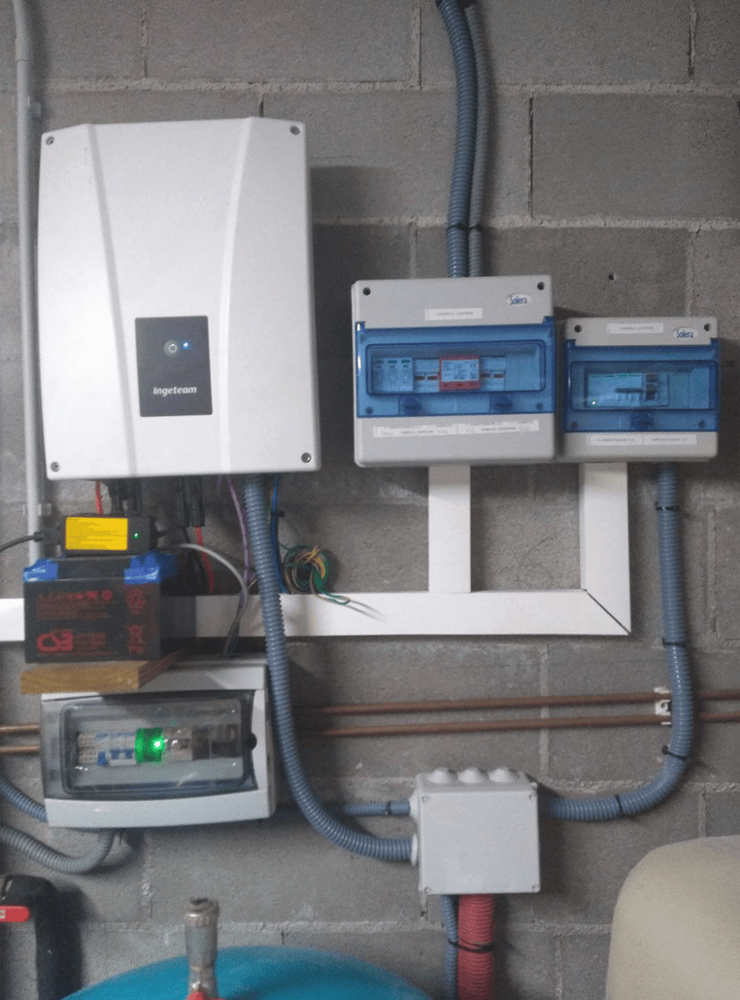

## Compatible Ingeteam inverters
* Ingeteam STORAGE 1Play TL M (3-6 kW)

## Communication wiring
The Ingeteam inverter works via CAN. The LilyGo board can have both a CAN battery and a CAN inverter connected on the same pins. When the board is used with two CAN devices at the same time that have termination resistors in all ends, the terminating resistor needs to be removed from the board. Please measure CAN termination if you have issues. This is explained in [CAN-troubleshooting](../40-setup/index.md#can-wiring-troubleshooting)

ℹ️ Always check the termination resistance of the system! That way you know if resistor needs to be removed or not.

ℹ️ Grounding is extremely important. Make sure the battery case is connected to protective earth, and the shield part of the twisted pair CAN is connected to PE also! Failing to do this will result in CAN errors.

## Which protocol to use
For this inverter type, use the option called "BYD Battery-Box Premium HVS over CAN Bus" under the "Inverter Protocol" setting

{ width="484" height="68" }

## Installation examples
A completed integration using LEAF battery and an Ingeteam inverter:

