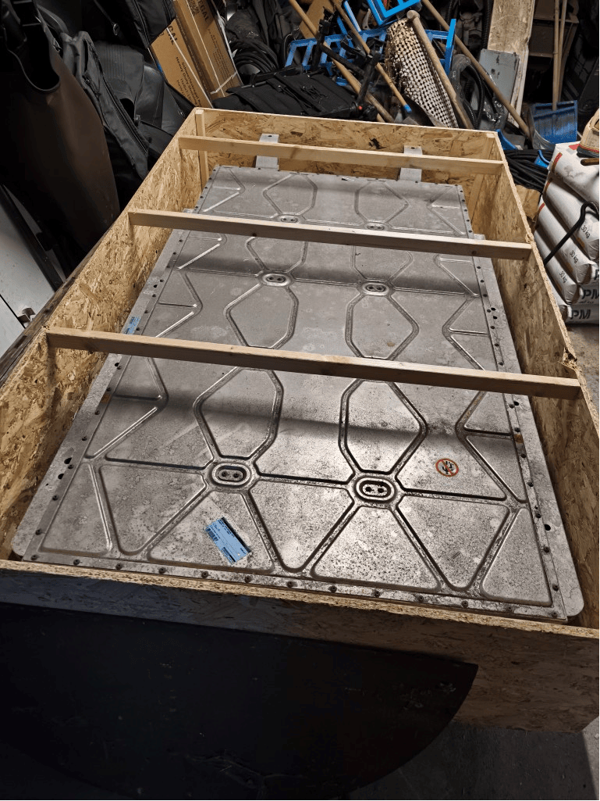
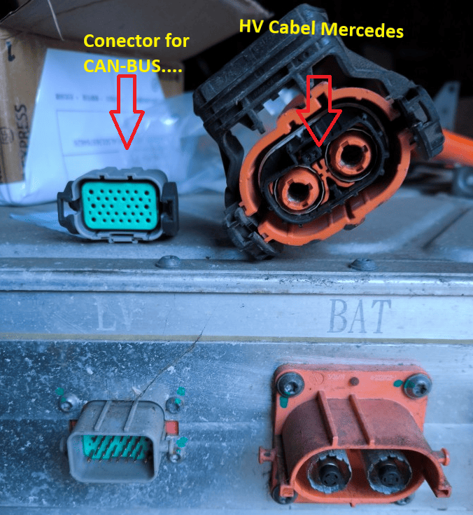
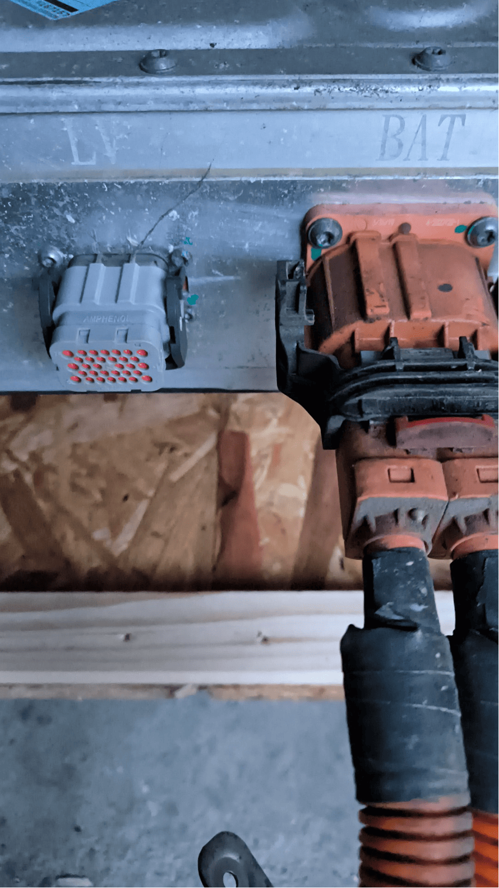
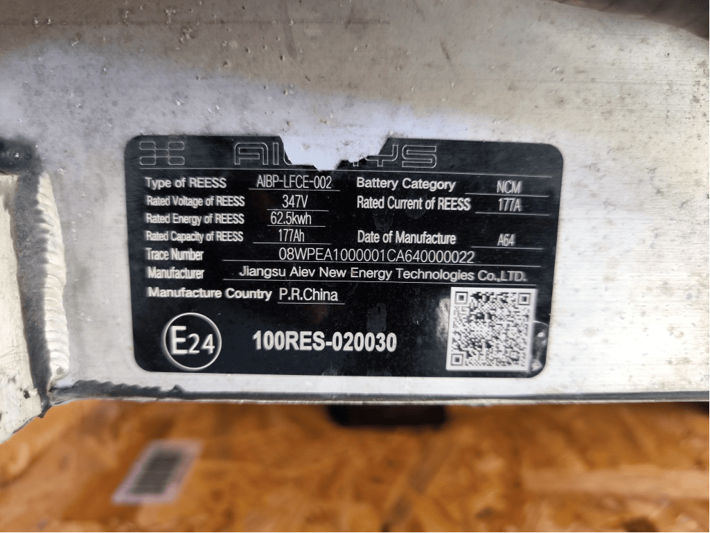
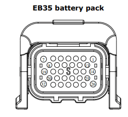
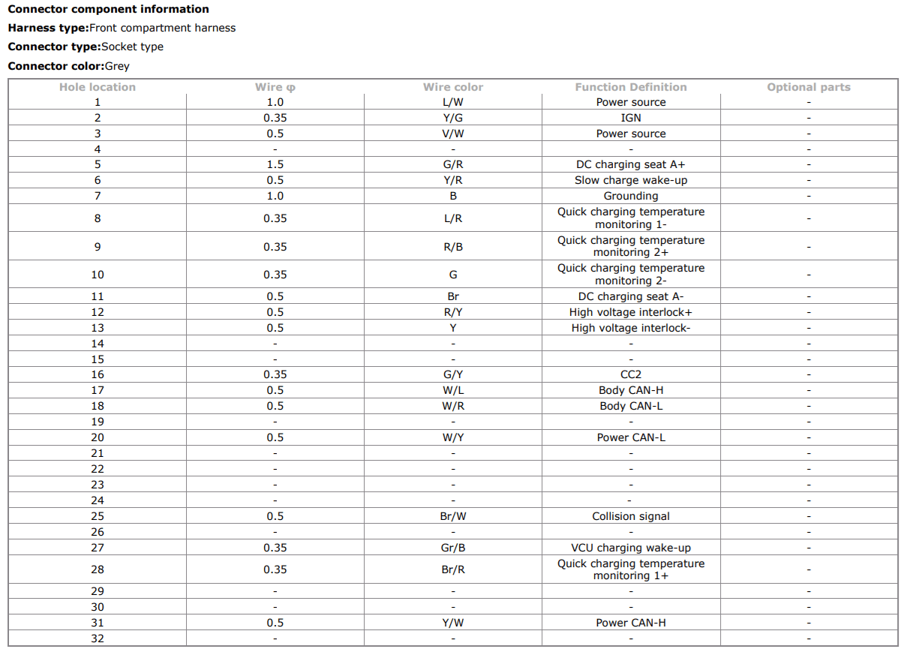
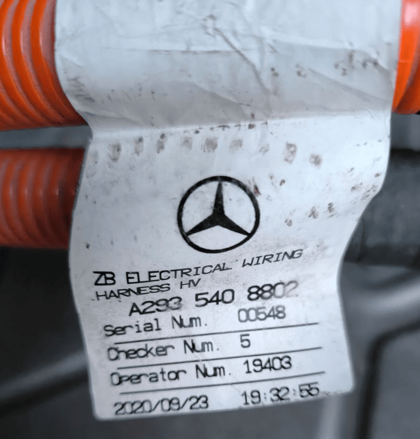
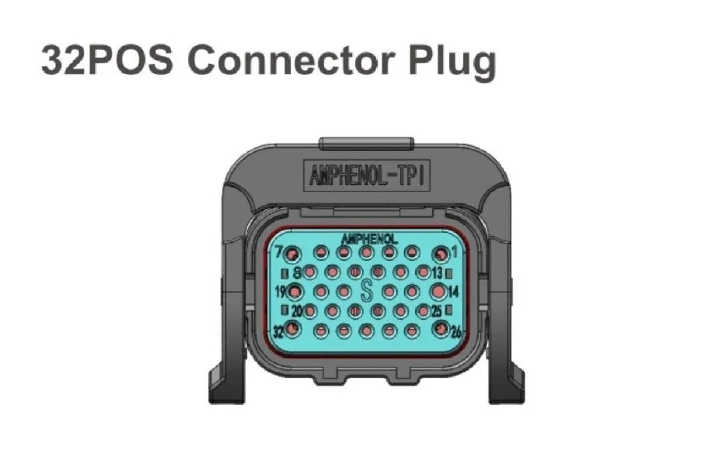
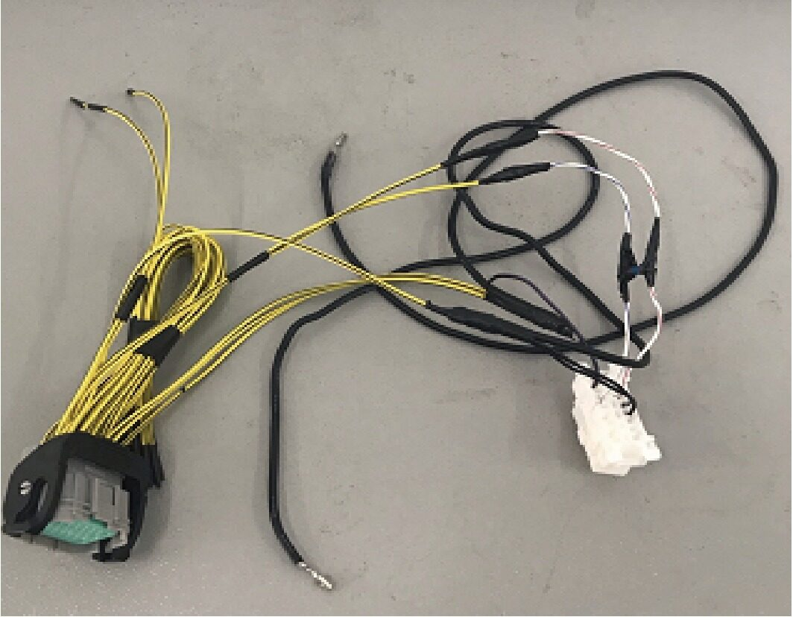
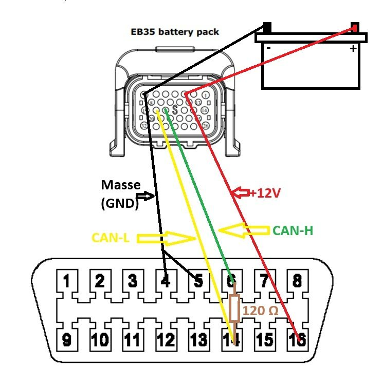

**Battery Aiways U5**

Connectors for HV-Connector and Connector Information (CAN-BUS)

Aiways high-voltage battery with plug-in connectors

Pin assignment

suitable high-voltage battery cable for Mercedes, Various models fit (for example, the EQC).

Suitable connector for the information port of the high-voltage - battery HC18B-S32

You can AMPHENOL 32 Core New Energy EV-Connector HC18B-S32 buy it on AliExpress at this link: https://a.aliexpress.com/_EIi8AZY

Genuine Aiways adapter for reading battery data via the OBD2 port.

Pinout for the adapter (Caution – not yet tested!!)

I think two 12-volt connections are still missing on the 32-pin connector plug side for High voltage interlock+ and High voltage interlock-. 

Connection to a hybrid inverter is coming soon...
