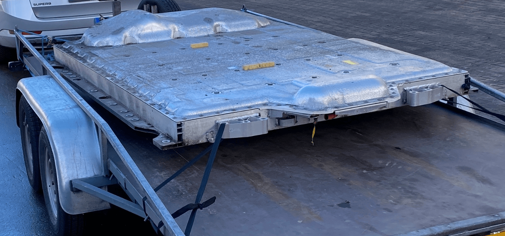
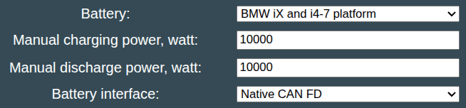
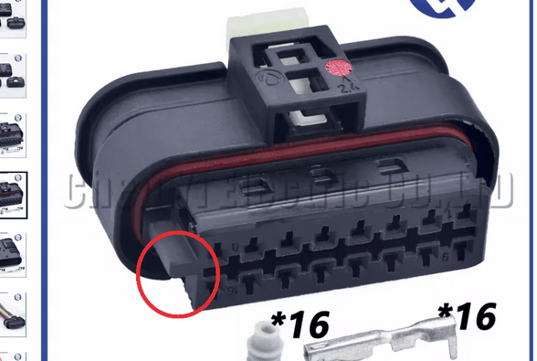
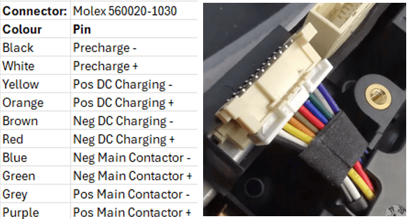
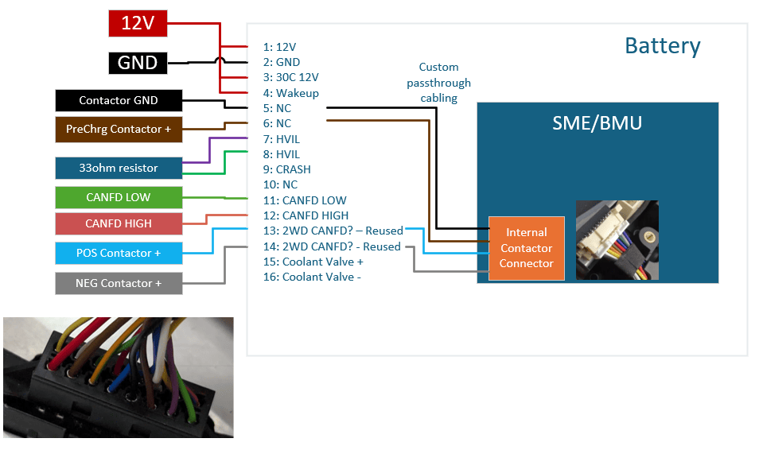
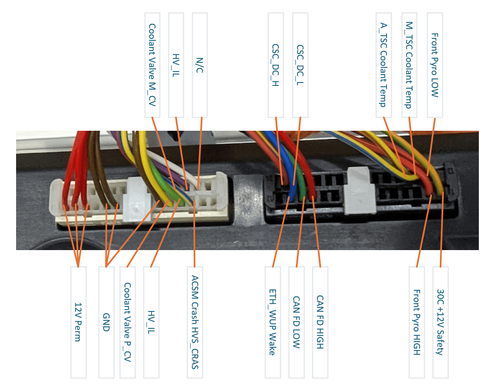
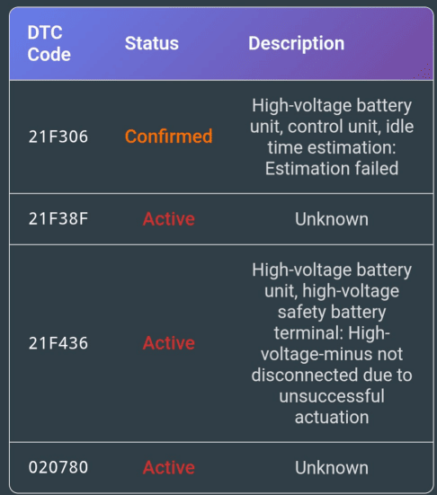

> [!CAUTION]
> Working with high voltage is dangerous. Always follow local laws and regulations regarding high voltage work. If you are unsure about the rules in your country, consult a licensed electrician for more information.

> [!WARNING]  
> CAN bus contactor control is in beta only, and has been known to permanently lock out the battery - therefore non developers should use the GPIO contactor control ONLY (Tick "Contactor control via GPIO" in settings). Re-using the iX batteries require opening the battery to change internal wiring for contactors. To do this safely, the correct personal protective equipment (PPE) is required. When handling the inside of a BMW iX battery, please make sure you check your local electrical safety legislation requirements.

# BMW Gen5 BEV Platform - (iX, i4, i5, i7)

BMW uses a shared modular platform across various vehicles with a common BMS (SME). BMW i4 for example has the SE26 or SE27 configuration.

Unlike i3, Gen5 now uses CAN-FD on the external side, and ISO-SPI between SME > Cell modules.

Here is a list of all different BMW iX batteries, and their specifications / voltage ranges

| Technical data | SE10 | SE11 | SE12 | SE13 | SE16 | SE26 | SE27 | SE30 | SE50 |
|---|---|---|---|---|---|---|---|---|---|
| Vehicles | iX | iX | iX1 | iX1, iX2 | iX3 | i4 | i4, i5 | i7 | iX |
| Number of battery cells (lithium-ion battery)       | 500 | 180 | 156 | | 188 | 288 | 324 | 408 | 450 |
| Chemistry                                           | NCA | | NMC | | NMC | NMC | NCA | NCA | NCA |
| Configuration                                       | 100s5p | 90s2p | 78s2p | | 94s2p | 96s3p | 108s3p | 102s4p | 90s5p | 
| Number of cell modules                              | 5 cell modules (8s5p)   6 cell modules (10s5p) | 10 cell modules (9s2p) | | | 8 cell modules with 18 battery cells   2 cell modules with 22 battery cells | 4 dual-cell modules (two 12s3p) | 3 cell modules (4s3p)   4 dual-cell modules (two 12s3p) | | |
| Nominal Voltage                                     | 368 V | 330.3 V | 286.3 V | | 345 V | 354 V | 398.5 V | | |
| Voltage range                                       | Min. 280 V - max. 430 V | Min. 252 V - max. 378 V | Min. 218.4 V - max 327.6 V | | Min. 263.8 V - max. 394.8 V | Min. 268.8 V - max. 408 V | Min. 302 V - max. 464 V | Min. 285.6 V | Min. 252.0 V |
| Battery capacity                                    | 303.0 Ah | 232.0 Ah | 232.0 Ah | | 232.0 Ah | 198.6 Ah | 210.6 Ah | 280.8 Ah | 303.0 Ah |
| Capacity per cell                                   | 60.6 Ah | 116.0 Ah | 116.0 Ah | | 116.0 Ah | 66.2 Ah | 70.2 Ah | 70.2 Ah | 60.6 Ah |
| Max. storable energy quantity                       | 111.5 kWh | 76.6 kWh | 66.45 kWh | | 80 kWh | 70.27 kWh | 83.9 kWh | 105.7 kWh | 100.35 kWh |
| Max. useful energy quantity                         | 106.3 kWh | 70.6 kWh | | | 73.8 kWh | 68 kWh | 80.7 kWh | 101.7 kWh | |
| Dimensions of the housing (length x width x height) | 2410 mm x 1742 mm x 141 (303) mm | 2410 mm x 1742 mm x 141 (303) mm | | | 2228 mm x 1586 mm x 311 mm | 2261 mm x 1708 mm x 285 mm | 2261 mm x 1708 mm x 285 mm | | |
| Total weight                                        | 649 kg | 521 kg | 436 kg | | 518 kg | 500.9 kg | 564.5 kg | | |
| Cooling system                                      | Coolant | Coolant | Coolant | Coolant | Coolant | Coolant | Coolant | Coolant | Coolant |

   
  <em>SE11 battery being transported on a trailer</em>

## Software configuration
For this battery type, use the option called "BMW iX and i4-7 platform" under the "Battery Protocol" setting.

Also remember to configure the allowed charging power, since we do not read this value via CAN.

## Note on CAN-FD
The Gen5 BMW battery architecture uses CAN-FD, so if you plan on integrating this battery, you will need to get the LilyGo T-2CAN, plus a [CAN-FD chip add-on](https://github.com/dalathegreat/Battery-Emulator/wiki/CAN%E2%80%90FD-add%E2%80%90on-(MCP2518FD)).

Alternatively, if you want to make it even easier, get the [Stark CMR](https://github.com/dalathegreat/Battery-Emulator/wiki/Hardware:-Stark-CMR) hardware which has built in support for CAN-FD. This is the recommended path!

# Connectors
The battery pack has several connectors on the outside and inside of the pack that are relevant for connecting this pack to the inverter and the battery emulator.

## Connectors on the outside of the pack
### LV connector
The low-voltage connector on the outside of the pack is a Hirschmann 805-587-545 16way 1.2 SealStar FA Connector. This is where the battery emulator is connected to in terms of power supply, interlock and CAN communication.

If you are having trouble sourcing the Hirschmann connector, a cheap alternative can be found on Aliexpress. [Purchase Link](https://nl.aliexpress.com/item/1005005722083920.html) . IMPORTANT SIDE NOTE: its available in 2 different types. The difference is the locating pin. Be sure to order the one with the locating pin on the 8-16 side, and not on the 1-9 side.

   
  <em>Hirschmann connector with locating pin on the 8-16 side</em>

Some packs have the LV connection at the front of the pack and appear to use a back to back connector instead.

| Pack type | Location of connector |
| --------- | --------------------- |
| SE16      | Bottom, front         |
| SE26      | Bottom, rear left     |
| SE27      | Bottom, rear left     |

The connector is referred to as A332*1B. The following connections must be made.

| Pin | Mandatory/Optional | Description                            | Connection  Information                     |
|-----|--------------------|----------------------------------------|---------------------------------------------|
| 1   | M                  | Supply, terminal 30                    | 12V                                         |
| 2   | M                  | Ground                                 | GND                                         |
| 3   | M                  | Terminal 30c signal                    | 12V                                         |
| 4   | M                  | Wake-up signal                         | 12V                                         |
| 5   | -                  | not used                               |                                             |
| 6   | -                  | not used                               |                                             |
| 7   | M                  | High-voltage interlock loop signal     | Connect to pin 8 via 33 Ohm resistor            |
| 8   | M                  | High-voltage interlock loop signal.    | Connect to pin 7 via 33 Ohm resistor            |
| 9   | -                  | Crash signal                           |                                             |
| 10  | -                  | not used                               |                                             |
| 11  | M                  | CAN-FD Low                             | Connect to battery emulator                 |
| 12  | M                  | CAN-FD High                            | Connect to battery emulator                 |
| 13  | -                  | not used                               |                                             |
| 14  | -                  | not used                               |                                             |
| 15  | O                  | Coolant shutoff valve Activation       | Connect to pin 16 via 12 Ohm or 16 Ohm resistor |
| 16  | O                  | Coolant shutoff valve Ground           | Coolant to pin 15 via 12 Ohm or 16 Ohm resistor |

> [!IMPORTANT]
> You need a high current capable 12V supply. If you are powering the BMS via the Stark CMR, you need to power it via the 7A capable Precharge circuit, see the Stark Wiki for more info

### HV connector

There are several high-voltage connectors on the outside of the pack. We only use the auxiliary connector to connect the to the inverter. The other connectors shall be protected by covers.

The auxiliary connector is referred to as the CCU (Combined Charging Unit) connector. The connector type is Hirschman HPS40-2, and a suitable cable is for instance 5A2DB59-03. Please check the color coding (most likely black) inside the connector of the pack and the color coding of the cable used. The color should match. The battery pack should have a fuse (100A). Some cables also have a fuse inside them, others do not. Both cable types can be used. By cutting the cable you will have two 6 mm2 wires that can be connected to the HV terminals of the inverter.

#### HV connector cover

On [Thingiverse](https://www.thingiverse.com/thing:6845382/files) you can download some 3D printable covers for the large rear connector, smaller front connector and internal blanking covers for BMU (If you disconnect the additional HV outputs internally).

  
Additional information about HV connectors

  For sake of completeness, all HV connector information is listed here.

| Number of connectors | Connector                                        | Cable/Cap                                                                         |
|----------------------|--------------------------------------------------|-----------------------------------------------------------------------------------|
| 1                    | DC charge connector                              | Protective Cap Hv Battery 889520 - BMW (12-90-9-796-829)                          |
| 1 or 2               | Main connectors                                  | Rosenberger HVS420 - Protective Cap for HV Battery 889520 - BMW (12-90-9-796-829) |
| 1                    | CCU/AC Connector (100A fused)                    | Hirschman HPS40-2 - Suitable cable is 5A2DB59-03                                  |

## Connectors on the inside of the pack
To control the contactors via manual contactor control, some connections have to be made on the inside of the pack.

These connections need to be made to the contactors inside the SME (BMW's name for the battery management system). The SME is usually located at the rear left of the battery pack. To create the connections you need to take off the lid of the battery pack, disconnect the high-voltage and low-voltage cabling from the SME, disconnect the cooling hoses to the SME, and take the SME out of the pack. Afterwards you need to remove the top lid of the SME. A connection needs to be established to the pre-charge contactor, main negative contactor and main positive contactor in the SME. Each contactor needs a supply voltage and a ground, therefore 6 connections need to be made. These connections can be established in multiple ways.

  
To the connector inside the SME via a PCB

  The cleanest solution, without cutting wires, is to connect to the black, white, blue, green, grey and purple cables inside the SME via a custom PCB. The PCB needs to contain the Molex 560020-1030 surface mounted PCB connector, to receive the existing cable. The 3 grounds can be shared between the contactors, which leaves 4 connections to be made between the battery emulator and the custom PCB: precharge contactor supply, main negative contactor supply, main positive contactor supply and ground.

  
To the cables insdie the SME by cutting or soldering to the wires

  Alternatively, the connections can be made by cutting or soldering to the 6 cables. The 3 grounds can be shared between the contactors. If you decide to combine the 3 grounds, you are left with 4 cables to be connected to the battery emulator.

   
  <em>Pinout of internal SME connector: Precharge and Pos Main and Neg Main need to be controlled by the battery emulator</em>

The cables from the SME need to be connected to the battery emulator, such that the battery emulator is able to control the contactors. Therefore you first need to route the cables outside the SME, for instance by creating a small hole in the lid of the SME. Afterwards these cables need to be routed to the outside of the pack.

### Passing the contactor cabling to the outside of the pack

The cables to control the contactors can be passed to the outside of the pack in multiple ways.

  
Free-standing A332*1B connector

Some packs (e.g. SE26, SE27) have a free-standing A332*1B connector, of which some of the non-used pins can be used to pass the cables to the outside of the pack. This is shown in the image below.

  
Integrated A332*1B connector

Some packs (e.g. SE16) have an integrated A332*1B connector, which cannot be used to pass the cables to the outside of the pack. The cables must be passed through the opening between the lid of the pack and the housing of the pack, or via a hole drilled through the housing of the pack. Please keep water ingress in mind when passing the cable to the outside of the pack in this manner.

  
Additional information

  For the sake of completeness, information is also provided regarding the external connectors on the outside of the SME.

  ### Pinout of external SME connectors

  

## Note on Diagnostic trouble codes (DTC)
You can read active DTCs via the More Battery Info page. Note that some code will always be active, plus if your battery has been crashed in the past there will be more codes.

   
  <em>Example of the DTCs present on a working setup using an SE26. Balancing is working with these DTCs active.</em>

## Note on Balancing
Balancing has not been confirmed by all users. Currently this topic is still under investigation. Please do not assume that your pack will support balancing without verifying this first.
