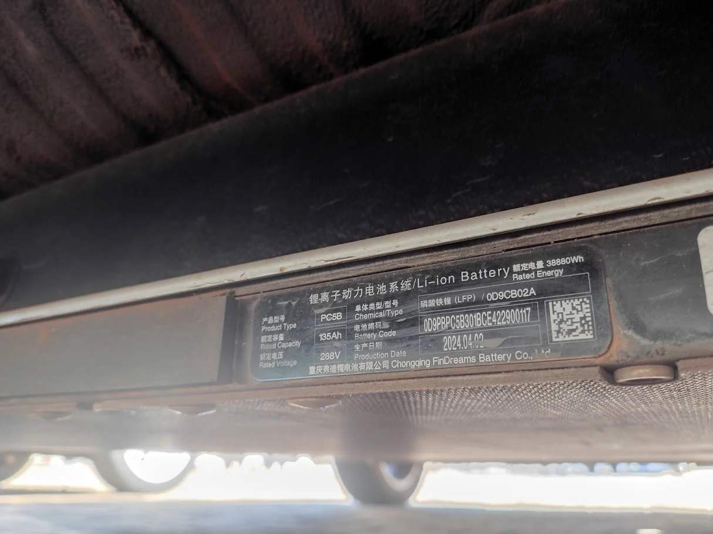
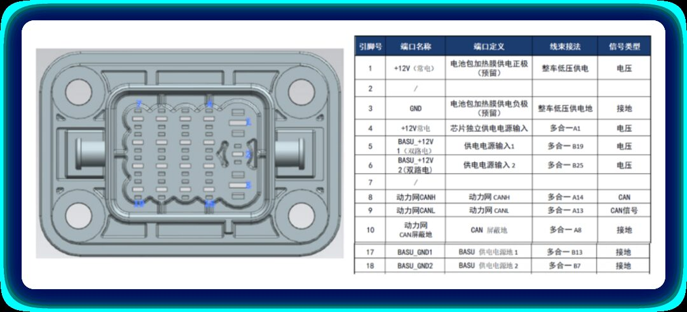

1. European Long range version battery pack
Platform: QH135Ah (regular blade)
Cell model: C102F
Cell capacity: 135 Ah
Cell nominal voltage: 3,2 V
Number of cells: 104
Pack capacity: 44,9 kWh
Pack nominal voltage: 332,8 V
Pack weight: 308,6 kg
Gravimetric energy density: 145 Wh/kg

2. international long range version
Platform: QH135Ah (regular blade)
Cell model: C102F
Cell capacity: 135 Ah
Cell nominal voltage: 3,2 V
Number of cells: 90
Pack capacity: 38,8 kWh
Pack nominal voltage: 288 V
Pack weight: 308,6 kg
Gravimetric energy density: 145 Wh/kg

