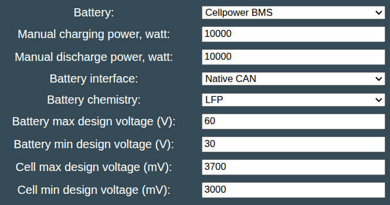

## Cellpower support
The Battery-Emulator has support for Cellpower BMS, used on Intercel CLPL batteries

## Setting up the Battery-Emulator configuration

!!! info "IMPORTANT"
    The Cellpower BMS runs at 250kbps CAN speed. Due to this it cannot be connected to same CAN bus as solar inverters

Start by connecting the CAN port of the BMS, to the Native CAN port on the Battery-Emulator

- If you have a Modbus inverter, connect it to the RS485 port of the Battery-Emulator
- If you have a CAN inverter, you need to connect it to a separate 500kbps CAN channel, since the BMS runs at 250kbps
   - One option is to use [add on MCP2515](../40-setup/40-can-related/CAN-add‐on-(MCP2515).md) board
   - Another options is to use [add on CAN-FD MCP2518](../40-setup/40-can-related/CAN‐FD-add‐on-(MCP2518FD).md) board 
   - Third option is to use [Stark CMR board](../30-hardware/Stark-CMR.md)
   - Fourth option is to use [Double LilyGo](../40-setup/20-software/Double-LilyGo.md) setup

## Software configuration
For this battery type, use the option called "Cellpower BMS" under the "Battery Protocol" setting. Also make sure to configure the interface to Native CAN

{ width="665" height="350" }

Also remember to configure all battery limits to suite the battery you are using!

