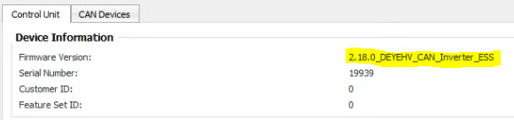
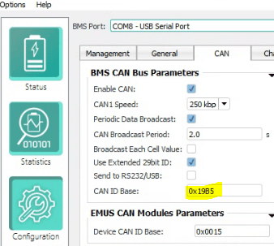
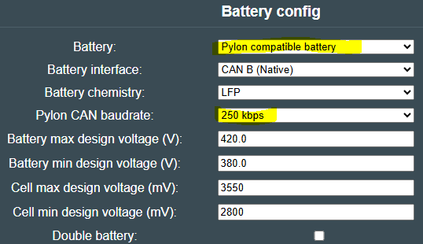

## Read this first
Preface, the entire Battery-Emulator project sets out to achieve safe re-use of EV batteries. By building your own battery, you will be taking larger risks. Cell balancing wire taps, shunts, busbar connections, BMS integration, temperature monitoring, fuses, contactors, interlocks, etc. all will have to be implemented by yourself instead of using a pre-made product. As with all things custom, there are higher risks of human error. This page covers emulating High Voltage protocols, so while most tinkerers might be familiar with 48V DIY batteries, building a 100S or more 400VDC battery is an entirely different beast that can be lethal. Take extra precaution when working on a custom DIY HV battery, you have been warned.

## Caution
If you are unsure of your technical knowhow, avoid building a high voltage battery from scratch

## Custom DIY battery with EMUS G1 BMS
The Battery-Emulator has support for the EMus G1 BMS. 
With this BMS you can construct your own high voltage battery, and connect the BMS via CAN to the Battery-Emulator. 
This allows you to use a DIY battery (instead of an EV battery) with any normal Battery-Emulator supported inverter.

## Where do I get the hardware?

www.emusbms.com

## Setup

Emus G1 BMS needs to be configured to emulate Deye_hv_can inverter protocol

{ width="580" height="136" }

Set CAN ID base to 0x19B5

{ width="338" height="303" }

Set Battery type to Pylon and baud rate to 250

{ width="538" height="310" }

Battery Emulator will show all needed information and also populate cellmonitor page with individual cell voltages and if they are balancing or not.

Contactor control.
The EMUS system when powered on, will automatically close battery contactors if it is plugged in to a CAN line. This can sometime be a problem if you do not want the battery live to the inverter.

The EMUS system has a 12v 'ignition switch' input to control the contactors from an external source. This can be connected through a relay from the Lilygo/Stark contactor control outputs on its GPIO. By switching 12v using a relay, you can then have the battery emulator/ inverter control the contactors. The EMUS system will still prevent the contactors opening if it is in a fault state to prevent damage to the battery.

It is also highly recommended to use a separate CAN line for the inverter, so use a Stark or Lilygo T 2-CAN.

