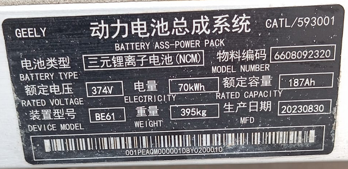
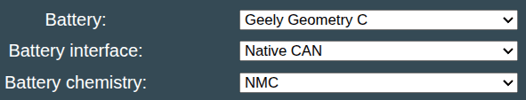
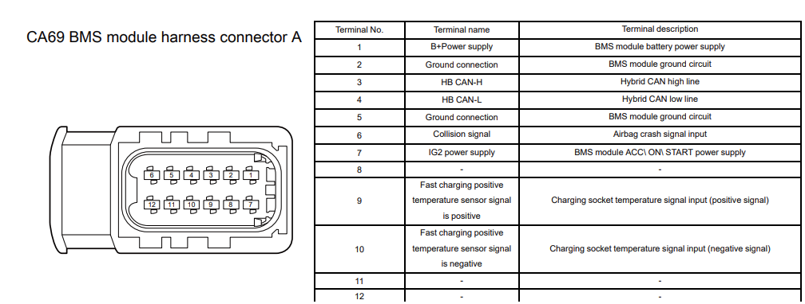
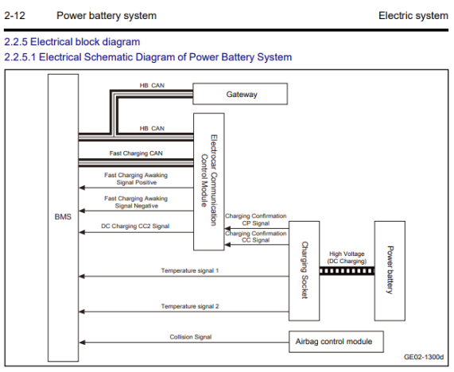
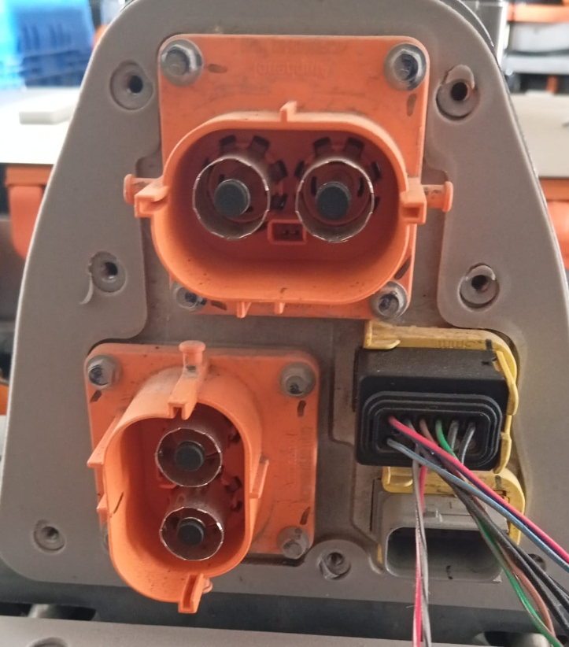
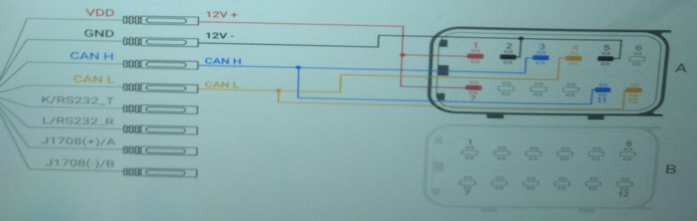

### WIP

### Geely Geometry C
There are two variants of the Geometry C battery

- 53kWh CATL NCM xxxV Nominal (xxxkg) 268.8~417.6V operating range
- 70kWh CATL NCM 374V Nominal (395kg) 285.6~443.7V operating range

## Software configuration
For this battery type, use the option called "Geely Geometry C" under the "Battery Protocol" setting

### Wiring diagram

### LV and HV connectors
The battery has 2x HV outputs, and 2x LV connectors. The top LV connector (A) is the main to use, which has the HB CAN-H/L. The bottom one has the fastcharging CAN (not required for stationary usage)

The battery contains a terminating resistor for HB-CAN

?The interlock signals on both HV connectors need to be shorted together?

|  BMS pin |  Signal Type |  Note |
| :--------: | :---------: | :---------: |
| 1 |  12V + | Connect to permanent 12V supply |
| 2 |  Ground  | Connect to ground for 12V supply |
| 3 |  HB CAN-H  | Connect to Battery-Emulator CAN-H |
| 4 |  HB CAN-L  | Connect to Battery-Emulator CAN-L |
| 5 |  Ground  | Connect to ground for 12V supply |
| 6 |  Collision Signal  | Not connected! |
| 7 |  ACC  | Connect to permanent 12V supply |
| 9 |  Fast charging socket PT1000+  | ??? Not connected ??? |
| 10 |  Fast charging socket PT1000-  | ??? Not connected ??? |

