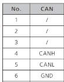
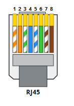
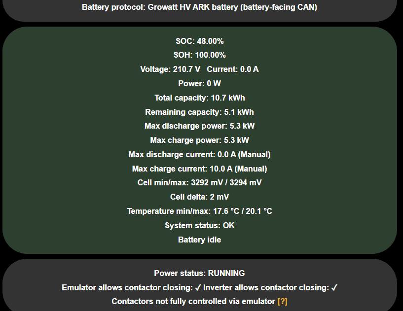

## Read this first
Preface, the entire Battery-Emulator project sets out to achieve safe re-use of EV batteries. By Connecting batteries with inverters they were not intented for by the manufacturer there's a risk to be considered. As with all things custom, there are higher risks of human error. This page covers emulating High Voltage protocols.
Take extra precaution when working on a custom DIY HV battery, you have been warned.

## Caution
If you are unsure of your technical knowhow, avoid working on a high voltage battery.

## 
The Battery-Emulator has support for the Growatt Ark  BMS and the ARK- 2.5H-A1 battery modules  
A complete system can consist of 1 BMS and 1 to 10 modules with a total voltage of 51 to 512 Vdc

## Setup

Connect CAN,

{ width="150" height="210" }

{ width="147" height="209" }

Set Battery type to Growatt ARK

{ width="817" height="631" }

