> [!CAUTION]
> Working with high voltage is dangerous. Always follow local laws and regulations regarding high voltage work. If you are unsure about the rules in your country, consult a licensed electrician for more information.

> [!IMPORTANT]  
> The EGMP battery platform cannot communicate over CAN. It only supports CAN FD!

Pinout on battery
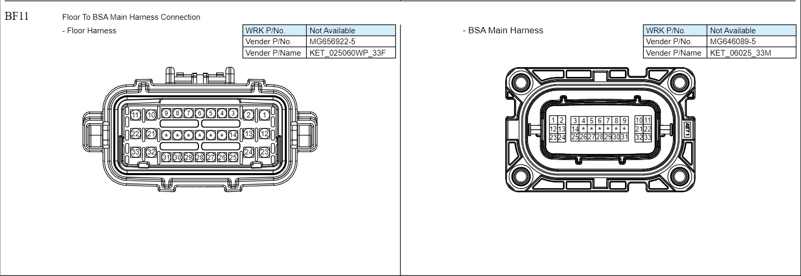
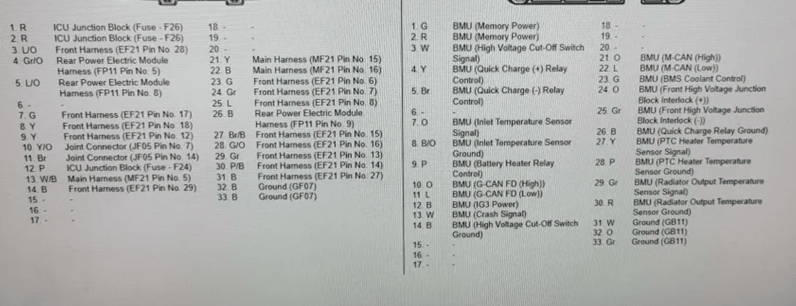

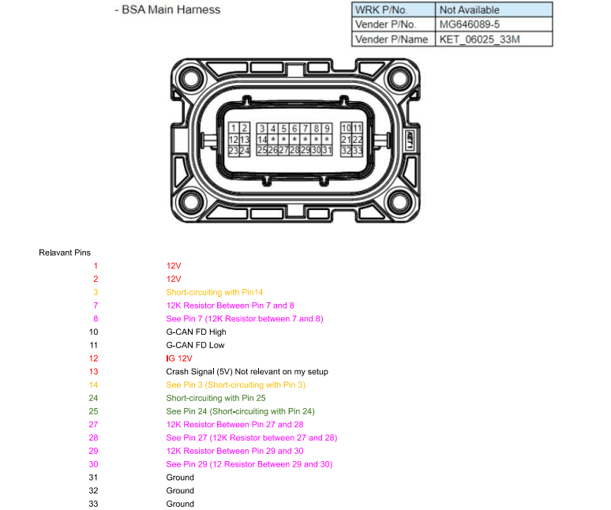
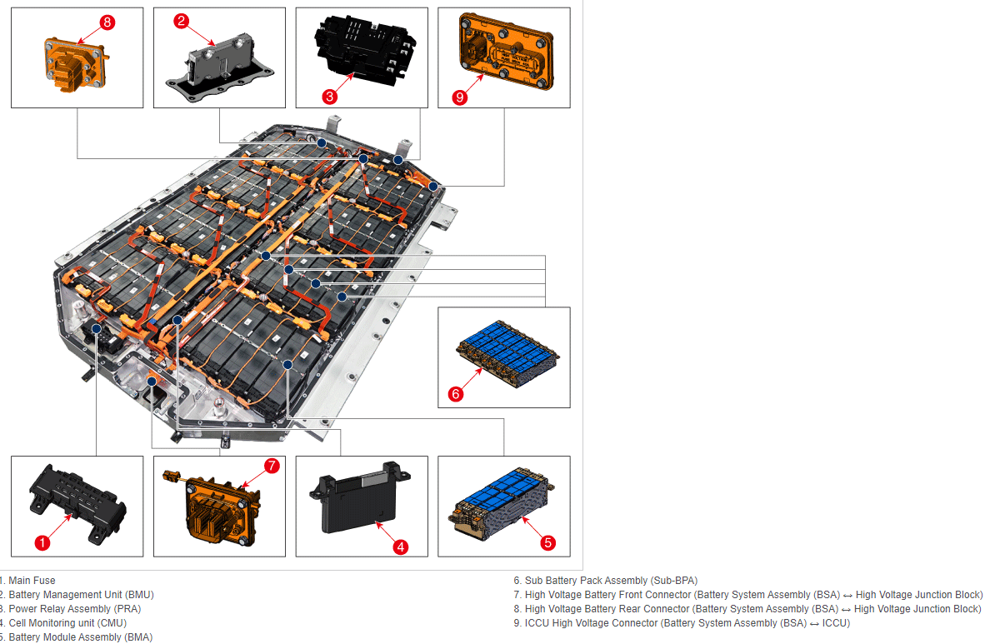
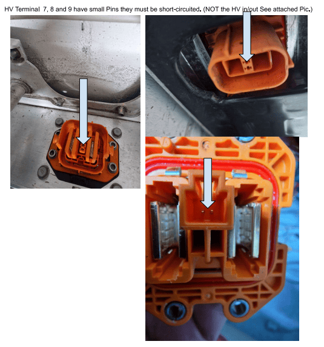

Batterie Data (from Kia/Hyundai Service Manual)
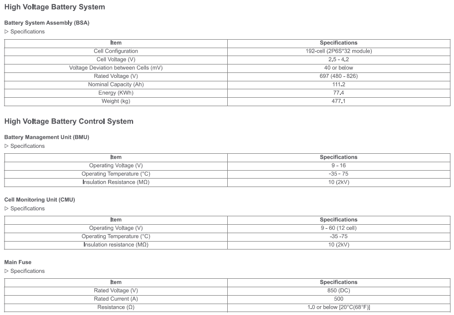

Batterie BMU/CMU Info
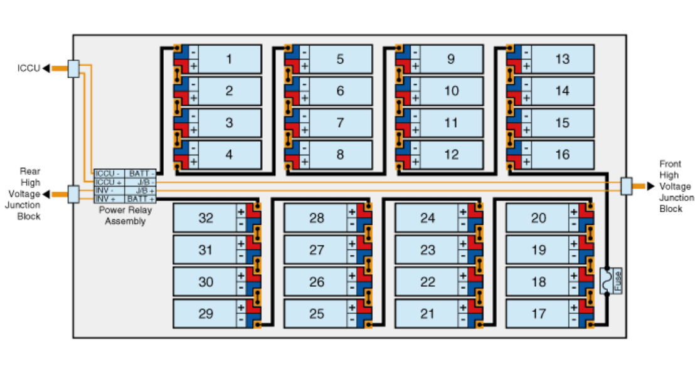
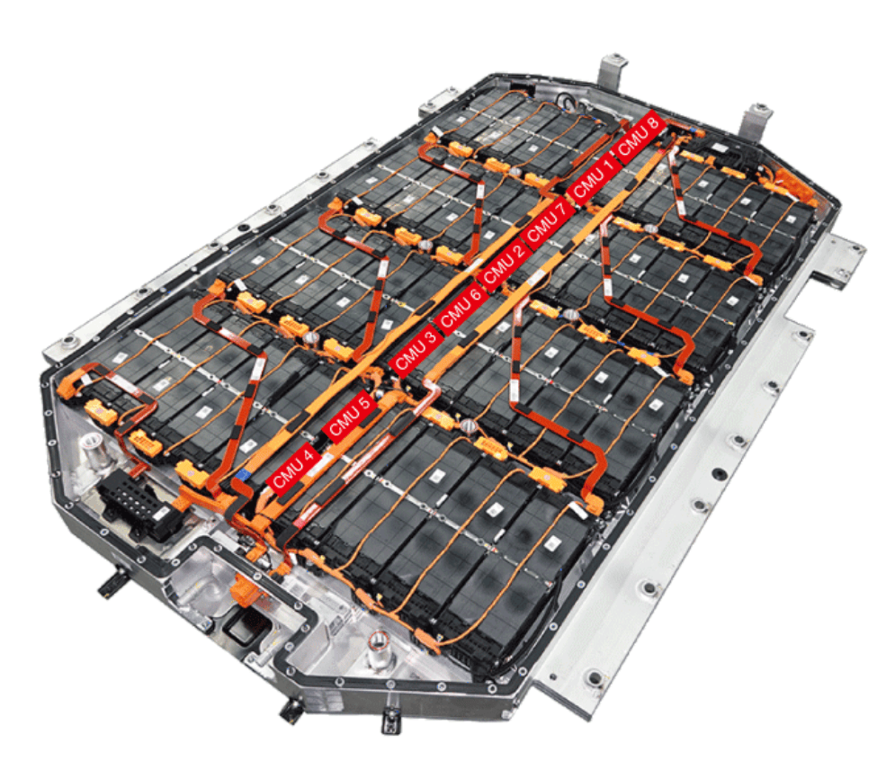
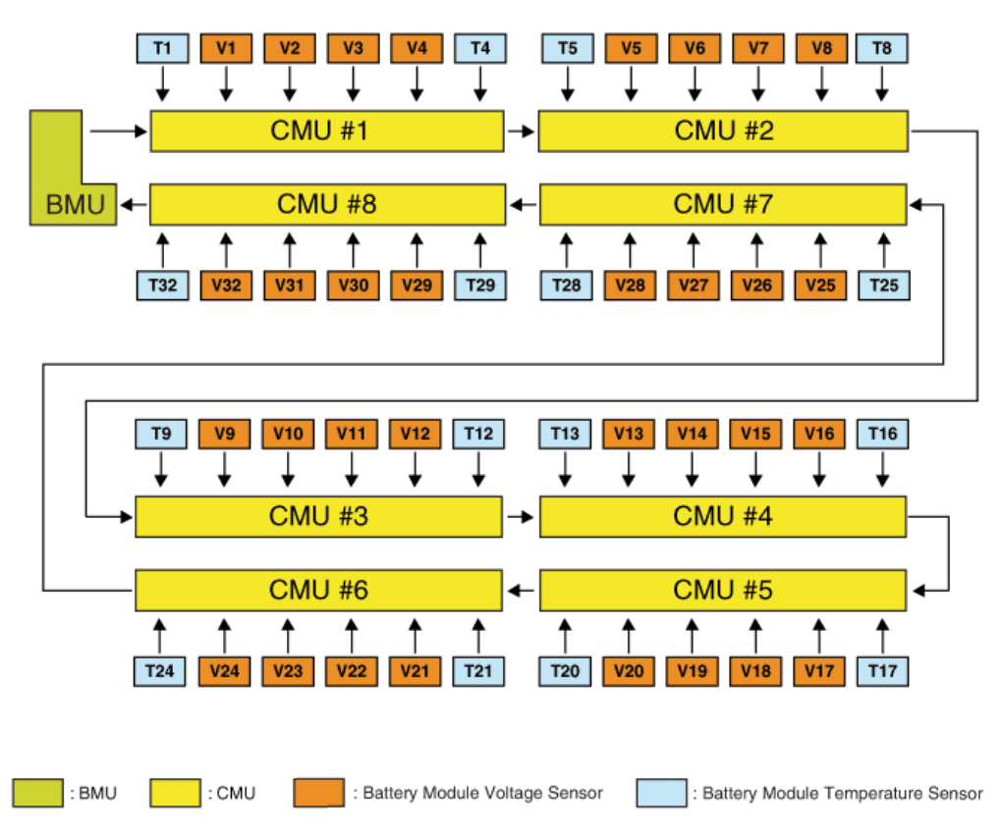
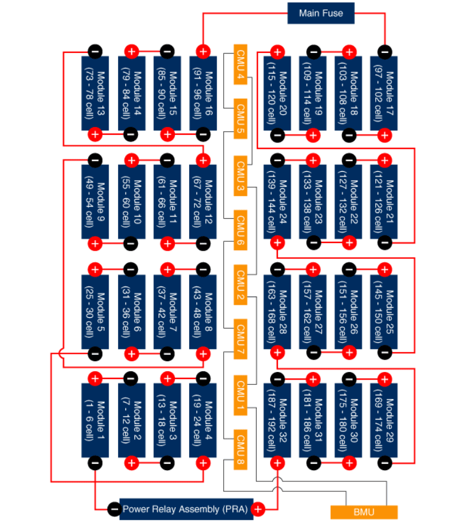
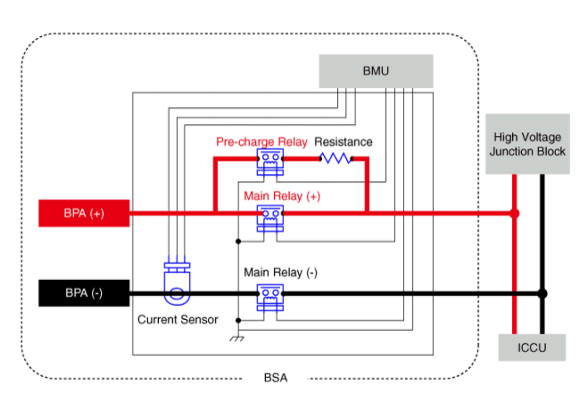
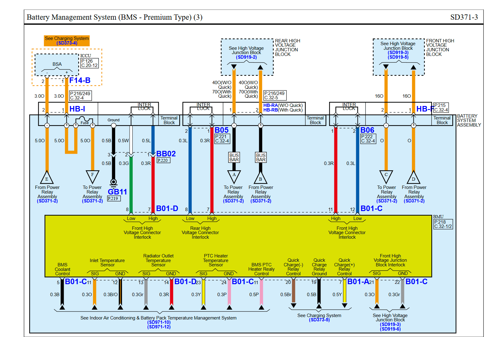
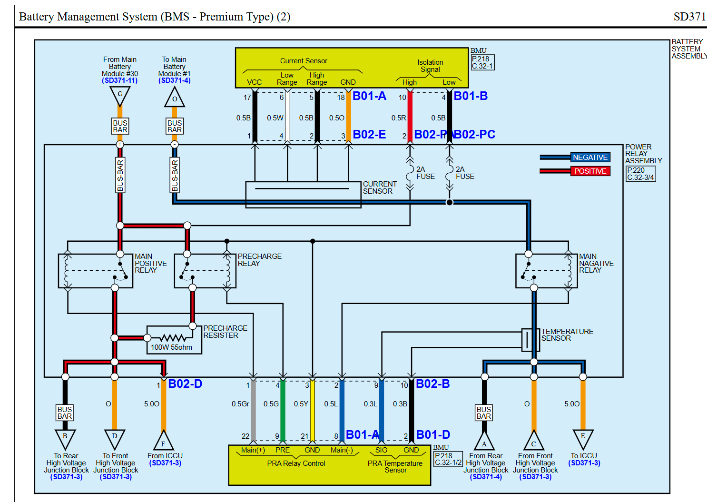

Images etc.

Similar wiki: [E-GMP platform](Hyundai-E‐GMP-platform-(58.2-‐-77.4-kWh).md)

***** Below find pin connection required ******
 1,2,12 - 12v / 
 3+14 - shunt / 
 7+8 - resistor / 
 10+11 - can-fd (to MCP board) / 
 13 - 5v / 
 24+25 - shunt / 
 27+28 - resistor / 
 29+30 - resistor / 
 31+32+33 - gnd / 
 
You also need to shunt the 3 interconnect in the 3 HV connectors. You can measure if the shunt is connected correctly with a voltmeter. If closed correctly the shunt should measure 2.5V