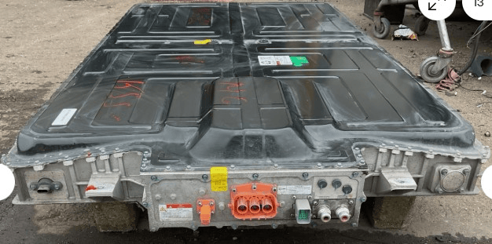
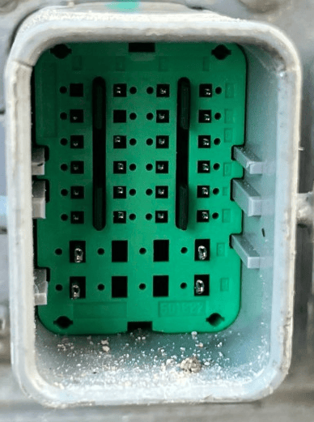

## Current status

The MG ZS is a MG Gen1 battery, and as such is supported by the "MG Gen1 (HS/ZS/MG5/MarvelR)" setting.

So far, the [44.5kWh](https://github.com/dalathegreat/Battery-Emulator/discussions/2444) and [69.9kWh](https://github.com/dalathegreat/Battery-Emulator/discussions/2141) have been confirmed working.

No LFP packs have been tested yet.

There is overlap with some of the the MG5 packs, see [MG5](MG5-‐-Marvel-R.md) for more information.

## Battery overview

## Low voltage connector

