# Current status

| Car | kWh | Chemistry | Battery type  | Part number | Status |
|----------|----------|----------|--------|----------|---------|
| MG5  | 52.5  | NMC  |    EU150A52S  | 10847655 | Tested and working |
| MG5  | 61    | NMC  |    EU174A61S  | 11163326 | Not tested |
| MG5  | 50.3  | LFP  |    BU131A50S  | 11486669 | Being tested |
| MG Marvel R  | 69.92 | NMC  |  EU199A69S |           | Reported working |
| MG Marvel R  | 69.9  | NMC  |  EU199A70S | 10953172  | Reported working (v10.11+) |

Battery Emulator currently has two different integrations supporting MG5, the legacy "MG5" integration and the updated "MG Gen1 (HS/ZS/MG5/MarvelR)" integration. The latter is more fully-featured and more likely to work with newer packs.

# MG5 Batteries

There are three types of batteries found in the MG5, a 52.5 kWh NMC, a 61.1 kWh NMC and a 50.3 kWh LFP pack, see details below.
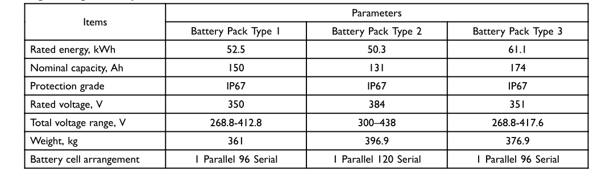{ width="1059" height="311" }

You can recognize the battery by the checking the label of the battery, the cell capacity and kWh is given, see photo below.
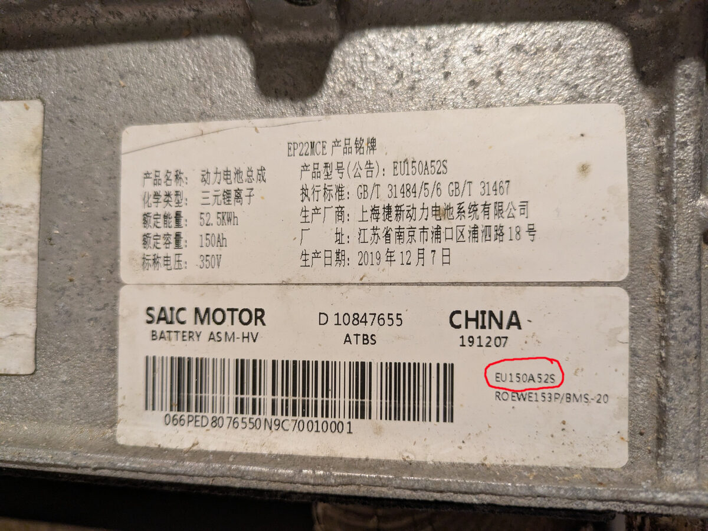

You can also recognize the different types by the cooling in/outlets. For the 50.3kWh and 61.1 kWh battery they are located right next to the connectors on the EDM(the connector extension coming out of the battery), see below:

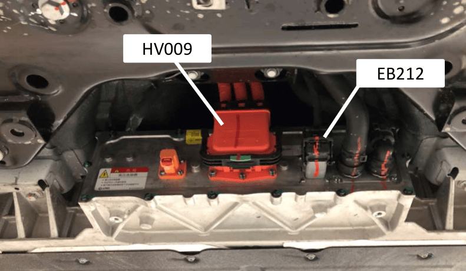{ width="791" height="460" }

While for the 52.5 kWh battery they are farther way, not on the EDM:

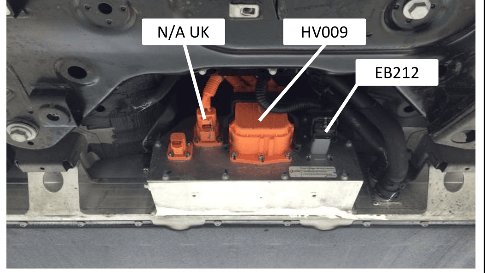{ width="1054" height="595" }

#### Main Service Disconnect
Make sure the MSD is fitted. Without this, the battery will be disabled.

Example, missing MSD:

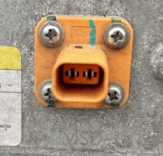{ width="234" height="224" }

# MG Marvel R Batteries

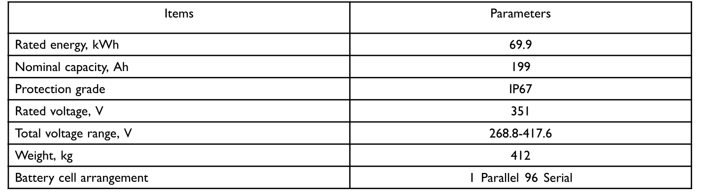{ width="1428" height="398" }

# Hardware setup

There are four connectors on the battery:

The Manual service disconnect(MSD): this is just a plug that inhibits the closing of the relays when not present. It needs to be removed when doing maintenance, always remove it when you are working on the battery yourself.

The auxiliary HV connector: It is only present on the 52.5kWh battery. It supplies the PTC battery heater unit. We dont need it. I have potted it with epoxy and put a 3d printed cover over it. This connector has  two HVIL (high voltage interlock) pins that signal the car when the HV connector is connected. Since the HVIL loop is not check by the BMS in the battery, it is not needed to short the pins in this connector.

The high voltage connector(HV009): This is the main HV connector from the battery to the car. It has three pins, a positive pin, a negative pin and another negative pin specifically for fast charging. Since we don't use the fast charging connection, we only need to connect the normal positive and negative pin. Although they look very similar,  the type of HV connector for the 52.5 kWh battery is different from the other two, they don't fit on each other.
The 52.5 kWh battery has an amphenol HVC3P80MV108227U19 connector, it fits with a high voltage cable MG part number 10824432.
The 50.3 kWh and 61.1 kWh batteries should fit with HV cable MG part number 10863642(to be confirmed)

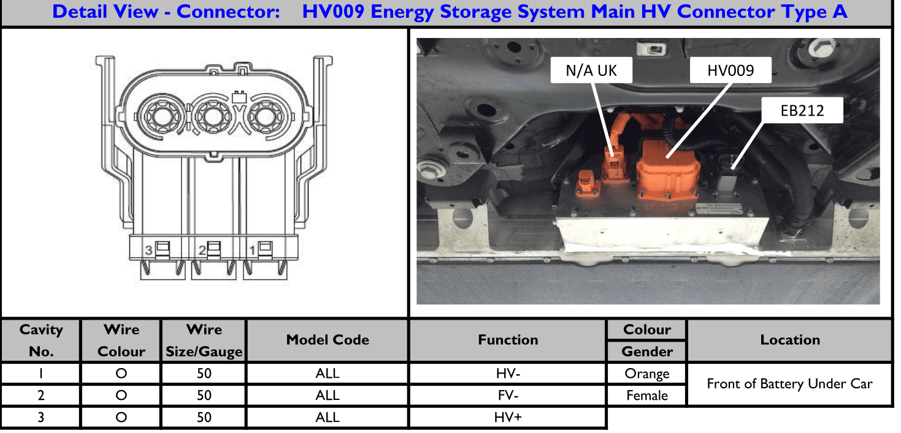{ width="1469" height="600" }

The low voltage connector(EB212): This connector is the same for all battery versions. It fits the molex connector part 643193211. You can either assemble the connector on your own with crimp terminals(64322 and 64323) and plugs(643191201 and 643251010) and a cap(643191201) or you can buy a premade connector from alieexpress.

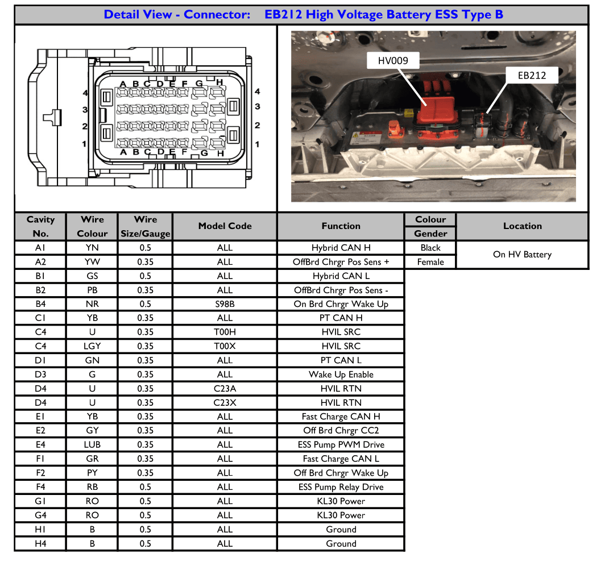{ width="1064" height="1003" }

To make the battery work, you need to connect:

* +12V to the KL30 power pins G1 and G4, this provides power to the BMS and the EDM (relay control).
* Ground to the ground pins H1 and H4. 
* +12V with a 1k resistor to wakeup enable pin D3, this will wake up the BMS.
* CANH to the PT CAN H and Hybrid CAN H pins C1 and A1. 
* CANL to the PT CAN L and Hybrid CAN L pins D1 and B1. 

The battery draws approx 250mA when only the BMS is active and about 500mA when the relays are closed. To close the relays you need approx 3A inrush current.

There are three CAN buses on the battery:

1. PT CAN (powertrain CAN) - **required** - 500kb/s: this is the main CAN bus of the car that manages the communication between the complete powertrain. This CAN bus responds to UDS requests and we can read the battery current and voltages from it. 
2. Hybrid CAN - **required** - 500kb/s: This bus communicates between the CCU(the cars internal charger) and battery. We need it to receive the CAN messages to close the contactors.
3. Fast charge CAN - _not required_ - 1Mb/s: this CAN bus sends data during DC fast charging to the EVC (electronic vehicle controller) which translates it into hardware signals to the fast charging station. This bus uses extended CAN IDs. We don't need it since we are just using the slow charging pathway.

Since we need both PT CAN and Hybrid CAN we connect them together for BE. 

An example connection diagram is shown below. It uses an external HV DC/DC that converts the 400V to 12V to charge a lead acid car battery.

Note: If an external 12V DC power supply is used the DC/DC converter is not required.
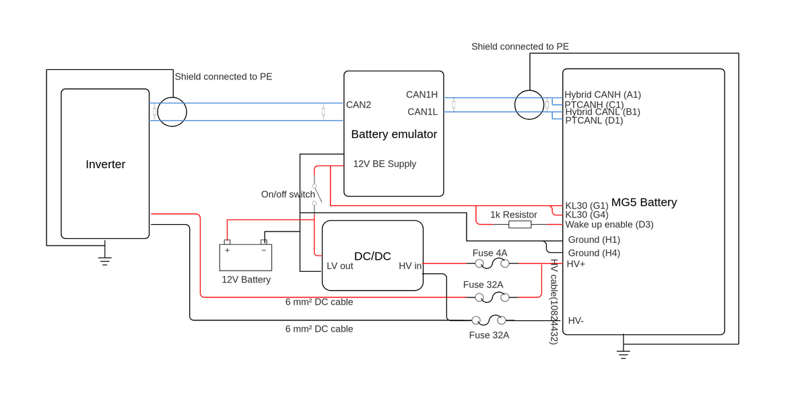{ width="2066" height="600" }

# Sofware configuration

The MG5 code only runs on hardware that has more than 4Mb of flash memory.

You need to select the MG5 battery and select the correct battery chemistry (NMC or LFP) and battery interface. Then configure the capacity and all the other options as you want. In order to use the DTC commands you need to enable logging via webserver.

The pause button works, although only if the current is bigger than 1.8A. The open and close contactor button also works. 
In the battery specific options the contactors can also be controlled. This will however not update the contactor state in the main webserver screen, it is best to verify the contactor state in the logging tab. When logging is enabled, it should always send a message when the state changes, connected=contactors closed, disconnected or something else=contactors open. But be sure to also verify by measuring before connecting/disconnecting any cables.

There is also an option to request the DTC errors and clear the error codes, this is interesting for debugging purposes. When the button is pressed, the BE will request the DTC error codes of the battery, you can see them in the logging screen. It will show the status of each error code, to get the explanation of each DTC code you check the battery diagnostics manual. Whenever a request is made to close the contactors, the BE will also automatically clear all the error codes.

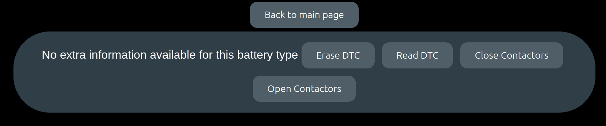{ width="1666" height="348" }

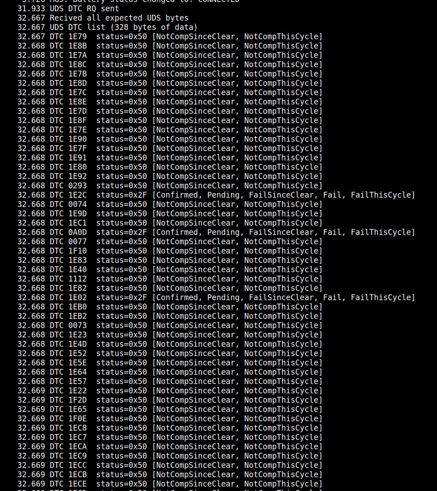{ width="1362" height="1528" }

