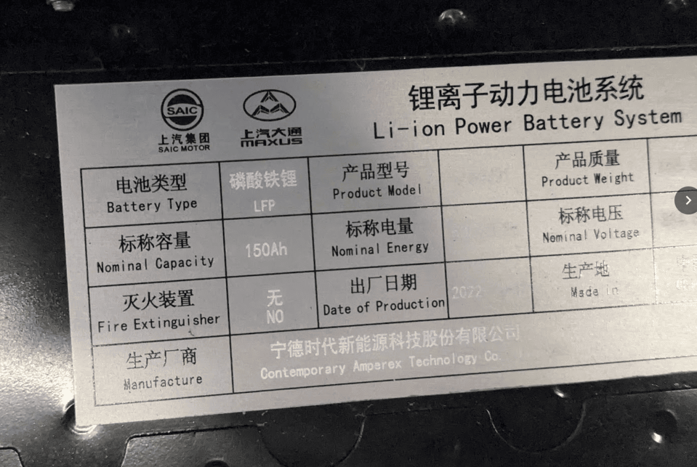
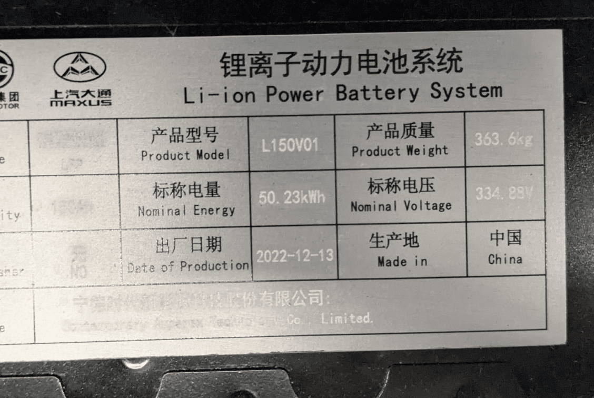
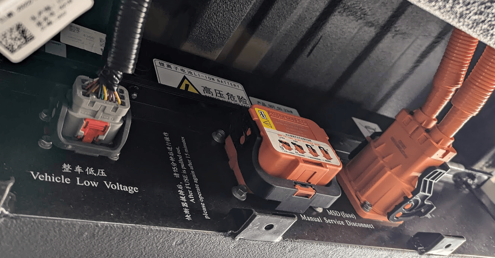
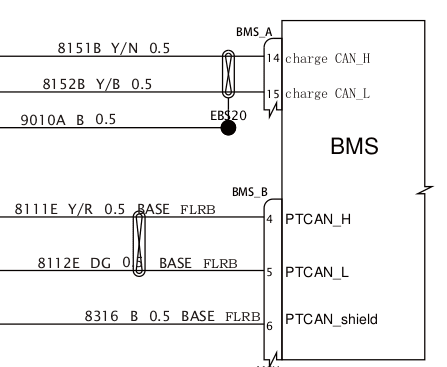
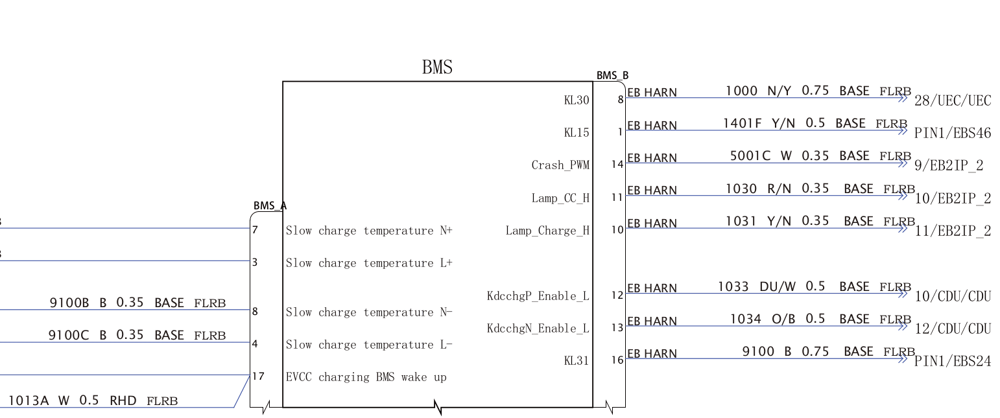
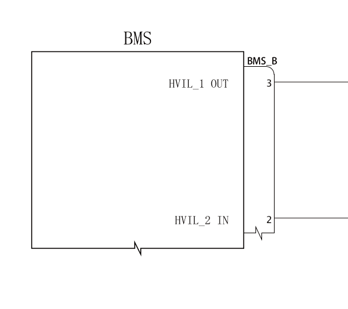
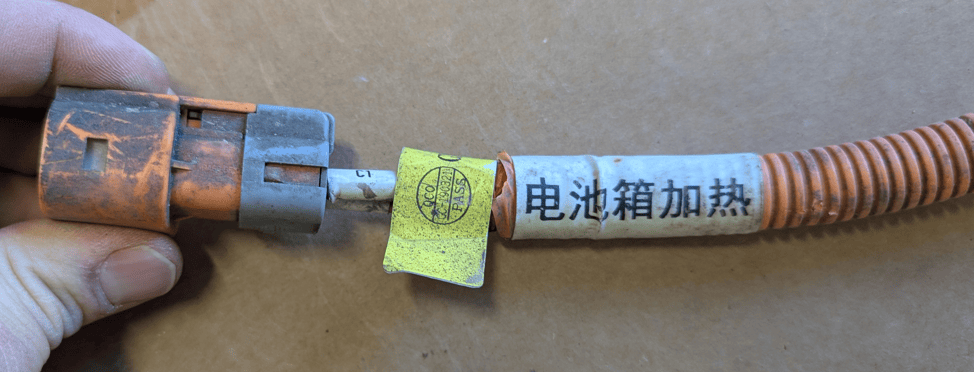

## Battery general info
Maxus eDeliver 3.
There are different battery models:
- 35kWh / 52.5kWh NCM by UABC "United Auto Battery System Co.,Ltd" (model year 2020, 2021)
- 50,2 kWh LFP by CATL "Contemporary Amperex Technology Co., Limited" (model year 2022+)

{ width="1128" height="756" }

{ width="1128" height="756" }

## Battery overview

{ width="1333" height="697" }

Left to right,  Low voltage connector, service disconnect switch, high voltage connector

## Low voltage wiring

Apart from the HV plug, the BMS has two plugs "A" and "B", A seems to be responsible for charging, B for everything else.
Service manual wiring attached, (PT CAN = PowerTrain CAN):

{ width="447" height="367" }

Other BMS connections
{ width="1542" height="645" }

The battery has an interlock on Connector B that needs to be shorted
{ width="583" height="518" }

### How do I connect the battery to the Battery-Emulator?
TODO
- Connector B: Pin 3 to Pin 2 to satisfy interlock detection

## High voltage wiring
Cable for heater?

{ width="974" height="372" }

