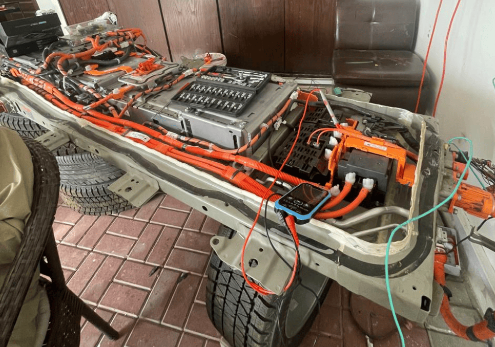
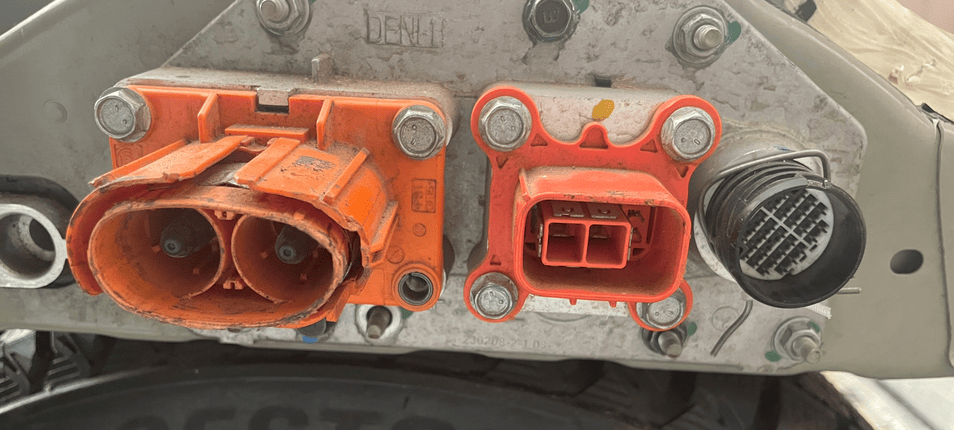

## Compatible batteries
This platform has a 20kWh batteryy
- Nissan Sakura 2022–present
- Mitsubishi eK X EV

### Physical Dimensions

| Parameter | Value |
|----------|-------|
| Pack Size (L × W × H) | <!-- e.g. 2400 × 1500 × 150 mm --> |
| Weight | <!-- e.g. 540 kg --> |

### Special considerations
- Requires external GPIO contactor control

## Software configuration
For this battery type, use the option called "Nissan LEAF" under the "Battery Protocol" section

## Part numbers 
The LV connectors are the samme as on Nissan LEAF

| Component | Part Number | Purchase Link |
|-----------|-------------|---------------|
| <!-- e.g. HV Connector --> | <!-- e.g. TE 123456 --> | [eBay](#) / [AliExpress](#) |

## Wiring, Low voltage connector
The Low Voltage connector is the same B36 connector used on the Nissan LEAF

| Parameter | Value |
|----------|-------|
| 12V Consumption — Peak Start | <!-- e.g. 15 A --> |
| 12V Consumption — Continuous | <!-- e.g. 5 A --> |
| CAN type | <!-- CAN or CAN-FD or RS485 --> |
| Contactor Control | <!-- CAN-controlled or Externally controlled --> |

## Wiring, High voltage connector

| Parameter | Value |
|----------|-------|
| Interlock Required | <!-- Yes / No --> |
| Number of Interlocks | <!-- e.g. 2 --> |

## Troubleshooting tips

<!-- Document common issues and their solutions -->

## Example picture from completed install

<!-- Add a photo of a finished installation for reference -->