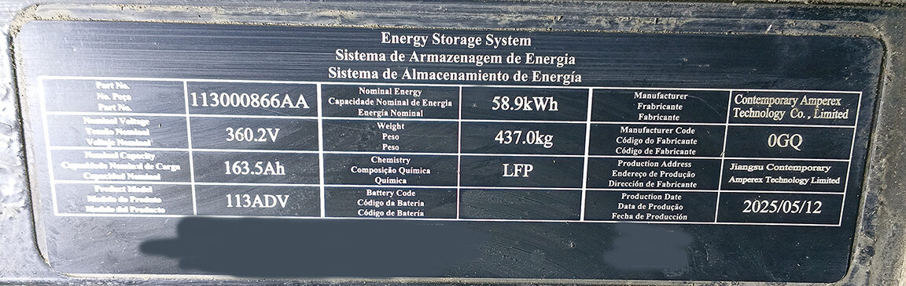
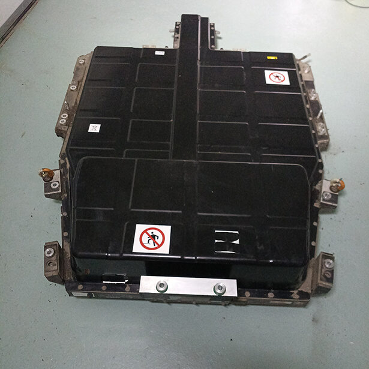
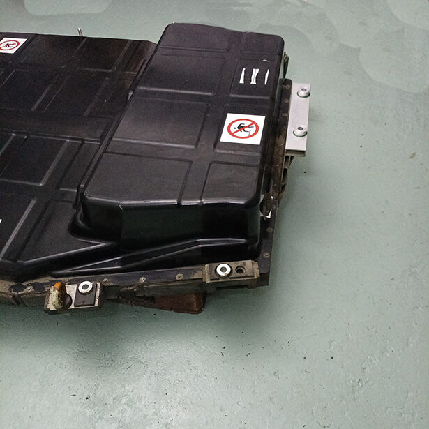
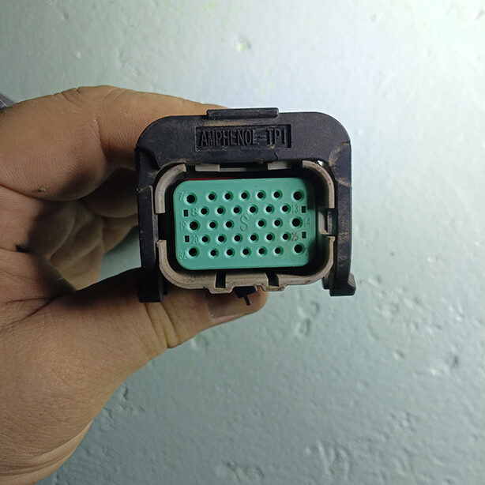
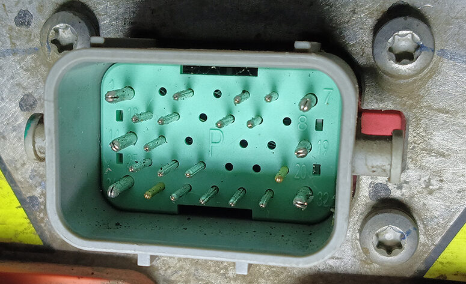
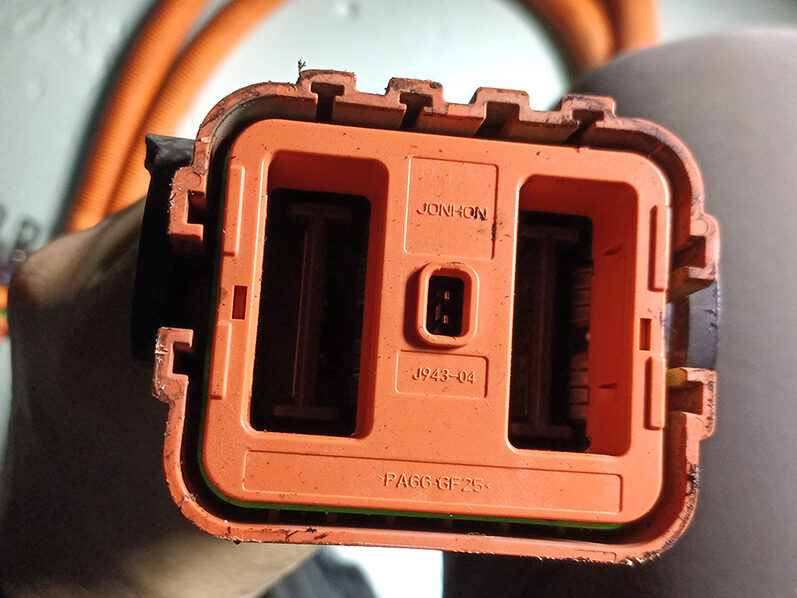
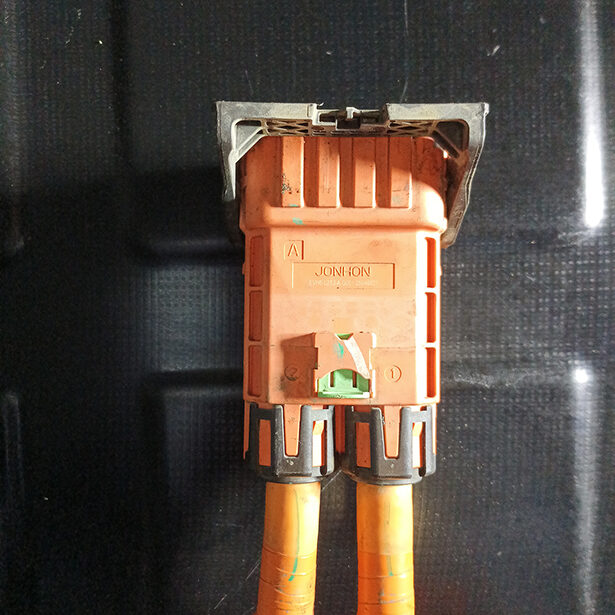
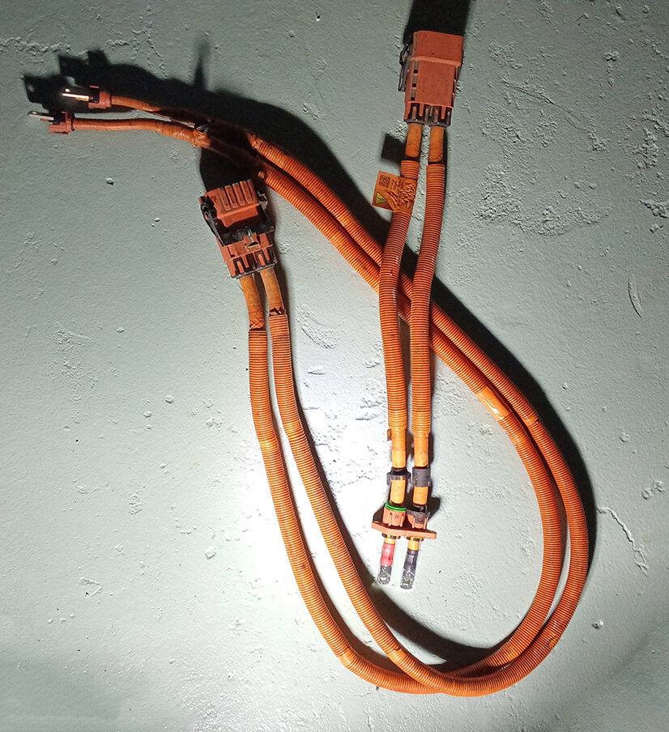
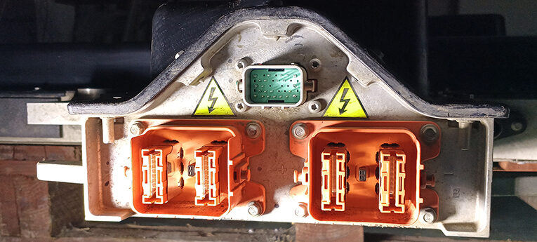

Omoda E5 Noble 
2025, 58.9KW
Battery is manufactured by CATL 

### Physical Dimensions

| Parameter | Value |
|----------|-------|
| Pack Size (L × W × H) | 1900 × 1370 × 300 mm |
| Weight | 437 kg |

## Software configuration
For this battery type, use the option called "xyz" under the "Battery Protocol" section

## Part numbers 
Part numbers for connectors/cables, along with purchase links to ebay/aliexpress

| Component | Part Number | Purchase Link |
|-----------|-------------|---------------|
| LV Connector  | <!--  --> | [eBay](#) / [AliExpress](#) |
| HV Connector (A)| 806020673AA | [eBay](#) / [AliExpress](#) |
| HV Connector (B)| 806020675AA | [eBay](#) / [AliExpress](#) |

## Wiring, Low voltage connector
LV Connector is a Amphenol-TPI HC Series (HC18B-S32 2516 326024) 

This has the ability 6 Power Pins (13A max) + 26 Signals (5A max)
The rear is protected in a (EDPM KR 06) boot that is cable tied closed 

The connection on the battery has following Pins
| Pin| Output           | Colour         | Notes
|----|------------------|----------------|----------
| 1: | <!-- -->         | Blue & Yellow  | 1.2mm Power
| 3: | Crash In         | Solid Blue     |
| 5: | Ground ???       | 0.85mm Black   |
| 6: | DC-Charge CC     | Red & White    |
| 7: | Ground ???       | 1.2mm Black    | 
| 9: | CAN H            | Green & White  | Twisted Pair (1)
| 10:| CAN L            | Yellow & Blue  | Twisted Pair (1)
| 12:| <!-- -->         | Green & Yellow | Twisted Pair (2)
| 13:| <!-- -->         | Purple & Yellow| Twisted Pair (2)
| 14:| <!-- -->         | Blue & White   | 1.2mm Power
| 15:| A+ Charge wakeup | White & Green  | 
| 19:| Ground ???       | 1.2mm Black    | 
| 20:| PSS- Air Bag     | Blue & Black   | Twisted Pair (3)
| 23:| Not Connected    | Not Connected  | Pin on battery but no connection 
| 24:| Not Connected    | Not Connected  | Pin on battery but no connection 
| 25:| <!-- -->         | Red & Blue     | Beware 25 & 28 Same colour wire !!
| 26:| <!-- -->         | White & Red    | 1.2mm Power 
| 27:| PSS+ Air Bag     | Red & Black    | Twisted Pair (3)
| 28:| <!-- -->         | Red & Blue     | Beware 25 & 28 Same colour wire !!
| 29:| HVIL2 Out        | Solid Orange   |
| 30:| HVIL2 IN         | Solid Green    |
| 31:| Ground ???       | 0.85mm Black   |
| 32:| Ground ???       | 1.2mm Black    | 
 

**Diagram of LV connections currently needed**

| Parameter | Value |
|----------|-------|
| 12V Consumption — Peak Start | <!-- --> |
| 12V Consumption — Continuous | <!-- --> |
| CAN type | <!-- --> |
| Contactor Control | <!-- --> |

## Wiring, High voltage connector
There are two HV Connectors (A) & (B)
Connectors are Jonhon 2 Pin EVH6 Series (EVH6 L2TJ-A G001 25046021)
Rated: Current is 150-350A, Voltage 1000V DC, IP68  
Straight Plugs with 70mm² cable 

Cable A is 750mm in length.
Cable B is 2000mm in length.

The Connections on the battery for each plug are clearly marked on Aluminium casting 

| Parameter | Value |
|----------|-------|
| Interlock Required | <!-- --> |
| Number of Interlocks | <!-- --> |

## Troubleshooting tips

