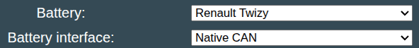

### WIP :construction: 

Renault Twizy is a 48V battery. The software supports this battery, but documentation is missing.

## Software config

For this battery type, use the option called "Renault Twizy" under the "Battery Protocol" setting

{ width="592" height="68" }

## Low voltage connector
HELP WANTED

## High voltage connector
HELP WANTERD
