# FAQ: Renault Zoe Battery Gen1
Zoe Generation 1 batteries have perfect support in the Battery-Emulator

## Variants of the Zoe
There are 3x batteries available for the Zoe, this page focuses on the Gen1 22/40kWh batteries
* 22kWh 2012-2019, Gen1
* 40kWh 2016-2019, Gen1
* [52kWh 2019-, Gen2](Renault-Zoe-Gen2.md)

## Zoe 41kWh pictures and pinout
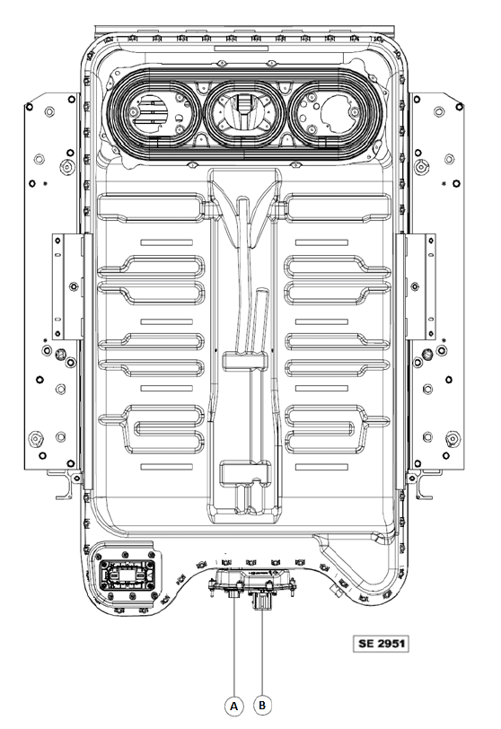
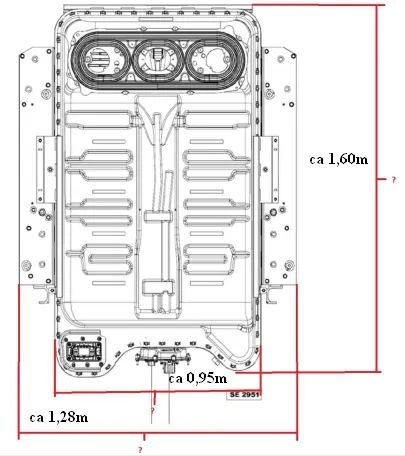
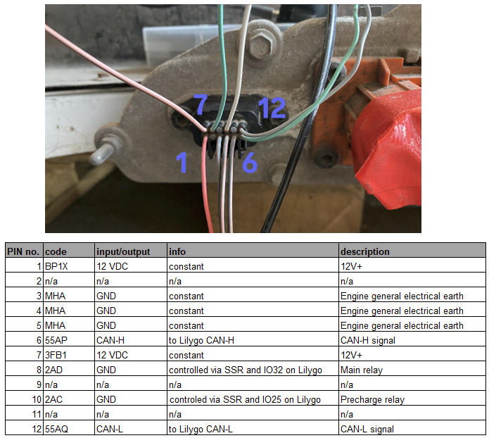

## Testing a battery before purchasing
It is possible to connect the Battery-Emulator up to the battery, with a 12V lead acid battery, and read out the battery cellvoltages and statistics before purchasing a battery. To do this, you will need Pin 1 3 4 5 6 7 12 (see the wiring diagram further down)

Example, Zoe battery being tested with a Stark CMR and Lead acid battery before purchase

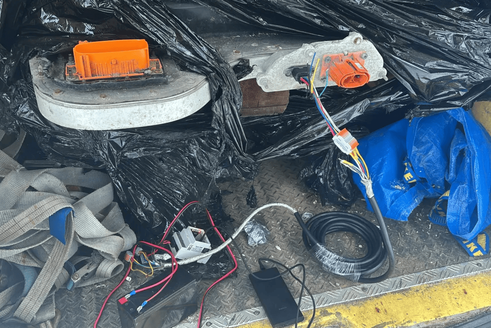

## Software configuration
For this battery type, use the option called "Renault Zoe Gen1 22/40kWh" under the "Battery Protocol" setting

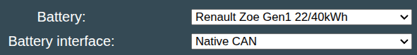

Note that you can also enable "Contactor Control via GPIO" to automate the closing/opening of contactors

## Safety fuse/switch
Note the battery fuse. Do not confuse it with the version from the 52kWh battery, using the incorrect one could result in blown fuses or worse. Use OEM fuse, part no: 297C13111R for 22kWh. 297C12645R for 40kWh

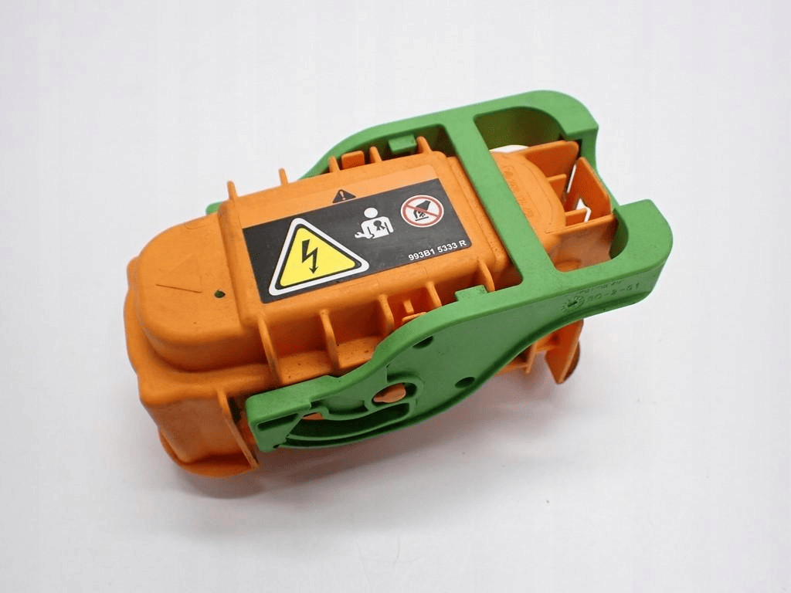

Renault ZOE Gen 1 fuse has to have continiuity between two external sides (positive line):
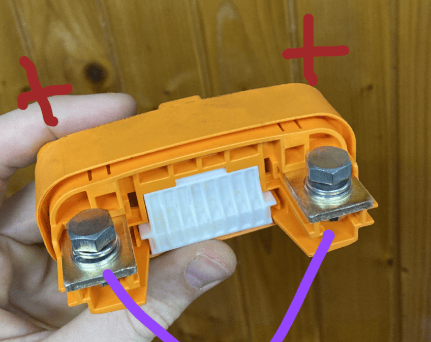

There are also two other fuses inside the pack. There is a fuse under the cover for the contactors and a fuse at the join of the two halves of the pack at the opposite end from the connectors. If the fuse in the middle of the pack blows, this shows as a cell imbalance with cell 48 being somewhere around 0v. Replacing the fuse restores operation.

## Part numbers for Renault Zoe 23/41kWh batteries
|  Product |  Purchase Link |
| :--------: | :---------: |
| Battery communication connector, Yazaki 7282-8854-30 |  [AliExpress](https://de.aliexpress.com/item/4000174903780.html)  OR [Aliexpress wired](https://www.aliexpress.com/item/1005006870591288.html) - You need the Female plug|
| High voltage connector 80kW 297A6-5SH1A OR 297A22581R |  [Ebay](https://www.ebay.com/sch/i.html?_from=R40&_nkw=297A65SH1A&_sacat=0)   |
| Safety switch/fuse | OEM Part no.297C13111R for 22kWh. 297C12645R for 40kWh |
| Relays | [Aliexpress DIN](https://www.aliexpress.com/item/1005007825084745.html) - get the "DC control DC CN" version (schematic to be added to this page)|

## Wiring diagrams

!!! info "IMPORTANT"
    This battery does not have a negative contactor. You only control precharge and positive contactor.

Example of contactor control via SSR relays, connected to a LilyGo T-CAN485 board:

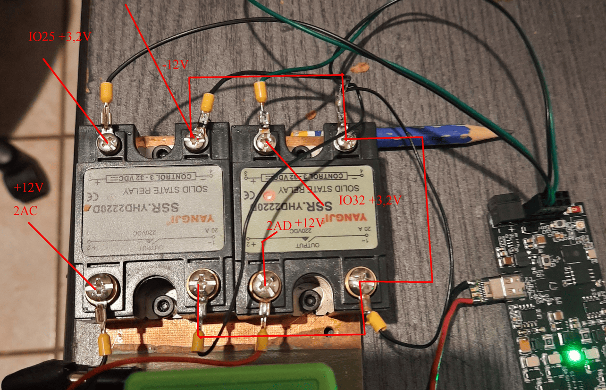

Example of contactor control via SSR relays, connected to a Stark CMR board:

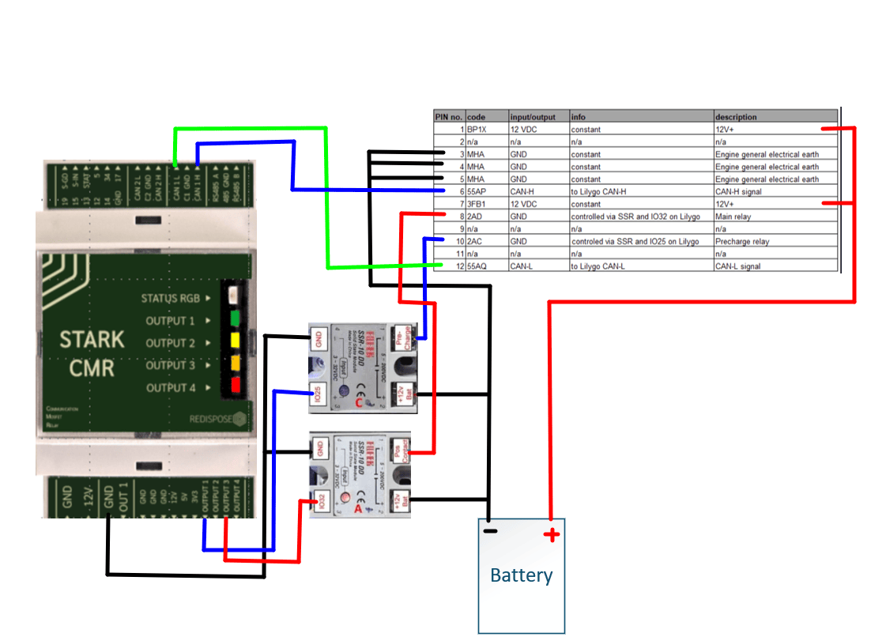

Alternate version with one power supply and 2 SSR DD NO relays using StarkCMR v2 (this version does not have BMS reset relay / function): 
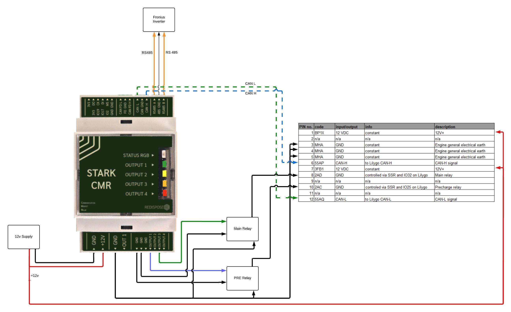

## Notes on balancing :b: 
The Zoe Gen1 batteries appear to start top-balancing at around 93% SOC. Due to this it is recommended to try and fully charge the battery from time to time, to allow it enough time to balance the cells.

You can observe cell-mV-delta at high SOC to confirm when balancing is active, unfortunately the Zoe Gen1 battery does not send which specific cells are being balanced, so there is no visualization in the Cellmonitor page.

## Troubleshooting
- If the inverter does not want to use the battery with more than a few watts of power, check your precharge wiring. You might be pulling all the power thru the precharge resistor instead of contactor. Classic mistake to swap these two around!
- If the cell number 48 is low, your internal battery fuse most likely has blown. Then you need to open up the battery and replace the fuse.

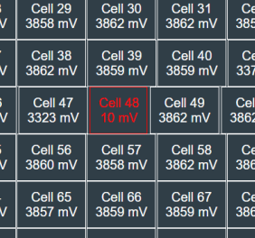

