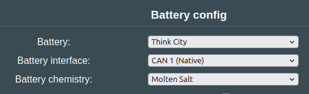
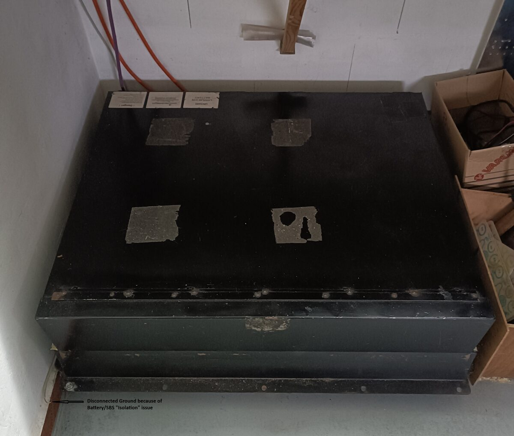
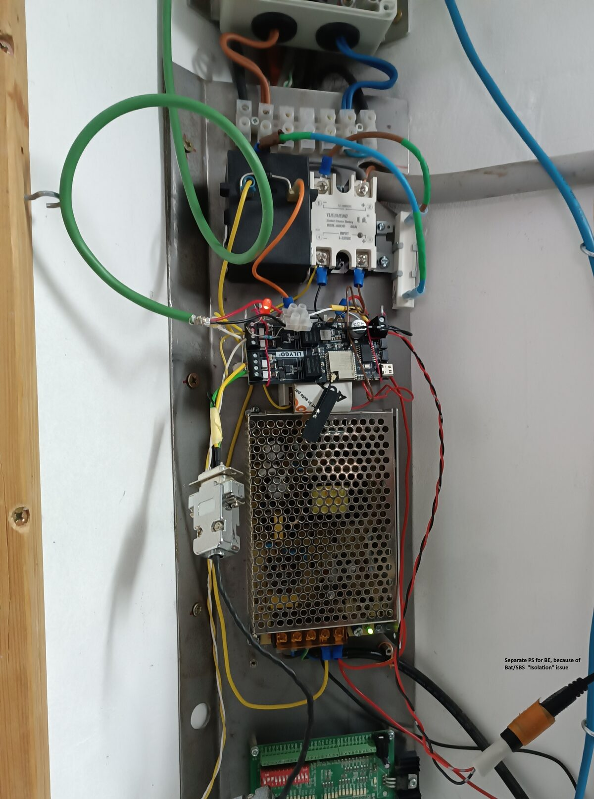
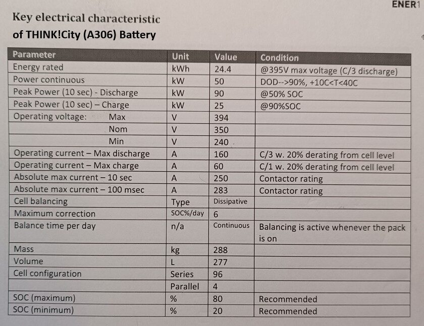
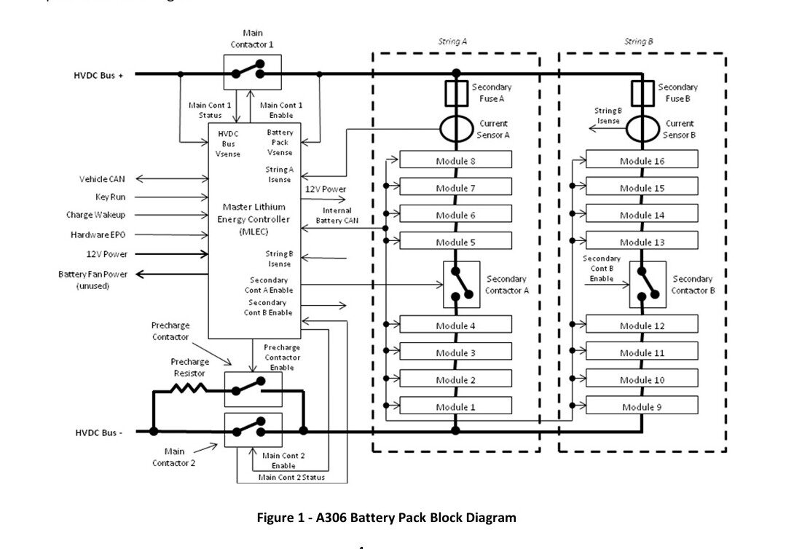

## Software setup

Set the software to use the Think city battery, and either use Molten salt or NCM depending on what battery you have

## Notes on isolation monitoring
The isolation monitoring circuit inside the Think battery is very sensitive. When connecting it to a solar inverter, the inverters own isolation detection might interfere with the Think's, and cause contactor opening. One user reported the following:

After about 3-4 minutes the battery BMS switches off its internal contactors with a service code in message ID 610h: "Isolation Fault With Contactors Off"

_To use the Think-Battery in stationary storage, the BMS needs to be isolated to prevent the "Isolation Fault" I suggest isolating the entire battery and using a separate power supply for the BMS. My Think battery is standing on wooden slats and cannot be hung on the wall. Therefore, I disconnected the grounding conductor and measured the insulation between the battery box and the conductor; the result - very high resistance (by disconnected power supply). In the next step I used a separate (small) power supply for the Battery Emulator..._
_(instead of make a "floating BMS" I made a "floating Battery"). Since then, my Think-Battery / SMA SBS2.5 system has been running continuously all day._

!!! warning "CAUTION"
    The battery box is not grounded! For battery function testing only! Or for complete and safe isolation of the battery box to prevent contact by people and animals.

