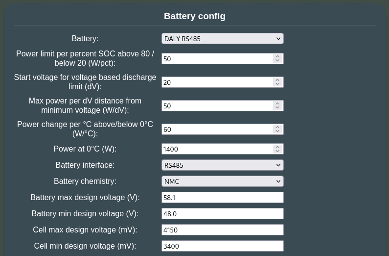
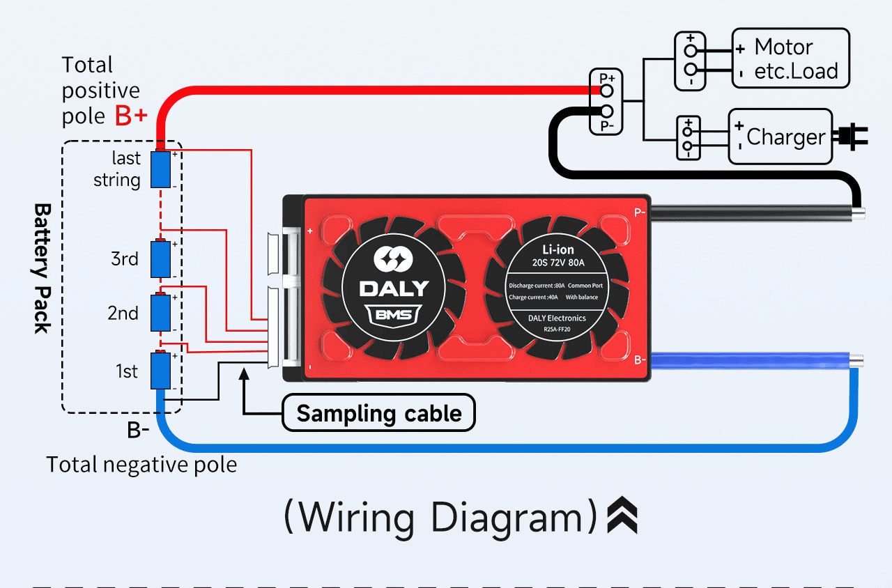
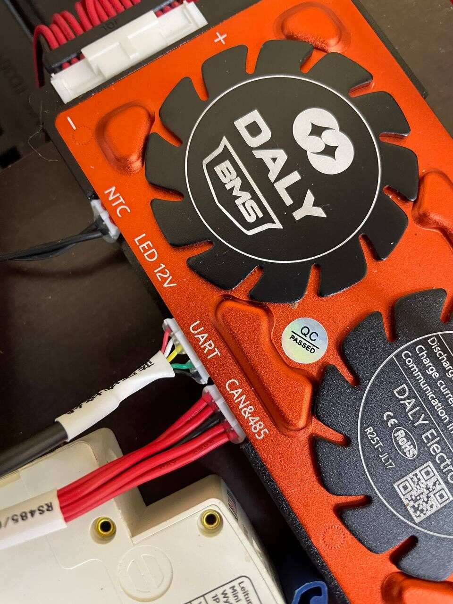
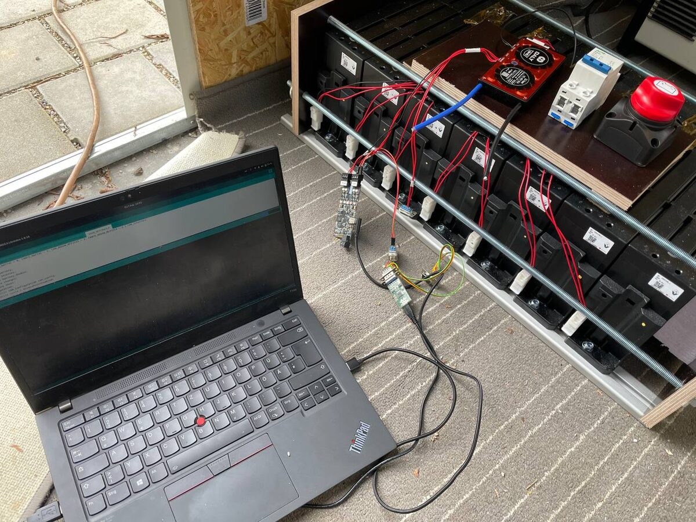
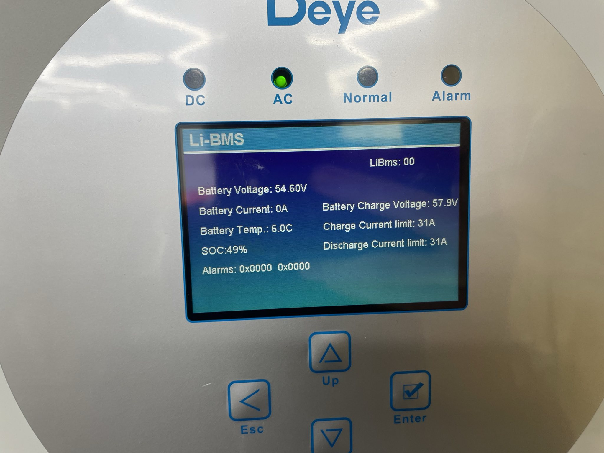
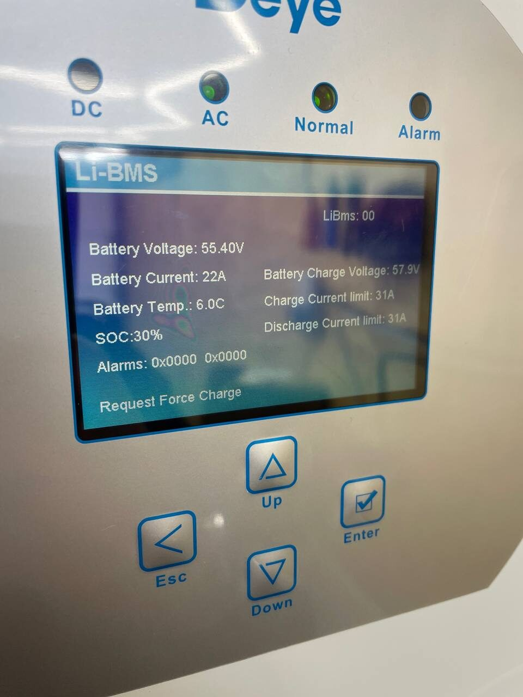
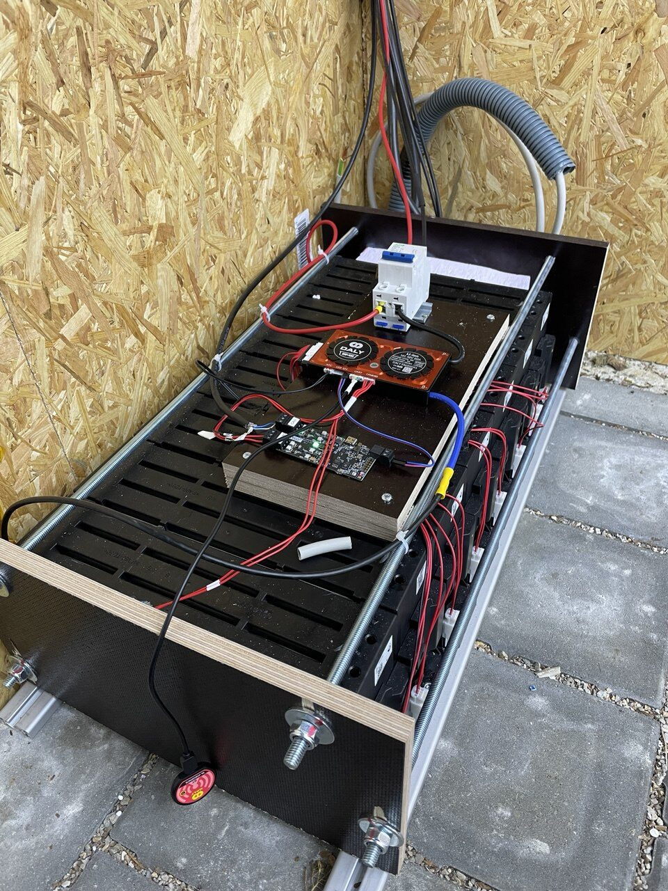
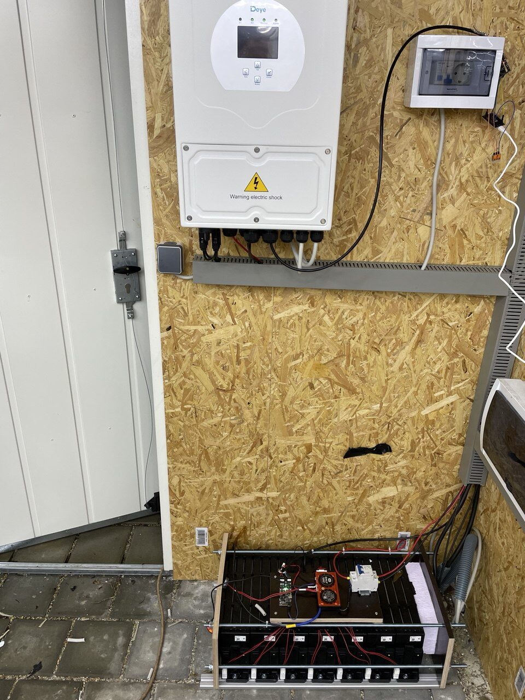
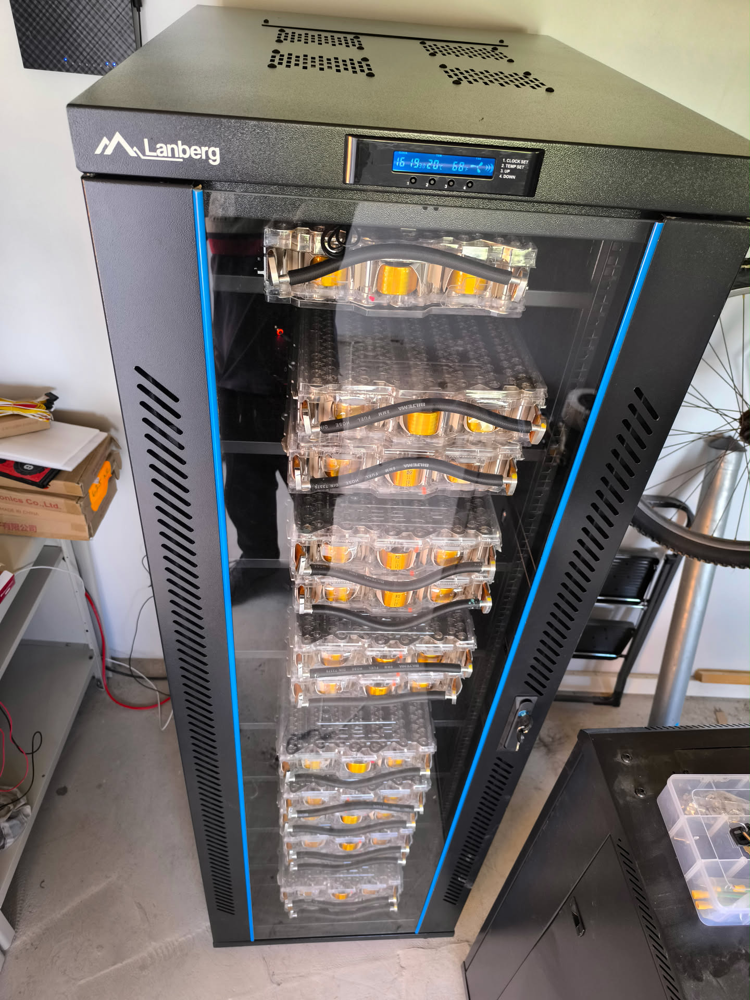
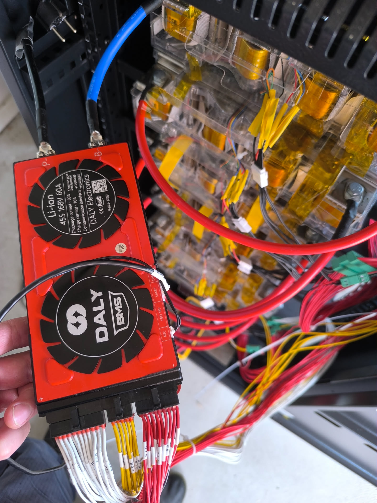

## Read this first

Preface, the entire Battery-Emulator project sets out to achieve safe re-use of EV batteries. By building your own battery, you will be taking larger risks. Cell balancing wire taps, shunts, busbar connections, BMS integration, temperature monitoring, fuses, contactors, interlocks, etc. all will have to be implemented by yourself instead of using a pre-made product. As with all things custom, there are higher risks of human error. Take extra precaution when working on a custom DIY battery, you have been warned.

!!! warning "CAUTION"
    If you are unsure of your technical knowhow, avoid building a battery from scratch

## Custom DIY battery with Daly SmartBMS
The Daly SmartBMS is a series of 4S up to 48S battery management systems allowing to build 12V to 180V DIY batteries.
It comes with CAN and RS485 communication. For battery emulator integration the RS485 communication was chosen. This allows to use CAN for communication with the inverter (e.g. emulating the pylon LV protocol and talking to many 48V solar inverters (Victron, Deye, GoodWe, ...)). 
But also directly via CAN to Growatt SPH LV and HV inverters.

### Where do I get the hardware?
- BMS from e.g. [Aliexpress](https://s.click.aliexpress.com/e/_c3AjMTZN), make sure to buy the **"smart"** version (i.e. it has RS485)
- Cells from Aliexpress, Scrapeyards, ...

## Battery Emulator Configuration
For this battery type, use the option called "DALY RS485" under the "Battery Protocol" setting. Also make sure to configure the interface to RS485.

{ width="795" height="522" }

The Daly BMS does not communicate maximum charging voltages or currents. We calculate our own based on SoC, Voltage and Temperature.
You can adjust these limits using the configuration options shown in the screenshot above using the guidelines below. Refer to your cell datasheet in order to determine safe values.

- maximum and minimum design voltages should be set according to your cell configuration and chemistry
- `Power at 0°C (W)` describes the maximum charge and discharge power the battery can handle when temperature is at exactly 0°C.
- `Power change per °C above/below 0°C (W/°C)` describes how much this power limit increases or decreases based on the current temperature. As an example, the values in the screenshot allow 1400W at 0°C, 2000W at 10°C and 800W at -10°C
- `Start voltage for voltage based discharge limit (dV)` allows to limit the discharge power based on pack voltage. The values in the screenshot start limiting at 50V (48V minimum pack voltage + 20dV offset).
- `Max power per dV distance from minimum voltage (W/dV)` configures the maximum discharge power based on distance from minimum pack voltage. The values in the screenshot give 1000W at 50V, 500W at 49V, 50W at 48.1V etc.
- `Power limit per percent SOC above 80 / below 20 (W/pct)` allows to limit charge and discharge speed based on SoC. A value of `50` means 500W max discharge at 10% and 500W max charge at 90%, 1000W, max discharge at 20% and 1000W max charge at 80%.

## Hardware Setup
Wire the BMS according to the [official wiring guide](https://www.dalybms.com/16s-bms-wiring-tutorial/):

Do not forget to check the balance cable voltages before connecting them to the BMS!

You can configure the integrated BMS safety levels (min, max volts, temperatures etc.) using the "Smart BMS" App or the Desktop program.

Connect Battery Emulator to the RS485 connector of the BMS. If your DALY BMS does not have the CAN/RS485 port you probably have a cheaper non-smart BMS. The battery emulator integration currently only works with the "SmartBMS" variant.

Make sure the RS485 connection works by inspecting the values displayed on the battery emulator webinterface

Next connect your inverter (via CAN). Best not to connect power cables just yet, but first ensure communication works fine.

Lastly you may connect power and test actual charging and discharging.

## Example integrations

#### Used Renault Twizy cells + 60A Daly BMS by @M4GNV5

#### Used Tesla Model S cell packs + 45S 60A Daly BMS - On Growatt SPH 7000 BH by Kelas

