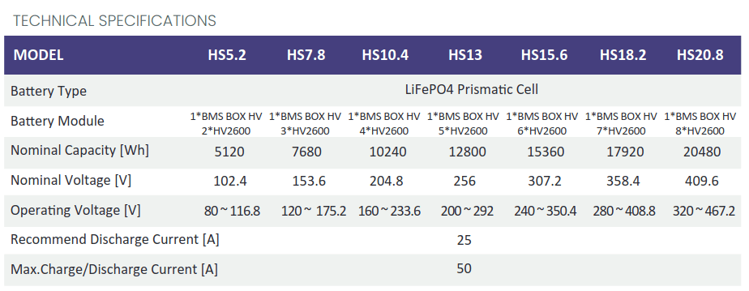
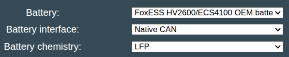

## FoxESS HV2600

The FoxESS battery is an OEM high quality LFP battery intended for stationary storage. The Battery-Emulator has support for interfacing with this OEM battery, so that you can connect it to other Inverters not originally intended for it. For example a Fronius Gen24.

## Specifications

The battery is modular, and can be arranged in 1-8 stacks to raise/lower the output voltage according to inverter needs. Capacity grows each time you add a module.

[Datasheet available here](https://www.fox-ess.com/wp-content/uploads/2024/12/EN-HV2600-Datasheet-V3.5-20241119.pdf)

## Software configuration
For this battery type, use the option called "FoxESS HV/2600/ECS4100 OEM battery" under the "Battery Protocol" setting

{ width="597" height="119" }
