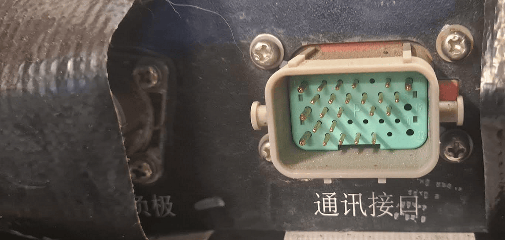

## Seres 3 under construction :construction: 

## Battery
53.61 kWh 

## Seres Models
* [Seres 7/M7](https://en.wikipedia.org/wiki/AITO_M7#Seres_7) (2024–present), mid-size SUV, rebadged [AITO M7](https://en.wikipedia.org/wiki/AITO_M7)
* [Seres M5](https://en.wikipedia.org/wiki/AITO_M5) (2024–present), compact SUV, rebadged [AITO M5](https://en.wikipedia.org/wiki/AITO_M5)
* [Seres SF5/A5/5](https://en.wikipedia.org/wiki/Seres_SF5) (2019–present), compact SUV
* [Seres 3/E3](https://en.wikipedia.org/wiki/Fengon_500#Seres_3) (2020–present), compact SUV, [rebadged](https://en.wikipedia.org/wiki/Rebadging) 
* [Fengon E3](https://en.wikipedia.org/wiki/Fengon_500)[[24]](https://en.wikipedia.org/wiki/Seres_Auto#cite_note-24)[[25]](https://en.wikipedia.org/wiki/Seres_Auto#cite_note-25)
* [Seres E1](https://en.wikipedia.org/wiki/Fengon_Mini_EV) (2023–present), city car, [badge engineered](https://en.wikipedia.org/wiki/Rebadging) [Fengon Mini EV](https://en.wikipedia.org/wiki/Fengon_Mini_EV)

## LV connector
{ width="1146" height="546" }

## CAN logs wanted!
