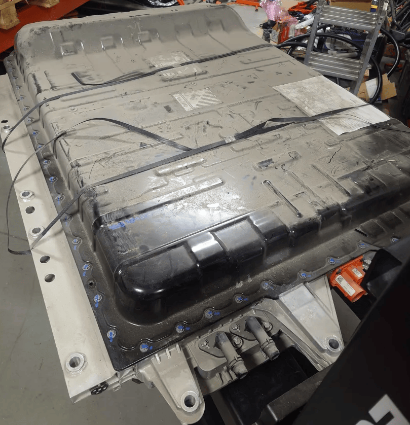
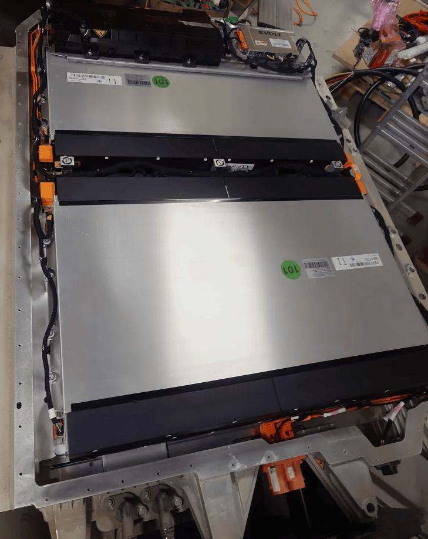
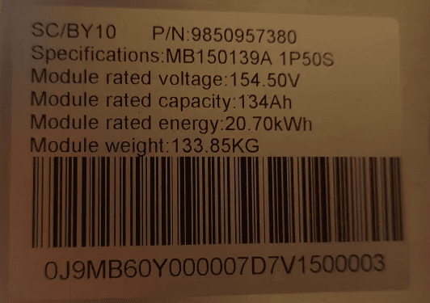
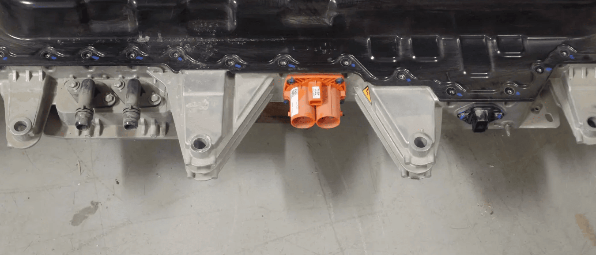
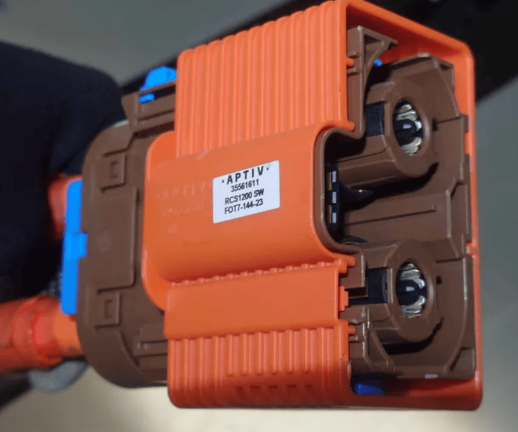
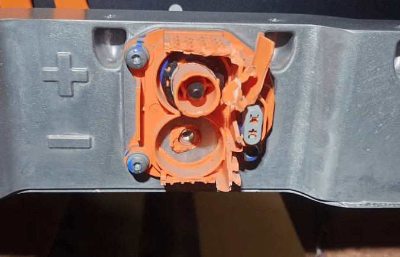
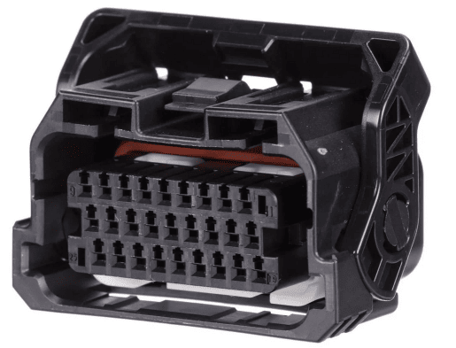
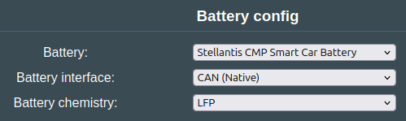
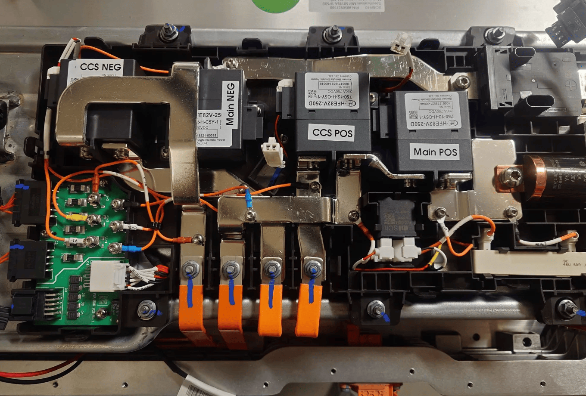

### Supported CMP Smart Car batteries
The Smart Car platform comes with:
- 29kWh LFP battery
- 44kWh LFP battery, 140Ah, 100S, 150x115x30cm dimensions, 350kg

!!! warning "CAUTION"
    If the battery is crashed hard, or detects a massive isolation leak, it will lock itself and display Battery Fault Level 5. Currently we have no way to reset this!

The following vehicles are part of the CMP Smart Car platform according to Wikipedia
- Citroën C3 (CC21) (2022–present, Asia, South Africa, Latin America)[21]
- Citroën C3 Aircross (CC24) (2023–present, Asia, South Africa, Latin America)[22]
- Citroën C3/e-C3 IV (2024–present, Europe)[23]
- Citroën C3 Aircross (2024–present, Europe)
- Citroën Basalt (2024–present)
- Opel Frontera (2024–present)
- Fiat Grande Panda (2025–present)
- Fiat Multipla (coming 2025)[24][25][26]
- Fiat pickup (coming 2025)
- Fiat Fastback (coming 2026)

44kWh battery

Inside is 2x 50S modules , total 100S

## Connectors
From left to right, liquid cooling ports, HV connector, LV connector

## HV connector
The main HV connector is an APTIV 35561611 RCS1200 SW F0T7-144-23 connector

There is also another HV connector on the back used for the DC fast charging port. It has a separate HVIL loop.

## Low voltage connector

LFP low voltage connector - in stock on [Mouser](https://eu.mouser.com/ProductDetail/JST-Automotive/27ZRO-B-1A?qs=Li%252BoUPsLEnuUscRf1zwznw%3D%3D), in case you are not able to get the harness with the connector when you buy the battery.
The connector has the pin numbering stamped on it.

- Connector: **27ZRO-B-1A**
- Pins 0.3 to 0.5 mm$`^2`$: SZRO-A021T-M0.64 
- Pins 0.75 to 0.85 mm$`^2`$: SZRO-A031T-M0.64 
- Dummy Plug: WPHDP-H-1A-H

### Wiring pinout

|  |  |  |
| --- | --- | --- |
| 1 | CAN H | (Connect to Battery Emulator CAN H)
| 2 | CAN L | (Connect to Battery Emulator CAN L)
| 5 | 12V | (Connect to permanent 12V)
| 6 | 12V | (Connect to permanent 12V)
| 7 | 12V | (Connect to permanent 12V) Only required on some batteries
| 9 | 12V | (Connect to permanent 12V)
| 10 | 12V | (Connect to permanent 12V)
| 11 | HVIL | (Connect to pin 12)
| 12 | HVIL | (Connect to pin 11)
| 13 | GND | (Connect to GND for the 12V feed)
| 14 | GND | (Connect to GND for the 12V feed)
| 21 | NTC | (Connect 10k resistor to pin 22) | 
| 22 | NTC | (Connect to resistor on pin 21) |

### Note on WUP
WakeUpPin (WUP) can be used to make the battery survive a reset/reboot in the software. If you connect all 4x 12V pins to the WUP pin via a relay/SSR, you can perform graceful reboots without needing to cycle 12V to the battery to get it to work after a reboot/OTA.

## Software configuration
To use this battery, select the "Stellantis CMP Smart Car Battery" battery option

## Troubleshooting
- If the battery is crashed hard or detects a massive isolation leak, it will lock itself and display Battery Fault Level 5. Currently, we have no way to reset this!

- Here is the internal layout of contactors. 
We engage Main Pos and Main Neg.

