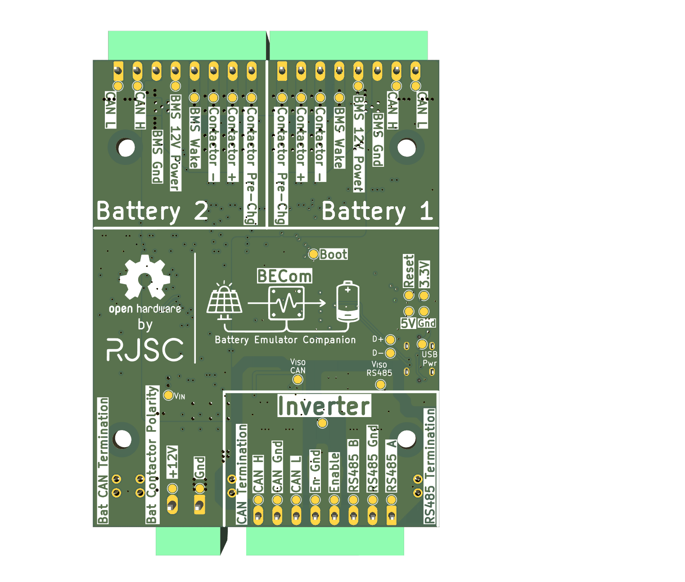
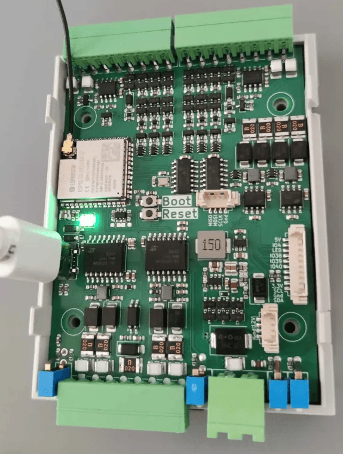

## Hardware basics
The BECom hardware is an open source hardware design created specifically for the Battery-Emulator project. It aims to ? **TODO ADD DESCRIPTION OF BOARD**

### Interfaces
The board has IO for 2x CAN batteries, along with contactor control for each battery. It also features a CAN interface for the inverter, and a Modbus RS485 connector. The inverter comms (CAN and RS485) are electrically isolated

## Hardware info
The hardware has more details [on this Github page](https://github.com/rjsc/BECom)

## Purchase link
TODO?

> [!NOTE]
> This has an included Antenna that needs to be mounted for good Wifi performance. Failure to install this will lead to connectivity issues

## Installing the software
Follow the [quickstart guide](https://github.com/dalathegreat/Battery-Emulator?tab=readme-ov-file#how-to-install-the-software-) to install the Battery-Emulator software onto the board for the initial setup

## Over the air (OTA) software updates
When updating this board [OTA](../40-setup/20-software/OTA-Update.md), be sure to select the software marked for this board. The files will be marked like this, signaling that this is **BECom** hardware

`BE_vX.Y.Z_BECom.ota.bin`

### Boot button 
The BOOT button has [special features to enable AP, wipe wifi settings or factory reset the device](../40-setup/20-software/BOOT-button-functions.md)
