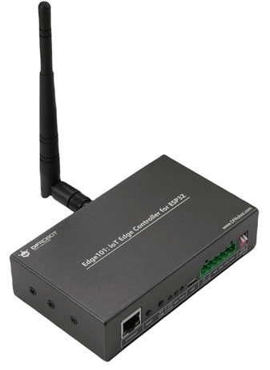
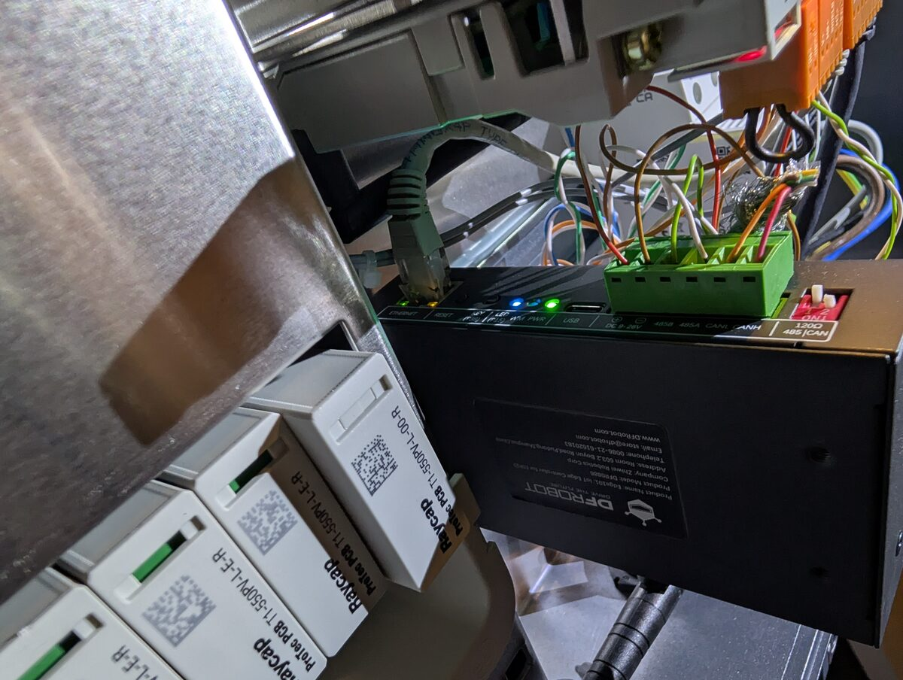

## Hardware basics
The DFRobot Edge101 is a rugged board, with the following features

- Isolated CAN
- Isolated RS485
- Ethernet (Will be supported in later BE releases)
- External Wifi antenna
- PCIe expansion slot with UART
- Case with DIN Rail mount (that fits perfectly inside of a Fronius Verto)
- External IO header (where you could attach an external MCP2518FD)
- SD Card slot
- 16MB Flash

## Purchase link
The hardware can be bought via sites like AliExpress, the [official store](https://www.dfrobot.com/product-2934.html) and [various distributors](https://octopart.com/de/part/dfrobot/DFR0886)