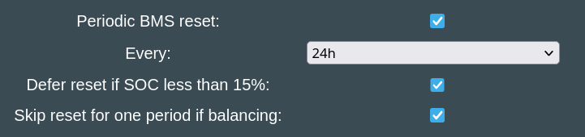

## Why is Periodic Reset needed?
Some EV batteries are not able to operate 24/7 nonstop under all conditions. Over time the SOC% will become less and less accurate, and in some integrations like the Nissan LEAF, even the GIDS (Wh remaining) becomes confused (see [Issue 86](https://github.com/dalathegreat/Battery-Emulator/issues/86)). Balancing also becomes a problem on some packs.

The solution is to periodically reset the 12V power going into the BMS.

The purpose is to force the BMS to recalculate SOC and clear drift/memory leaks by removing its power for a configured time. This requires hardware support: the board must define a `BMS_POWER` pin **and** you must have physically wired the BMS's power supply through it (via a relay/MOSFET). Boards that define the pin include LilyGo T-CAN485, LilyGo-2-CAN, 3LB, Stark CMR, Waveshare and BeCom; the generic/default HAL leaves it unconnected (`GPIO_NUM_NC`), so the toggle is a no-op there. 

### Batteries that benefit from Periodic Reset

- [Nissan LEAF](../../20-battery/nissan_leaf_e_nv200.md)
- [Dacia Spring / Renault K-ZE](../../20-battery/dacia_spring_renault_k_ze.md)
- various Renault types

### GPIO behavior

The `BMS_POWER` pin is only configured as an output and driven **HIGH** at boot if **at least one** of the following is true:

- *Periodic BMS reset every 24h* is enabled, **or**
- *Remote BMS reset via MQTT allowed* is enabled, **or**
- the board forces it on (only the Stark CMR board does this).

If none of these apply, the initialization block is skipped entirely — the pin is never set as an output and therefore stays low/floating. This is why the pin is not driven high unless one of these options is enabled, and this is why when you don't use this feature, you will have to power your BMS directly

Both options behave identically with respect to the pin: enabling **"Periodic BMS reset every 24h"** or **"Remote BMS reset via MQTT allowed"** alone is enough to drive the pin HIGH at boot, exactly like the periodic option. 

The configured pin will remain **HIGH** during regular reboots and OTA in case BMS Reset is configured as the following:

- LilyGo T-2CAN: GPIO3 and GPIO2 (both the default and the option)
- LilyGo T-CAN485: only GPIO25
- Waveshare ESP32‐S3‐RS485‐CAN: GPIO6 (default and only option)
- BECom: GPIO1 (default and only option)
- Stark CMR: GPIO23 (by hardware) and GPIO25

In other cases there may be a brief window during startup, before this init runs, where the pin is not yet driven; expect a short low/indeterminate period at power-on before it goes HIGH.
    
### Reset sequence

When a reset runs (via MQTT, the HA button, or the 24h timer), the pin goes **LOW** for the configured duration, then HIGH again:

1. **Pause** the emulator so it stops requesting charge/discharge.
2. **Wait for safe current** — proceeds when current is 0 A, or below 1.0 A after 5 s. If current is still flowing after 10 s the reset **aborts** (to avoid damaging contactors under load) and raises `EVENT_PERIODIC_BMS_RESET_FAILURE`. Exception: if the emulator drives the contactors directly, it cuts power immediately since it can hold the contactors closed.
3. **Cut BMS power** — drive `BMS_POWER` LOW.
4. **Hold** for the *Periodic BMS reset off time* (`BMSRESETDUR`, default **30 s**, configurable in the webserver).
5. **Power back on** — drive `BMS_POWER` HIGH, then wait a fixed **3 s** warmup.
6. **Unpause**. Done.

By default the system will power off for 30 seconds during the daily reboots. This time can be tweaked in the Webserver settings if you want the reset to be shorter or longer. Some batteries are OK with as short resets as 2 seconds. Here is the setting:

{ width="363" height="95" }

## Taking it into use

There are two ways you can implement Periodic BMS reset:

- triggered locally on Battery Emulator
- triggered from an external system through MQTT

Local triggering has the benefit of operating completely standalone, without any dependency of any third party system. Remote triggering has the benefit of having control of the exact moment you want to perform the reset, take into account various aspects of your energy usage.

### Local trigger on Battery Emulator

{ width="721" height="170" }

Enable the **"Periodic BMS reset"** option. This will reveal 3 options:

- Do the reset once per 24h or once per 48h
- Defer reset if SOC (either real or scaled) is less than 15%
- Skip reset for one period if balancing

Deferring in case of low SOC is useful for cases when reset causes the calculated SOC to differ from the value it was before the reset. In such a case, if the battery was stalling at a min. SOC imposed by the inverter (usually 5%), and BMS would come up with a lower SOC than it had before the reset, it could trigger the inverter to start charging to grid if no sun available, to reach back up to the level required. You can avoid this situation by performing the BMS reset automatically later, when the battery charged back to above 15%.

Skipping one period if balancing (of either 24h or 48h) can be useful for battery packs which report balancing state correctly. Resetting the BMS while balancing is in progress could be counter-productive on packs which spent a lot of time measuring the cells before balancing. This option gives a chance to the balancing process to actually finish, and only perform the reset a cycle later. We don't wait forever to finish balancing, as it's very unlikely that this process would take multiple days. If it still reports as balancing after a second period has passed, it will be reset nevertheless.

With **Periodic BMS reset** option enabled, the GPIO pin will be toggled ON upon boot, and when the time comes to reset the BMS, the pin will be turned OFF for the number of seconds configured (default 30).

The day starts when Battery Emulator is powered on and booted successfully. After 24 hours of uptime, the reset will be triggered.

### Remote trigger through MQTT

Battery Emulator's [MQTT](../20-software/mqtt.md#button-command-discovery) implementation subscribes to the `BMSRESET` command topic to trigger a hardware power-cycle of the BMS. 

The `BMSRESET` command (and the auto-discovered "Reset BMS" Home Assistant button) is only acted upon when **Allow remote BMS reset via MQTT** (`REMBMSRESET`) is enabled. If it is disabled, the command is silently ignored. Note that the HA button is published regardless of this setting, so it can appear in Home Assistant but do nothing until the option is enabled.

{ width="579" height="32" }

With **Allow remote BMS reset via MQTT** option enabled, the GPIO pin will be toggled ON upon boot. It will be toggled OFF and back ON after the configured time when the command arrives. It doesn't send any battery protocol/CAN message. It performs a **hardware power-cycle of the BMS** by toggling the `BMS_POWER` GPIO pin, using the exact same routine as the built-in feature. 

