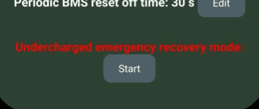
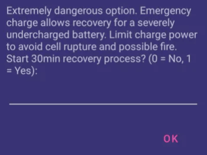
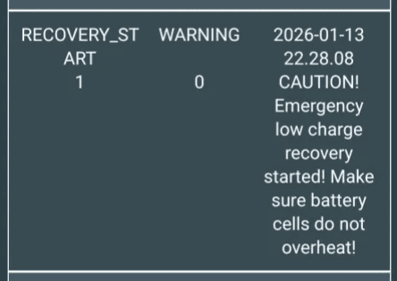
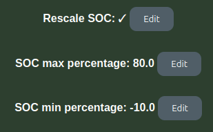

## Recovering an undercharged battery

!!! warning "CAUTION"
    Recovering a too low cell can result in fire :fire: Always limit charging power to a single digit value, and pay close attention to temperatures. Charging too fast can result in cell rupture and fire. Recovering a 2.7V cell is generally safe, 2.5V needs caution, below 2.0V is usually not possible and will always result in a permanently damaged battery that is no longer safe for stationary use. You have been warned!

### How
A scary looking option is added to the Settings page

If user presses Start, they have to enter "1" to confirm going into the emergency recovery mode

User gets notified also via Events that this mode started

In this mode, charging up to 5.0A is allowed. Current can be lowered manually via the max charge A setting. After 30 minutes, the mode is exited.

!!! info "IMPORTANT"
    If one cell is below 2000mV, the function disables instantly. It is not safe to recover such an undercharged cell.

## Notes on SOC
Some inverters wont charge if SOC is 0.xx%. Use the Scaled SOC feature, and set minSOC to -10%. This will force SOC to appear higher towards t he inverter, and allow it to hopefully charge

{ width="309" height="191" }

