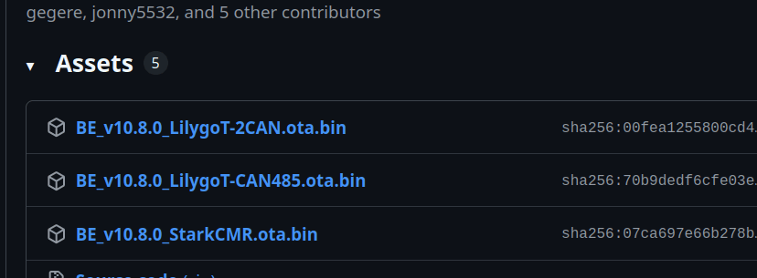
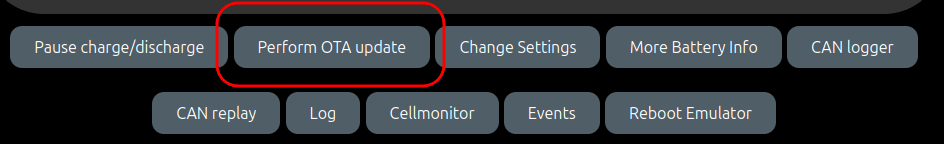
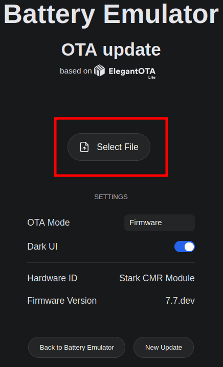
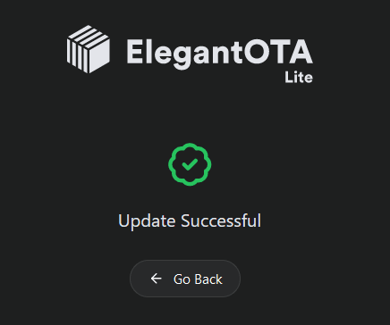
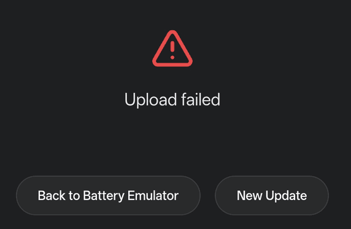

### What is OTA?
Over-the-Air (OTA) update is a mechanism that allows firmware updates to be deployed to ESP32 devices wirelessly, eliminating the need for physical connections. The Battery-Emulator uses the library Elegant OTA to achieve this.

### Prerequisites
Before being able to use OTA update, ensure you have the following prerequisites:
* A Wifi connection established to the board
   * Either a direct connection to the board (192.168.4.1 IP after connecting to the BatteryEmulator network (default password 123456789)
   * OR a connection via a router (see [quickstart video](https://youtu.be/sR3t7j0R9Z0) for how to connect Battery-Emulator hardware directly to your home network)

!!! tip "TIP"
    Starting from version 7.0.0 , many settings are stored to persistent memory. This means that all the things you configure in Webserver (Wifi settings, max charge/discharge rate, SOC scaling settings, Battery capacity) don't have to be configured again. The system will use the previously set settings automatically!

### Getting the updated file
You can download the latest release from [Github Releases](https://github.com/dalathegreat/Battery-Emulator/releases) section

After opening the release you want to update to, at the bottom of the page select the .bin file that matches your hardware

### Performing the OTA update
* Start by navigating to the web address (Note that IP will be different compared to direct / router connection)
* At the bottom of the page, click the "Perform OTA update"

* On the ElegantOTA page, select the "Select file" option

* Select the `.bin` file that you want to update to

* Flashing will commence, once completed you will see this message:

* Congratulations, you have now updated the firmware remotely over the air! 🥳 

## Troubleshooting
If you see "Upload failed" or some other error code, you can try the following things

{ width="572" height="373" }

- Make sure you are sending the right .bin file for the correct hardware
- Improve Wifi coverage if signal is weak, remove obstructions if needed
- OTA updating from another device (Laptops are better than smartphones)
- Connect directly to the AccessPoint network broadcasted by the Battery-Emulator, stand near the device, and send the OTA file
