## Webserver
You can interact with the Battery-Emulator via the built in Webserver. Here you can check battery status, change battery settings, update the software over-the-air, check active events, monitor cell voltages plus much more! It is easy to commission a new system, and the preferred way to monitor a newly setup battery system.

> [!IMPORTANT]  
> Never expose the Battery-Emulator to the internet without a firewall. **Never ever port forward it** to be accessible directly on a WAN port! Use a VPN to the site to access its web interface over an encrypted channel.

## Prerequisites
To be able to use the Webserver, you need to connect to the Battery-Emulator to either your home Wifi, or connect directly to the access point that the Battery-Emulator itself is broadcasting.

### A: Connect to your home network
To have the Battery-Emulator accessible in your home network, you need to enter your home Wifi credentials into the webserver settings. See the quickstart guide for more information on how to perform the initial Wifi setup.

> [!NOTE]  
> SSID can max be 63 chars, and password needs to be atleast 8 chars long. Only 2.4Ghz networks are supported, 5Ghz will NOT work! 

When the board boots, it will attempt to connect to the wifi network you specified. Your router will give it a unique IP, so next up is figuring out what the actual address is. There are a few options you can do

- Connect temporarily to the Battery-Emulator's Access Point, navigate to 192.168.4.1 via a webbrowser, and read out the IP address it got

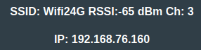

- Connect via USB and read out the serial print via a serial terminal. When the board boots, it will post which IP address it got assigned to. If you only see ????? in the terminal, change the baud rate from 9600 to 115200.
- Check your router info. Incase your home router has a login page (typically 192.168.1.1), you can via this see what devices are connected to your home network. The board will show up as `battery-emulator-a1b2` in your DHCP leases table.

Once the IP of the board has been determined, open a webbrowser on a device that is connected to the same home network, and type in the IP. This will open the Webserver user interface

### B: Connect to the Wi-Fi access point (AP)
By default, there is an AP broadcasted by the board, with the SSID `battery-emulator-a1b2` (containing the last two bytes of its MAC address). The default password is `123456789`. You have to change it in the webserver to improve cyber-security: when the AP is running with the factory-default password, it is automatically disabled after 5 minutes (raising a corresponding event). If a custom AP password has been set, it stays enabled indefinitely. Limiting the default-password AP to a short provisioning window mitigates the attack vector while keeping first-time setup and recovery access fully functional.

After connecting your laptop/phone to this network, you can open a webbrowser and access the interface. To login, browse to the page [192.168.4.1](http://192.168.4.1), this will open the Webserver user interface.

If you don't plan to use the Access Point on a regular basis, disable it. Not only the system will be more secure, but it will also consume less energy plus the board will run 10 degrees cooler because the radio will not be transmitting continuously. Bonus: less radio interference. 

> [!TIP]  
> If you disabled the Access Point earlier and need to use it again without having access to the home network, you can [turn it back on with the BOOT button](BOOT-button-functions.md#start-wi-fi-access-point) on the board.

> [!TIP]  
> You can improve signal quality on the LilyGo board by adding an external Wifi antenna. You can easily salvage one from an old router. There is a SMD resistor that needs to be moved in order for the board to use the external antenna.

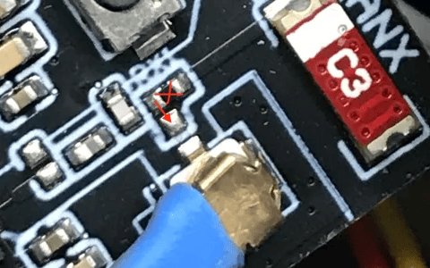

## Using the Webserver
The front page will contain some quick information about the system. What software version the system has, Inverter protocol, Battery type, Livedata from the battery transmitted to the Inverter, along with some buttons to go to other pages. The page will be green incase all is well, go yellow incase there is an active warning, and go red incase an error is active and blocking operation. Incase there is a warning/error active, you can click the `Events` button to go to this view.

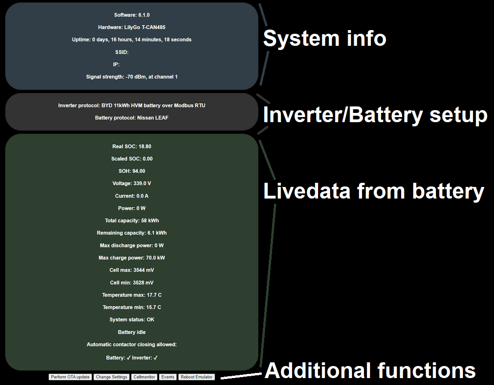

#### Limiting factor
Using the webserver you can see what part is limiting the charge/discharge. It will show you if the battery is the bottleneck, or if the inverter is the limiting factor.

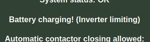

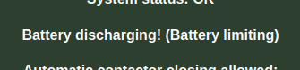

Note, if no power is being put in/out of the battery, the text will simply say Battery Idle

Above this text you can also see the Amperages allowed by the Emulator. You can see when the charge/discharge amperage values are limited by the battery itself (BMS), or by the user configurable settings (Manual)

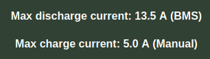

## Events
This page contains information about events that have occured while the system has been running. All events are timestamped, and have an occurance counter so you know if many events of the same type has triggered. 

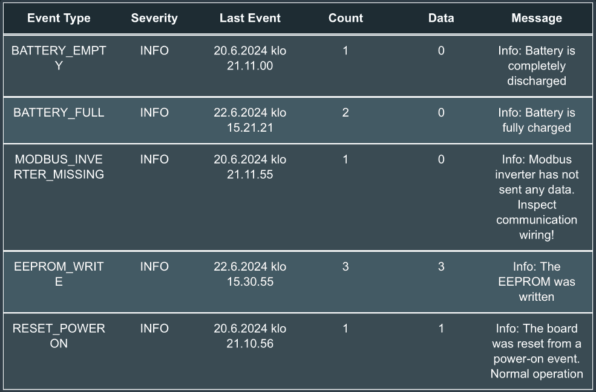

Each event also has a description field with more info. The events are grouped into three categories:

### Info ℹ️ 
Info events contain useful information like when battery has been charged full, completely discharged, reset reason etc. Having info events present does not warranty any user action

### Warning 🟡 
Warning events contain info that users might want to act upon. The system will try to mitigate certain warnings, like incase the battery is reaching too high voltage, the system will raise a warning event and prevent further charging (only discharging will be possible). Warning events should be analyzed when spotted. The front page of the webserver, plus the LED on the board will also turn yellow when a warning event is active.

### Error 🔴 
Critical error events contain info about why the system has stopped operation. Incase it is no longer safe to continue using the battery, an error event will be generated and charging/discharging is set to 0W allowed. Check the Error event description for information on how to proceed or what to check. The front page of the webserver, plus the LED on the board will also turn red when an error event is active.

## Cellmonitor
Via this page you can keep track of all the cells in your battery. At the top of the page there is a quick readout of Min/Max/Deviation inside the battery. The view also has a grid view of all cells and their values, along with a graph at the bottom for quick visualization on how balanced the battery is. The two cells that are lowest and highest will be highlighted red for quicker identification where they are.

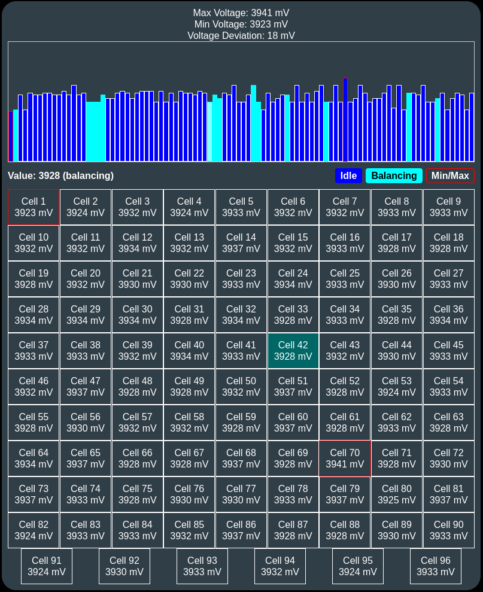

### Interpreting the values
In general, the lower the voltage deviation in mV, the better. A battery with 10mV deviation is considerably healthier than one with 100mV deviation. Individual cells that are lower than the rest can be a sign of early stages of cellfailures/degradation/overheating, however, this depends heavily on the chemistry of the battery. Some chemistries like LMO can have way larger deviations at lower SOC% compared to NCM chemistries. 

Deviations can also grow under heavy load. If you pull tens of kW out of the battery, the mV deviation usually increases. This is completely normal.

The system will automatically go into a warning state incase a cellvoltage goes too high or too low. If this happens, an Event will be raised (see the event page), and further charging/discharging will be halted. 

### Balancing status

On some battery types (Nissan LEAF, Renault Zoe Gen2, more), we visualize the balancing status that the BMS sends in the graph view. You will see cyan colored bars for cells that balance, along with a text saying BALANCING when you hover over the cell.

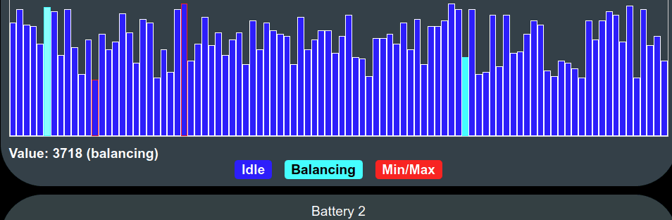

## Perform OTA Update

Via this page you can update the software. [See the page OTA Update for more info how](OTA-Update.md)

## Reboot Emulator

This button will restart the emulator. Can be useful to get out of a latched error message blocking operation (critical cell condition, etc.). Pressing the button will prompt you, "Are you sure you want to reboot?"

> [!Note]  
> Rebooting the Emulator might open contactors! If you have configured the hardware to control contactors via GPIO (see [Automatic Contactor Control](Contactor-Control-via-GPIO-pins.md)), they will absolutely open during a reboot! CAN controlled contactors have undefined behavior during reboot.

> [!Note]  
> Rebooting the Emulator might put your inverter in a fault state. Some inverters take the reboot without any issues (Fronius Gen24), but others can properly lock themselves (SMA Tripower), and require a reset on the inverter side to get going again. 

## Settings

### Web Server Authentication

This protection level is not particularly robust (Digest access authentication), however, it is sufficient to prevent non-malicious usage within the internal network on which it operates and the username and password are not sent in clear text. 

### Inverter config

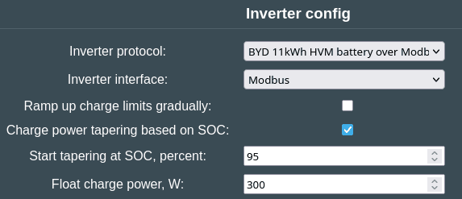

From the appropriate dropdown lists select the Inverter protocol and the interface you wish the Emulator to talk with your inverter.

**Ramp up charge limits gradually** filter smooths sudden increases in the battery's charge power limits before sending them to the inverter to prevent oscillation, using a low pass filter in the software. 

**Charge power tapering based on SOC** will start gradually reducing the allowed charge power when approaching top of SOC, from full allowed power down to 0W at 100% SOC, for a smooth approach to full instead of an abrupt cutoff. Also works with Scaled SOC. It has two settings: **Start tapering at SOC, percent**, this is the (scaled) SOC where charge power tapering begins; and **Float charge power, W** which is the minimum charge power held during tapering until 100% SOC is reached. Recommended to set it to 5-10% of the inverter's max power for a single battery (for double and triple, you can increase the value accordingly). 0 disables this, tapering will go linearly to 0W.

> [!IMPORTANT]
> Remember to set **Max charge speed (A)** and **Max discharge speed (A)** correctly to match your setup for these options to work properly!

> [!NOTE]
> Certain battery integrations will enable **Charge power tapering based on SOC** automatically, making it mandatory to use this function. 

### Battery

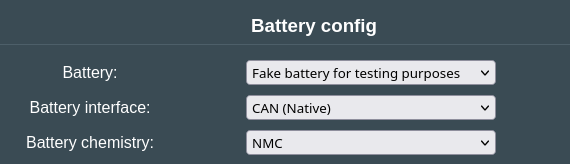

From the appropriate dropdown lists select the driver you'd like to use when communicating with your battery. An intersting type is **Fake battery for testing purposes** which simulates the setup of a single, double or triple battery towards the inverter and the integration plaftforms. This "battery" offers a "Fake battery voltage:" configurable option at the bottom of the page: you can simulate various SOCs, even balancing of simulated cells if you set SOC above 85%.

Certain settings allow customizing the battery parameters:

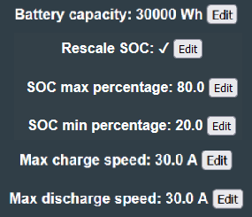

#### Battery Capacity

How much energy can your battery store? Some batteries autodetect this via CAN communication, but for some battery types that do not have this it is good to manually define the value so that your inverter knows how large the battery is.

#### Rescale SOC%

If enabled, the system will rescale SOC% between the configured min/max-percentage. By not using the entire battery, the amount of cycles the battery can last increases. Good practice is to use this feature, and restrict SOC% between 20-80%, however, scaling SOC max too low may cause oscillations when charge approaches the scaled 100%. If you run into this, enable "Ramp up charge limits gradually" in "Inverter config" and raise SOC max percentage to 100%.

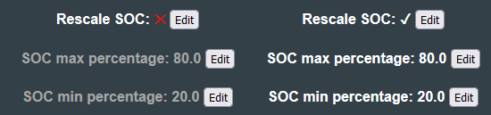

> [!NOTE]
> For some battery chemistries (LFP especially), rescaling SOC% prevents the battery from top-balancing properly. For these chemistries it is recommended only to rescale the bottom section (e.g. using 20-100%) 

> [!TIP]
> Starting from software 8.10.0, it is now possible to do [negative rescaling](https://github.com/dalathegreat/Battery-Emulator/pull/1040)

#### Battery charge/discharge limit

- Max charge speed (A)
- Max discharge speed (A)

This setting caps the amount of power that can go in/out of the battery. Even though most EV packs can push out hundreds of ampere, most inverters will not handle so large amounts of current. Some inverters even stop functioning in case they see allowed a large value. By default this is set to 30A on charge and discharge. Set this value to correspond to the parameters of your inverter (Inverter Power / Vmin), the wiring or the fuses in your system (whichever the lowest). It is important for these numbers to be correct, in order for the filters and the taper to operate correctly. 

> [!TIP]
> If you have a 3kW inverter, the Max charge/discharge speed would be 3000W / 300Vmin = 10A

#### Manual charge voltage limits

Disabled by default. This option can be enabled to manually limit min/max voltage in the system. Note that not all inverters support voltage based limits, the setting was primarily developed for BYD_CAN. If left disabled, the system will automatically use the entire voltage range of your battery (unless Rescale SOC% is enabled)

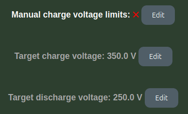

### Log

When **General logging via Webserver** (or SD-card logging) is enabled, a **Log** button appears on the front page. This page streams the general debug log from the emulator, and lets you **Refresh** the data, **Export to .txt**, and **Delete the log file**.

> [!NOTE]
> Logging adds overhead. Webserver and SD-card logging are fine for troubleshooting, but USB-serial logging in particular can cause performance issues and should be left off during normal operation.

### Logging destinations (USB, SD card and syslog)

Battery-Emulator keeps two independent log streams: **general logging** (human-readable status/debug text) and **CAN message logging** (the raw bus traffic covered under CAN logging above). General logging can be sent to any combination of four sinks — the Webserver [Log](#log) page, USB serial, an SD card, and a remote syslog server — while CAN message logging can additionally be written to USB serial or an SD card. All of these are toggled under Settings → Debug options, and every general-log line is prefixed with an uptime timestamp (`seconds.milliseconds`).

> [!NOTE]
> Logging is entirely optional and off by default. Enable only the sinks you actually need — each one adds processing overhead, and USB serial in particular is best left off during normal operation.

#### USB serial

**General logging via USB serial** and **CAN message logging via USB serial** stream the log live over the USB cable. Open a serial terminal on the connected computer at **115200 baud** to watch it in real time. This is the quickest way to see what the board is doing during bring-up, but it is also the heaviest option.

> [!WARNING]
> USB serial logging causes performance issues and should be avoided if possible — especially CAN message logging, which prints every incoming and outgoing frame.

#### SD card

On hardware that has an µSD slot, **General logging to SD card** and **CAN message logging to SD card** persist the log across reboots. Entries are buffered in RAM and flushed to two files in the card root: general logging to **`/log.txt`** and CAN traffic to **`/canlog.txt`**. You can download or clear these files from the browser — the general log via the [Log](#log) page's *Export to .txt* / *Delete log file* buttons, and the CAN log via the [CAN logger](#can-logging) page. Because it survives power cycles, SD logging is the best option for catching an intermittent fault that only shows up after hours of running.

> [!NOTE]
> SD logging only works on SD-equipped boards, and on hardware where the slot pins are shared the µSD slot must first be enabled under the Hardware config. CAN-to-SD logging is high-volume and adds load, so enable it only while actively troubleshooting.

#### Remote syslog

**General logging to syslog server** forwards each general-log line as a UDP **syslog** datagram in **RFC 5424** format to a server of your choice — handy for aggregating logs from a permanently installed system into an existing logging/monitoring setup. Configure the **server IP**, **UDP port** (default 514) and **facility** (0–23, default 1 = user) under Debug options.

Each line is tagged with a syslog **severity**: lines that originate from an event carry that event's level (error → *err*, warning → *warning*, firmware update → *notice*, info → *info*), and all other lines are sent as *debug*. The datagram uses the board's hostname and an app-name of `BatteryEmulator`, and it leaves the timestamp field empty (NILVALUE `-`) so the receiving syslog server stamps each message on arrival. Datagrams can only be received while the board is joined to the Wi-Fi.

> [!TIP]
> If you own a Synology NAS, in the Log Center set up a Log Receiving entry in **IETF** format.

> [!NOTE]
> Remote syslog is not available on small-flash builds.

#### CAN logging

See the page about [CAN logging](../40-can-related/CAN-logging.md) for more information about the CAN logging function.
