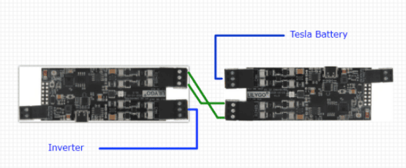
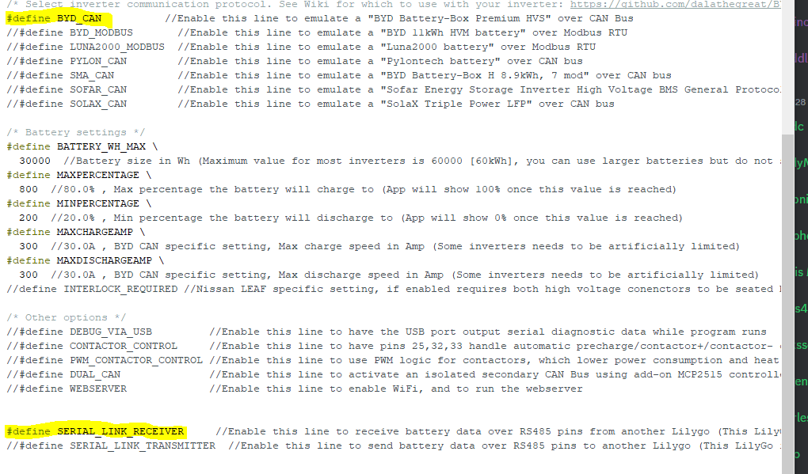
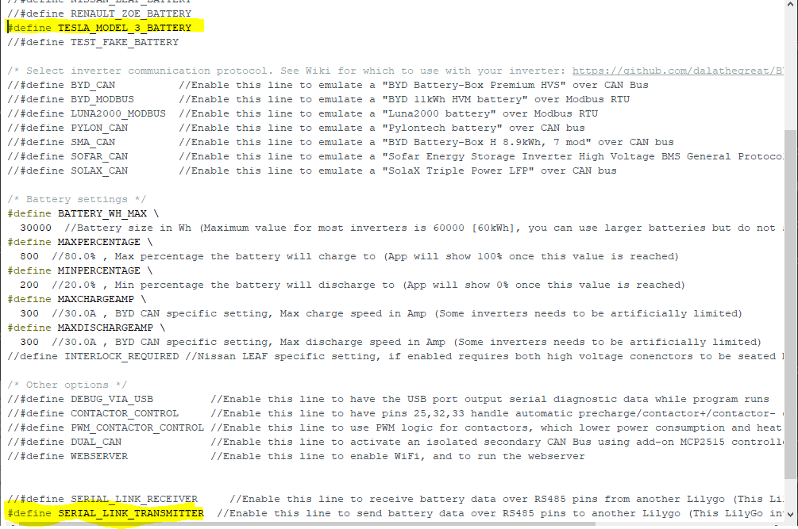

## NOTE: no longer functional

**Due to numerous issues, Double LilyGo is no longer possible with the latest Battery Emulator code. Use one of the other available hardware options.**

## Why are isolated CAN channels needed?
Some Inverters do not like to see automotive CAN frames on the CAN channel meant for stationary storage. When they see these messages, they enter a fault state. To get around this, we can use two LilyGo's in tandem, one interfacing only with battery, and the other interfacing only with inverter. They then talk to each other via Serial communication on the RS485 pins, to relay the data without CAN.

!!! warning "WARNING"
    This is a legacy option. Using double LilyGo's is extremely hard to troubleshoot, plus the fact that not all safety features will be active. Users have reported overcharged batteries from this setup. Due to this, it is recommended to instead use an add-on CAN channel, or a board with multiple CAN channels as standard (Stark, etc.)

Better options
* You can [add an isolated MCP2515 CAN channel](../40-can-related/can_add_on_mcp2515.md)
* You can [add an isolated MCP2518 CANFD channel, and run it in classic CAN mode](../40-can-related/can_fd_add_on_mcp2518fd.md)
* You can use the [Stark CMR](../../30-hardware/stark_cmr.md) board
* You can use a [CAN filter](../40-can-related/can_filter_hardware.md) between inverter and the rest of the system 

## How to connect it
Use twisted pair wires between the RS485 pins on both LilyGo's
RS_A <-> RS_A
RS_B <-> RS_B

## How to configure it
Example configuration, using a Tesla battery with Solax inverter. All configurations are done in the `USER_SETTINGS.h` file. The two new options (`#define SERIAL_LINK_RECEIVER` & `#define SERIAL_LINK_TRANSMITTER`) can be found here.

Inverter connected LilyGo (Protocol + Receiver):

Battery connected LilyGo (Battery + Transmitter):

!!! note "NOTE"
    If you get compilation errors, you most likely selected too many arguments on the same board. For example, SERIAL_LINK_RECEIVER + SOLAX_CAN + TESLA_MODEL_3Y_BATTERY is an invalid combination, the board configured as receiver should only have the protocol enabled ( SERIAL_LINK_RECEIVER + SOLAX_CAN )

