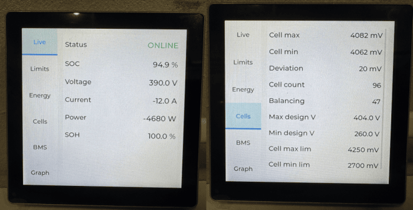

## Some ESPNow background 

ESP-NOW is a low-latency wireless protocol by Espressif that allows direct device-to-device communication without a router. It works on the data-link layer, bypassing higher OSI layers, which results in fast response times and minimal overhead. It supports ESP8266, ESP32, ESP32-S, and ESP32-C series chips and can coexist with Wi-Fi and Bluetooth LE.
It’s ideal for smart home devices, remote controls, and sensor networks, supporting one-to-one, one-to-many, and many-to-many communication with payloads up to 250 bytes.

### **Key Features:**
* Low latency (millisecond-level delay)
* No gateway required
* Encrypted or unencrypted communication
* Range up to ~220 meters in open space
* Supports callbacks for send/receive events

## **ESPNow in Battery Emulator context**
Any ESP32 nearby devices could be used to display the Battery Emulator data without needing any physical connection with the Battery Emulator.
The example below is printing some battery information in the ESP console but the implementation could be extended to use External Displays.
The battery data is broadcasted by using the ESPNow message format to all the ESP32 nearby devices supporting ESPNow V1 (250 bytes)
Due to the size limitation of the ESPNow V1 message , the Battery data was split into 4 different categories/structure:
* battery info - contains the battery general information, capacity, etc
* battery status - contains the current status of the battery 
* battery cell status - contains the current cell voltages 
* battery balancing status - contains the current balancing status of each cell  

Note: enabling ESPNow increases the temperature of the ESP chip, as it shares the radio interface with Wi-Fi. Without ESP-NOW, the Wi-Fi client connection lets the modem duty-cycle down to the network's DTIM interval. The moment ESP-NOW is active, the connectionless path needs the PHY/RX chain powered continuously — Espressif's own FAQ states that once the device enters modem-sleep it can't service ESP-NOW. So you flip from a low duty-cycle radio to a ~100%-on radio, and the PA/PHY idle current is what generates heat with ESPNow enabled. It's the radio staying lit.

##  **Examples of implementation**

### ESPHome and LVGL

```yaml
# =============================================================================
# Battery-Emulator ESP-NOW monitor — Guition 4848S040 display
# Receives all ESP-NOW broadcast fields and shows every bit on a tabbed UI.
# Hardware block reused verbatim from nagyrobi/esp32-evse_esphome-lvgl pak/.
# Tested with ESPHome 2026.6.3
# =============================================================================

substitutions:
  device_name: be-monitor
  friendly_name: "Battery Monitor"
  emulator_mac: "AA:BB:CC:11:22:33"      # <-- emulator #1 STA MAC (replace)

esphome:
  name: ${device_name}
  friendly_name: ${friendly_name}

esp32:
  board: esp32-s3-devkitc-1
  framework:
    type: esp-idf

psram:
  speed: 80MHz
  mode: octal

logger:
  baud_rate: 0
  level: INFO

wifi:                                     # same AP as the emulator => same channel
  ssid: !secret wifi_ssid
  password: !secret wifi_password
  reboot_timeout: 30min
  enable_btm: true

ota:
  - platform: esphome
    password: !secret ota_password
    on_begin:
      - light.turn_off:
          id: display_backlight
          transition_length: 0s
      - lambda: "id(display_backlight).loop();"

# api:                                    # uncomment if you want it in Home Assistant
  # reboot_timeout: 60min
  # encryption:
    # key: !secret encryption_key

# --- 4848S040 hardware -------------------------------------------
spi:
  - id: lcd_spi
    clk_pin: GPIO48
    mosi_pin: GPIO47

i2c:
  id: touchscreen_bus
  sda: GPIO19
  scl: { number: 45, ignore_strapping_warning: true }

output:
  - platform: ledc
    id: gpio_backlight_pwm
    pin: GPIO38
    frequency: 150Hz
    min_power: 0.01
    zero_means_zero: true

light:
  - id: display_backlight
    name: Backlight
    platform: monochromatic
    output: gpio_backlight_pwm
    restore_mode: ALWAYS_ON
    default_transition_length: 500ms

display:
  - platform: st7701s
    id: my_display
    dimensions: { width: 480, height: 480 }
    spi_mode: MODE3
    data_rate: 2MHz
    color_order: RGB
    invert_colors: False
    cs_pin: 39
    de_pin: 18
    hsync_pin: 16
    vsync_pin: 17
    pclk_pin: 21
    pclk_frequency: 12MHz
    pclk_inverted: False
    hsync_pulse_width: 8
    hsync_front_porch: 10
    hsync_back_porch: 20
    vsync_pulse_width: 8
    vsync_front_porch: 10
    vsync_back_porch: 10
    update_interval: never
    auto_clear_enabled: False
    init_sequence:
      - 1
      - [0xFF, 0x77, 0x01, 0x00, 0x00, 0x10]
      - [0xCD, 0x00]
    data_pins:
      red:    [11, 12, 13, 14, 0]
      green:  [8, 20, 3, 46, 9, 10]
      blue:   [4, 5, 6, 7, 15]

touchscreen:
  - platform: gt911
    id: my_touch
    display: my_display
    on_release:
      - if:
          condition: lvgl.is_paused
          then:
            - lvgl.resume:
            - lvgl.widget.redraw:
            - light.turn_on: { id: display_backlight, transition_length: 300ms }

# --- ESP-NOW receiver + full decode + watchdog ------------------------------
globals:
  - id: cell_mv
    type: int[192]
    restore_value: no   # per-cell mV
  - id: cell_bal
    type: int[192]
    restore_value: no   # per-cell balancing 0/1

espnow:
  peers:
    - ${emulator_mac}
  on_broadcast:
    - address: ${emulator_mac}
      then:
        - lambda: |-
            if (size < 5) return;
            const uint8_t bat = data[2];
            const uint8_t typ = data[3];
            const uint8_t* p  = data + 4;
            if (bat != 1) return;
            auto u16 = [&](int o){ return (uint16_t)(p[o]|(p[o+1]<<8)); };
            auto i16 = [&](int o){ return (int16_t)(p[o]|(p[o+1]<<8)); };
            auto u32 = [&](int o){ return (uint32_t)p[o]|((uint32_t)p[o+1]<<8)
                                        |((uint32_t)p[o+2]<<16)|((uint32_t)p[o+3]<<24); };
            auto i32 = [&](int o){ return (int32_t)u32(o); };

            if (typ == 1 && size >= 4 + 24) {                 // ---- INFO ----
              lv_label_set_text_fmt(id(v_cap),  "%u Wh", (unsigned)u32(0));   // INFO.total_capacity_Wh
              lv_label_set_text_fmt(id(v_rcap), "%u Wh", (unsigned)u32(4));   // INFO.reported_total_capacity_Wh
              lv_label_set_text_fmt(id(v_vmax), "%.1f V", u16(8)/10.0);       // INFO.max_design_voltage_dV (dV/10)
              lv_label_set_text_fmt(id(v_vmin), "%.1f V", u16(10)/10.0);      // INFO.min_design_voltage_dV (dV/10)
              lv_label_set_text_fmt(id(v_clmx), "%d mV", (int)u16(12));       // INFO.max_cell_voltage_mV
              lv_label_set_text_fmt(id(v_clmn), "%d mV", (int)u16(14));       // INFO.min_cell_voltage_mV
              lv_label_set_text_fmt(id(v_cldv), "%d mV", (int)u16(16));       // INFO.max_cell_voltage_deviation_mV
              lv_label_set_text_fmt(id(v_ncell), "%d", (int)p[18]);          // INFO.number_of_cells
              uint32_t ch = u32(20);                                         // INFO.chemistry (enum)
              lv_label_set_text(id(v_chem), ch==0?"Autodetect":ch==1?"NCA":ch==2?"NMC":ch==3?"LFP":ch==4?"ZEBRA":"Unknown");  // INFO.chemistry

            } else if (typ == 2 && size >= 4 + 62) {          // ---- STATUS ----
              lv_label_set_text_fmt(id(v_rem),  "%u Wh", (unsigned)u32(0));   // STATUS.remaining_capacity_Wh
              lv_label_set_text_fmt(id(v_rrem), "%u Wh", (unsigned)u32(4));   // STATUS.reported_remaining_capacity_Wh
              lv_label_set_text_fmt(id(v_mdw),  "%u W", (unsigned)u32(8));    // STATUS.max_discharge_power_W
              lv_label_set_text_fmt(id(v_mcw),  "%u W", (unsigned)u32(12));   // STATUS.max_charge_power_W
              lv_label_set_text_fmt(id(v_odw),  "%u W", (unsigned)u32(16));   // STATUS.override_discharge_power_W
              lv_label_set_text_fmt(id(v_ocw),  "%u W", (unsigned)u32(20));   // STATUS.override_charge_power_W
              lv_label_set_text_fmt(id(v_pow),  "%d W", (int)i32(24));        // STATUS.active_power_W (signed)
              lv_label_set_text_fmt(id(v_tchg), "%d Wh", (int)i32(28));       // STATUS.total_charged_battery_Wh
              lv_label_set_text_fmt(id(v_tdis), "%d Wh", (int)i32(32));       // STATUS.total_discharged_battery_Wh
              lv_label_set_text_fmt(id(v_mda),  "%.1f A", u16(36)/10.0);      // STATUS.max_discharge_current_dA (dA/10)
              lv_label_set_text_fmt(id(v_mca),  "%.1f A", u16(38)/10.0);      // STATUS.max_charge_current_dA (dA/10)
              lv_label_set_text_fmt(id(v_soh),  "%.1f %%", u16(40)/100.0);    // STATUS.soh_pptt (/100)
              lv_label_set_text_fmt(id(v_volt), "%.1f V", u16(42)/10.0);      // STATUS.voltage_dV (/10)
              lv_label_set_text_fmt(id(v_cmax), "%d mV", (int)u16(44));       // STATUS.cell_max_voltage_mV
              lv_label_set_text_fmt(id(v_cmin), "%d mV", (int)u16(46));       // STATUS.cell_min_voltage_mV
              lv_label_set_text_fmt(id(v_soc),  "%.1f %%", u16(48)/100.0);    // STATUS.real_soc (/100)
              lv_label_set_text_fmt(id(v_rsoc), "%.1f %%", u16(50)/100.0);    // STATUS.reported_soc (/100)
              lv_label_set_text_fmt(id(v_cerr), "%d", (int)u16(52));          // STATUS.CAN_error_counter
              lv_label_set_text_fmt(id(v_tmax), "%.1f °C", i16(54)/10.0);     // STATUS.temperature_max_dC (/10)
              lv_label_set_text_fmt(id(v_tmin), "%.1f °C", i16(56)/10.0);     // STATUS.temperature_min_dC (/10)
              lv_label_set_text_fmt(id(v_curr), "%.1f A", i16(58)/10.0);      // STATUS.current_dA (signed, /10)
              lv_label_set_text_fmt(id(v_rcur), "%.1f A", i16(60)/10.0);      // STATUS.reported_current_dA (signed, /10)
              lv_label_set_text_fmt(id(v_cdev), "%d mV", (int)u16(44)-(int)u16(46));  // derived: cell_max_voltage_mV - cell_min_voltage_mV
              if (size >= 4+63) lv_label_set_text_fmt(id(v_cal), "%d", (int)p[62]);   // STATUS.CAN_battery_still_alive
              if (size >= 4+76) {
                uint32_t rbs=u32(64), lm=u32(68), bs=u32(72);                 // STATUS.real_bms_status / led_mode / balancing_status (enums @64/68/72)
                lv_label_set_text(id(v_bms),   rbs==0?"Disconnected":rbs==1?"Standby":rbs==2?"Active":rbs==3?"Fault":"Unknown");  // STATUS.real_bms_status
                lv_label_set_text(id(v_led),   lm==0?"Classic":lm==1?"Flow":lm==2?"Heartbeat":"Unknown");                        // STATUS.led_mode
                lv_label_set_text(id(v_balst), bs==0?"Unknown":bs==1?"Error":bs==2?"Ready":bs==3?"Active":"Unknown");            // STATUS.balancing_status
              }

            } else if (typ == 3 && size >= 4 + 193) {         // ---- BALANCE ----
              const uint8_t n=p[192]; int act=0;
              for (int i=0;i<192;i++){ int v=(i<n)?(p[i]?1:0):0; id(cell_bal)[i]=v; act+=v; }
              lv_label_set_text_fmt(id(v_cbal), "%d", act);   // BALANCE: count of cell_balancing_status[]==1

            } else if (typ == 4 && size >= 4 + 193) {         // ---- CELL ----
              const uint8_t n = p[192];
              for (int i=0;i<192;i++) id(cell_mv)[i] = (i<n) ? (int)p[i]*20 : 0;
              lv_label_set_text_fmt(id(v_ncell), "%d", (int)n);   // CELL.number_of_cells
              // ---- bar chart drawn as absolute-positioned obj rectangles ----
              // (ESPHome compiles out lv_chart, so we draw bars ourselves.)
              if (n > 0) {
                lv_obj_t* cont = id(cells_chart);
                lv_obj_update_layout(cont);                  // ensure size is known
                int W = lv_obj_get_content_width(cont);  if (W <= 0) W = 372;
                int H = lv_obj_get_content_height(cont); if (H <= 0) H = 460;
                const int gap = (n > 64) ? 1 : 2;            // px between bars
                // (Re)create the bar widgets only when the cell count changes.
                if ((int)lv_obj_get_child_count(cont) != n) {
                  lv_obj_clean(cont);
                  for (int i=0;i<n;i++) {
                    lv_obj_t* b = lv_obj_create(cont);
                    lv_obj_remove_style_all(b);
                    lv_obj_set_style_bg_opa(b, LV_OPA_COVER, 0);
                    lv_obj_set_style_radius(b, 0, 0);
                  }
                }
                // Fixed height scale: 2.000 V .. 5.000 V per cell (values are mV).
                const int lo = 3200, hi = 4300;
                // Min/max indices, so only ONE lowest + ONE highest bar go red.
                // (Values are quantized to 20 mV, so many cells tie on value.)
                int cmin=999999, cmax=-1, imin=0, imax=0;
                for (int i=0;i<n;i++){ int v=id(cell_mv)[i]; if(v>0){ if(v<cmin){cmin=v;imin=i;} if(v>cmax){cmax=v;imax=i;} } }
                for (int i=0;i<n;i++) {
                  lv_obj_t* b = lv_obj_get_child(cont, i);
                  if (!b) continue;
                  int v  = id(cell_mv)[i];
                  int x0 = xoff + i * slot;                   // uniform spacing & gap
                  long bh = (long)(v-lo) * H / (hi-lo); if (bh < 3) bh = 3; if (bh > H) bh = H;
                  lv_obj_set_pos(b, x0, (int)(H - bh));        // anchor to bottom
                  lv_obj_set_size(b, bw, (int)bh);
                  uint32_t col = 0x2196F3;                     // blue   = normal
                  if (id(cell_bal)[i]) col = 0x9C27B0;         // purple = balancing
                  if (i==imin || i==imax) col = 0xF44336;      // red    = lowest / highest
                  lv_obj_set_style_bg_color(b, lv_color_hex(col), 0);
                }
              }
            }
        - binary_sensor.template.publish: { id: be1_online, state: true }
        - script.execute: be1_watchdog

script:
  - id: be1_watchdog
    mode: restart
    then:
      - delay: 3s
      - binary_sensor.template.publish: { id: be1_online, state: false }

binary_sensor:
  - platform: template
    id: be1_online
    name: "BE1 Online"
    device_class: connectivity
    trigger_on_initial_state: true
    on_press:                              # receved a broadcasted packet
      - lvgl.label.update: { id: v_online, text: "ONLINE", text_color: 0x2ECC71 }
    on_release:                            # >3 s without a packet
      - lvgl.label.update: { id: v_online, text: "OFFLINE", text_color: 0xE74C3C }

text_sensor:
  - platform: wifi_info
    ip_address:
      name: "IP Address"
      id: ip_address
      entity_category: diagnostic
    ssid:
      name: "Connected SSID"
      entity_category: diagnostic
    mac_address:
      name: "Mac Address"
      entity_category: diagnostic

# --- LVGL tabbed UI ----------------------------------------------------------
lvgl:
  displays:
    - my_display
  touchscreens:
    - my_touch
  buffer_size: 100%
  color_depth: 16
  default_font: montserrat_20
  on_idle:
    timeout: 300s
    then:
      - light.turn_off: { id: display_backlight, transition_length: 2000ms }
      - lvgl.pause:
  pages:
    - id: main_page
      pad_all: 0
      widgets:
        - tabview:
            id: tabs
            position: LEFT
            size: 22%
            tab_style:
              items:
                text_align: CENTER
                text_font: montserrat_18
            tabs:
              # ---- TAB 1: Live -----------------------------------------------
              - name: "Live"
                id: tab_live
                scrollable: true
                widgets:
                  - obj:
                      width: 100%
                      height: 100%
                      border_width: 0
                      pad_all: 6
                      scrollable: true
                      layout: { type: GRID, grid_columns: [FR(55), FR(45)], grid_rows: [50, 44, 44, 44, 44, 44] }
                      widgets:
                        - label: { text: "Status",  grid_cell_column_pos: 0, grid_cell_row_pos: 0, grid_cell_y_align: CENTER }
                        - label: { id: v_online, text: "OFFLINE", text_color: 0xE74C3C, text_font: montserrat_22, grid_cell_column_pos: 1, grid_cell_row_pos: 0, grid_cell_x_align: END, grid_cell_y_align: CENTER }
                        - label: { text: "SOC",     grid_cell_column_pos: 0, grid_cell_row_pos: 1, grid_cell_y_align: CENTER }
                        - label: { id: v_soc,  text: "--", text_font: montserrat_22, grid_cell_column_pos: 1, grid_cell_row_pos: 1, grid_cell_x_align: END, grid_cell_y_align: CENTER }
                        - label: { text: "Voltage", grid_cell_column_pos: 0, grid_cell_row_pos: 2, grid_cell_y_align: CENTER }
                        - label: { id: v_volt, text: "--", text_font: montserrat_22, grid_cell_column_pos: 1, grid_cell_row_pos: 2, grid_cell_x_align: END, grid_cell_y_align: CENTER }
                        - label: { text: "Current", grid_cell_column_pos: 0, grid_cell_row_pos: 3, grid_cell_y_align: CENTER }
                        - label: { id: v_curr, text: "--", text_font: montserrat_22, grid_cell_column_pos: 1, grid_cell_row_pos: 3, grid_cell_x_align: END, grid_cell_y_align: CENTER }
                        - label: { text: "Power",   grid_cell_column_pos: 0, grid_cell_row_pos: 4, grid_cell_y_align: CENTER }
                        - label: { id: v_pow,  text: "--", text_font: montserrat_22, grid_cell_column_pos: 1, grid_cell_row_pos: 4, grid_cell_x_align: END, grid_cell_y_align: CENTER }
                        - label: { text: "SOH",     grid_cell_column_pos: 0, grid_cell_row_pos: 5, grid_cell_y_align: CENTER }
                        - label: { id: v_soh,  text: "--", text_font: montserrat_22, grid_cell_column_pos: 1, grid_cell_row_pos: 5, grid_cell_x_align: END, grid_cell_y_align: CENTER }
              # ---- TAB 2: Limits ---------------------------------------------
              - name: "Limits"
                id: tab_limits
                scrollable: true
                widgets:
                  - obj:
                      width: 100%
                      height: 100%
                      border_width: 0
                      pad_all: 6
                      scrollable: true
                      layout: { type: GRID, grid_columns: [FR(58), FR(42)], grid_rows: [40, 40, 40, 40, 40, 40, 40, 40] }
                      widgets:
                        - label: { text: "Max charge",    grid_cell_column_pos: 0, grid_cell_row_pos: 0, grid_cell_y_align: CENTER }
                        - label: { id: v_mcw, text: "--", grid_cell_column_pos: 1, grid_cell_row_pos: 0, grid_cell_x_align: END, grid_cell_y_align: CENTER }
                        - label: { text: "Max discharge", grid_cell_column_pos: 0, grid_cell_row_pos: 1, grid_cell_y_align: CENTER }
                        - label: { id: v_mdw, text: "--", grid_cell_column_pos: 1, grid_cell_row_pos: 1, grid_cell_x_align: END, grid_cell_y_align: CENTER }
                        - label: { text: "Max charge I",  grid_cell_column_pos: 0, grid_cell_row_pos: 2, grid_cell_y_align: CENTER }
                        - label: { id: v_mca, text: "--", grid_cell_column_pos: 1, grid_cell_row_pos: 2, grid_cell_x_align: END, grid_cell_y_align: CENTER }
                        - label: { text: "Max dischg I",  grid_cell_column_pos: 0, grid_cell_row_pos: 3, grid_cell_y_align: CENTER }
                        - label: { id: v_mda, text: "--", grid_cell_column_pos: 1, grid_cell_row_pos: 3, grid_cell_x_align: END, grid_cell_y_align: CENTER }
                        - label: { text: "Override chg",  grid_cell_column_pos: 0, grid_cell_row_pos: 4, grid_cell_y_align: CENTER }
                        - label: { id: v_ocw, text: "--", grid_cell_column_pos: 1, grid_cell_row_pos: 4, grid_cell_x_align: END, grid_cell_y_align: CENTER }
                        - label: { text: "Override dis",  grid_cell_column_pos: 0, grid_cell_row_pos: 5, grid_cell_y_align: CENTER }
                        - label: { id: v_odw, text: "--", grid_cell_column_pos: 1, grid_cell_row_pos: 5, grid_cell_x_align: END, grid_cell_y_align: CENTER }
                        - label: { text: "Reported SOC",  grid_cell_column_pos: 0, grid_cell_row_pos: 6, grid_cell_y_align: CENTER }
                        - label: { id: v_rsoc,text: "--", grid_cell_column_pos: 1, grid_cell_row_pos: 6, grid_cell_x_align: END, grid_cell_y_align: CENTER }
                        - label: { text: "Reported I",    grid_cell_column_pos: 0, grid_cell_row_pos: 7, grid_cell_y_align: CENTER }
                        - label: { id: v_rcur,text: "--", grid_cell_column_pos: 1, grid_cell_row_pos: 7, grid_cell_x_align: END, grid_cell_y_align: CENTER }
              # ---- TAB 3: Energy ---------------------------------------------
              - name: "Energy"
                id: tab_energy
                scrollable: true
                widgets:
                  - obj:
                      width: 100%
                      height: 100%
                      border_width: 0
                      pad_all: 6
                      scrollable: true
                      layout: { type: GRID, grid_columns: [FR(58), FR(42)], grid_rows: [44, 44, 44, 44, 44, 44] }
                      widgets:
                        - label: { text: "Remaining",     grid_cell_column_pos: 0, grid_cell_row_pos: 0, grid_cell_y_align: CENTER }
                        - label: { id: v_rem,  text: "--", grid_cell_column_pos: 1, grid_cell_row_pos: 0, grid_cell_x_align: END, grid_cell_y_align: CENTER }
                        - label: { text: "Rep. remaining",grid_cell_column_pos: 0, grid_cell_row_pos: 1, grid_cell_y_align: CENTER }
                        - label: { id: v_rrem, text: "--", grid_cell_column_pos: 1, grid_cell_row_pos: 1, grid_cell_x_align: END, grid_cell_y_align: CENTER }
                        - label: { text: "Capacity",      grid_cell_column_pos: 0, grid_cell_row_pos: 2, grid_cell_y_align: CENTER }
                        - label: { id: v_cap,  text: "--", grid_cell_column_pos: 1, grid_cell_row_pos: 2, grid_cell_x_align: END, grid_cell_y_align: CENTER }
                        - label: { text: "Rep. capacity", grid_cell_column_pos: 0, grid_cell_row_pos: 3, grid_cell_y_align: CENTER }
                        - label: { id: v_rcap, text: "--", grid_cell_column_pos: 1, grid_cell_row_pos: 3, grid_cell_x_align: END, grid_cell_y_align: CENTER }
                        - label: { text: "Tot. charged",  grid_cell_column_pos: 0, grid_cell_row_pos: 4, grid_cell_y_align: CENTER }
                        - label: { id: v_tchg, text: "--", grid_cell_column_pos: 1, grid_cell_row_pos: 4, grid_cell_x_align: END, grid_cell_y_align: CENTER }
                        - label: { text: "Tot. dischg",   grid_cell_column_pos: 0, grid_cell_row_pos: 5, grid_cell_y_align: CENTER }
                        - label: { id: v_tdis, text: "--", grid_cell_column_pos: 1, grid_cell_row_pos: 5, grid_cell_x_align: END, grid_cell_y_align: CENTER }
              # ---- TAB 4: Cells ----------------------------------------------
              - name: "Cells"
                id: tab_cells
                scrollable: true
                widgets:
                  - obj:
                      width: 100%
                      height: 100%
                      border_width: 0
                      pad_all: 6
                      pad_right: 16
                      scrollable: true
                      layout: { type: GRID, grid_columns: [FR(58), FR(42)], grid_rows: [38, 38, 38, 38, 38, 38, 38, 38, 38, 38] }
                      widgets:
                        - label: { text: "Cell max",      grid_cell_column_pos: 0, grid_cell_row_pos: 0, grid_cell_y_align: CENTER }
                        - label: { id: v_cmax, text: "--", grid_cell_column_pos: 1, grid_cell_row_pos: 0, grid_cell_x_align: END, grid_cell_y_align: CENTER }
                        - label: { text: "Cell min",      grid_cell_column_pos: 0, grid_cell_row_pos: 1, grid_cell_y_align: CENTER }
                        - label: { id: v_cmin, text: "--", grid_cell_column_pos: 1, grid_cell_row_pos: 1, grid_cell_x_align: END, grid_cell_y_align: CENTER }
                        - label: { text: "Deviation",     grid_cell_column_pos: 0, grid_cell_row_pos: 2, grid_cell_y_align: CENTER }
                        - label: { id: v_cdev, text: "--", grid_cell_column_pos: 1, grid_cell_row_pos: 2, grid_cell_x_align: END, grid_cell_y_align: CENTER }
                        - label: { text: "Cell count",    grid_cell_column_pos: 0, grid_cell_row_pos: 3, grid_cell_y_align: CENTER }
                        - label: { id: v_ncell,text: "--", grid_cell_column_pos: 1, grid_cell_row_pos: 3, grid_cell_x_align: END, grid_cell_y_align: CENTER }
                        - label: { text: "Balancing",     grid_cell_column_pos: 0, grid_cell_row_pos: 4, grid_cell_y_align: CENTER }
                        - label: { id: v_cbal, text: "--", grid_cell_column_pos: 1, grid_cell_row_pos: 4, grid_cell_x_align: END, grid_cell_y_align: CENTER }
                        - label: { text: "Max design V",  grid_cell_column_pos: 0, grid_cell_row_pos: 5, grid_cell_y_align: CENTER }
                        - label: { id: v_vmax, text: "--", grid_cell_column_pos: 1, grid_cell_row_pos: 5, grid_cell_x_align: END, grid_cell_y_align: CENTER }
                        - label: { text: "Min design V",  grid_cell_column_pos: 0, grid_cell_row_pos: 6, grid_cell_y_align: CENTER }
                        - label: { id: v_vmin, text: "--", grid_cell_column_pos: 1, grid_cell_row_pos: 6, grid_cell_x_align: END, grid_cell_y_align: CENTER }
                        - label: { text: "Cell max lim",  grid_cell_column_pos: 0, grid_cell_row_pos: 7, grid_cell_y_align: CENTER }
                        - label: { id: v_clmx, text: "--", grid_cell_column_pos: 1, grid_cell_row_pos: 7, grid_cell_x_align: END, grid_cell_y_align: CENTER }
                        - label: { text: "Cell min lim",  grid_cell_column_pos: 0, grid_cell_row_pos: 8, grid_cell_y_align: CENTER }
                        - label: { id: v_clmn, text: "--", grid_cell_column_pos: 1, grid_cell_row_pos: 8, grid_cell_x_align: END, grid_cell_y_align: CENTER }
                        - label: { text: "Dev limit",     grid_cell_column_pos: 0, grid_cell_row_pos: 9, grid_cell_y_align: CENTER }
                        - label: { id: v_cldv, text: "--", grid_cell_column_pos: 1, grid_cell_row_pos: 9, grid_cell_x_align: END, grid_cell_y_align: CENTER }
              # ---- TAB 5: Temp / BMS -----------------------------------------
              - name: "BMS"
                id: tab_bms
                scrollable: true
                widgets:
                  - obj:
                      width: 100%
                      height: 100%
                      border_width: 0
                      pad_all: 6
                      scrollable: true
                      layout: { type: GRID, grid_columns: [FR(50), FR(50)], grid_rows: [40, 40, 40, 40, 40, 40, 40, 40] }
                      widgets:
                        - label: { text: "Temp max",   grid_cell_column_pos: 0, grid_cell_row_pos: 0, grid_cell_y_align: CENTER }
                        - label: { id: v_tmax, text: "--", grid_cell_column_pos: 1, grid_cell_row_pos: 0, grid_cell_x_align: END, grid_cell_y_align: CENTER }
                        - label: { text: "Temp min",   grid_cell_column_pos: 0, grid_cell_row_pos: 1, grid_cell_y_align: CENTER }
                        - label: { id: v_tmin, text: "--", grid_cell_column_pos: 1, grid_cell_row_pos: 1, grid_cell_x_align: END, grid_cell_y_align: CENTER }
                        - label: { text: "BMS status", grid_cell_column_pos: 0, grid_cell_row_pos: 2, grid_cell_y_align: CENTER }
                        - label: { id: v_bms,  text: "--", grid_cell_column_pos: 1, grid_cell_row_pos: 2, grid_cell_x_align: END, grid_cell_y_align: CENTER }
                        - label: { text: "Balancing",  grid_cell_column_pos: 0, grid_cell_row_pos: 3, grid_cell_y_align: CENTER }
                        - label: { id: v_balst,text: "--", grid_cell_column_pos: 1, grid_cell_row_pos: 3, grid_cell_x_align: END, grid_cell_y_align: CENTER }
                        - label: { text: "LED mode",   grid_cell_column_pos: 0, grid_cell_row_pos: 4, grid_cell_y_align: CENTER }
                        - label: { id: v_led,  text: "--", grid_cell_column_pos: 1, grid_cell_row_pos: 4, grid_cell_x_align: END, grid_cell_y_align: CENTER }
                        - label: { text: "Chemistry",  grid_cell_column_pos: 0, grid_cell_row_pos: 5, grid_cell_y_align: CENTER }
                        - label: { id: v_chem, text: "--", grid_cell_column_pos: 1, grid_cell_row_pos: 5, grid_cell_x_align: END, grid_cell_y_align: CENTER }
                        - label: { text: "CAN errors", grid_cell_column_pos: 0, grid_cell_row_pos: 6, grid_cell_y_align: CENTER }
                        - label: { id: v_cerr, text: "--", grid_cell_column_pos: 1, grid_cell_row_pos: 6, grid_cell_x_align: END, grid_cell_y_align: CENTER }
                        - label: { text: "CAN alive",  grid_cell_column_pos: 0, grid_cell_row_pos: 7, grid_cell_y_align: CENTER }
                        - label: { id: v_cal,  text: "--", grid_cell_column_pos: 1, grid_cell_row_pos: 7, grid_cell_x_align: END, grid_cell_y_align: CENTER }
              # ---- TAB 6: Cell-voltage bar chart -----------------------------
              # Bars are created at runtime from the cell count (see CELL branch).
              # flex_grow gives equal widths; height = voltage; colors set per bar:
              #   blue = normal, purple = balancing, red = lowest/highest.
              - name: "Graph"
                id: tab_graph
                scrollable: false
                widgets:
                  - obj:
                      id: cells_chart
                      width: 100%
                      height: 100%
                      border_width: 0
                      pad_all: 4
                      scrollable: false
                      bg_opa: TRANSP
                      # Bars are absolute-positioned obj rectangles created at
                      # runtime (see CELL branch). lv_chart is unavailable in 
                      # ESPHome (LV_USE_CHART is compiled out at time of writing).
```
{ width="700" height="357" }

### Arduino
Contents of **battery.h** file:
```C
  #include <Arduino.h>

  #define MAX_AMOUNT_CELLS 192

  enum bms_status_enum { STANDBY = 0, INACTIVE = 1, DARKSTART = 2, ACTIVE = 3, FAULT = 4, UPDATING = 5 };
  enum real_bms_status_enum { BMS_DISCONNECTED = 0, BMS_STANDBY = 1, BMS_ACTIVE = 2, BMS_FAULT = 3 };
  enum balancing_status_enum {
    BALANCING_STATUS_UNKNOWN = 0,
    BALANCING_STATUS_ERROR = 1,
    BALANCING_STATUS_READY = 2,  //No balancing active, system supports balancing
    BALANCING_STATUS_ACTIVE = 3  //Balancing active!
  };
  enum battery_chemistry_enum { Autodetect = 0, NCA = 1, NMC = 2, LFP = 3, ZEBRA = 4, Highest };

  enum class comm_interface {
    Modbus = 1,
    RS485 = 2,
    CanNative = 3,
    CanFdNative = 4,
    CanAddonMcp2515 = 5,
    CanFdAddonMcp2518 = 6,
    Highest
  };

  enum led_mode_enum { CLASSIC, FLOW, HEARTBEAT };
  enum PrechargeState {
    AUTO_PRECHARGE_IDLE,
    AUTO_PRECHARGE_START,
    AUTO_PRECHARGE_PRECHARGING,
    AUTO_PRECHARGE_OFF,
    AUTO_PRECHARGE_COMPLETED,
    AUTO_PRECHARGE_FAILURE
  };
  enum BMSResetState {
    BMS_RESET_IDLE = 0,
    BMS_RESET_WAITING_FOR_PAUSE,
    BMS_RESET_POWERED_OFF,
    BMS_RESET_POWERING_ON,
  };

  #define DISCHARGING 1
  #define CHARGING 2

  #define CAN_STILL_ALIVE 60
  // Set by battery each time we get a CAN message. Decrements every second. When reaching 0, sets event

  enum CAN_Interface {
    // Native CAN port on the LilyGo & Stark hardware
    CAN_NATIVE = 0,
    // Native CANFD port on the Stark CMR hardware
    CANFD_NATIVE = 1,
    // Add-on CAN MCP2515 connected to GPIO pins
    CAN_ADDON_MCP2515 = 2,
    // Add-on CAN-FD MCP2518 connected to GPIO pins
    CANFD_ADDON_MCP2518 = 3,
    // No CAN interface
    NO_CAN_INTERFACE = 4
  };

  struct BATTERY_INFO_TYPE {
    /** uint32_t */
    /** Total energy capacity in Watt-hours 
     * Automatically updates depending on battery integration OR from settings page
    */
    uint32_t total_capacity_Wh = 30000;
    uint32_t reported_total_capacity_Wh = 30000;

    /** uint16_t */
    /** The maximum intended packvoltage, in deciVolt. 4900 = 490.0 V */
    uint16_t max_design_voltage_dV = 5000;
    /** The minimum intended packvoltage, in deciVolt. 3300 = 330.0 V */
    uint16_t min_design_voltage_dV = 2500;
    /** The maximum cellvoltage before shutting down, in milliVolt. 4300 = 4.300 V */
    uint16_t max_cell_voltage_mV = 4300;
    /** The minimum cellvoltage before shutting down, in milliVolt. 2700 = 2.700 V */
    uint16_t min_cell_voltage_mV = 2700;
    /** The maxumum allowed deviation between cells, in milliVolt. 500 = 0.500 V */
    uint16_t max_cell_voltage_deviation_mV = 500;

    /** uint8_t */
    /** Total number of cells in the pack */
    uint8_t number_of_cells;

    /** Other */
    /** Chemistry of the pack. Autodetect, or force specific chemistry */
    battery_chemistry_enum chemistry = battery_chemistry_enum::NCA;
  };  // 24 bytes

  struct BATTERY_STATUS_TYPE {
    /** uint32_t */
    /** Remaining energy capacity in Watt-hours */
    uint32_t remaining_capacity_Wh = 0;
    /** The remaining capacity reported to the inverter based on min percentage setting, in Watt-hours 
     * This value will either be scaled or not scaled depending on the value of
     * battery.settings.soc_scaling_active
     */
    uint32_t reported_remaining_capacity_Wh;
    /** Maximum allowed battery discharge power in Watts. Set by battery */
    uint32_t max_discharge_power_W = 0;
    /** Maximum allowed battery charge power in Watts. Set by battery */
    uint32_t max_charge_power_W = 0;
    /* Some early integrations do not support reading allowed charge power from battery
    On these integrations we need to have the user specify what limits the battery can take */
    /** Overriden allowed battery discharge power in Watts. Set by user */
    uint32_t override_discharge_power_W = 0;
    /** Overriden allowed battery charge power in Watts. Set by user */
    uint32_t override_charge_power_W = 0;

    /** int32_t */
    /** Instantaneous battery power in Watts. Calculated based on voltage_dV and current_dA */
    /* Positive value = Battery Charging */
    /* Negative value = Battery Discharging */
    int32_t active_power_W = 0;
    int32_t total_charged_battery_Wh = 0;
    int32_t total_discharged_battery_Wh = 0;

    /** uint16_t */
    /** Maximum allowed battery discharge current in dA. Calculated based on allowed W and Voltage */
    uint16_t max_discharge_current_dA = 0;
    /** Maximum allowed battery charge current in dA. Calculated based on allowed W and Voltage  */
    uint16_t max_charge_current_dA = 0;
    /** State of health in integer-percent x 100. 9900 = 99.00% */
    uint16_t soh_pptt = 9900;
    /** Instantaneous battery voltage in deciVolts. 3700 = 370.0 V */
    uint16_t voltage_dV = 3700;
    /** Maximum cell voltage currently measured in the pack, in mV */
    uint16_t cell_max_voltage_mV = 3700;
    /** Minimum cell voltage currently measured in the pack, in mV */
    uint16_t cell_min_voltage_mV = 3700;
    /** The "real" SOC reported from the battery, in integer-percent x 100. 9550 = 95.50% */
    uint16_t real_soc;
    /** The SOC reported to the inverter, in integer-percent x 100. 9550 = 95.50%.
     * This value will either be scaled or not scaled depending on the value of
     * battery.settings.soc_scaling_active
     */
    uint16_t reported_soc;
    /** A counter that increases incase a CAN CRC read error occurs */
    uint16_t CAN_error_counter;

    /** int16_t */
    /** Maximum temperature currently measured in the pack, in d°C. 150 = 15.0 °C */
    int16_t temperature_max_dC;
    /** Minimum temperature currently measured in the pack, in d°C. 150 = 15.0 °C */
    int16_t temperature_min_dC;
    /** Instantaneous battery current in deciAmpere. 95 = 9.5 A */
    int16_t current_dA;
    /** Instantaneous battery current in deciAmpere. Sum of all batteries in the system 95 = 9.5 A */
    int16_t reported_current_dA;

    /** uint8_t */
    /** A counter set each time a new message comes from battery.
     * This value then gets decremented every second. Incase we reach 0
     * we report the battery as missing entirely on the CAN bus.
     */
    uint8_t CAN_battery_still_alive = CAN_STILL_ALIVE;
    /** The current system status, which for now still has the name bms_status */
    bms_status_enum bms_status = ACTIVE;
    /** The current battery status, which for now has the name real_bms_status */
    real_bms_status_enum real_bms_status = BMS_DISCONNECTED;
    /** LED mode, customizable by user */
    led_mode_enum led_mode = CLASSIC;
    /** Balancing status */
    balancing_status_enum balancing_status = BALANCING_STATUS_UNKNOWN;
  };  // 80 bytes

  struct BATTERY_BALANCING_STATUS_TYPE {
    /** All balancing resistors status inside the pack, either on(1) or off(0).
     * Use with battery.info.number_of_cells to get valid data.
     * Not available for all battery manufacturers.
     */
    bool cell_balancing_status[MAX_AMOUNT_CELLS];

    /** uint8_t */
    /** Total number of cells in the pack */
    uint8_t number_of_cells;

  };  // 193 bytes

  struct BATTERY_CELL_STATUS_TYPE {

    /** All cell voltages currently measured in the pack, in mV. 212 * 20 = 4240 mV
     * Use with battery.info.number_of_cells to get valid data.
     */
    uint8_t cell_voltages_mV[MAX_AMOUNT_CELLS];

    /** uint8_t */
    /** Total number of cells in the pack */
    uint8_t number_of_cells;
  };  // 193 bytes

  enum espnow_message_enum { BAT_INFO = 1, BAT_STATUS = 2, BAT_BALANCE = 3, BAT_CELL_STATUS = 4 };

  struct ESPNOW_BATTERY_MESSAGE {
    uint16_t emulator_id;
    uint8_t battery_id;
    uint8_t esp_message_type;
    uint8_t esp_message[];
  } __packed;
```
Contents of **BE_ESPNow_Console.ino** file:
```C
/*
 * Example for using ESPNow feature on Battery Emulator
 */
#include <Arduino.h>
#include "pin_config.h"
#include "WiFi.h"
#include <esp_now.h>
#include "battery.h"

// ---------------- BATTERY DATA DEFAULT VALUES ----------------
int pvPower = 1200;
int chargePower = 1200;
int dischargePower = 800;
int loadPower = -200;
int cellMin = 0;
int cellMax = 0;
int remainingCap = 0;
int batterySOC = 20;
int chargeCurrent = 10;
int dischargeCurrent = 10;
float batterySOH = 100.0;
int batteryVoltage = 375;
int batteryCurrent = 10;
int totalCharged = 1200;
int totalDischarged = 1187;
int tempMax = 40;
int tempMin = -10;

uint8_t cellVoltages[192] = {
  185, 186, 184, 187,
  185, 186, 185, 184,
  186, 185, 187, 185,
  186, 185, 184, 185,
  185, 186, 184, 187,
  185, 186, 185, 184,
  186, 185, 187, 185,
  186, 185, 184, 185,
  185, 186, 184, 187,
  185, 186, 185, 184,
  186, 185, 187, 185,
  186, 185, 184, 185,
  185, 186, 184, 187,
  185, 186, 185, 184,
  186, 185, 187, 185,
  186, 185, 184, 185,
  185, 186, 184, 187,
  185, 186, 185, 184,
  186, 185, 187, 185,
  186, 185, 184, 185,
  185, 186, 184, 187,
  185, 186, 185, 184,
  186, 185, 187, 185,
  186, 185, 184, 185,
};
uint8_t cellNo = 32;

struct BATTERY_STATUS_TYPE b_status;
struct BATTERY_INFO_TYPE b_info;
struct BATTERY_BALANCING_STATUS_TYPE b_ballancing;
struct BATTERY_CELL_STATUS_TYPE b_cell_status;
struct ESPNOW_BATTERY_MESSAGE b_message;

void OnDataRecv(const uint8_t * mac, const uint8_t *incomingData, int len) {
  memcpy(&b_message, incomingData, len);
  if(b_message.esp_message_type == BAT_INFO) {
    memcpy(&b_info, b_message.esp_message, sizeof(b_info));
    cellNo = b_info.number_of_cells;
    Serial.print("Bytes received (INFO): ");
    Serial.println(len);

  } else if(b_message.esp_message_type == BAT_STATUS) {
    memcpy(&b_status, b_message.esp_message, sizeof(b_status));
    Serial.print("Bytes received (STATUS): ");
    Serial.println(len);
    batterySOC = b_status.real_soc/100;
    loadPower = b_status.active_power_W;
    chargePower = b_status.max_charge_power_W;
    dischargePower = b_status.max_discharge_power_W;
    cellMin = b_status.cell_min_voltage_mV;
    cellMax = b_status.cell_max_voltage_mV;
    remainingCap = b_status.remaining_capacity_Wh;

    chargeCurrent = b_status.max_charge_current_dA/10;
    dischargeCurrent = b_status.max_discharge_current_dA/10;
    batterySOH = b_status.soh_pptt/100;
    batteryVoltage = b_status.voltage_dV/10;
    batteryCurrent = b_status.current_dA/10;

    totalCharged = b_status.total_charged_battery_Wh/1000;
    totalDischarged = b_status.total_discharged_battery_Wh/1000;
    tempMax = b_status.temperature_max_dC;
    tempMin = b_status.temperature_min_dC;

  } else if(b_message.esp_message_type == BAT_BALANCE) {
    memcpy(&b_ballancing, b_message.esp_message, len - 4);
    Serial.print("Bytes received (BALANCE): ");
    Serial.println(len);

  } else if(b_message.esp_message_type == BAT_CELL_STATUS) {
    memcpy(&b_cell_status, b_message.esp_message, sizeof(b_cell_status));
    cellNo = b_cell_status.number_of_cells;
    memcpy(&cellVoltages, b_cell_status.cell_voltages_mV, min(sizeof(b_cell_status), sizeof(cellVoltages)));
    Serial.print("Bytes received (CELL): ");
    Serial.println(len);

  } else {
    Serial.print("Bytes received (UNKNOWN TYPE): ");
    Serial.println(len);
  }
}

// ---------------- DATA RENDERERS ----------------
void print_battery_data() {
  Serial.println("========BATTERY DATA=========");
  Serial.printf("Battery SOC          = %d %s\n", batterySOC, "%");
  Serial.printf("Max Charge           = %d %s\n", chargePower, "W");
  Serial.printf("Load                 = %d %s\n", loadPower, "W");
  Serial.printf("Cell Max Voltage     = %d %s\n", cellMax, "mV");
  Serial.printf("Max Discharge        = %d %s\n", dischargePower, "W");
  Serial.printf("Remaining Cap        = %d %s\n", remainingCap, "Wh");
  Serial.printf("Cell Min Voltage     = %d %s\n", cellMin, "mV");
  Serial.printf("Max Charge Current   = %d %s\n", chargeCurrent, "A");
  Serial.printf("Total Charged        = %d %s\n", totalCharged, "kWh");
  Serial.printf("Max Cell Temperature = %d %s\n", tempMax, "dC"); //°C
  Serial.printf("Max Discharge Curent = %d %s\n", dischargeCurrent, "A");
  Serial.printf("Total Discharged     = %d %s\n", totalDischarged, "kWh");
  Serial.printf("Min Cell Temperature = %d %s\n", tempMin, "dC"); //°C
  Serial.printf("Battery SOH          = %f %s\n", batterySOH, "%");
  Serial.printf("Battery Voltage      = %d %s\n", batteryVoltage, "V");
  Serial.printf("Current              = %d %s\n", batteryCurrent, "A");
  Serial.println("=============================");
}

// ---------------- SETUP ----------------
void setup() {

    Serial.begin(115200);
    Serial.println("Hello BE");
 
   // Set device as a Wi-Fi Station
    WiFi.mode(WIFI_STA);

    // Init ESPNow
    if (esp_now_init() != ESP_OK) {
        Serial.println("Error initializing ESPNow");
        return;
    }

    // Once ESPNow is successfully Init, we will register for recv CB to
    // get recv packer info
    esp_now_register_recv_cb(esp_now_recv_cb_t(OnDataRecv));

}

// ---------------- LOOP ----------------
void loop() {
  delay(2000);
  print_battery_data();
}

```
Example of output:
```
Bytes received (INFO): 28
Bytes received (STATUS): 84
Bytes received (CELL): 197
Bytes received (BALANCE): 197
========BATTERY DATA=========
Battery SOC          = 50 %
Max Charge           = 5000 W
Load                 = 0 W
Cell Max Voltage     = 3596 mV
Max Discharge        = 5000 W
Remaining Cap        = 15000 Wh
Cell Min Voltage     = 3500 mV
Max Charge Current   = 13 A
Total Charged        = 0 kWh
Max Cell Temperature = 60 dC
Max Discharge Curent = 13 A
Total Discharged     = 0 kWh
Min Cell Temperature = 50 dC
Battery SOH          = 99.00 %
Battery Voltage      = 370 V
Current              = 0 A
=============================
```
