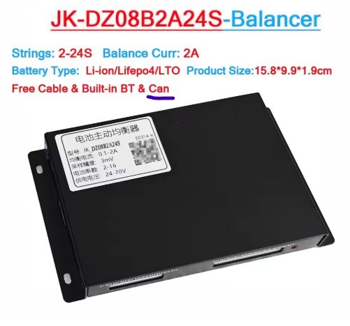
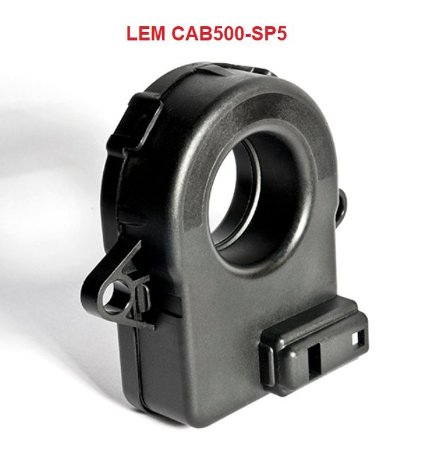
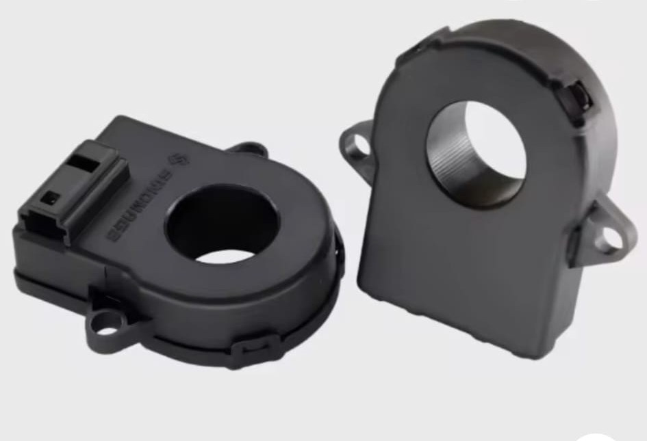
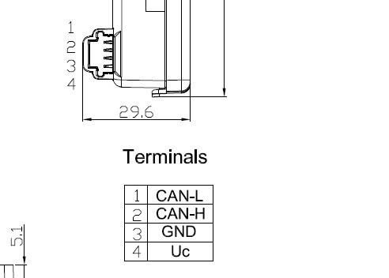

**Configuration and Operation Manual**

Firmware: Battery-Emulator v13.1 or later with the JK Active Balancer integration. Reference board: LilyGo T-2CAN (ESP32-S3). Last revised 9 October 2026.

This page is for the person who installs and configures the emulator with JK Active Balancers and a CAB500 current sensor. It explains where every setting lives, what it does, which values are safe, and how the firmware behaves when something goes wrong. Everything described here was verified on the bench with one balancer, two cells and a CAB500.

## 1. What the system does

The emulator sits between a DIY battery pack built with JK Active Balancers and a solar inverter. The inverter expects a commercial battery with a BMS; the emulator pretends to be one.

### Data flow

```
JK balancer 1..15 ----CAN 250 kbps----> [battery CAN interface]      [inverter CAN interface] --> Inverter
CAB500 current sensor --CAN 250 kbps--> [battery CAN interface]   ESP32-S3 emulator
                                                                  +--> contactors: precharge, +, -
                                                                  +--> web page (WiFi), MQTT (optional)
```

!!! note
    Which of the two CAN ports of the T-2CAN is the battery interface and which is the inverter interface is a Settings page choice (Battery CAN interface, Inverter CAN interface). The balancers and the CAB500 share the battery interface, which the driver runs at 250 kbps. The inverter port speed is set by the inverter protocol, normally 500 kbps.

## 2. Where the settings live

Everything is configured on the web page. There is no USER_SETTINGS.h any more and nothing to recompile.

| Place | What is set there | How it is changed | When it takes effect |
|---|---|---|---|
| Settings page, Battery config | Battery type (JK Active Balancer (CAB500)), battery CAN interface, second battery, inverter protocol and interface, contactor control, precharge time, WiFi, MQTT. | Form with Save; reboot afterwards. | After reboot. |
| Settings page, JK section | Everything JK specific: power limits, SOC window, recalibration, ramps, cut-off hysteresis, balancers, current direction, chemistry and voltage limits, pack layout, balancer firmware version. | Same form, appears when the JK battery is selected. | After the next reboot. |
| Main page, Battery settings | Battery capacity (Wh), rescaled SOC, max charge / discharge current, manual voltage limits, target charge / discharge voltage, BMS reset. | Edit buttons on the main page. | Immediately. |
| More battery info page | Status of every balancer and of the CAB500, cycle counter, derived limits, and the action buttons: Reset BMS cycles, CAB500 to 125 / 250 / 500 kbps. | Buttons. | Immediately. |

!!! note
    The JK settings are read once by the driver at boot. Saving writes them to flash only; nothing changes until you reboot. The Target discharge voltage on the main page is the exception: the driver reads it live.

## 3. Quick start checklist

Follow this order for a new installation.

- 1. Wire the hardware as in chapter 5. Keep the pack disconnected from the inverter until the web page shows every balancer and the CAB500 as Connected.
- 2. Flash the firmware over USB (PlatformIO upload) the first time. Later updates can go through the OTA page.
- 3. Power the balancers before or together with the emulator. The driver polls balancer 1 for 10 seconds after boot; if nothing answers in that window it stops polling until the next reboot.
- 4. Open the web page (own access point or your router). Settings page: Battery = JK Active Balancer (CAB500), Battery CAN interface = the port with the balancers, Inverter and Inverter CAN interface, Contactor control on with your precharge time, WiFi credentials. Save.
- 5. Still on the Settings page, JK section: number of cells, cells per balancer, low-voltage or bridge mode, balancer firmware version, LFP or NCM chemistry, maximum balancers. Check the nine voltage limits the chemistry box filled in. Save, reboot.
- 6. Main page, Battery settings: real battery capacity in Wh, maximum charge and discharge current in A, and Target discharge voltage = the pack voltage where discharging must stop. The factory default is 300 V and blocks any pack below it. The row is hidden until Manual charge voltage limits is switched on; you can switch it off again afterwards, the stored voltage stays.
- 7. If the pack is small (few cells) also lower Discharge cut-off hysteresis in the JK section from 3.0 V to something like 0.1 V, otherwise the pack can never get above target + hysteresis and discharge stays 0 W.
- 8. If the CAB500 is new it still runs at 500 kbps: More battery info shows it Disconnected and a comms fault appears after about 40 s. Open the contactors, click CAB500 to 250 kbps, wait 10 s, refresh (chapter 11). Reboot to clear the latched fault.
- 9. Check More battery info: every balancer Connected, CAB500 Connected, pack voltage equal to a multimeter reading, current positive while charging. If the sign is wrong tick Reverse current sensor direction, save, reboot.
- 10. Set Max charge power and Max discharge power (W) to what cabling, contactors and inverter can take. Save, reboot. Connect the inverter and watch the first full charge: the SOC must reach SOC max close to the moment the highest cell reaches the SOC full on voltage. If it runs ahead or behind, the Wh value is wrong.

## 4. Settings page: common battery settings

These rows belong to Battery-Emulator itself and apply to every battery type. Only the ones that matter for a JK installation are listed.

| Field | Typical value | Meaning |
|---|---|---|
| Battery | JK Active Balancer (CAB500) | Selects the JK driver. The JK section of the page appears below. |
| Battery CAN interface | the port with the balancers | The driver runs this port at 250 kbps. It must not be the inverter port. |
| Second battery / Battery 2 CAN interface | off | Two JK packs on two CAN ports, each with its own CAB500. Both packs share the JK settings except the CAB500 variant, which has a second dropdown. |
| Battery chemistry | ignored | The JK driver overrides this with its own LFP box. Leave as is. |
| Inverter / Inverter CAN interface | site specific | Inverter protocol and the other CAN port. BYD Battery-Box Premium HVS with the Deye option is the tested combination. |
| Contactor control, Precharge time | on, 500 ms | The emulator drives the contactors. Faults open them permanently after 10 s (v13 behaviour, not adjustable). |
| Battery capacity (Wh), main page | your pack | Converted to Ah with the pack maximum voltage for the coulomb counter. Default 30000 Wh. A wrong value makes the SOC run too fast or too slow. |
| Max charge / discharge current (A), main page | 30.0 / 30.0 | Clamp applied after the JK power limits are converted to amps at the actual pack voltage; the lower one wins. The main page marks the active limit with (Manual) or (BMS). |
| Manual charge voltage limits, main page | off | When on, v13 blocks charging at or above Target charge voltage and discharging at or below Target discharge voltage, each with a 2.0 V release hysteresis, and sends the targets to the inverter. The JK driver does not need it. |
| Target discharge voltage (V), main page | pack cut-off | Always used by the JK driver as the discharge cut-off (chapter 10). Default 300 V. |
| Rescale SOC, SOC max / min percentage | on, 80 / 20 | The inverter sees 0-100 % mapped onto this window of the real SOC. Independent of the JK SOC window. |

!!! note
    A reading of 0 W on the main page can come from three places: the JK driver (cut-off, ramps, faults), the v13 safety layer (cell or pack voltage, manual limits, system FAULT) and the current clamp above. The Events page tells which one; the label (Manual) or (BMS) next to the current tells whether the clamp is active.

## 5. Hardware, parts and wiring

### 5.1 Parts

| Part | Used for | Where |
|---|---|---|
| LilyGo T-2CAN (ESP32-S3, two CAN ports on board) | The emulator. Runs Battery-Emulator v13 with the JK driver. | LilyGo |
| JIKONG JK-DZ08-B2A24S active balancer (2 A, 2 to 24 cells, built-in CAN and Bluetooth) | One per group of up to 24 cells. Supply 20 to 100 V, balancing 0.1 to 2 A, 3 mV accuracy. | aliexpress.com/item/1005008512834934.html |
| Current sensor, one of: LEM CAB500-C/SP5 or STB-CAB500M-22C (500 A, CAN) | Pack current for the coulomb counter. One per pack, on the pack's own CAN bus. | LEM: mou.sr/4yPDbDp; STB: AliExpress, search STB-CAB500M-22C |
| 4-pin connector harness, TE 1612035-1 / 1473672-1 / 1123343-1 | Mates with the CAB500 socket (CAN-L, CAN-H, GND, Uc). | a.aliexpress.com/_EzbfyR8 |
| Isolated DC-DC converter 12 V in, 24 V out, 15 W | One per balancer, powers the balancer's PWR input from the 12 V supply. | aliexpress.com/item/1005010265328330.html |
| 120 ohm resistor | Far-end termination of the battery CAN bus (at the last balancer). | any |
| 12 V supply | Emulator, CAB500 Uc and the DC-DC converters. | site specific |
| Contactors, precharge resistor, fuses, cabling | As for any Battery-Emulator installation; see the Battery-Emulator wiki. | site specific |

{ width="325" }

*JK-DZ08-B2A24S: CAN bus balancer, 8 to 24 strings, 2 A balancing current*

{ width="325" }

*Balancer label. The supply input accepts 20 to 100 V; each balancer gets a 24 V converter*

{ width="300" }

*LEM CAB500-C/SP5 current sensor*

{ width="400" }

*STB-CAB500M-22C current sensor, same CAN protocol and socket*

{ width="250" }

*Isolated 12 V to 24 V DC-DC module, one per balancer*

!!! note
    The driver does not care which of the two sensors is fitted, only which CAN ID it transmits on. Set the CAB500 variant dropdown (chapter 7.6) so that the More battery info page shows the sensor as Connected; if it stays Disconnected at the right speed, try the other variants.

### 5.2 Balancer cell wiring

- Each balancer measures and balances one group of up to 24 cells through its tap wires B1 to B24; GND is the negative of the first cell of its group. Wire the taps exactly as the JIKONG manual shows and double-check every tap before plugging the connector in: a swapped or missing tap is what the cell count mismatch alarm reports.
- Series pack with more than 24 cells (bridge mode): the balancers are chained, and the top cell of one group is shared as the first tap of the next balancer, as in the drawing below. In the firmware tick Bridge mode; each balancer after the first then uses cells per balancer minus 1.
- Parallel packs (low-voltage mode): each balancer owns one complete pack and the packs are in parallel. Tick Low-voltage mode; the cell count must be a multiple of cells per balancer.
- Set the balancer's own cell count in the JIKONG app to the number of cells it is wired to (the status page shows identified / set). Give every balancer a unique CAN address 1..N in the app, in the order the groups are wired; the emulator polls address 1 first.

{ width="600" }

*Bridge wiring from the JIKONG manual: balancer 1's top cell B24 is also balancer 2's first tap*

### 5.3 Balancer power

- The balancer needs 20 to 100 V on PWR. Instead of taking it from the cells, each balancer has its own isolated DC-DC converter: 12 V in from the installation's 12 V supply, 24 V out.
- Converter output plus to the balancer PWR terminal, converter output minus to the balancer GND terminal. Because the converter is isolated, its output rides on the potential of that balancer's cell group; never share one converter between two balancers whose groups are in series.
- Converter input: 12 V and ground from the same 12 V supply as the emulator. The inputs of all converters can be in parallel.

!!! note
    Check the PWR and GND terminal names against your balancer's manual before powering up; the label and connector layout differ between hardware revisions.

### 5.4 CAB500 current sensor

{ width="300" }

*CAB500 socket: 1 CAN-L, 2 CAN-H, 3 GND, 4 Uc*

{ width="250" }

*Mating 4-pin harness (TE 1612035-1 family)*

| Pin | Signal | Wire to |
|---|---|---|
| 1 | CAN-L | Battery CAN bus CAN-L (same bus as the balancers) |
| 2 | CAN-H | Battery CAN bus CAN-H |
| 3 | GND | Ground of the 12 V supply (common with the emulator and the CAN bus ground) |
| 4 | Uc | 12 V from the emulator's supply. The sensor accepts 8 to 16 V; never the 24 V of the converters. |

- Clamp the sensor around one pack cable, positive or negative, between the pack and the contactors, so that every amp in or out of the pack passes through it. Only one cable through the ring.
- The sign must be positive while charging. If the main page shows negative current while charging, tick Reverse current sensor direction in the JK settings and reboot; no need to turn the sensor around.
- A new sensor transmits at 500 kbps and will show Disconnected with a comms fault after about 40 s. Change it to 250 kbps once from the More battery info page (chapter 11), then reboot.
- Readings beyond plus or minus 600 A are ignored as power-up artefacts; the sensor itself flags overcurrent at about 520 A.

### 5.5 CAN wiring

- The T-2CAN has two CAN ports with transceivers on board, CAN 1 (native) and CAN 2 (MCP2515). Which one is the battery port and which the inverter port is chosen on the Settings page (Battery CAN interface, Inverter CAN interface); both assignments work. The driver runs the battery port at 250 kbps, the inverter protocol sets the other.
- Battery bus: one twisted pair CAN-H / CAN-L from the emulator's battery port along the balancers to the last balancer, with the CAB500 tapped in along the way. Run the CAN ground with it. Do not star-wire.
- Termination: 120 ohm at the emulator end (the T-2CAN termination for that port) and 120 ohm at the last balancer. The CAB500 sits mid-bus without a resistor. The balancer's CAN connector pin order is on the balancer's label or manual.
- Inverter bus: the other port to the inverter, terminated at both ends as that protocol requires.
- Second battery: its balancers and its own CAB500 need a CAN port of their own, so with a CAN inverter the T-2CAN's two ports are used up by one pack and the inverter; a second JK pack needs an RS485/Modbus inverter or a board with a third CAN interface. Two sensors cannot share a bus unless they are different variants.

### 5.6 Power-up order

- Power the balancers (converters) before or together with the emulator. The balancers take about 5 s to boot; the driver polls balancer 1 for 10 s and suppresses CAN bus error warnings on the battery port meanwhile. If no balancer answered within 10 s the driver stops polling until the next reboot.
- The CAB500 has a 30 s grace period after boot before its fault counting starts, so it may be powered with the emulator.

!!! note
    There is no analog current sensor input and no CAN speed setting. The battery port is fixed at 250 kbps by the driver.

## 6. Web interface overview

### 6.1 Main page

Shows SOC, SOH, pack voltage, current, power, total and remaining capacity, the power and current limits currently sent to the inverter with their limiting factor, cell minimum / maximum and delta, temperatures, BMS status and system status. The Battery settings block below holds the common fields of chapter 4. The system status turns red and shows Inspect reason when an ERROR event is active.

### 6.2 Settings page

One form for the whole emulator. The JK section (chapter 7) appears when the JK battery is selected in the Battery dropdown. Each field has a help button. Save writes to flash; a reboot applies the JK fields.

### 6.3 More battery info page

- One block per balancer: Connected / Disconnected, pack voltage (from the status frame on V11.56, summed from the cells on V11.55), temperature, balancing state, balance switch, maximum balance current, communication fault counter, cell count mismatch and wire resistance. Alarms show as ALARM (latched, reboot to clear).
- CAB500 CT Sensor block: Connected, communication state, fault counter, hardware state with the DTC code (0x41 overcurrent, 0x42 reference voltage, 0x44 signal lost, 0x46 supply voltage), the CAN speed change line (chapter 11) and the capacity in Ah the coulomb counter divides by, next to the rated Ah from the Wh setting.
- BMS Cycles and Calculated capacity, and the line In use since last boot with the pack and cell limits the driver derived from the settings.
- Red banner BATTERY NOT RUNNING when the saved settings are inconsistent (chapter 9.6).
- Buttons: Reset BMS cycles (counter to zero, SOH back to 100 %), and CAB500 to 125 / 250 / 500 kbps.

### 6.4 Events page

Every protection that acts leaves an event here with a time stamp, a count and a Data value. JK events are prefixed JK and name the balancer or the error code in Data (Appendix C). ERROR events put the system in FAULT; WARNING events do not change the power limits by themselves.

## 7. JK settings reference

All values take effect after a reboot. Defaults are the built-in values of a board with nothing stored. Percent and amp fields accept decimals (99.0, 0.10).

### 7.1 Power limits

| Field | Default | Range | What it does |
|---|---|---|---|
| Max charge power (W) | 20000 | 1000 - 200000 | Highest charge power offered to the inverter. The real limit is the lower of this (converted to amps at the actual pack voltage) and Max charge current on the main page. |
| Max discharge power (W) | 20000 | 1000 - 200000 | Same for discharge. |

### 7.2 SOC window

| Field | Default | Range | What it does |
|---|---|---|---|
| SOC max (%) | 99.0 | 50 - 100 | Charging stops here: charge power 0 W at or above this SOC. End point of the charge ramp. |
| SOC min (%) | 1.0 | 0 - 50 | Lower limit of the counter; discharge power 0 W at or below it. Must be below SOC max, otherwise the battery does not run. |
| Current deadband (A) | 0.10 | 0 - 5 | Currents smaller than this count as zero so sensor noise does not drift the SOC. The CAB500 offset is within 0.2 A. |

### 7.3 SOC recalibration

Coulomb counting drifts over time. The counter is corrected from the cell voltage when the battery has been at rest (chapter 8.3).

| Field | Default | Range | What it does |
|---|---|---|---|
| Rest time before SOC recalibration (ms) | 10000 | 1000 - 3600000 | How long the current must stay below the rest threshold before a correction is allowed. 10 s is a minimum, 5-30 minutes is realistic for a settled cell voltage. |
| Rest current threshold (A) | 0.10 | 0 - 5 | Below this current the battery counts as resting. Values below the deadband act as the deadband. |
| Recalibrate below SOC (%) | 10.0 | 0 - 50 | Counter between SOC min and this value: correction at rest even if no cell reached a voltage zone. |
| Recalibrate above SOC (%) | 95.0 | 50 - 100 | Same for the top: counter between this value and SOC max. |

### 7.4 Power ramps and discharge cut-off

Near the SOC limits the power offered to the inverter is reduced linearly so the inverter does not stop abruptly. The discharge cut-off works on the pack voltage.

| Field | Default | Range | What it does |
|---|---|---|---|
| Discharge ramp width (% SOC) | 3.0 | 0.5 - 20 | Width of the ramp above the ramp bottom: full power above bottom + width, linearly less below. |
| Discharge ramp bottom (%) | 7.0 | 0 - 50 | SOC where discharge power reaches zero. |
| Discharge ramp minimum power (W) | 0 | 0 - 200000 | Floor of the discharge ramp (0 = none). |
| Discharge cut-off hysteresis (V) | 3.0 | 0 - 50 | Below Target discharge voltage (main page) discharge is 0 W; it resumes once the pack is this far above the target. 3.0 V suits a 96S pack; use about 0.1 V for a few cells. |
| Charge ramp width (% SOC) | 5.0 | 0.5 - 20 | Width of the ramp below SOC max: full power below SOC max minus width, linearly less above. |
| Charge ramp minimum power (W) | 4000 | 0 - 200000 | Floor of the charge ramp so a Deye keeps charging to the top. The floor cannot exceed the max charge power or the current clamp. |

### 7.5 Balancers

| Field | Default | Range | What it does |
|---|---|---|---|
| Max balancers polled | 8 | 1 - 15 | Upper limit on the number of balancers polled, independent of the number derived from the cell count. |
| Firmware version | 2 | 1, 2, 3 | Polarity of the alarm bits in the balancer status byte. 1 = all V11.55 (bits inverted). 2 = all V11.56 (as documented). 3 = per balancer from the boxes below. |
| Balancer n is V11.55 (15 boxes) | 1-4 ticked | - | Used only with version 3. A ticked box means that balancer runs V11.55. |

!!! note
    A wrong firmware version turns the cell count and wire resistance alarms upside down: healthy balancers show ALARM and the pack goes to a latched fault, or real alarms are missed. An alarm must be present in three consecutive status frames before it counts, so a single garbled frame at power-up is ignored.

### 7.6 Current sensor

| Field | Default | Range | What it does |
|---|---|---|---|
| Reverse current sensor direction | unticked | - | Flips the sign of the measured current at the source, so SOC counting, the displayed current and the current reported to the inverter all follow. Tick it when the page shows negative current while charging. |
| CAB500 variant (CAN frame ID) | CAB500-2 (0x3C2) | -1, -2, -3, -4, -5, -9 | Which variant is fitted; the number printed on the sensor sets the CAN ID it transmits on: -1 = 0x3C1, -2 = 0x3C2, -3 = 0x3C3, -4 = 0x3C4, -5 = 0x3C5, -9 = 0x3C0. The More battery info block shows the ID in use. |
| Second battery CAB500 variant | CAB500-2 (0x3C2) | same | Only shown while Second battery is ticked in the Battery config. The second pack has its own sensor on its own CAN interface and may be a different variant. |

### 7.7 Chemistry and voltage limits

Ticking or unticking LFP chemistry fills the nine voltage fields with the defaults of that chemistry in the browser. You can edit them afterwards; the values saved are what the driver uses.

| Field | NCM default | LFP default | What it does |
|---|---|---|---|
| LFP chemistry | unticked | ticked | Selects the voltage-to-SOC table and the presets. Overrides the chemistry dropdown of the Battery config for this battery. |
| Max cell voltage (mV) | 4220 | 3650 | v13 safety: charge blocked at or above it (released 20 mV lower), critical latched fault 100 mV above it. |
| Min cell voltage (mV) | 2700 | 2800 | v13 safety: discharge blocked at or below it, critical latched fault 100 mV below it. |
| Max cell deviation (mV) | 150 | 230 | Above it v13 raises a warning and the JK driver derates both limits linearly, reaching 50 W at setting + 50 mV (chapter 10). |
| Pack max voltage per cell (mV) | 4190 | 3510 | Times the series cell count = pack design maximum. Pack over-voltage protection, SOC plausibility, Wh-to-Ah conversion. |
| Pack min voltage per cell (mV) | 2900 | 3000 | Times the series cell count = pack design minimum. Pack under-voltage protection. |
| SOC full: enter at cell (mV) | 4130 | 3420 | Average cell at or above this sets the counter to SOC max (one shot). |
| SOC full: re-arm below cell (mV) | 4100 | 3350 | Re-arms the full one-shot. Also the top voltage zone for recalibration. |
| SOC empty: enter at cell (mV) | 3350 | 2900 | Average cell at or below this sets the counter to SOC min (one shot). |
| SOC empty: re-arm above cell (mV) | 3400 | 3050 | Re-arms the empty one-shot. Also the bottom voltage zone for recalibration. |

!!! note
    Required order: min cell < empty on < empty off < full off < full on < max cell, and pack min < pack max (pack min at least 2000 mV). The page does not refuse a bad save; the driver refuses to run and shows the reason in the red banner and in the JK_CONFIG_ERROR event. The series cell count is cells per balancer in low-voltage mode, otherwise the number of cells. All fields accept 2000 - 4300 mV, deviation 10 - 500 mV.

### 7.8 Pack layout

| Field | Default | Range | What it does |
|---|---|---|---|
| Number of cells | 96 | 1 - 192 | Total cells wired to all balancers. 192 is the v13 maximum. |
| Cells per balancer | 24 | 1 - 24 | Cells connected to each balancer. |
| Low-voltage mode (parallel packs) | unticked | - | Each balancer is one complete pack and the packs are in parallel. Cells must be a multiple of cells per balancer. Pack voltage = average of the per-balancer sums; series cells = cells per balancer. |
| Bridge mode | unticked | - | Balancers chained in series with one shared tap: each balancer after the first uses cells per balancer minus 1. Cannot be combined with low-voltage mode. |

Number of balancers polled = cells divided by cells per balancer, rounded up (bridge mode: 1 + remaining cells divided by cells per balancer minus 1), then capped by Max balancers polled. Examples: 96 cells, 24 per balancer, series = 4 balancers, 96S pack (the default). 24 cells, 12 per balancer, low-voltage = 2 balancers in parallel, 12S pack. 2 cells, 2 per balancer = 1 balancer, 2S bench pack.

## 8. How the state of charge (SOC) is calculated

### 8.1 Capacity

The capacity in Ah is Battery capacity (Wh, main page) divided by the pack maximum voltage (series cells x pack max per cell). Example: 96 cells x 4.19 V = 402 V; 30000 Wh / 402 V = 74.6 Ah. The Ah value is reduced by 0.01 % per counted full cycle and the same factor is shown as SOH.

### 8.2 Coulomb counting

- Every 50 ms the CAB500 samples received in that window are averaged, the current is multiplied by the elapsed time and added to (charging) or subtracted from (discharging) the SOC. Charging is multiplied by 0.99 for efficiency. Currents inside the deadband count as zero.
- While the CAB500 sends nothing (unplugged, boot grace), the counter sees 0 A and the SOC freezes.
- Readings beyond plus or minus 600 A are discarded. A CAB500 that is powering up sends zero bytes, which decode to -2147483 A through the offset and would empty any SOC instantly.
- At boot the page shows a 50 % placeholder until every configured cell has reported. Then the counter starts from the voltage table using the average of the highest and lowest cell; the first rest period corrects it.
- Discharged Ah are accumulated; each full capacity discharged increments the cycle counter, which is saved in flash (JK_CYCLES, JK_CYCLES2 for the second pack).

### 8.3 Corrections

- Full one-shot: average cell at or above SOC full enter sets the counter to SOC max; re-armed below SOC full re-arm.
- Empty one-shot: average cell at or below SOC empty enter sets the counter to SOC min; re-armed above SOC empty re-arm.
- Rest recalibration: when the current has been below the rest threshold for the rest time, and either the highest cell is at or above SOC full re-arm, or the lowest cell is at or below SOC empty re-arm, or the counter is in the bottom or top SOC window, the counter is replaced by the table value for the average cell voltage. While the battery stays at rest this repeats every rest time.

!!! note
    Why the SOC windows exist: if the counter drifts high, it reaches SOC max before the cells are really full, the inverter stops charging and the cells never reach the voltage zone. The windows catch this. The price is a small charge/stop cycle near the top when the cell voltage has not settled; a longer rest time reduces it.

### 8.4 Current direction

The driver expects a positive current while charging. If your sensor is mounted the other way round, use Reverse current sensor direction rather than rewiring.

## 9. Start-up, supervision and protections

### 9.1 Start-up sequence

- The driver polls balancer 1 every 200 ms for the first 10 s. After the first answer it polls all configured balancers round-robin. No answer within 10 s: polling stops, the battery stays Disconnected until reboot.
- Nothing is published until every configured cell has reported a voltage. Until then the main page shows the 50 % placeholder SOC, the limits are 0 W, the contactors are not permitted and no event is raised. If the balancers never show up, v13 raises its own battery missing error after 60 s.
- The CAB500 has a 30 s grace period after boot before its fault counting starts.
- CAN bus error warnings on the battery port are suppressed for the first 10 s because balancers that power up together with the emulator put errors on the bus.

### 9.2 Balancer communication

- A balancer that does not answer a poll within 1 s gets one fault count per second. After the first missed second the WARNING event JK_BALANCER_COMM_WARNING is raised (Data = balancer number); it clears when the balancer answers again.
- At 10 counts the fault latches until reboot: ERROR event JK_BALANCER_COMM_FAULT, BMS status FAULT, the page shows the balancer Disconnected even after it returns.

### 9.3 CAB500 supervision

- After the 30 s grace, more than 1 s without a frame adds one fault per second. First missed second: WARNING JK_CAB500_COMM_WARNING, clears when frames return. At 10: latched ERROR JK_CAB500_COMM_FAULT.
- If the error bit in the sensor frame stays set for more than 10 s: latched ERROR JK_CAB500_HW_ERROR with the DTC code in Data and on the page.
- Frames with the error bit, the 0xFFFFFFFF sentinel or an implausible value are not used for the SOC.

### 9.4 Balancer hardware alarms

- Cell count mismatch (a cell tap open or the layout settings wrong) and wire resistance come from the balancer status byte, interpreted with the firmware version setting.
- An alarm must be present in 3 consecutive status frames (about 0.6 s) before it counts, then it latches until reboot: ERROR event JK_CELL_COUNT_MISMATCH or JK_WIRE_RESISTANCE (Data = balancer number), BMS status FAULT, ALARM (latched) on the page. Reconnecting the tap does not clear it.
- If a cell that had reported goes silent without an alarm bit, the pack is treated the same way: latched JK_CELL_COUNT_MISMATCH with Data 0, last good readings kept on the page.

### 9.5 What a fault means for the inverter and the contactors

Every JK ERROR event puts the system in FAULT. In FAULT the v13 safety layer forces 0 W both ways, so the inverter sees 0 W (the 50 W Deye value the driver reports is overridden here). After 10 s in FAULT v13 opens the contactors and latches them open; only a power cycle closes them again. Because the JK faults are latched as well, a fault always ends in a reboot after the cause has been fixed.

### 9.6 Configuration check at boot

If the saved JK settings are inconsistent the driver does not poll, keeps the limits at 0 W, stays in FAULT so the contactors remain open, raises JK_CONFIG_ERROR (Data = code) and shows a red banner on More battery info. Codes: 1 bridge and low-voltage both on, 2 cells not a multiple of cells per balancer in low-voltage mode, 3 more than 15 balancers needed, 4 cell counts out of range, 5 firmware version not 1-3, 6 voltage limits out of order or pack min invalid, 7 SOC min not below SOC max. Correct the settings and reboot.

### 9.7 Safety layer (v13, all batteries)

| Check | Condition | Result |
|---|---|---|
| Cell over-voltage | highest cell >= Max cell voltage | Warning CELL_OVER_VOLTAGE, charge 0 W until the cell is 20 mV below the limit. |
| Cell critical over-voltage | highest cell >= Max cell voltage + 100 mV | ERROR, latched until reboot. FAULT, 0 W, contactors open after 10 s. |
| Cell under-voltage | lowest cell <= Min cell voltage | Warning CELL_UNDER_VOLTAGE, discharge 0 W while the condition holds. Charging stays allowed. |
| Cell critical under-voltage | lowest cell <= Min cell voltage - 100 mV | ERROR, latched until reboot. FAULT, 0 W, contactors open after 10 s. |
| Pack over / under voltage | pack above design max or below design min | Warning, charge or discharge 0 W while the condition holds. |
| Cell deviation | spread > Max cell deviation | Warning CELL_DEVIATION_HIGH only. The power reduction comes from the JK driver (chapter 10). |
| SOC plausibility | pack above 97.5 % of design max and SOC below 65 % | Warning SOC_PLAUSIBILITY_ERROR. Stays until cleared on the Events page or rebooted. |
| Manual voltage limits (when on) | pack >= Target charge voltage / <= Target discharge voltage | Charge / discharge 0 W, released 2.0 V past the target. A voltage dip during a fault can leave discharge blocked on a small pack. |
| Battery full / empty | real SOC exactly 100 % / 0 % | Info events. The JK SOC window (99 / 1 %) normally keeps the SOC away from these values. |
| Charge / discharge limit exceeded | measured power well above the limit for several checks | Info event. |

## 10. Power limiting, step by step

Each cycle the JK driver decides the charge and discharge power in this order. Afterwards the v13 safety layer (chapter 9.7) and the current clamp (chapter 4) can only lower them.

- 1. Latched fault active (balancer or CAB500 communication, hardware alarm, CAB500 hardware error): 50 W both ways and BMS status FAULT. The ERROR event then puts the system in FAULT, where v13 forces 0 W.
- 2. Pack voltage below Target discharge voltage: discharge 0 W, charge from the charge ramp. An empty pack can always be recharged.
- 3. Pack voltage above Target discharge voltage + Discharge cut-off hysteresis: discharge from the discharge ramp (ramp bottom, width, minimum power), charge from the charge ramp (SOC max, width, minimum power).
- 4. Pack voltage inside the hysteresis band: the previous values are kept.
- 5. Cell deviation above Max cell deviation: both values are multiplied by a factor that falls linearly from 1 at the setting to 0 at setting + 50 mV, with a floor of 50 W. WARNING event JK_CELL_DEVIATION with the spread in Data, cleared when the spread is back at or below the setting. With 150 mV set and 20 kW ramps: 160 mV = 16 kW, 175 mV = 10 kW, 190 mV = 4 kW, 200 mV and above = 50 W.
- 6. SOC at or above SOC max: charge 0 W. SOC at or below SOC min: discharge 0 W.

The resulting watts are converted to amps at the actual pack voltage and clamped by Max charge / discharge current on the main page. The inverter receives amps.

!!! note
    The 50 W values exist so a Deye inverter does not start the opposite direction on a 0 W limit. They are effective only in the deviation derate; in a real fault the system FAULT overrides them with 0 W.

## 11. Changing the CAB500 CAN speed

New sensors ship at 500 kbps; the balancer bus runs at 250 kbps. The driver can reconfigure the sensor over the bus using the sensor's UDS commands, from the More battery info page.

- Open the contactors first (the buttons are refused while they are closed). The battery bus is switched for about 10 s and balancer polling pauses meanwhile; the CAB500 fault timer is held so no fault results.
- Click CAB500 to 250 kbps (or 125 / 500 kbps). The driver listens 2 s each at 500, 250 and 125 kbps for the sensor's 0x3C2 stream, talks to it at the speed where frames appear, writes the new speed (WriteDataByIdentifier 0xF012), waits 1 s, resets the sensor (ECUReset), switches the bus to the new speed and reads the speed back (ReadDataByIdentifier 0xF012) or accepts the stream at the new speed as confirmation. Then the bus returns to 250 kbps.
- The page reloads after 1.5 s and shows the progress in the CAN speed change line; refresh again after about 10 s for the result: done, sensor not found, write rejected, or write accepted but nothing seen at the new speed (then power-cycle the sensor and check the CAB500 block).
- If the sensor had already been declared faulted (10 s silent), that fault is latched: reboot after a successful change.

!!! note
    Setting a sensor to 500 or 125 kbps makes it unusable for this driver until it is set back to 250 kbps. The buttons exist for returning a sensor to factory state.

## 12. Changing the pack layout or chemistry safely

- Set the inverter to standby or disconnect it, so a wrong limit during the change cannot be acted on.
- Settings page, JK section: change cells, cells per balancer, mode, and tick or untick LFP chemistry if the cells are different. The chemistry box refills the nine voltage fields; check them before saving. Save, reboot.
- Watch More battery info: all balancers Connected, pack voltage equal to the multimeter, cell count on the cell monitor equal to the real count, no red banner.
- Check the In use since last boot line: pack max/min, cell max/min and deviation must be the values you expect.
- Main page: set Target discharge voltage and Battery capacity for the new pack, and the cut-off hysteresis in the JK section if the pack is small.
- Reconnect the inverter and watch the first charge and discharge.

!!! note
    The chemistry box does not re-wire anything: an NCM pack with LFP limits is over-discharged and never charged full; an LFP pack with NCM limits is over-charged. The limits are shown on the page so you can verify them.

## 13. Troubleshooting

| Symptom | Likely cause | What to do |
|---|---|---|
| All balancers Disconnected | Wrong battery CAN interface, missing termination, balancer addresses not 1..N, balancers powered more than 10 s after the emulator | Check the Battery CAN interface setting, CAN-H/L and termination, addresses in the JK app. Power balancers first, then reboot. |
| Only balancer 1 Connected | Other balancers share an address, or Max balancers polled / cell count too low | Set unique addresses; check Max balancers polled and the layout. |
| Cell count mismatch / wire resistance ALARM on healthy balancers | Wrong firmware version setting | Set 1 for V11.55, 2 for V11.56, or 3 with the per-balancer boxes. Reboot clears the latch. |
| CAB500 Disconnected, comms fault after 40 s | Sensor at factory 500 kbps, or wiring | Open contactors, CAB500 to 250 kbps, wait, refresh, reboot. Check wiring and the sensor supply. |
| Current negative while charging, SOC goes down | Sensor direction | Tick Reverse current sensor direction, save, reboot. |
| SOC reaches 99 % in seconds, or barely moves | Battery capacity (Wh) wrong, or pack max per cell wrong | Enter the real Wh on the main page. |
| Max discharge power 0 W although the pack is charged | Target discharge voltage above the pack voltage (default 300 V), or pack inside the hysteresis band | Set Target discharge voltage to the real cut-off; lower Discharge cut-off hysteresis for small packs. |
| Max discharge current 0.0 A (Manual) | Max discharge current on the main page is 0, or manual voltage limits latched after a voltage dip | Set the current; switch Manual charge voltage limits off. |
| Charge 0 W, discharge normal | Highest cell at Max cell voltage (v13 latch), SOC at SOC max, or manual limits | Check cell max on the main page and the Events page. |
| Everything 0 W, page red, Inspect reason | A latched JK fault or a v13 critical event | Events page names it. Fix the cause, reboot. |
| Contactors open and stay open | More than 10 s in FAULT | Fix the cause, power cycle. This is v13 behaviour. |
| Inverter never tapers, flat current to the end | Charge ramp minimum power above the current clamp at this voltage | Lower Charge ramp minimum power, or raise Max charge current if the hardware allows. |
| SOC_PLAUSIBILITY_ERROR warning | SOC counter far too low for a nearly full pack | Let the pack rest so recalibration runs; check Wh and pack max per cell. Clear the event on the Events page. |
| Red banner BATTERY NOT RUNNING | Inconsistent JK settings (chapter 9.6) | Correct them on the Settings page, save, reboot. |
| Charge/stop cycling near full | Rest recalibration snapping the SOC down from the unsettled cell voltage | Increase the rest time; raise Recalibrate above SOC closer to SOC max. |

## Appendix A. Default values on a new board

Built into the firmware; used when nothing is stored for a key. Stored values are never overwritten by a firmware update.

| Group | Defaults |
|---|---|
| Power limits | charge 20000 W, discharge 20000 W |
| SOC window | max 99.0 %, min 1.0 %, deadband 0.10 A |
| Recalibration | rest 10000 ms, rest current 0.10 A, below 10.0 %, above 95.0 % |
| Ramps and cut-off | discharge width 3.0 %, bottom 7.0 %, minimum 0 W, cut-off hysteresis 3.0 V; charge width 5.0 %, minimum 4000 W |
| Balancers | max 8 polled, firmware version 2 (V11.56), V11.55 boxes 1-4 ticked (used only with version 3) |
| Current sensor | not reversed, CAB500-2 (frame ID 0x3C2) |
| Chemistry NCM | cell 4220 / 2700 mV, deviation 150 mV, pack 4190 / 2900 mV per cell, SOC full 4130 / 4100 mV, empty 3350 / 3400 mV |
| Chemistry LFP preset | cell 3650 / 2800 mV, deviation 230 mV, pack 3510 / 3000 mV per cell, SOC full 3420 / 3350 mV, empty 2900 / 3050 mV |
| Pack layout | 96 cells, 24 per balancer, low-voltage off, bridge off (4 balancers, 96S) |
| Main page battery settings (v13) | 30000 Wh, rescaled SOC on 80 / 20 %, 30.0 A / 30.0 A, manual voltage limits off, target 450.0 V / 300.0 V |

## Appendix B. Settings stored in flash memory

Namespace batterySettings of the ESP32 NVS partition. Keys are at most 15 characters. Percent values are stored x10, amps x1000, volts x10.

| Key | Content |
|---|---|
| JKCHGW, JKDCHGW | Max charge / discharge power (W) |
| JKSOCMAX, JKSOCMIN, JKDEADBAND | SOC max / min (x10), deadband (mA) |
| JKRESTMS, JKRESTMA, JKRCBOT, JKRCTOP | Rest time (ms), rest current (mA), recalibration windows (x10) |
| JKDRAMP, JKDRBOT, JKDMINW, JKDCHYST, JKCRAMP, JKCMINW | Discharge ramp width and bottom (x10), minimum (W), cut-off hysteresis (dV); charge ramp width (x10), minimum (W) |
| JKMAXBAL, JKFWVER, JKFWMASK | Max balancers, firmware version, V11.55 mask (bit 15 = balancer 1) |
| JKREVCUR, JKLFP, JKLOWV, JKBRIDGE | Reverse current, LFP chemistry, low-voltage mode, bridge mode (bool) |
| JKCABID, JKCABID2 | CAB500 frame ID of battery 1 and 2 (962 = 0x3C2) |
| JKCELLMAX, JKCELLMIN, JKCELLDEV, JKPACKMAX, JKPACKMIN | Cell and pack limits (mV) |
| JKVFON, JKVFOFF, JKVEMON, JKVEMOFF | SOC full / empty one-shot thresholds (mV) |
| JKCELLS, JKCPB | Number of cells, cells per balancer |
| JK_CYCLES, JK_CYCLES2 | Cycle counters of battery 1 and 2, written by the driver |
| BATTTYPE, BATTCOMM, BATTERY_WH_MAX, MAXCHARGEAMP, MAXDISCHARGEAMP, TARGETDISCHVOLT, ... | v13 common settings (battery type 60 = JK Active Balancer) |

## Appendix C. Events raised by the JK driver

| Event | Level | Data | Raised when / cleared |
|---|---|---|---|
| JK_BALANCER_COMM_WARNING | WARNING | balancer number | A balancer missed polls for more than 1 s. Clears when it answers. |
| JK_BALANCER_COMM_FAULT | ERROR, latched | balancer number | 10 s without answer. Reboot. |
| JK_CAB500_COMM_WARNING | WARNING | fault counter | CAB500 silent for more than 1 s after the boot grace. Clears when frames return. |
| JK_CAB500_COMM_FAULT | ERROR, latched | 0 | CAB500 silent for 10 s. Reboot. |
| JK_CAB500_HW_ERROR | ERROR, latched | DTC code | Sensor error bit set for more than 10 s. Reboot. |
| JK_CELL_COUNT_MISMATCH | ERROR, latched | balancer number, 0 = cell voltage missing | Cell count alarm in 3 consecutive frames, or a cell went silent. Reboot. |
| JK_WIRE_RESISTANCE | ERROR, latched | balancer number | Wire resistance alarm in 3 consecutive frames. Reboot. |
| JK_CELL_DEVIATION | WARNING | spread in mV | Spread above the deviation setting, power derated. Clears when the spread shrinks. |
| JK_CONFIG_ERROR | ERROR | reason code | Inconsistent JK settings at boot. Fix and reboot. |

For a second JK pack the same events carry a _BAT2 suffix and the Events page names the pack.
