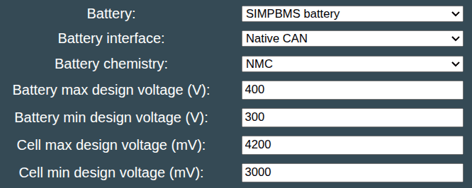

The SimpBMS is an open source (software) BMS for reusing various EV battery modules in a custom pack, instead of using the OEM BMS, for example if you want to use fewer/more modules than the OEM battery had.

There's some instructions here [github/Tom-evnut](https://github.com/Tom-evnut/SimpBMS) and the SimpBMS is compatible with the BMW PHEV modules, VW PHEV and ID modules, Tesla modules, Outlander PHEV modules etc.

### Where do I get the hardware?

[evshop](https://evshop.eu/en/bms/280-simp-bms-battery-management-system.html) still seem to have stock, but the original hardware isn't readily available any more. It has been ported to newer Teensy boards and also ESP32, some of which are open source.

!!! warning "Attention"
    Different SimpBMS clones have different pin layouts in the RJ45 connector. In the original schematic, CAN is on pins 7 and 8, while pins 3, 4, and 1, 2 are 12V. However, I have a clone where CAN is on pins 1 and 2. As a result, you can easily burn the CAN chip if you connect it incorrectly!

Also be aware to enter the settings and setup correctly for you pack. The setting _pack end of charge current_ should be set to 0 when used for static storage or else the BMS will report the value as the allowed charge current even when full.

## Software configuration
For this battery type, use the option called "SIMPBMS battery" under the "Battery Protocol" setting.

{ width="666" height="266" }

Also remember to configure all cellvoltage limits and pack design voltage limits according to your battery build.
