## Compatible BYD batteries

The code is compatible with a variety of BYD vehicle batteries. Check the product code sticker, and verify that the battery has already been tested with the Battery-Emulator, indicated by the ✅-mark that contactor closing works and the pack has been confirmed working.

To get contactor closing to function, start BYD battery first, and Battery-Emulator afterwards. If you start Battery-Emulator before the battery, it wont close contactors before you restart the emulator. Also make sure no FAULT events are active when trying to start, this will prevent contactor operation.

|  Product Type |  Byd Model  | Energy | Capacity | Nominal voltage | Status |
| :-----------: | :---------: | :----: | :------: | :-------------: | :----: |
| PV2 | ? | 40 kWh | 150Ah | 300.8V | ✅ 
| PE4 | Seal | 61.66kWh | 150Ah | 409.6V | ✅
| ??? | Atto 3 | 50kWh | ? | ? | ✅ 
| P48 | Atto 3 | 60.48kWh | 150Ah | 403.2V | ✅ 
| P4S | ? | 74.8kWh | 150Ah | 499.2V | ✅ 
| VD6 | Seal U DM-i | 18,32kWh | 54Ah | 339.2V | :x: (Type B LV connector)
| PA4 | Tang | 86.4kWh  | 135Ah | 640V | :x: (Type B LV connector)
| PE2 | Han | 85.4kWh  | 150Ah | 569.6V | :x: (Type B LV connector)
| PE5 | Seal   | 82.56kWh | 150Ah | 550.4V | ✅ 
| PE6 | Seal   | 82.56kWh | 150Ah | 550.4V | ✅ 
| PK3 | Dolphin | 49.92kWh | 150Ah | 332.8V | -
| P0B | Dolphin | 43.2kWh | 150Ah | 288V | -
| P07 | T3     | 50.37kWh | 115Ah | 438V | -
| P94 | Dolphin | 44.928kWh | 135Ah | 332.8V | ✅ 
| P99 | ? | 44.928kWh | 135Ah | 320.0V | -
| PC5B | Dolphin mini | 38.8kWh | 135Ah | 288V | :x: (Type B LV connector)
| ? | Song Plus | 82.56kWh | 150Ah | 550.4V | ✅ 
| PM6 | Song Plus | 87.04 kWh | 170Ah | 512.0V | ✅
| PM6B|? | 87.04 kWh | 170Ah | 512.0V | ✅
| PR2| Song Plus | 87.04 kWh | 170Ah | 512.0V | ?
| PF9| Song Plus | 87.04 kWh | 170Ah | 512.0V | ?
| PM7 | Seal U | 71.80 kWh | 170Ah | 422.4V | ✅ 
| VM7 | Sealion 8 DM-p (AU) | 35.62 kWh | 78.4Ah | 454.4V | :x: (Type C LV connector)
| PW4 | Seal 7 | 91.392 kWh | 170Ah | 537.6V | ✅

Confirmed working BYD Seal 60kWh battery example sticker:

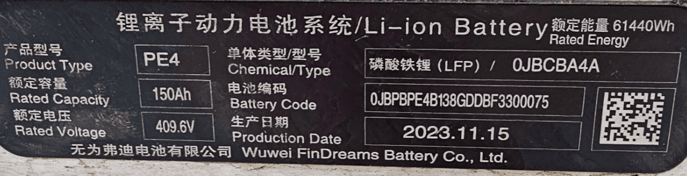

!!! note "NOTE"
    If you intend to run two BYD batteries in [parallel](../setup/software/battery_2x.md), make sure they are both the same model!

## Software setup
Select **BYD Atto 3/Seal/Dolphin** under **Battery Protocol**.

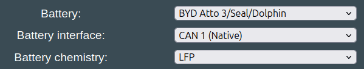{ width="599" height="115" }

!!! note "IMPORTANT"
    The battery needs to be on its own CAN channel. It cannot share the same CAN channel as the solar inverter. LilyGo T-2CAN or similar double CAN hardware is recommended!

### Example battery install, Atto 3 P48 battery

The extended range nominal 60.48 kWh BYD Atto 3 blade battery pack is 1.2m wide by 2.1m long and 120mm high, weighing 402kg. 
The battery chemistry is LFP (LiFePO4). The battery configuration is 126s1p, estimated capacity of fully charged pack is 126 cells at nominal 3.2V x 150Ah connected in series = 60.48 kWh. Fully charged the pack produces total voltage of 441V max (3.5V/cell) and at 10% SOC, about 403V (3.2V/cell), as measured and monitored by OBD2 CarScanner during charging.

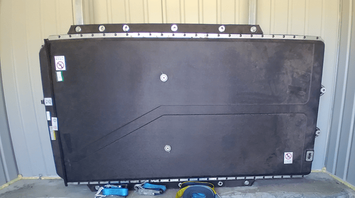
 
Viewed from the front, left is the low voltage connector, central is two refrigerant lines and right is the HV connector, with +ve on RHS.
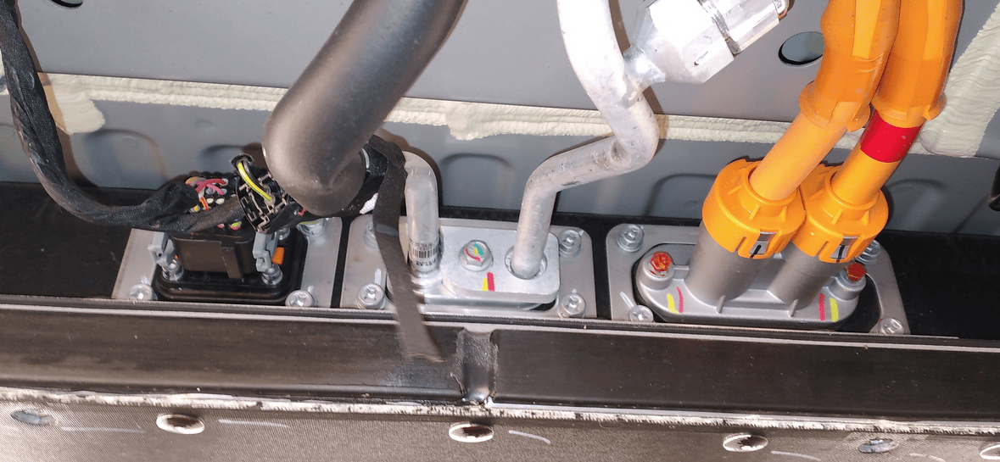

The front connectors end of the battery also includes the contactor block. There is a well-hidden 800V/350A fuse near the positive contactor(coil:12VDC/contactor:250A) on the RHS of the block, along with a mini pre-charge contactor (coil:12VDC/contactor:10A) and a pre-charge resistor, which is underneath the HV connector. There is no Tesla-like pyro fuse that blows when airbags are deployed; the system just opens the contactors.

## Video example
Here is a great video made by "Flying Tools" showcasing how to connect the BYD Atto 3 battery.

[youtube](https://www.youtube.com/watch?v=YBYWBapnnyM)

## Battery specifications

## LV Connector Type A
The connection diagram is derived from reverse engineering the pins. The following pinout is valid for, but not limited to, PE4, PE5, PE6 and P48 battery. It can be identified easily by seeing that there are 4 rows of pins, and three thicker pins on the side.
 
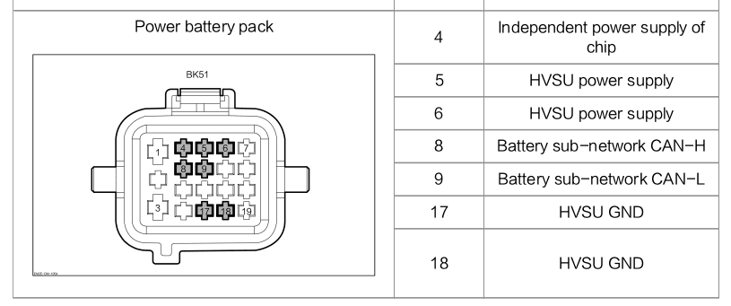{ width="489" height="205" }
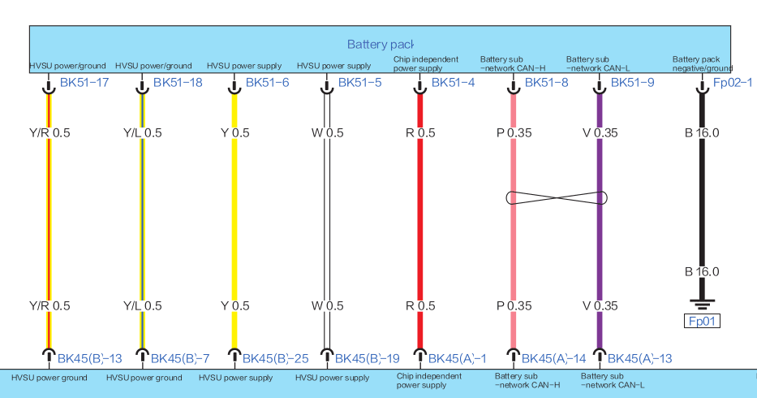{ width="489" height="257" }

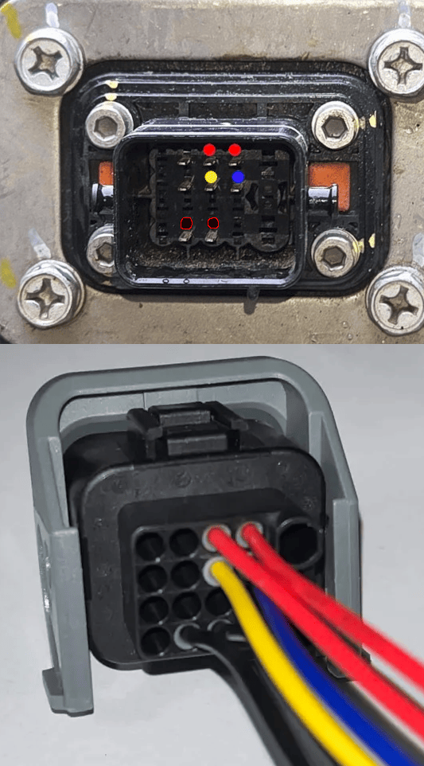

## LV Connector Type B
This connector appears on newer battery types, such as the PA4. The software is NOT fully compatible with TypeB batteries yet. :x:
Pinout varies between different batteries despite the plug & socket being the same.

*Development ongoing, many details can be found in the Discord*

| Battery | Plug Image | Wiring Diagram | Pinout |
|---|---|---|---|
| **PA4** | 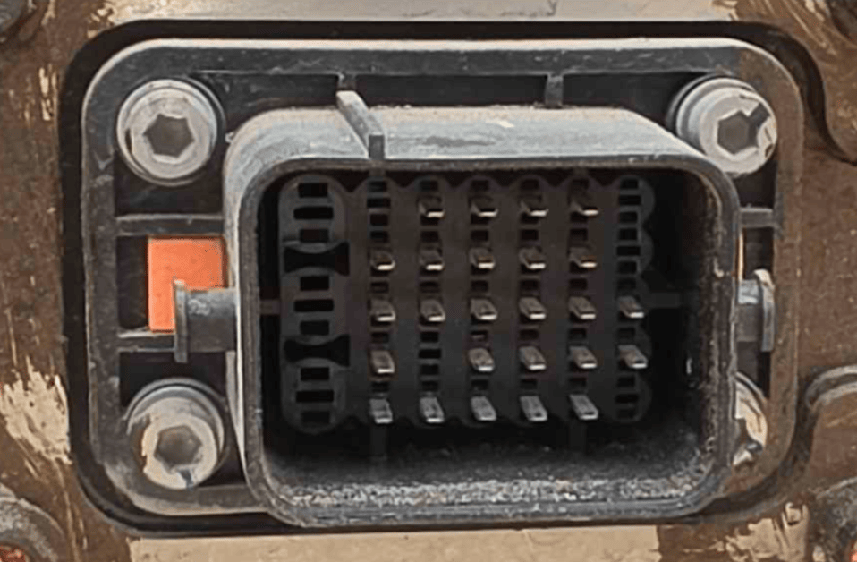{ width="280" } | — | Not yet documented |
| **PC5B** (upside down compared to PA4) | 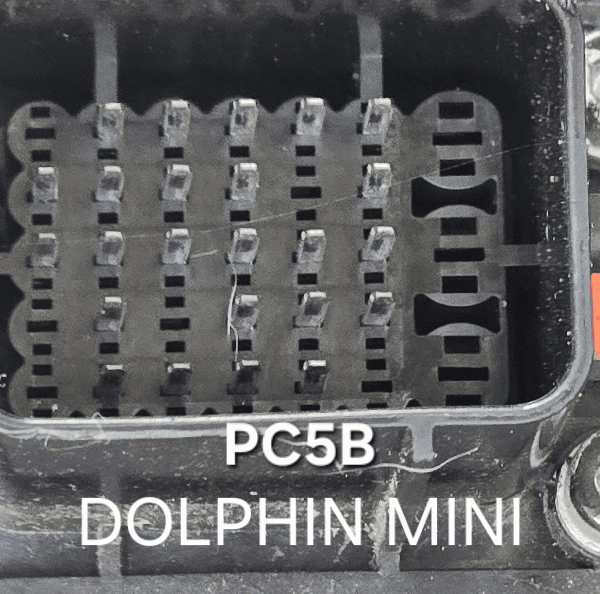{ width="280" } | 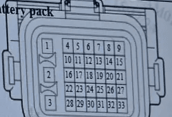{ width="280" } | [See below](#pinout-comparison) |
| **VD6** | 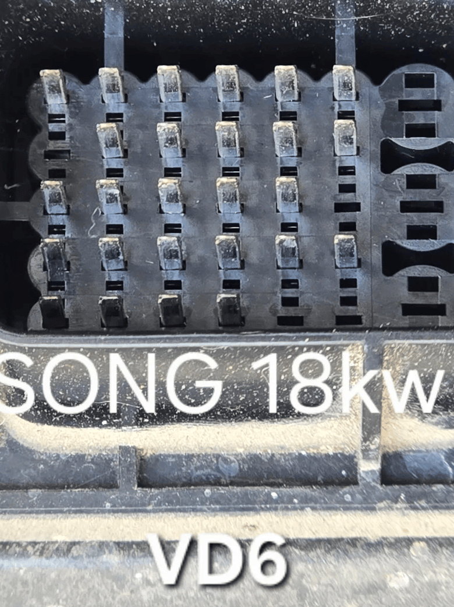{ width="280" } | 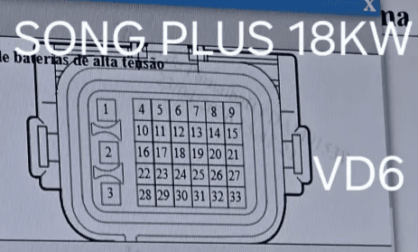{ width="280" } | [See below](#pinout-comparison) |
| **VM7** | 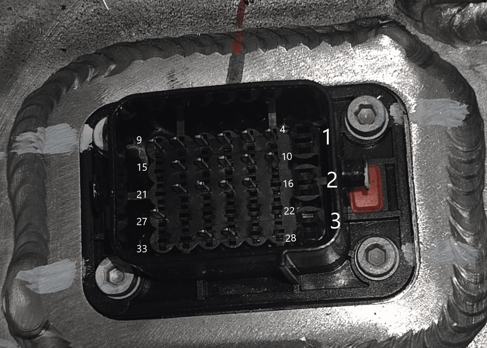{ width="280" } | — | Mostly unknown at the moment, derived from in car measurements and comparison to VD6 |

### Pinout comparison

| Pin | PC5B | VD6 | VM7 |
|---|---|---|---|
| 1 | — | — | — |
| 2 | — | — | — |
| 3 | — | — | — |
| 4 | Constant 12V power | Constant power supply | Constant 12V |
| 5 | Ignition 12V power | Power network CAN-H | Power network CAN-H |
| 6 | — | Power network CAN-L | Power network CAN-L |
| 7 | — | — | GND (CAN twisted pair shield) |
| 8 | Charging Subnet CAN-L | IG3 | ? (maybe IG, based on VD6) |
| 9 | — | Vehicle battery GND | GND |
| 10 | Energy Subnet CAN-L | Vehicle battery GND | GND |
| 11 | — | Charging connection signal | ? |
| 12 | DC charging pos/neg power supply (12V in) | — | ? |
| 13 | HV interlock signal 1 | Collision signal | ? |
| 14 | DC+ temp sensor signal | — | ? |
| 15 | Charging Subnet CAN-H | — | — |
| 16 | GND | — | — |
| 17 | Energy Subnet CAN-H | Charging CAN-H | Charging CAN-H |
| 18 | HV interlock signal 2 | Charging CAN-L | Charging CAN-L |
| 19 | — | Temperature test 1+ | ? |
| 20 | DC- temp sensor signal | Temperature test 2+ | ? |
| 21 | DC charging port temp sensor GND | Fast-charging pos/neg contactor GND | — |
| 22 | Collision signal | Fast-charging positive contactor 1 | — |
| 23 | GND | Fast-charging negative contactor 1 | — |
| 24 | DC charging pos contactor control signal | — | — |
| 25 | Charging connection confirmation CC | CC contactor burn-detection point | — |
| 26 | DC charging aux power supply wakeup A+ | DC charging port voltage status signal CC+ | — |
| 27 | — | Temperature detection GND | ? |
| 28 | — | — | — |
| 29 | Ignition 12V power | — | — |
| 30 | On board charging connection signal | HV interlock input signal 1 | ? (Interlock +?) |
| 31 | DC charging negative contactor control signal | HV interlock output signal 1 | ? (Interlock -?) |
| 32 | DC charging sensor signal | — | — |
| 33 | Charging connection confirmation CC2 | CC contactor burn-detection GND | — |

## HV Connectors
High voltage connectors vary a bit between the different BYD variants. Due to this, it is best to try and source the high voltage cable from the same type of vehicle that the battery came from.

## Contactor control over CAN (software — no teardown)

Battery-Emulator can control the battery's original contactors over CAN. On a supported, unlocked pack, there is no need to open the battery or add relays for contactor control. This is available from firmware **10.11.0**.

### Behaviour

- The contactors close automatically when the inverter gives permission and there is no active fault.
- Before opening, Battery-Emulator requests zero power and waits for the current to fall. A normal open request can still proceed after a timeout. If the current does not fall below 2.5 A within 10 seconds, Battery-Emulator skips the [balancing contactor cycle](#cell-balancing) and leaves the battery connected. 
- You can also use **Open Contactors** and **Close Contactors** on the **More Battery Info** page.

### Safety interlocks

Battery-Emulator requests the contactors open when equipment stop is active, the inverter withdraws permission to close, or the system enters a **FAULT** state. This includes communication faults after a loss of battery or inverter CAN messages.

### Notes

- Power the BYD battery first, then Battery-Emulator.
- Losing the web UI or VPN connection does not request a shutdown. The battery remains under the control of the equipment-stop, fault and inverter interlocks.
- Firmware **12.5.0** corrects the link voltage reported to the BMS during precharge. Earlier versions could report full pack voltage too early and cause the BMS to store **P1A3400 Pre-charge Failure**.

## Contactor Block Modification
In the event of the battery being locked, the pre-charge and two contactors can be wired to manually switch on, or preferably to automatically activate via 3 SSRs with the GPIO pins on the Lilygo board (see [Contactor control via GPIO pins](../setup/software/contactor_control_via_gpio_pins.md)).
When accessing the internals of the battery, wear the appropriate safety gloves and follow safe procedures to avoid shorting across HV terminals. To access the contactor block, first remove the top cover, which fortunately is not sealed down; ~ 76 screws and 2 central top bolts require removal. In the pictorial description that follows, details of the full removal of the contactor block is shown, to identify the various parts. With connection points identified, it is now not necessary to remove the block as these 12V connection points are accessible from the top of the block. This current protocol involved connecting 3 circuits individually to the precharge and two contactor relays. This was achieved merely by wiring in extra lines on top of existing wiring connector points. With hindsight, a more effective alternative is included in the discussion below (Unlocking a crashed battery).
[github/juancruz1953](https://github.com/juancruz1953/Images/blob/main/Atto3ContactorBlockRewire.pdf)

## Parts list
Here are some of the part numbers and purchase links, incase your battery came without them:

|  Part |  Product Link | Notes |
| :--------: | :---------: | :---------: |
| LV connector |  [AliExpress](https://a.aliexpress.com/_EugRLIo)   | 19pin 1192800MB 1192800FB BYD
| LV connector Pre-wired  | [aliexpress](https://a.aliexpress.com/_EHMKS3i) | ----
| HV cable | ---- | OEM numbers: 1364774600 & SC2EM215300A or SC2EM-2105300
| HV cable PE5/PE6 | ---- | OEM numbers: EKEA2105300Y / 13568667-00

Example, high voltage cable for P48 Pack # 1364774600

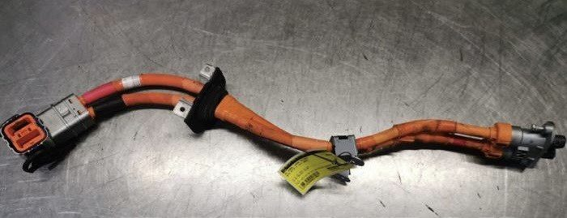

Example, high voltage cable for PE5/PE6 Pack # EKEA2105300Y / 13568667-00

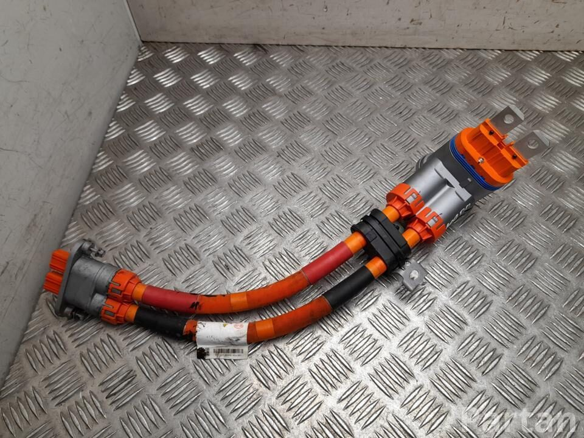

### Note on reusing HV cable :zap: 
If you are using the HV cable that came with the battery, and plan to cut off the ends to crimp on new terminals, be aware that the cables contain an outer shield layer. It is very important to properly insulate this, so you do not short high voltage to protective earth accidentally.

When preparing the cable, special attention must be taken the cable's shielding:

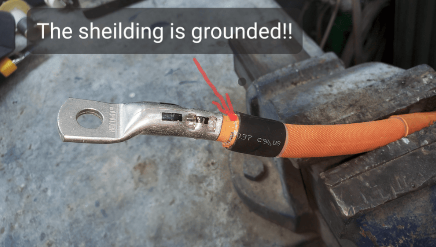

First make sure to leave at least 8mm space:

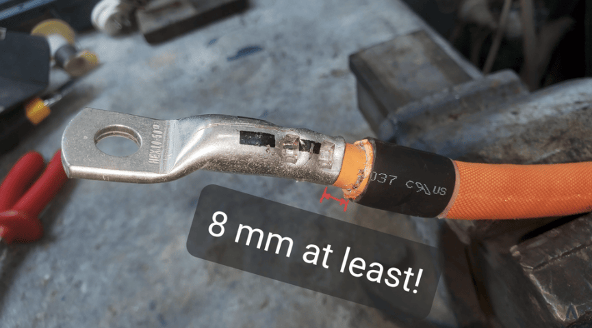

Then apply hot glue or other insulation adhesive:

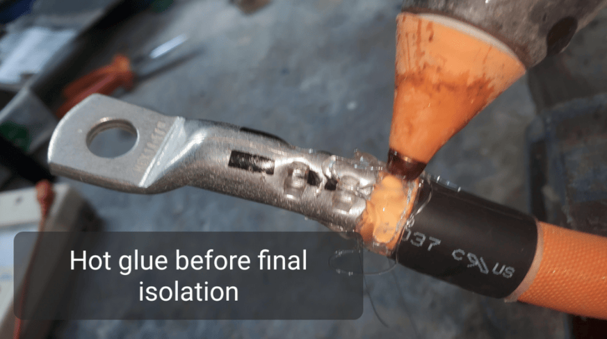

Final insulation layer applied:

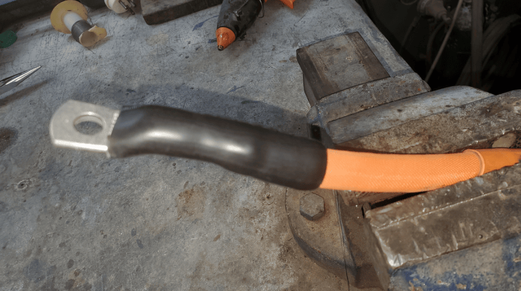

It is recommended to check your handiwork, by performing an insulation test on the cable after completing the work.

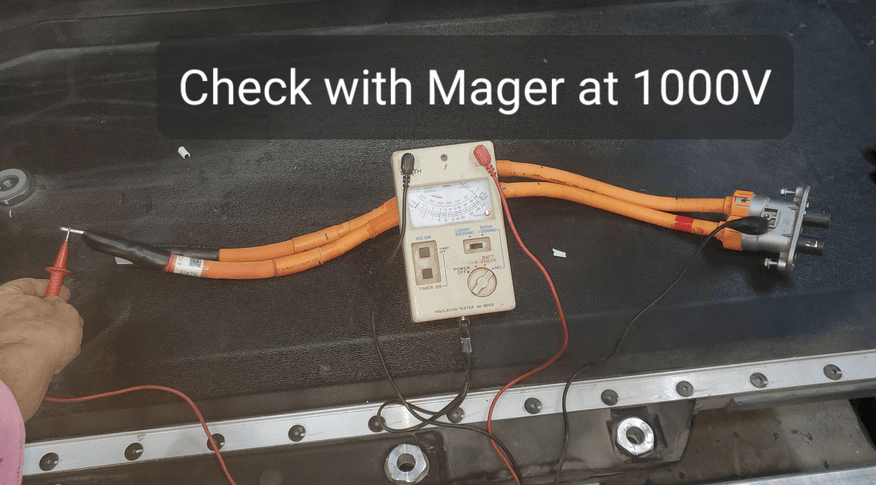

## How do I know if I have a crashed & locked battery?

Contactors failing to close does not, by itself, confirm that the battery is crash-locked. Check the startup order, CAN communication, active faults and inverter permission first. The **More Battery Info** page shows the contactor state reported by the BMS.

A BMS SOC reading that stays fixed while the battery is charging or discharging can also be a sign of a locked pack. Use this alongside the other checks rather than treating it as proof on its own.

## Charging and SOC calibration

From firmware **12.5.0**, Battery-Emulator lets the BYD BMS finish charging itself, as it would in the car. This gives the BMS the full-charge event it needs to recalibrate its own SOC and SOH.

Native charging is **enabled by default**. You can find it on **More Battery Info**, under **Native SOC calibration, charge termination & balancing**.

Once the BMS finishes charging, Battery-Emulator stops requesting charge. With balancing disabled, the contactors stay closed and the battery remains available for discharge. Another charge session is allowed after the battery has been discharged.

The panel shows the charge session state and the highest cell voltage and cell spread recorded at the last native charge termination.

!!! note "Primary battery only"
    In firmware **12.5.0**, native charging and the automatic balancing contactor cycle are available on the primary battery only. They are not available on the second battery.

### Cell balancing

From firmware **12.5.0**, Battery-Emulator can briefly disconnect the battery after a native full charge to trigger the BMS to start balancing.

To use this, leave native charging enabled and turn on **Balancing enabled** in the same panel. Balancing is **off by default**. **Hold for** sets how long the contactors stay open, with a default of **30 minutes**.  Through experimentation on the Discord, users have reported this to work with as little as 3 minutes open time. Press **Save** after changing the hold time.

During this hold, the battery cannot supply or accept power. Once the hold ends, Battery-Emulator closes the contactors again. The BMS can then continue balancing while the battery is in use; it does not need to remain disconnected for the whole balancing period. The panel shows the hold state and remaining time while the battery is held open.

Testing so far shows that the BMS selects the highest-voltage cells at the end of charging and balances those cells for around **17-18 hours**. Further full-charge cycles let it work through other cells, so an uneven pack may take several cycles to improve. The open time is what triggers the BMS to start balancing; it is not the total balancing time.

If the battery will not close again, Battery-Emulator makes a limited number of retries, then leaves it open and reports a contactor mismatch for you to investigate.

### Checking the balance timers

Open **More Battery Info → Cell Balance Timers**, then press **Read Timers**. This reads the total balancing hours recorded by the BMS for each cell.

Take a reading before a balancing cycle, then read again the following day using the same browser. The page compares the readings and highlights cells whose totals have increased.

These are lifetime counters, so they show that balancing happened between readings. They do not show which cells are balancing right now. Readings are taken manually, and the comparison history is saved in your browser.

### Insulation monitor and native charging

The BMS will refuse a native charge session while it reports an insulation fault. The **Isolation resistance monitor** section on More Battery Info shows the monitor status and controls.

If automatic monitor disable is enabled, firmware **12.5.0** reapplies it when the BMS turns monitoring back on after the contactors open. This also covers the contactor cycle used for balancing. Disabling the monitor does not repair an insulation fault.

## SOC drift and older calibration options

The BMS's reported SOC can drift over time, particularly if it does not get a chance to complete a full charge. With native charging enabled, the BMS can correct its own SOC when it finishes charging.

The older **Artificial SOC auto-calibration** section is greyed out while native charging is enabled, because the BMS is handling calibration itself. If native charging is disabled, Battery-Emulator's older automatic calibration method is still available. Manual SOC and capacity calibration also remains available.

### Artificial SOC auto-calibration

This method has been available since firmware **10.10.1**. When enabled and not overridden by native charging, Battery-Emulator waits for a settled full charge, then writes a 100% SOC calibration to the BMS using the same procedure as the manual calibration button. The correction persists across reboots.

The following conditions apply to this older method, not to native charging:

- Automatic calibration is enabled.
- The charge taper has reached its final stage, with cells near full and the current limit down to about 1 A.
- The BMS reports that the main contactors are closed.
- Current is between roughly 0.5 A discharge and 3 A charge.
- This condition has held for at least 10 minutes. A brief current excursion of up to 60 seconds is tolerated without resetting the timer.
- SOC is below 100% by more than the configured drift threshold.
- At least one hour has passed since the last calibration.

On **More Battery Info**, use **Enabled** and **Trigger drift** in the **Artificial SOC auto-calibration** panel to configure it. The status rows show which conditions have been met and what it is still waiting for.

### Manual SOC and capacity calibration

Manual calibration has been available on **More Battery Info** since firmware **10.3.0**. In the **Manual SOC & capacity calibration** panel:

1. Set **Target SOC** to the SOC you want to write to the BMS.
2. Check **Target capacity**. This defaults to the capacity read from the BMS, and changing it affects the reported SOH.
3. Press **Calibrate SOC** to write the values.

The screenshot below shows the controls in an older firmware version; the labels and layout have since changed.

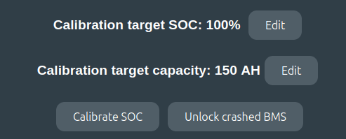{ width="493" height="199" }

## How do I unlock a crashed battery?
There are two methods to try and unlock the battery. The methods are via More Battery Info page (easy), and alternatively via CAN Replay (harder)

!!! info "IMPORTANT"
    To be able to unlock, you need separate control over B+ and IGN pin going towards battery (The two 12V pins on the battery). These need to be powered on/off in a specific sequence.

- Pin 4 12v+ BMS
- Pin 5 12v+ ignition
- Also make sure 12V supply has at least 12.8V and 2A available before starting the unlock procedure

### More Battery Info Unlock
There is a button in the "More Battery Info" page in the webserver, that when pressed will attempt to unlock the crashed battery.

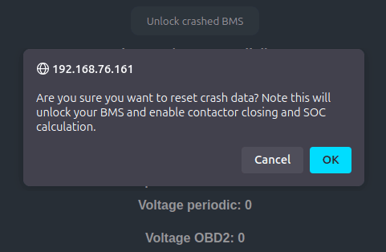

### CAN replay
One user reported success by manually sending the CAN log file while the battery 

[resetLockedBYD_v1.txt](https://github.com/user-attachments/files/20038227/resetLockedBYD_v1.txt)

User 1: About the power cycle and how I did it:

- Battery-Emulator compiled with only TEST_FAKE_BATTERY and no inverter selected
- Started with no power to either 12V constant or 12V ignition. I have separate switches for them though.
- So first Battery-Emulator hardware is powered on.
- Then 12V constant switch on, wait a few seconds and ignition on.
- At this point no communication is present on CAN, complete radio silence.
- Run unlock commands, upload resetLockedBYD_v1.txt in the CAN replay page in Battery-Emulator, and transmit it towards the battery
- Once again radio silence.
- Switch off 12V ignition.
- Wait a few seconds and then switch off 12V constant.

User 2 success story:

- I have B+ and the 2 ignition wires on separate switches.
- I turn on B+ first then ignition.
- Software was setup for BYD ATTO 3, v8.13.0
- Then I ran unlock procedure via "More Battery Info" page
- After the unlock I turned off ignition then B+ and the Liligo together then reverse process turning back on.
- Contactors closed after.

