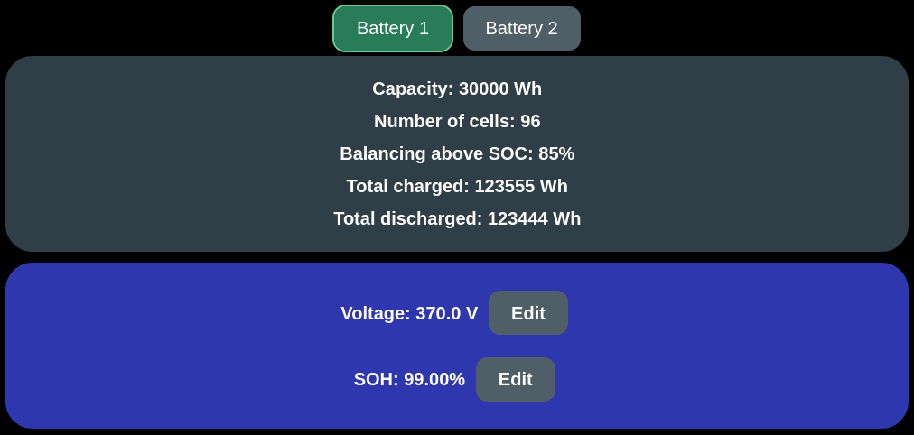

### What is this?

The Fake battery is a built-in battery integration that generates plausible battery data entirely inside the emulator, without any real pack, BMS or CAN traffic. In the Settings page it is listed as **Fake battery for testing purposes**.

It is meant for:

- Bringing up a new inverter integration without risking a real pack
- Testing the web UI, cell monitor, MQTT / Home Assistant autodiscovery, ESP-NOW and the display
- Verifying double and triple battery setups on a single board, with packs that can be made to differ from each other
- Reproducing SOC-, voltage-, SOH- and balancing-dependent behaviour on demand, by simply typing a pack voltage or a state of health

!!! danger "CAUTION"
    The Fake battery reports a healthy pack that always allows charge and discharge. If it is selected while real hardware is connected, the inverter will happily push power into or out of whatever is actually on the DC bus. Only use it on a bench setup, or with the HV side disconnected.

### Taking it into use

1. Open the emulator web UI and go to **Settings**.
2. In the **Battery** dropdown, select `Fake battery for testing purposes`.
3. Set **Battery communication interface** to any available interface (e.g. `CAN native`). The Fake battery never transmits and does not need a bus, but an interface must be selected.
4. Optionally tick **Double battery** and/or **Triple battery** (both are supported, see below) and select their interfaces.
5. Press **Save**, then **Reboot**.

After the reboot the status page shows the protocol name `Fake battery for testing purposes`, the emulator raises the normal "battery detected" event, and the system goes to ACTIVE just as with a real pack.

### Its own settings: Voltage and SOH

The Fake battery's settings live on the **More Battery/Cell Info** page (the button on the status page, `/advanced`), not on the Settings page. Below the panel listing the pack's properties there is a blue card with two rows:




**Voltage: `<value>` V** with an **Edit** button
**SOH: `<value>` %** with an **Edit** button

| Property | Voltage | SOH |
|:---|:---|:---|
| Unit | Volts, 0.1 V resolution | Percent, 0.01 % resolution |
| Accepted input | 0 – 5000 | 0 – 100 |
| Useful range | 245.0 – 404.0 V (the design limits of the fake pack) | any |
| Value after boot | 370.0 V | 99.00 % |
| Applied | Immediately, no reboot needed | Immediately, no reboot needed |
| Persisted | No | No |
| Affects | Only the pack whose tab is open | Only the pack whose tab is open |

Values are rounded to the nearest step, so typing 370.3 gives 370.3 V, and 87.35 gives 87.35 %.

The voltage drives almost everything else the pack reports: SOC, remaining energy, cell voltages and the simulated balancing state. The SOH is reported as entered and is otherwise inert: it feeds the SOH events and everything that displays or transmits SOH (status page, MQTT, ESP-NOW and the inverter protocols that carry it).

The panel above the card lists what the pack reports but cannot be changed: capacity, number of cells, the SOC above which balancing starts, and the total charged and discharged energy.

!!! note "NOTE"
    The card is drawn by the Fake battery integration itself, so it is invisible for every real battery. On a double or triple setup the page has a tab per battery, and each tab shows and edits that pack's own values.

### How SOC is derived from the voltage

Each pack's SOC is interpolated linearly between the fake pack's design limits, 245.0 V (0.00 %) and 404.0 V (100.00 %):

```
SOC [%] = (pack voltage - 245.0) / (404.0 - 245.0) * 100
```

Values at or below 245.0 V clamp to 0.00 %, values at or above 404.0 V clamp to 100.00 %.

| Fake voltage | Real SOC | Remaining energy | Note |
|:---:|:---:|:---:|:---|
| 245.0 V | 0.00 % | 0 Wh | Battery empty event, discharge blocked |
| 280.0 V | 22.01 % | 6603 Wh | |
| 320.0 V | 47.16 % | 14148 Wh | |
| 370.0 V | 78.61 % | 23583 Wh | Default after boot |
| 380.2 V | 85.03 % | 25509 Wh | Simulated balancing starts |
| 390.0 V | 91.19 % | 27357 Wh | |
| 404.0 V | 100.00 % | 30000 Wh | Battery full event, charge blocked |

Remaining energy is always `30 kWh × SOC`, so it stays consistent with the SOC shown.

The SOC that the inverter sees is still the **scaled** SOC, so the usual **SOC max/min percentage** settings apply on top of this. With the default 80 % / 20 % scaling, a fake voltage of 370.0 V (78.61 % real) reads as roughly 97.7 % towards the inverter.

### Simulated cell voltages

The pack voltage is divided evenly over 96 cells and a random spread of ±20 mV is applied per cell, re-rolled once per second:

```
cell [mV] = pack voltage [V] * 1000 / 96 + random(-20 .. +20)
```

| Fake voltage | Nominal cell voltage |
|:---:|:---:|
| 245.0 V | 2552 mV |
| 320.0 V | 3333 mV |
| 370.0 V | 3854 mV |
| 404.0 V | 4208 mV |

Because the spread never exceeds 40 mV between highest and lowest cell, the cell deviation event (500 mV default) never fires by itself. The constantly changing values make the cell monitor page, the MQTT cell voltage payloads and the ESP-NOW cell frames behave like a live pack.

### Simulated balancing

Above **85.00 % calculated SOC** (about 380.2 V) the Fake battery starts a simulated balancing session:

- Balancing status is reported as **Active**
- Every cell sitting more than 7 mV above the pack average has its balancing resistor flagged as on
- Since the cell spread is re-randomised every second, the set of balancing cells keeps changing, which is exactly what a display or MQTT consumer sees on a real pack

Below 85.00 % SOC the balancing status is reported as **Ready** and all balancing flags are cleared.

### Fixed values reported

Everything not derived from the voltage, and not settable on the info page, is a constant:

| Parameter | Reported value |
|:---|:---|
| Total capacity | 30 000 Wh (30 kWh) |
| Current | 0.0 A (so active power is always 0 W) |
| Max charge power | 5000 W |
| Max discharge power | 5000 W |
| Min / max temperature | 5.0 °C / 6.0 °C |
| Number of cells | 96 |
| Max / min design voltage | 404.0 V / 245.0 V |
| Max / min cell voltage | 4250 mV / 2500 mV |
| Max cell deviation | 500 mV (datalayer default) |
| Total charged energy | 123 555 Wh |
| Total discharged energy | 123 444 Wh |
| CAN alive | Always alive, faked once per second |

The **Battery capacity** setting on the Settings page has no effect with this integration: the driver rewrites the capacity to 30 kWh every second. The **Max charge/discharge speed (A)**, **Manual charge voltage limits**, **SOC scaling** and remote limit settings do work normally, since they are applied by the common layers after the battery driver has run.

The Fake battery implements none of the optional BMS functions (reset BMS, reset SOC, clear isolation, DTC reading, manual balancing, …), so none of those buttons appear on the battery info pages.

### Double and triple battery

The Fake battery supports both **Double battery** and **Triple battery**. Each extra instance is created on its own configured interface and gets its own datalayer entry, its own cell voltages, its own randomisation, its own balancing state, and its own voltage and SOH. All packs boot at 370.0 V and 99.00 %, so out of the box they are identical — which is what a healthy parallel installation looks like — and each pack is then free to be moved on its own tab. Total capacity becomes 60 kWh (double) or 90 kWh (triple).

Towards the inverter the packs are still presented as one large battery: the capacities and remaining energies are summed, while the SOC handed over follows battery 1. Per-pack differences are therefore visible on the status page, the info tabs, MQTT and ESP-NOW, but they do not move the SOC the inverter reads.

#### Making the packs disagree on purpose

Giving one pack a different voltage is the quickest way to walk the parallel safety check through its states:

| Voltage difference towards battery 1 | What happens |
|:---|:---|
| Up to 1.5 V | Packs count as in sync, the extra battery is allowed to close its contactor |
| More than 1.5 V, over 3 seconds | `Voltage difference between batteries` event is raised |
| More than 1.5 V, over 10 seconds | The extra battery is no longer allowed to close its contactor, and an already closed contactor opens |

Bringing the voltages back within 1.5 V clears the event and lets the pack rejoin.

!!! note "NOTE"
    In firmware older than this, packs 2 and 3 simply mirrored battery 1's voltage, so they could never be made to disagree. Older builds also refused to close the second and third contactors while the packs sat at exactly 370.0 V: the voltage-sync check treats 3700 dV as "no data read yet" and returned before comparing. It now only does so while the cell voltages are still at their 3700 mV default too, so a pack genuinely at 370.0 V joins normally. If the extra contactors stay open at the default voltage on your build, it predates that fix — change the voltage to 370.1 V and they close.

### Events you can provoke on purpose

Because the pack voltage and SOH are free inputs, the Fake battery is a convenient way to walk the safety layer through its states:

| Setting | What happens |
|:---|:---|
| Voltage below 245.0 V | Battery undervoltage event, then cell undervoltage below about 242 V |
| Voltage exactly 245.0 V or lower | SOC 0.00 %, battery empty event, discharge power forced to 0 W |
| Voltage 404.0 V | SOC 100.00 %, battery full event, charge power forced to 0 W |
| Voltage above 404.0 V | Battery overvoltage event, followed by cell overvoltage and critical cell overvoltage |
| Voltage around 380 V and up | Balancing goes Active in the UI, MQTT and ESP-NOW |
| Voltage of one pack moved away from battery 1 | Voltage difference event and, after 10 seconds, that pack is dropped from the DC link |
| SOH of battery 1 below 25.00 % | Battery state of health low event |
| SOH of two packs more than 25.00 % apart | SOH difference event |

!!! note "NOTE"
    The SOH difference check ignores any pack that reads exactly 99.00 %, because that is the value integrations leave behind when they have no SOH to report. Since 99.00 % is also the Fake battery's default, both packs have to be moved off it before the event can fire. The state of health low event only looks at battery 1.

### Quirks

- **DC bus reported as not live.** The Fake battery declares the DC bus dead at startup. With GPIO contactor control enabled, the flag is corrected as soon as precharge completes. Without contactor control it stays false, and inverters that gate on it — notably BYD-Modbus — report **STANDBY** instead of **ACTIVE** to the inverter. Enable contactor control, or expect standby on the inverter side.
- Neither the voltage nor the SOH is stored in NVM, every reboot returns every pack to 370.0 V and 99.00 %.
- Charged/discharged energy counters are frozen constants, they never move.
