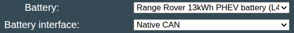

### Work in progress integration :construction: 

## Land Rover battery variants
Following is a list of PHEV/EV Land Rover/Jaguar models that have lithium batteries that can be used by the Battery-Emulator.

* Range Rover (L405) [2012–2021]
* Range Rover Sport (L494) [2013–2022]
   * 13.1 kWh Lithium ion (PHEV)
   * Software selection: Range Rover 13kWh PHEV battery (L494/405)

{ width="590" height="67" }

* Discovery Sport 1/2 (L550)
* Range Rover Evoque 2 (L551) [2019 – present]
* E-Pace (X540) [2017–present]
   * 15 kWh Lithium ion (PHEV)
   * Software selection: LAND_ROVER_PHEV_15

### Range Rover Velar (L560) [2017–present]
17.1 kWh Lithium ion (PHEV)
19.246/15.39 (total/usable) kWh (PHEV 2023 ->)

### Land Rover Defender (L663)
2019-Present 13.1kWh li-ion PHEV

### I-Pace (X560 & X590)
Use I-PACE implementation