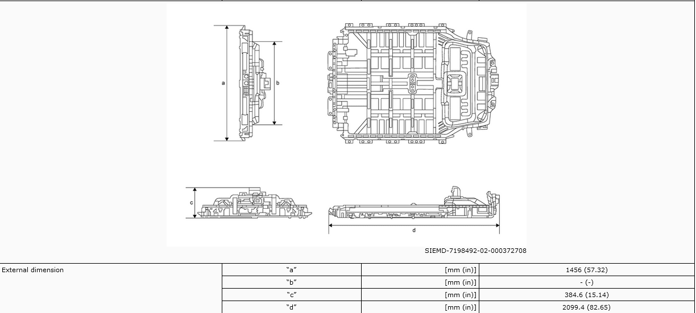
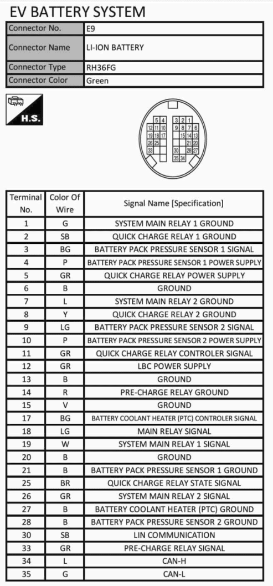
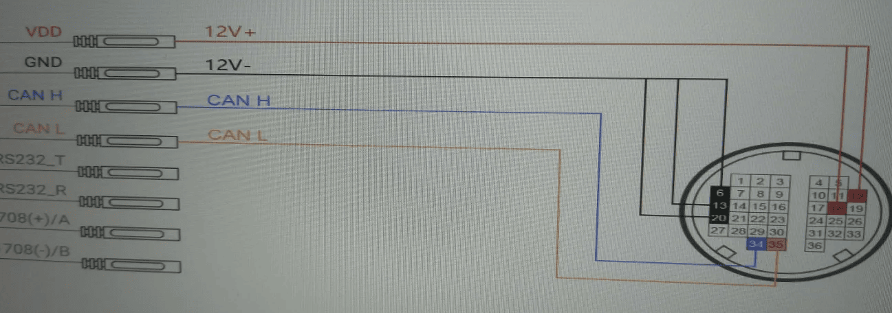
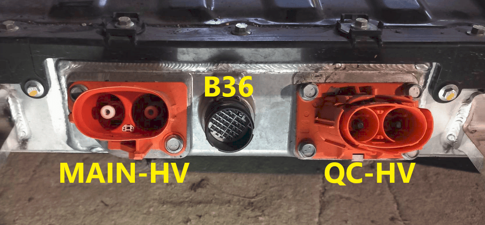

## Work in progress integration :construction: 

## General info

⚠️ CAN LOGS WANTED FOR THIS BATTERY! ⚠️ 

The Nissan Ariya [battery](https://www.batterydesign.net/2022-nissan-ariya/) comes in two variants.

- 63kWh - 96S 400V Architecture - 451kg 1456x384x2099mm
- 87kWh - 96S 400V Architecture - 578kg 1456x384x2099mm

## Pinout BMS
The Ariya battery uses the same 36-pin Yazaki connector as the Nissan LEAF, but it uses more pins:

* Pin 34 CAN-H - Connect to CAN-H on the board
* Pin 35 CAN-L - Connect to CAN-L on the board
* Pin 6 Ground - Connect to Ground
* Pin 13 Ground - Connect to Ground
* Pin 15 Ground - Connect to Ground
* Pin 20 Ground - Connect to Ground
* Pin 12 12V - Connect to 12V constant

Depending on which high voltage port you use the next pins will differ. 
If using MAIN-HV: (the safe bet, since we control both contactors)

* Pin 1 Main relay 1 GND - Connect to Ground
* Pin 7 Main relay 2 GND - Connect to Ground
* Pin 14 Precharge GND - Connect to Ground
* Pin 33 Precharge Sig - Connect to 12V to control precharge (either manual or automatic)
* Pin 19 Main relay 1 Sig - Connect to 12V to control contactor (either manual or automatic)
* Pin 26 Main relay 2 Sig - Connect to 12V to control contactor (either manual or automatic)

If using QC-HV: (UNCLEAR HOW THIS WORKS)

* Pin 2 QC relay 1 GND - Connect to Ground
* Pin 8 QC relay 2 GND - Connect to Ground
* Pin 11 QC cont sig - Connect to ?
* Pin 25 QC state sig - Connect to ?

You can use either QC-HV or the MAIN-HV connector. The QC-HV uses the same high voltage cable as the Nissan LEAF.

## Precharge/Contactor closing

Almost all EV batteries contain contactors and precharge relays. Contactors act like big relays, and are used to control electrical circuits where currents are high. They are designed to be able to break the flow of current in a safe manner without electrical arcing. There are two contactors, one for positive and one for negative. To avoid electrical arcing when turning on the battery, the initial inrush of current is led thru a precharge resistor, to allow for slow charging of the capacitors inside the inverter. If the inverter has been turned off for a long time, the capacitors inside will act almost as a dead-short, 0 ohm resistance. If you skip using the precharge, then your contactors will spark every time you close them, wearing them out prematurely. Now that we know what the contactors/precharge does, we can look at ways to control it.

The Nissan Ariya battery can be used in two ways. Manual and automatic startup/shutdown of the contactors/precharge circuit.

### Automatic control 🤖

Battery Emulator hardware can act on its own, and turn on/off the contactors/precharge resistor when the battery says it is OK and turn off when not OK to proceed. This is done via the 3.3V digital output header that is located on the supported boards.

To enable the feature in the software, Enable the **Contactor control via GPIO** option on the Settings page.

{ width="505" height="42" }

To keep things simple, it is recommended to use Solid State Relays (SSR). These can be activated with 3Volt, and control large DC currents. Follow this schematic to complete the circuit:

The pin numbers below are the ones used on the LilyGo T-CAN485, check the HAL definitions of your own board if you use a different one:

- Precharge pin 25 - Precharge SSR + input
- Positive Contactor pin 32 - Positive SSR + input
- Negative Contactor pin 33 - Negative SSR + input
- GND - All 3x SSR - input

OPTIONAL: If you use SSR relays with the Battery-Emulator hardware, you can also enable PWM mode for reduced power consumption. Here are parameters confirmed working with the LEAF contactors+PWM.

## Part numbers

|  Product |  Purchase Link |
| :--------: | :---------: |
| 36pin battery connector (2013-2023) Yazaki 7287-1065-30 (female with cables) |  [AliExpress](https://s.click.aliexpress.com/e/_onL8Fx6)   |
| High voltage connector QC 297A6-5SH1A |  [Ebay](https://www.ebay.com/sch/i.html?_from=R40&_nkw=297A65SH1A&_sacat=0)   |
| High voltage connector Main |  ???   |
| Service disconnect switch |  ???   |
