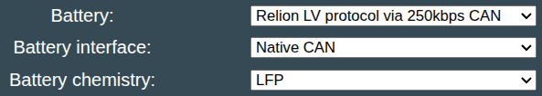

## Compatible RELi³ON batteries

- [RB48V200](https://www.relionbattery.com/products/lithium/rb48v200)

## Software configureation

The Relion LV protocol supports 48V batteries.

For this battery type, use the option called "Relion LV protocol via 250kbps CAN" under the "Battery Protocol" setting

{ width="593" height="106" }

Note, the 250kbps mode only works on **NATIVE CAN** interfaces
