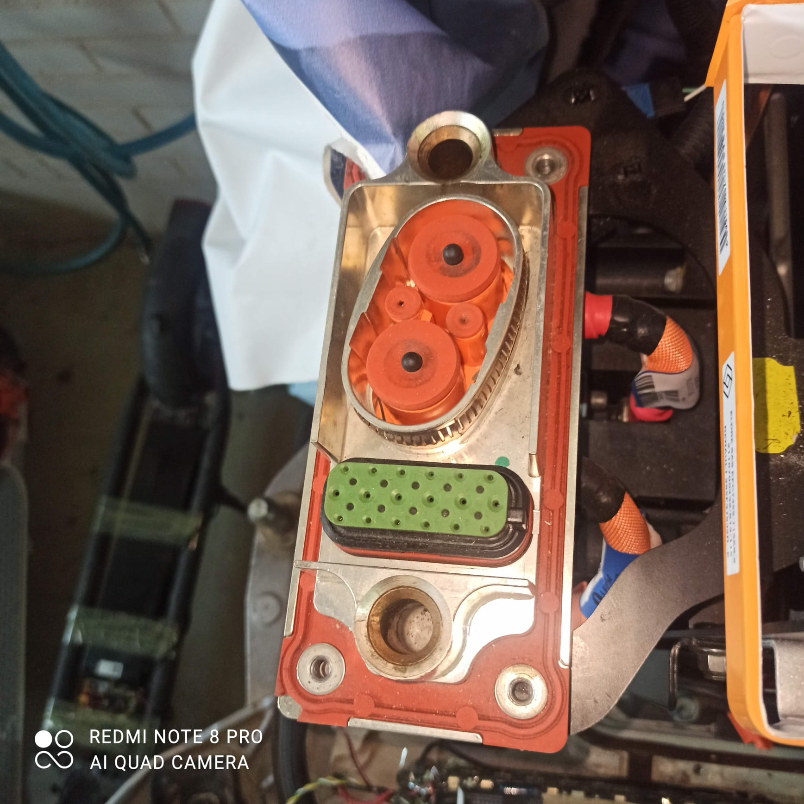
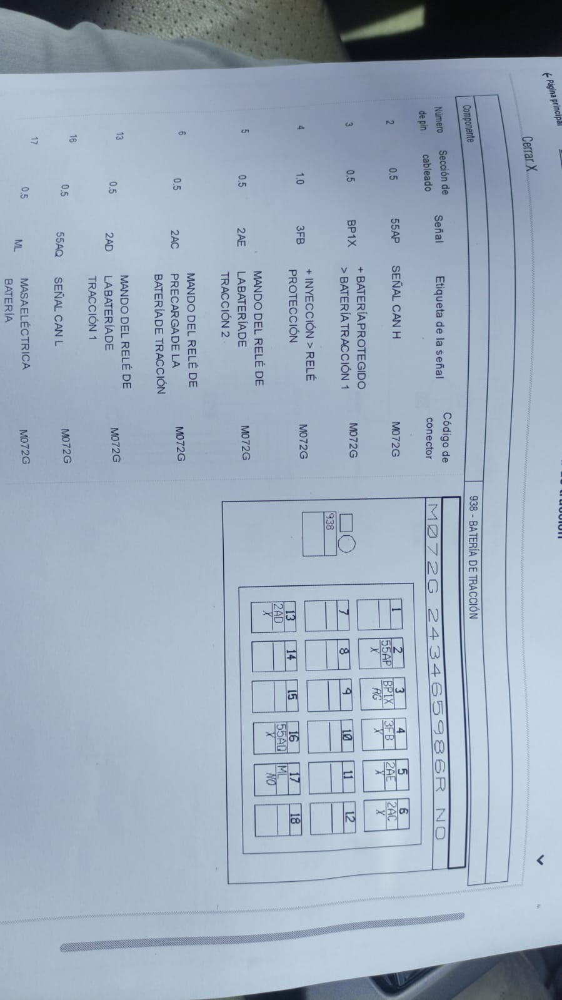

### WIP :construction: 

## Variants of the Fluence ZE

There are 2x batteries available for the Fluence:

* 22kWh 2011-2017
* 36kWh 2018- (Can be used with Zoe Gen1 software setting)

### 22kWh connector and pinout

### 36kWh connector and pinout
Probably is the same as 22kWh model changing the cells only. But not verified. If you have wiring diagrams, pictures of the battery, connectors, feel free to share!