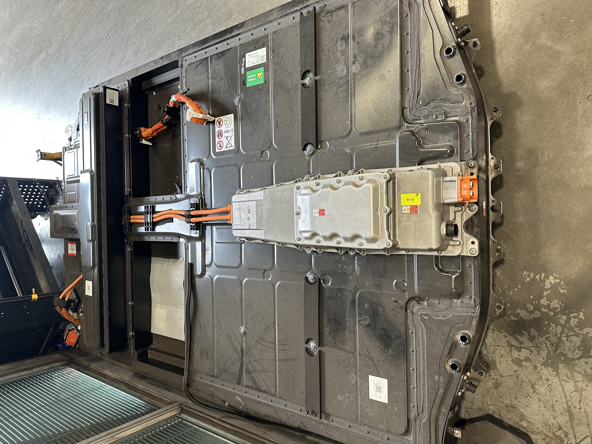
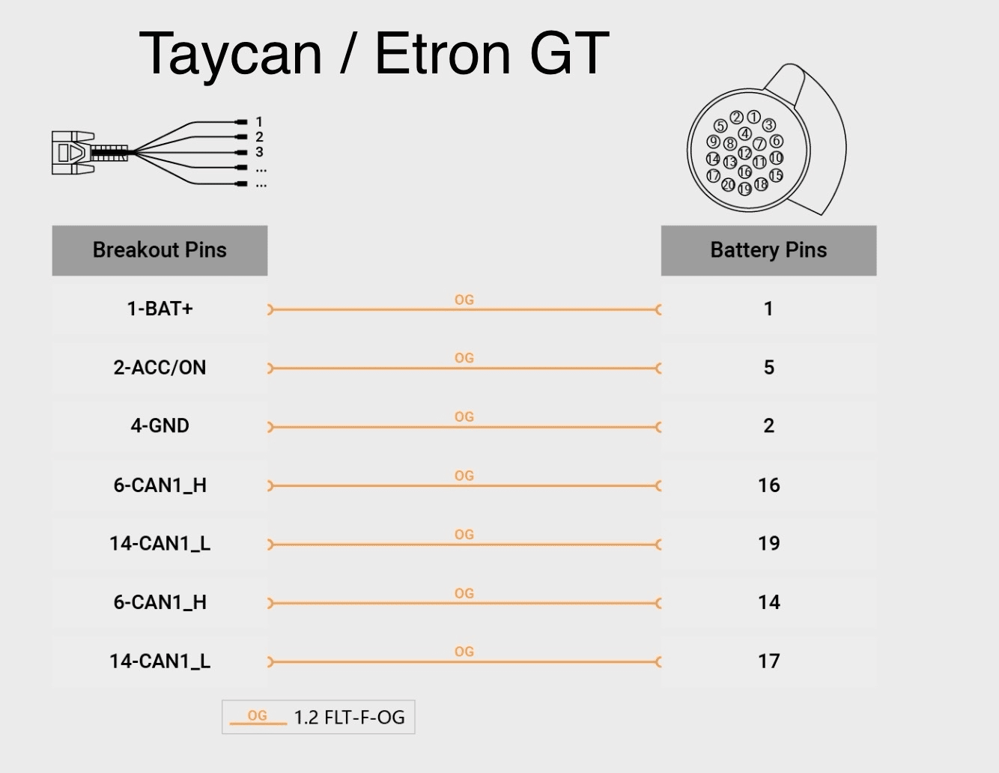
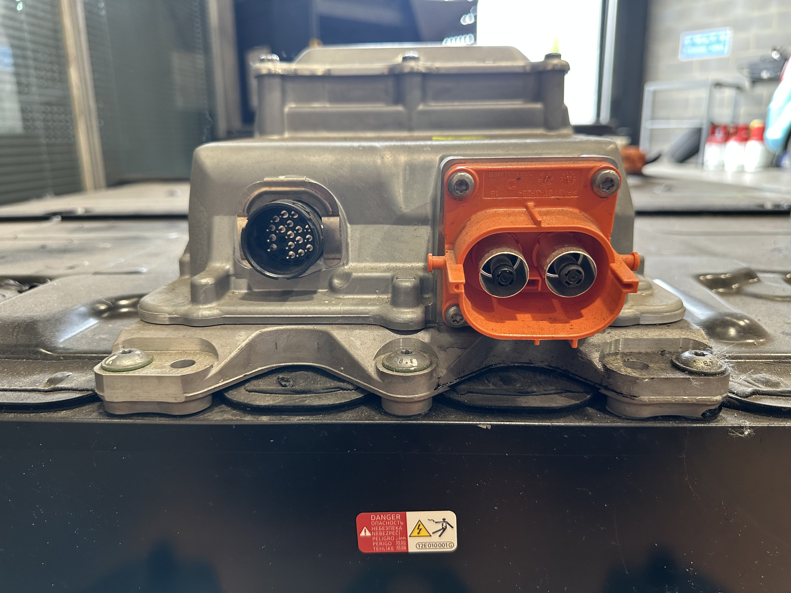
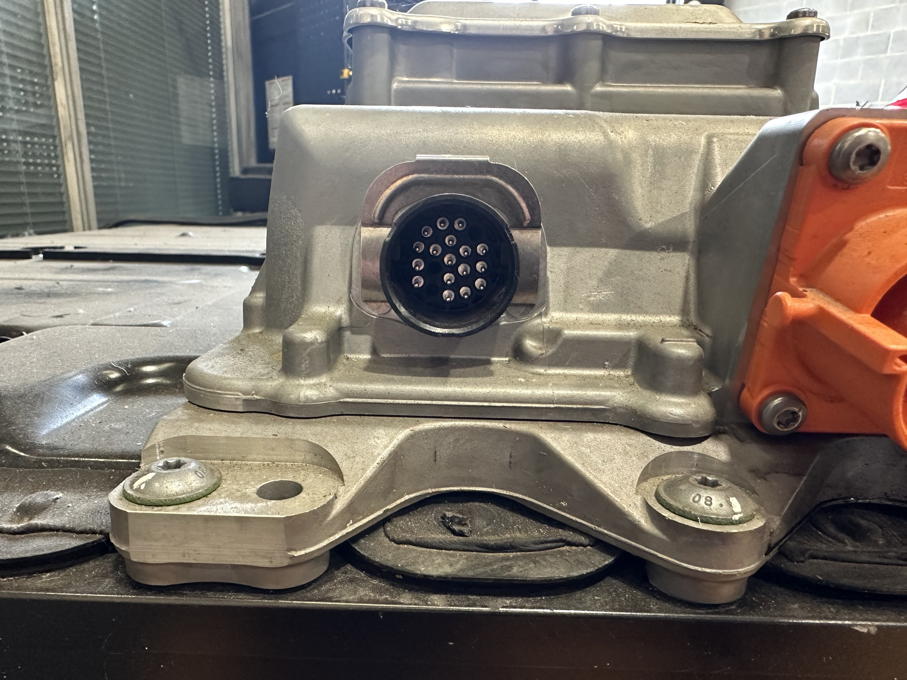
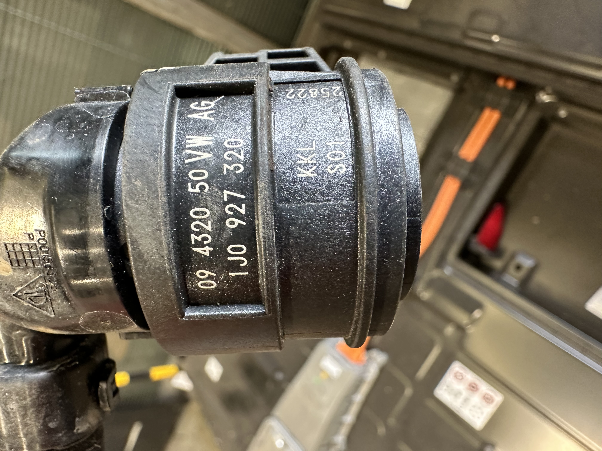
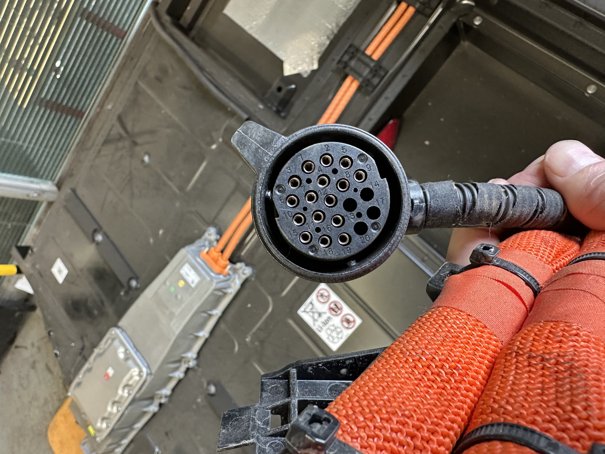
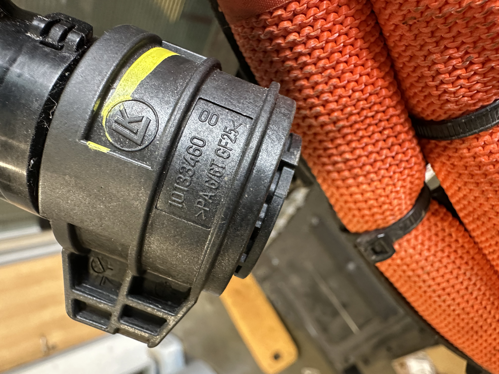
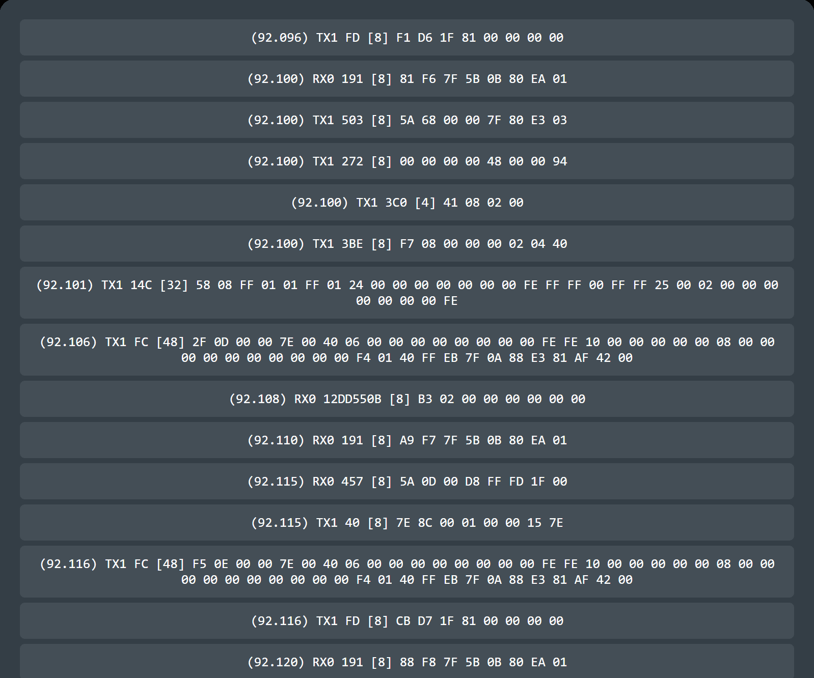

### Volkswagen Group MSB platform

- [Porsche Taycan](https://en.wikipedia.org/wiki/Porsche_Taycan) (J1 Performance; 2019–present)
- [Audi e-tron GT](https://en.wikipedia.org/wiki/Audi_e-tron_GT) (J1 Performance; 2020–present)

### Battery variants

- 79.2 kWh (71.0 kWh usable) liquid-cooled lithium-ion
- 93.4 kWh (83.7 kWh usable) liquid-cooled lithium-ion "Performance Battery Plus"

### Wiring

PIN 1: 12v supply
Pin 3: 12v Supply
PIN 2: GND
PIN 4: Pilot line IN (High Voltage Interlock)
Pin 5: 12v Ign 
Pin 9: Pilot line OUT (High Voltage Interlock)
Pin 10: Temp sensor Signal (pre-run)
Pin 11: Temp Sensor Signal (return)
Pin 15: Temp Sensor Ground (pre-Run)
Pin 18: Temp Sensor Ground (return)
Pin 16: CAN High
Pin 19: CAN Low

Only CAN Pins 16 and 19 are populated in both Audi Etron GT and Porsche Taycan Batteries so that is where I have taken the CAN data from

### Logs 

New logs 22/05/2025 (93.4 kWh Performance Battery Plus) (2021 Porsche Taycan Turbo S) below taken VIA serial using Putty assigned to the relevant COM port assigned to the Lilygo.

Individual logs for each listed item and one complete log start to finish at 67% SOC on vehicle display.

[idle_door_openPINS16+19.log](https://github.com/user-attachments/files/20383569/idle_door_openPINS16%2B19.log)

[ign_on67percentSOC.log](https://github.com/user-attachments/files/20383563/ign_on67percentSOC.log)

[drive_park_reverse_drive.log](https://github.com/user-attachments/files/20383568/drive_park_reverse_drive.log)

[charge_start.log](https://github.com/user-attachments/files/20383567/charge_start.log)

[charge_end.log](https://github.com/user-attachments/files/20383566/charge_end.log)

[off_idle_drive_off_charge_end_charge_contactors_off.log](https://github.com/user-attachments/files/20383564/off_idle_drive_off_charge_end_charge_contactors_off.log)

[TaycanbatStandAlone.log](https://github.com/user-attachments/files/20391487/TaycanbatStandAlone.log)

[TaycanBatStandAlone2.log](https://github.com/user-attachments/files/20391488/TaycanBatStandAlone2.log)

OBD data via Diagnostics Looking at Cell voltages 63% SOC total 751.2v 12-13mv Delta approx 22c temp
[taycanOBDBatteryData.log](https://github.com/user-attachments/files/20393706/taycanOBDBatteryData.log)

OBD Data from Carscanner App Toggling through menus and again ending with cell voltages display
[CarScannerOBD.log](https://github.com/user-attachments/files/20393927/CarScannerOBD.log)

LOG in CANFD standalone 30/05/2025
[TaycanFDstanalone.log](https://github.com/user-attachments/files/20522032/TaycanFDstanalone.log)

 