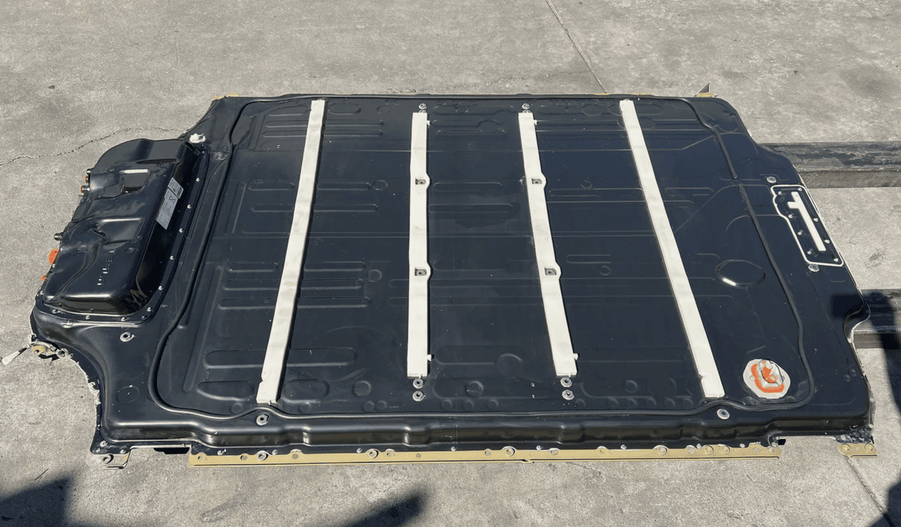
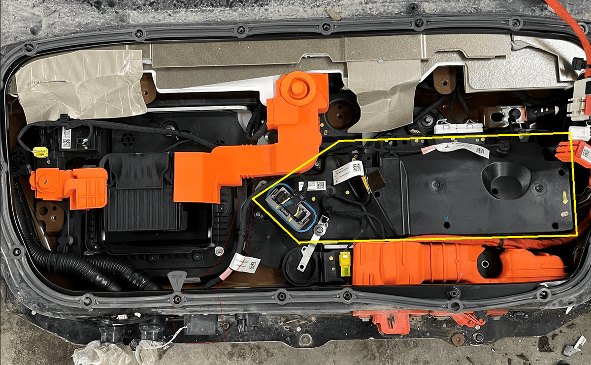
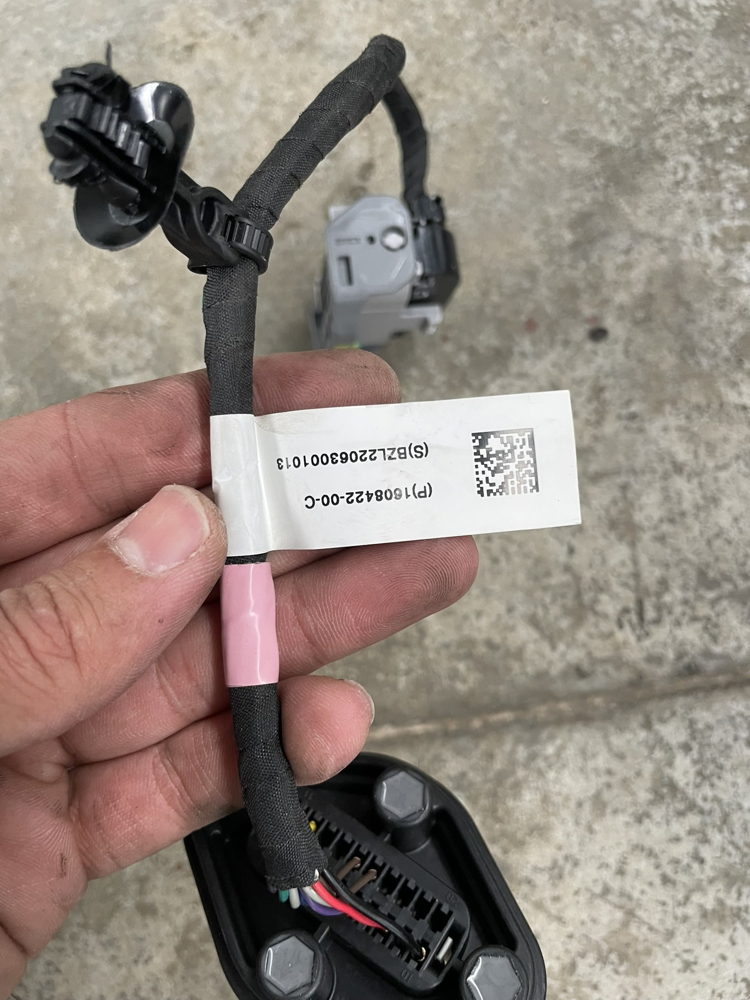
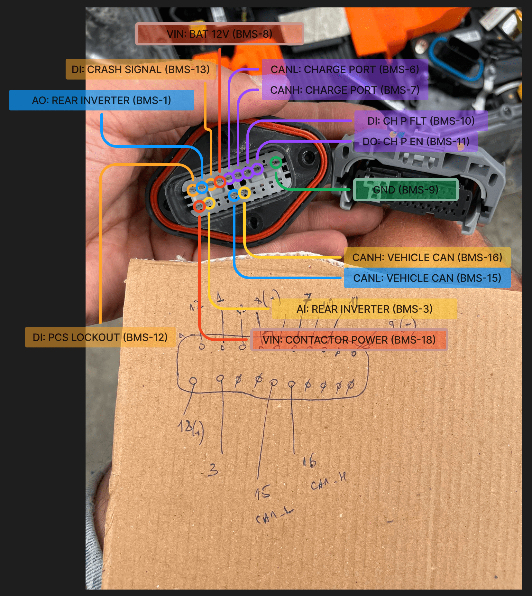
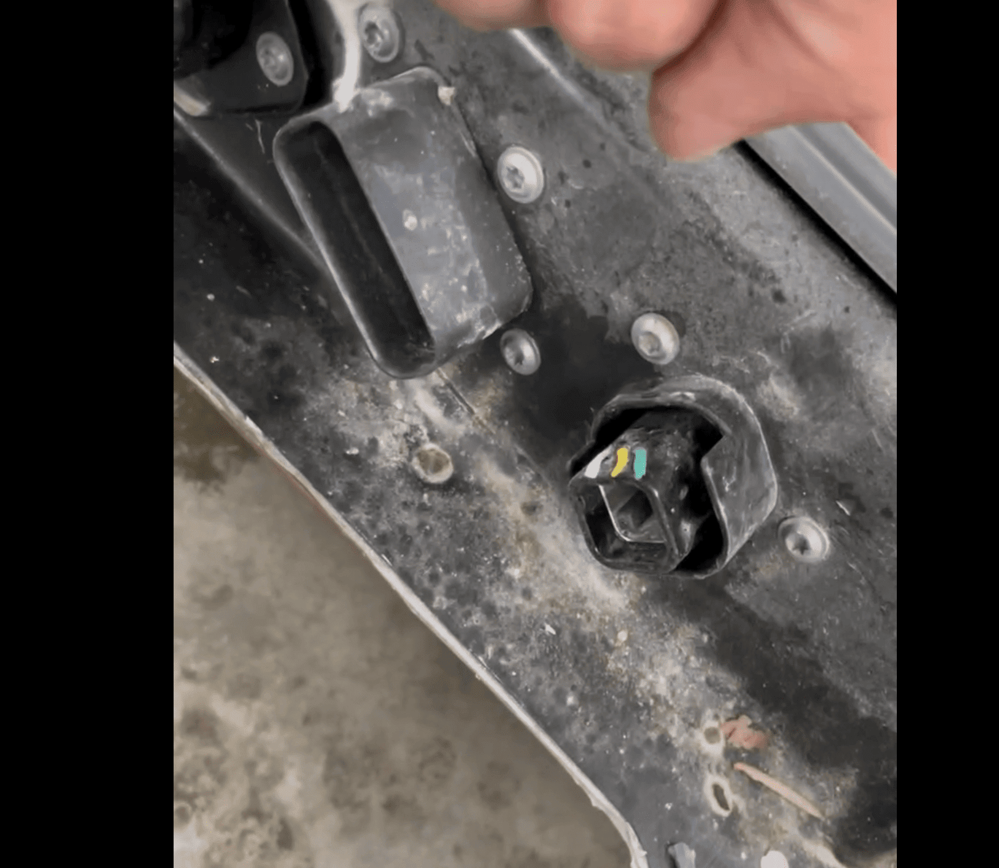
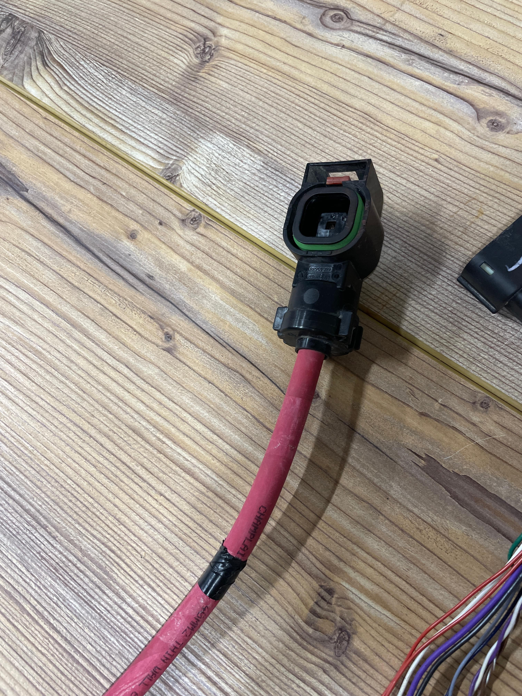
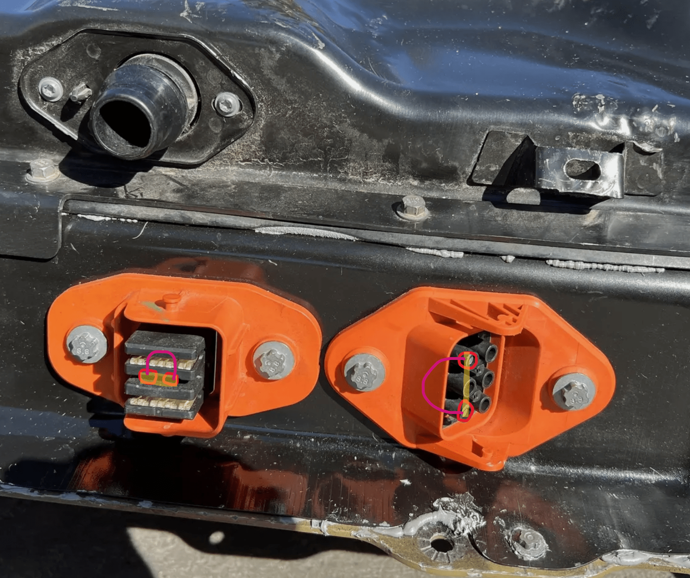
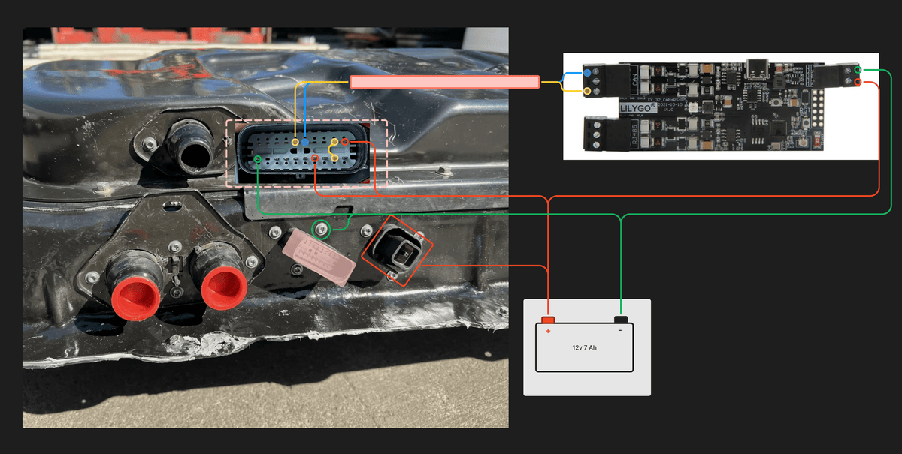

## Tesla Model S/X 2021+

Working with the Tesla Model S and X 2021+ battery differs in some ways from Tesla 3 and Y batteries. However, the basic connection principle remains similar. Therefore, we recommend starting by reading the [guide for connecting Tesla 3/Y batteries](tesla_model_3_y.md) to understand the general approach.
This article will focus on the differences in the battery and connection process for the S/X models.

## Battery Architecture
{ width="1150" }

Unlike M3/Y batteries, the 100 kWh battery has more cells and a maximum voltage of around 460 volts.

## BMS Controller
The battery uses a BMS controller, which visually resembles the one in the 3/Y models (it might even have the same circuitry, but this is uncertain and requires further investigation).

{ width="1182" }

## External Connector
The external BMS connector differs. Tesla engineers used an extension adapter:

{ width="1204" }

The connector on the battery has the following pinout relative to the connector on the BMS itself:

{ width="827" }

Unlike M3/Y, only the positive PCS contact comes out of the battery, while the negative is now the battery casing itself. A special connector is used to connect the positive terminal:

{ width="812" }

{ width="1204" }

## Connection to Battery Emulator
Key points for connecting these batteries:

The HVIL has been slightly modified, so no resistors are  needed between pins 1 and 3 of the BMS. The factory wiring uses a jumper here, so we need to connect it in the same way. You also need to short all HVIL contacts on the motor power connectors and the air conditioning connector.

The battery has three motor connectors. In car versions with two motors, there may be one factory-installed plug.
You need to short the signal contacts on all connectors, as this forms a single INTERNAL_HVIL circuit.

{ width="842" }

General connection scheme to Battery Emulator:

{ width="2376" }

Precharge capacitors are still required, as nothing changes compared to connecting M3/Y batteries [see the article on connecting M3/Y](tesla_model_3_y.md).

In cars, these batteries typically work together with 16V li-ion batteries in the vehicle's onboard network.
However, the batteries I tested with the Battery Emulator used 12V batteries. The charging voltage does not exceed 14.25V, which is the same as in the M3/Y. 
This is controlled by the PCS. It’s possible that certain CAN frames control the onboard voltage. More advanced reverse engineers can provide more information here.

!!! warning "CAUTION"
    In any case, you must follow safety precautions, as you are working in a high-voltage environment, so proceed at your own risk. Be careful!