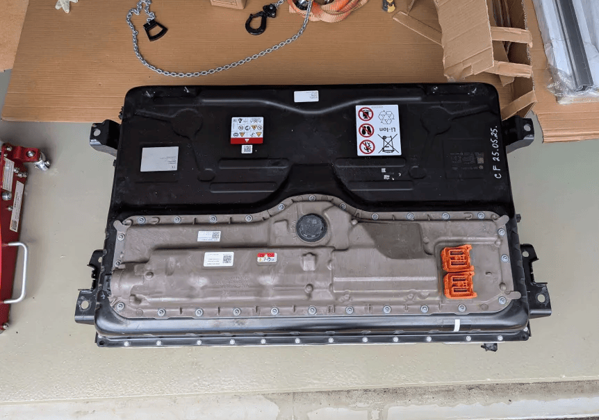
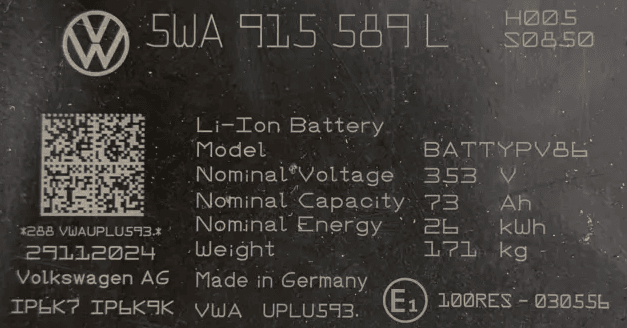

# Volkswagen MQB battery platform

!!! info "IMPORTANT"
    The MQB batteries do **not** have any precharge resistors built in. They need to see actual battery voltage on the high voltage terminals before the battery can turn on the contactors. Due to this requirement the MQB batteries are harder to re-use compared to most EV battery packs. To achieve this, a standalone lab PSU or high voltage isolated boost converter can be used to generate the high voltage needed to start the battery.

This platform shares a lot of similarities with the [Volkswagen MEB platform](vW_meb.md)

{ width="862" height="605" }

{ width="627" height="328" }

### Physical Dimensions

| Parameter | Value |
|----------|-------|
| Pack Size (L × W × H) | <!-- e.g. 2400 × 1500 × 150 mm --> |
| Weight | <!-- e.g. 540 kg --> |

## Compatible batteries

<strong>Vehicles using the MQB Evo 2024+ platform (Note only 2024+)</strong>

- Audi A3 Mk4 (2020–present)
- Audi Q3 Mk3 (2025–present)
- Audi Q3 Sportback Mk2 (2025–present)
- Audi Q6 (2022–present)
- Cupra Formentor (2021–present)
- Cupra Terramar (2024–present)
- Jetta VS8 (2025–present)
- SEAT León Mk4 (2020–present)
- Škoda Superb Mk4 (2023–present)
- Škoda Octavia Mk4 (2020–present)
- Škoda Kodiaq Mk2 (2023–present)
- Volkswagen Atlas/Teramont Pro Mk2 (2025–present)
- Volkswagen Caddy Mk4 (2020–present)
- Ford Tourneo Connect Mk3 (2022–present)
- Volkswagen Golf Mk8 (2019–present)
- Volkswagen Lamando L (2022–present)
- Volkswagen Lavida Pro (2025–present)
- Volkswagen Multivan (T7) (2022–present)
- Volkswagen Passat/Magotan/Passat Pro (B9) (2023–present)
- Volkswagen Sagitar L (2025–present)
- Volkswagen Talagon (2021–present)
- Volkswagen Tavendor (2022–present)
- Volkswagen Tiguan Mk3 (2023–present)
- Volkswagen Tayron Mk2 (2024–present)
- Volkswagen T-Roc Mk2 (2025–present)

## Software configuration
For this battery type, use the option called "VW Group MQB Evo 2024+ via CAN-FD" under the "Battery Protocol" section.

