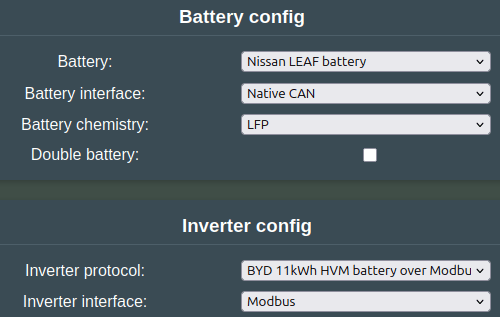

# Supported Emulator Hardware

There are many hardware kits that can run the Battery-Emulator software. Cheap option is the "LilyGo T-2CAN" (2x CAN). For those that need more reliable and certifiable hardware, the "Stark CMR" is highly recommended. Amount of stars ⭐ signal how easy to use the hardware is for a newcomer:

|  Product |  Product Link | Notes | CAN interfaces | Newcomer friendly |
| :--------: | :---------: | :---------: | :----------: | :----------: |
| LilyGo T-CAN485 |  [Wiki page](lilygo_t_can485.md)   | Cheap! CAN & Modbus! | 1 (+ 1 add-on) | ⭐
| Stark CMR Module | [Wiki page](stark_cmr.md) | Professional HW, CE certified, Massive I/O | 2 (+ 1 add-on) | ⭐⭐⭐
| 3LB | [KiCAD Design Files](https://github.com/malcolmputer/3lb) | Open source triple-CAN (fully isolated) | 3 (+ ? add-on) | ⚠️
| LilyGo T-2CAN | [Wiki page](lilygo_t_2can.md) | Cheap! Dual isolated CAN | 2 (+ 1 add-on) | ⭐⭐⭐
| LilyGo T-2CANFD | [Wiki page](lilygo_t_2can.md) | Cheap! Isolated CAN & Isolated CAN-FD | 2 (+ 1 add-on) | ⭐⭐⭐
| Waveshare ESP32-S3-RS485-CAN  | [Wiki page](waveshare_esp32_s3_rs485_can.md) | Cheap! CAN & Modbus! | 1 (+ 1 add-on) | ⭐⭐
| ESP32 Devkit V1 | [Wiki page](esp32_devkit_v1.md) | Build your own! For expert tinkerers | | ⭐

!!! note "NOTE"
    There is no way to purchase a pre-programmed device. This is a hobbyist open source project. You will be responsible for loading the software and setting it up correctly for your components. There is however a [support Discord group](https://www.patreon.com/dala) available.

## How do I configure the software for my battery/inverter?

All the changes to the software are done on the _Change Settings_ page, which can be accessed thru the Webserver. At the top of this webpage, you can select which battery, inverter protocol and what interface they are connected to. If you are unsure which protocol you need, check the specific page for the battery/inverter you are using linked here in the Wiki

## How do I know what battery/inverter interface to use

This depends which hardware you are using for the Battery-Emulator. For instance Stark CMR uses "Native CAN" for CAN1, and "Native CAN FD" for CAN2. See the Wiki page for the hardware you are using for more info

## Status LED

The board has a built in LED that is used to signal current status. With this feature, it is easy to at a glance catch what info the board is getting. It will show the current colors:

* Pulses 🟢 if all is well and BMS is active
* Pulses 🟡 if battery has entered a warning state
* Solid 🔴 if battery goes into a fault state
* Pulses ⚪ when the BOOT button has [been long pressed for various tasks](../setup/software/boot_button_functions.md)

By visiting the "Events" page in the Webserver, you can see which specific warnings/faults are active

## Connectivity

The board has wifi, and supports running a [Webserver that you can connect to for real time values](../setup/software/webserver_guide.md), [Over The Air updates](../setup/software/ota_update.md) (OTA), cellmonitoring, changing settings and more. See the [Webserver](../setup/software/webserver_guide.md) page for more info on how to use the system

For those into home automation, the code also supports [MQTT](../setup/software/mqtt.md) 
