**MCU / flash:** ESP32-S3 (Xtensa LX7 dual-core, 240 MHz), 16 MB flash, 8 MB PSRAM. 

The LilyGo T-2CAN is a dual CAN board, excellent for integrations that require separate CAN controllers. It is very easy to use this board on multi-CAN systems compared to the LilyGo T‐CAN485. The CAN interfaces are both galvanically isolated, making it safe to use with inverters such as Solax.

**There are two versions of the T-2CAN:**

- **T-2CAN** (classic): Supports 2x CAN
- **T-2CAN FD**: Supports 1x CAN and 1x CAN FD.

Since they are the same price, the T-2CAN FD is generally recommended.

!!! note "NOTE"
    This board is not natively compatible with Modbus/RS485 or CAN FD (in the case of the non-FD 2CAN), although both can be [added on](#add-ons).

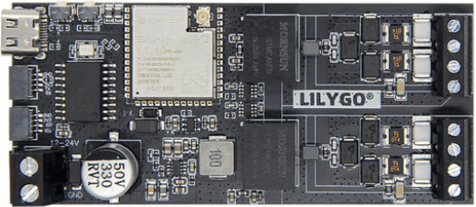

## Purchase link

The hardware can be bought via sites like AliExpress, or the official [LilyGo store](https://lilygo.cc/products/t-2can)

## Hardware info

| GPIO | Function |
|---|---|
| 0 | BOOT button — [long-press options available](../setup/software/boot_button_functions.md) |
| 1 | Battery wake-up 1 (Configurable port = WUP1 / WUP2, default) — or I2C display SDA (I2C Display SSD1306) — or [Equipment stop](../setup/software/equipment_stop.md) input ([E-stop](../setup/software/equipment_stop.md) / [BMS Power](../setup/hardware/periodic_bms_reset.md)) |
| 2 | Battery wake-up 2 (WUP1 / WUP2, default) — or I2C display SCL (I2C Display SSD1306) — or [BMS Power](../setup/hardware/periodic_bms_reset.md) output ([E-stop](../setup/software/equipment_stop.md) / [BMS Power](../setup/hardware/periodic_bms_reset.md)); held across a reset/OTA reboot |
| 3 | [BMS Power](../setup/hardware/periodic_bms_reset.md) output (Configurable port = WUP1 / WUP2 or I2C Display); held across a reset/OTA reboot |
| 4 | [Third battery](../setup/software/battery_3x.md) contactors output — or CHAdeMO pin 4 |
| 5 | [Second battery](../setup/software/battery_2x.md) contactors output — or CHAdeMO current transducer input (ADC1_CH4) |
| 6 | Native CAN RX (CAN B) |
| 7 | Native CAN TX (CAN B) |
| 8 | On-board controller INT — [MCP2518FD](../setup/can_related/can_fd_add_on_mcp2518fd.md) |
| 9 | On-board MCP2515 RST (non-FD board only); also driven by the FD/non-FD detection probe at boot |
| 10 | On-board controller CS — [MCP2518FD](../setup/can_related/can_fd_add_on_mcp2518fd.md) |
| 11 | On-board controller MOSI/SDI — [MCP2518FD](../setup/can_related/can_fd_add_on_mcp2518fd.md) |
| 12 | On-board controller SCK — [MCP2518FD](../setup/can_related/can_fd_add_on_mcp2518fd.md) |
| 13 | On-board controller MISO/SDO — [MCP2518FD](../setup/can_related/can_fd_add_on_mcp2518fd.md) |
| 14 | Inverter disconnect [contactor output](../setup/software/contactor_control_via_gpio_pins.md) — or battery wake-up 2 (Configurable port = I2C Display or [E-stop](../setup/software/equipment_stop.md) / [BMS Power](../setup/hardware/periodic_bms_reset.md)) |
| 15 | CHAdeMO pin 10 |
| 16 | CHAdeMO pin 2 |
| 17 | Negative [contactor output](../setup/software/contactor_control_via_gpio_pins.md) |
| 18 | [HIA4V1 precharge control](../setup/hardware/high_voltage_source.md#option-b-hia4v1) — or battery wake-up 1 (Configurable port = I2C Display or [E-stop](../setup/software/equipment_stop.md) / [BMS Power](../setup/hardware/periodic_bms_reset.md)) |
| 21 | Precharge [contactor output](../setup/software/contactor_control_via_gpio_pins.md) |
| 35 | [Status LED](index.md#status-led-) (addressable) |
| 36 | [Equipment stop](../setup/software/equipment_stop.md) input (Configurable port = WUP1 / WUP2 or I2C Display) |
| 37 | [MCP2518FD](../setup/can_related/can_fd_add_on_mcp2518fd.md) SDO — header add-on on an FD board, first FD interface on a non-FD board |
| 38 | [MCP2518FD](../setup/can_related/can_fd_add_on_mcp2518fd.md) SCK — header add-on on an FD board, first FD interface on a non-FD board |
| 39 | [MCP2518FD](../setup/can_related/can_fd_add_on_mcp2518fd.md) INT — header add-on on an FD board, first FD interface on a non-FD board |
| 40 | CHAdeMO lock |
| 41 | [MCP2518FD](../setup/can_related/can_fd_add_on_mcp2518fd.md) CS — header add-on on an FD board, first FD interface on a non-FD board |
| 42 | [MCP2518FD](../setup/can_related/can_fd_add_on_mcp2518fd.md) SDI — header add-on on an FD board, first FD interface on a non-FD board |
| 43 | RS485 TX (also the bootloader UART, so boot chatter goes out on the bus) |
| 44 | RS485 RX (also the bootloader UART) |
| 46 | SMA inverter contactor enable input |
| 47 | CHAdeMO pin 7 |
| 48 | Positive [contactor output](../setup/software/contactor_control_via_gpio_pins.md) |

!!! note "NOTE"
    The firmware auto-detects at boot whether the board carries an MCP2515 or an [MCP2518FD](../setup/can_related/can_fd_add_on_mcp2518fd.md), which decides how GPIO8–13 and GPIO37–42 are used.

The hardware has more details on LilyGo's Github page
[github/Xinyuan-LilyGO](https://github.com/Xinyuan-LilyGO/T-2Can)

!!! note "NOTE"
    This has an included Antenna that needs to be mounted for good Wifi performance. Failure to install this will lead to connectivity issues.

    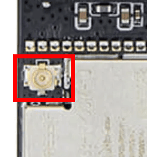

## Installing the software

Follow the [quickstart guide](https://github.com/dalathegreat/Battery-Emulator?tab=readme-ov-file#how-to-install-the-software-) to install the Battery-Emulator software onto the board for the initial setup.

## Over the air (OTA) software updates

When updating this board [OTA](../setup/software/ota_update.md), be sure to select the software marked for this board. The files will be marked like this, signaling that this is **T-2CAN** hardware.

`BE_vX.Y.Z_LilygoT-2CAN.ota.bin`

## Interfaces

The board comes with 2 CAN channels. One is labelled CAN-A , and the other one is CAN-B.

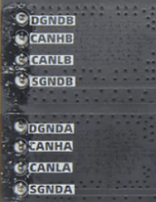

The interfaces correspond to the following options in the Battery-Emulator software

- CAN-A -> **CAN MCP 2518 Add-on**
   - CANLA (CAN-LOW)
   - CANHA (CAN-HIGH)
- CAN-B -> **Native CAN**
   - CANLB (CAN-LOW)
   - CANHB (CAN-HIGH)

Example configuration, Nissan LEAF battery connected to CAN-B , and a Deye inverter connected to CAN-A

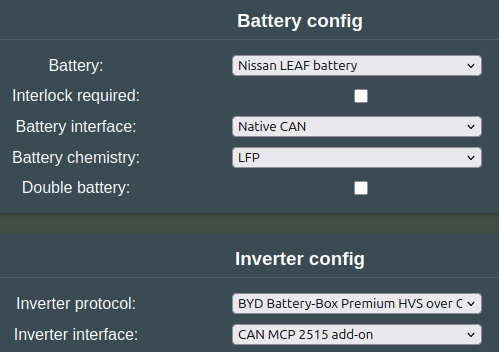

## Add-ons

The T-2CAN has two SH-1.0mm connectors with two GPIOs each, and unpopulated solder pads for power and 21 more GPIOs. This allows you to add some modules without soldering, and even more by making connections to the solder pads underneath.

!!! note "NOTE"
    The onboard 3.3V regulator (RT9080) is only rated for 600mA output, which does not leave much spare for add-ons (the ESP32S3 requires 500mA minimum). The 5V rail has much more capacity (3A), so if you need significant amounts of current at 3.3V you will need an additional regulator or external power.

### Modbus/RS485 (solderless)

You can connect a 4-pin auto-direction 3.3V-supply TTL-RS485 module to the T-2CAN via the first SH-1.0mm connector. LilyGo sell a [pre-made SH-1.0mm to Dupont cable](https://lilygo.cc/products/dupont-cable). The modules are readily available on Aliexpress:

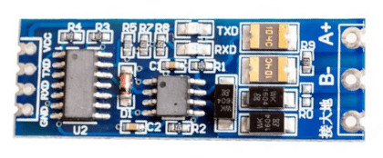{ width="270" } 
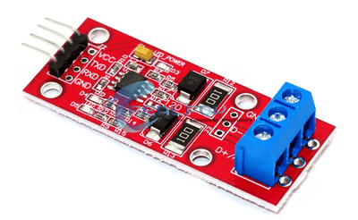{ width="270" }
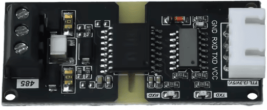{ width="270" }

The connections should be made like this (the colors match the LilyGo cable):

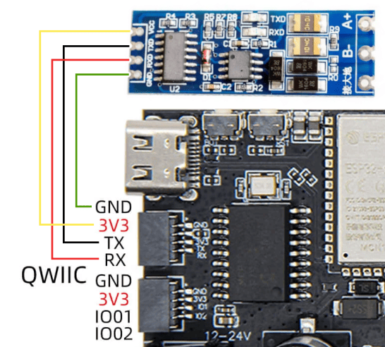

These modules are inconsistent with their TX/RX labelling. Usually the TX pin on the module is an input, which should be connected to TX on the T-2CAN (which is an output). However on some, the TX pin on the module is an output, so should instead go to RX on the T-2CAN (and vice versa for the other pin). Choosing modules with onboard LEDs helps with debugging.
 If you do run into no-communication issues while everything else seems correct, switching around RX and TX will not damage anything, give it a try!

RS485 needs a 120 ohm termination resistor at each end of the bus, for best performance. This may need manually enabling on your RS485 module. For example, the blue modules have empty 'R13' pads which need a solder blob bridging them to enable the 120 ohm termination:

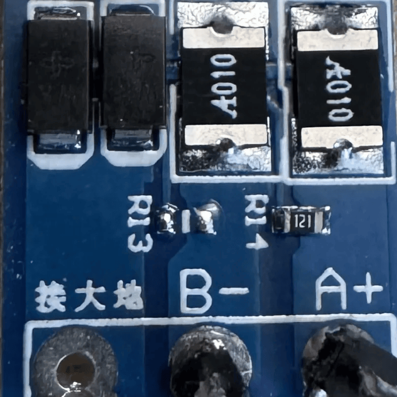{ width="300" }

The TX/RX pins are also used by the bootloader when the ESP32 starts up, which sends a brief chunk of debugging information onto the bus at 115200. This will hopefully be ignored by attached RS485 devices - if there are problems, it may be possible to burn an efuse on the ESP32S3 to disable this.

### Configurable port

The second 'QWIIC' connector (the one with GND/3V3/IO01/IO02 on the image above) can be configured for several different functions, via the settings page:

### Expansion header

The underside of the board has pads for a 26-pin 2.54mm-pitch pin header.
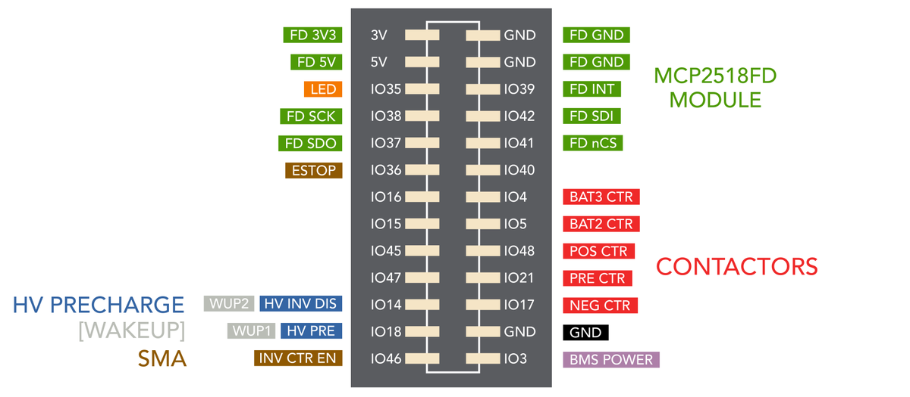

Note that the configurable port setting overrides these pin assignments - for example, if you choose WUP1/WUP2 for the configurable port, these pins will be on the top QWIIC connector, and not the underside expansion header.

You can either solder directly to the pads, or attach a 2x13P header and use Duponts.

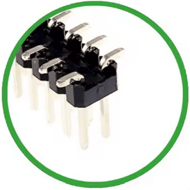 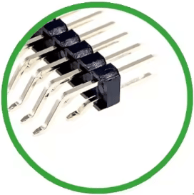 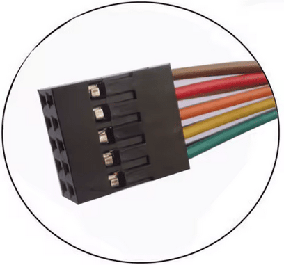

#### MCP2518 CAN FD module

An [MCP2518 CAN FD](../setup/can_related/can_fd_add_on_mcp2518fd.md) module can be connected to the green pins on the diagram above. This can be attached with a 2x5 Dupont connector to the top section of the pin headers (you can make up your own cable with a 2x6 Dupont at the other end for the module). This provides a third non-isolated interface capable of CAN FD (required by some batteries), in addition to the existing two isolated ones.

On the T-2CAN FD, this means you can have two CAN FD ports and one CAN (non-FD) port.

#### LED

You can attach a WS2812B LED to the board, connecting to IO35, 5V and GND. It may be easiest to solder this directly to the board using thin jumper wires. It is preferable to use the 5V rather than 3.3V supply as it has more spare capacity.

#### Contactors

The contactor outputs provide a 3.3V logic signal, which is insufficient to drive a contactor directly. You can drive relays via a transistor or optoisolator buffer, or use solid state relays (SSRs) which turn on fully at 3V (the voltage may sag below 3.3V).

## See also

- [BOOT button](../setup/software/boot_button_functions.md) for special features to enable AP, wipe wifi settings or factory reset the device
- [CAN add-on MCP2518FD](../setup/can_related/can_fd_add_on_mcp2518fd.md) for an additional CAN interface

!!! note "NOTE"
    In the past, `BMS POWER` was `IO45` for the 2CAN FD. It has now moved back to `IO3` - if your setup uses `IO45`, you will need to move the connection when upgrading to newer software versions.

### 3D-printable parts

You can print your own cases and mounts for this board, check out the [3D‐printable parts page](../setup/hardware/list_of_3d_printable_parts.md).

### Troubleshooting 🔧
If you see `CAN_NATIVE_BUS_ERROR` / `CANMCP2515_BUS_ERROR` events and have problems with CAN interfaces, supply the board with 12V instead of 5V. This stabilizes the CAN hardware significantly

### See also

- [BOOT button](../setup/software/boot_button_functions.md) for special features to enable AP, wipe wifi settings or factory reset the device
- [CAN add-on MCP2518FD](../setup/can_related/can_fd_add_on_mcp2518fd.md) for an additional CAN interface
