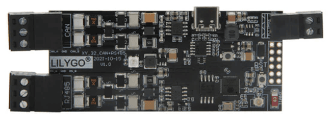
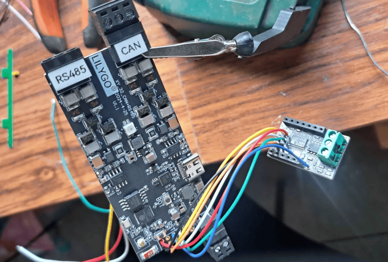
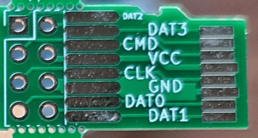
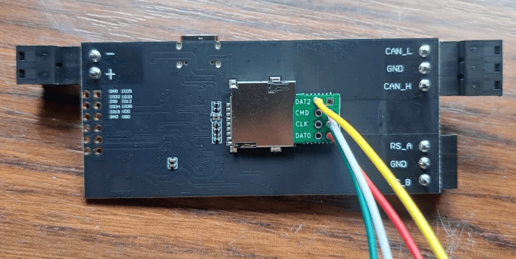
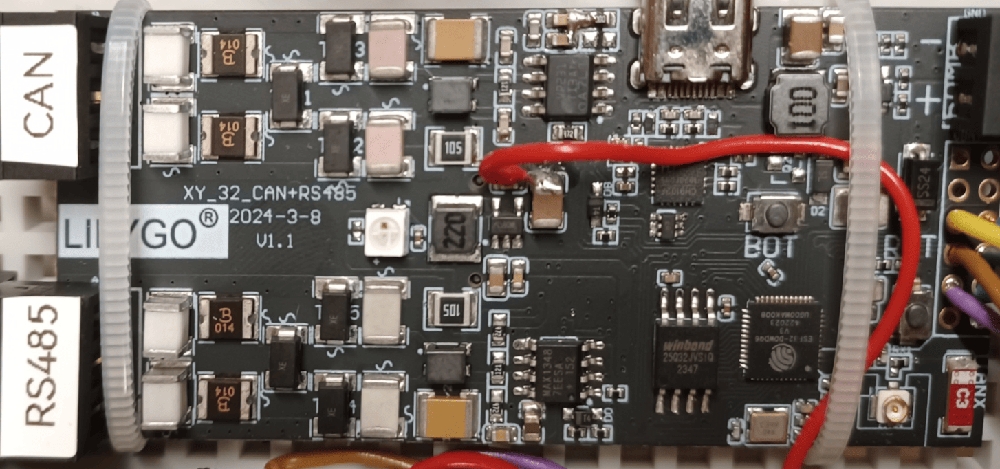

**MCU / flash:** ESP32-D0WDQ6-V3 (Xtensa LX6 dual-core, 240 MHz), 4 MB flash, no PSRAM.

The LilyGo T-CAN485 is what the Battery-Emulator originally started development with. It is a very cheap microcontroller, that runs the entire project easily. It has 1x CAN, 1x RS485, and GPIO pins for expansion.

!!! warning "WARNING"
    This board has limited flash memory. Starting from 2027, it might not get new integrations added to it. All other hardware choices are better suited for those seeking new feature development and new integrations.

    A good replacement is [Waveshare ESP32‐S3‐RS485‐CAN](waveshare_esp32_s3_rs485_can.md). For CAN components, the new [T-2CAN](lilygo_t_2can.md) board is a good choice.

## Purchase link

The hardware can be bought via sites like [AliExpress](https://www.aliexpress.com/item/1005003624034092.html)

## Hardware info

| GPIO | Function |
|---|---|
| 0 | BOOT button — [long-press options available](../setup/software/boot_button_functions.md) |
| 2 | SD card MISO (Configurable port = µSD Card, default) |
| 4 | [Status LED](index.md#status-led-) (addressable) |
| 5 | MCP2515 MOSI / [MCP2518FD](../setup/can_related/can_fd_add_on_mcp2518fd.md) SDI — or SMA inverter contactor enable input (SMA enable pin = Pin 5, default) — or CHAdeMO pin 10 |
| 12 | MCP2515 / [MCP2518FD](../setup/can_related/can_fd_add_on_mcp2518fd.md) SCK — or CHAdeMO pin 2 |
| 13 | SD card CS (Configurable port = µSD Card) |
| 14 | SD card SCLK (µSD Card) — or I2C display SCL (Configurable port = I2C Display SSD1306) |
| 15 | SD card MOSI (µSD Card) — or I2C display SDA (I2C Display SSD1306) — or [second battery](../setup/software/battery_2x.md) contactors output — or CHAdeMO current transducer input (ADC2_CH3) |
| 16 | 5 V boost regulator enable |
| 17 | RS485 transceiver enable |
| 18 | [BMS Power](../setup/hardware/periodic_bms_reset.md) output ([BMS Power](../setup/hardware/periodic_bms_reset.md) pin = Pin 18, default) — or MCP2515 / [MCP2518FD](../setup/can_related/can_fd_add_on_mcp2518fd.md) CS — or CHAdeMO lock |
| 19 | RS485 SE (transceiver shutdown) |
| 21 | RS485 RX |
| 22 | RS485 TX |
| 23 | Native CAN SE (transceiver silent/enable) |
| 25 | Precharge [contactor output](../setup/software/contactor_control_via_gpio_pins.md) — or [BMS Power](../setup/hardware/periodic_bms_reset.md) output ([BMS Power](../setup/hardware/periodic_bms_reset.md) pin = Pin 25) — or [HIA4V1 precharge control](../setup/hardware/high_voltage_source.md#option-b-hia4v1) — or battery wake-up 1 (WUP1); held at its driven level across a firmware-initiated reset/OTA reboot |
| 26 | Native CAN RX |
| 27 | Native CAN TX |
| 32 | Positive [contactor output](../setup/software/contactor_control_via_gpio_pins.md) — or inverter disconnect [contactor output](../setup/software/contactor_control_via_gpio_pins.md) — or battery wake-up 2 (WUP2) |
| 33 | Negative [contactor output](../setup/software/contactor_control_via_gpio_pins.md) — or SMA inverter contactor enable input (SMA enable pin = Pin 33) |
| 34 | MCP2515 MISO / [MCP2518FD](../setup/can_related/can_fd_add_on_mcp2518fd.md) SDO — or CHAdeMO pin 7 |
| 35 | MCP2515 / [MCP2518FD](../setup/can_related/can_fd_add_on_mcp2518fd.md) INT — or [Equipment stop](../setup/software/equipment_stop.md) input — or CHAdeMO pin 4 |

!!! note "NOTE"
    Thhe binary for this board builds with `SMALL_FLASH_DEVICE`, which compiles out the I2C display, so on the stock firmware the Configurable port dropdown only offers µSD Card.

The hardware has more details on LilyGo's Github page [github/Xinyuan-LilyGO](https://github.com/Xinyuan-LilyGO/T-CAN485)

!!! tip "TIP"
    You can improve Wi-Fi signal quality on the LilyGo board by adding an external antenna. You can easily salvage one with socket and cable from an old router. There is a SMD resistor that needs to be moved in order for the board to use the external antenna.
    
    

## Expanding the board

The board comes with 1x CAN channel, and 1x RS485 channel. Some integrations need more than 1 channel, in these cases the LilyGo can be extended with add-on CAN channels:

- [CAN-FD add on](../setup/can_related/can_fd_add_on_mcp2518fd.md)

Example LilyGo + MCP2515 board:

### SD socket IO pins

The SD card slot can be used to gain more pins. This can be useful on setups that need lots of inputs/outputs, for instance add-on CAN + contactor control and/or enable line inputs. To use the SD card slot, you will need a "SD Card breakout board"

- GPIO 2 corresponds to DAT0  (SD_MISO)
- GPIO 13 corresponds to DAT3 (SD_CS)
- GPIO 14 corresponds to CLK  (SD_SCLK)
- GPIO 15 corresponds to CMD  (SD_MOSI)

Completed product:

### Alternative 5V source

The Lilygo also has a 3V3 to 5V boost switch-mode power supply (it is used for the RS485 chip on the Lilygo). It does not have an overly convenient location for connecting, but it can be soldered to one side of C62 (side closest to C64). The Lilygo can then be powered with 12V, which can be more convenient than powering the Lilygo with 5V. See the red wire in the image below. Of course the 5V supply on the Lilygo must be enabled for this to work.

### CAN-FD Motherboard

This is work in progress **BETA** PCB design for a motherboard to hold both a lillygo T-CAN485, a CAN FD board and a smart highside power switch for contactors. Requires a small amount of SMD soldering. You will need to desolder the output connectors on the lillygo + can FD board.

* Current version 1.1

#### Overview of features

* Four channel smart high side power switch (short circuit, overload & thermal protection) 4th channel input&output is on terminal other 3 inputs are sourced from lillygo) 2.6A nominal per channel (6.5A current limit)
* MCP2518FD CAN_FD module
* Pluggable/swappable Lilygo and CAN-FD modules
* Entire cost should be around 55USD
* Requires both 12V (contactors) and 5V input

#### BOM

* 1x PCB [Link](https://oshwlab.com/cloudy62/batemudaughterboard)  - Please make your own checks before manufacturing
* 1x 83mm DIN Rail case with terminals AK-DR-105A [Link](https://www.aliexpress.com/item/1005006067012648.html)
* 1x SPI To CANFD MCP2518FD Module (must be this style) [Link](https://www.aliexpress.com/item/1005007349452566.html)
* 1x 6A round PCB fuse
* 2x 2x6 2.54mm pin header sockets (Lilygo and Can data header)
* 1x 1x2 2.54mm pin header socket (LilyGo power header)
* 9x 1 way 2.54mm pin header sockets (singles as they don't quite match the spacing, might be better options)
* 4x 1206 4k7 SMD resistors
* 2x [Optional] 1206 120ohm resistors (if you need to add termination on either can-bus) Both boards also have can jumpers
* 1x Infineon BTS716G [Link](https://www.mouser.co.uk/ProductDetail/Infineon-Technologies/BTS716G?qs=MGskQgfwDzus89Wlyk6rrg%3D%3D&srsltid=AfmBOorB3UWUL11UHGQ6T4TqtPE6G-uxXzaoZuVttZVdFuyMxHTPvx4-)

## Enhancements notes, things to know

The chip has the tendency to run quite hot. Some people book good results by adding a RAM or Raspberry Pi heatsinks on the chip, reducing the heat.
Above 80 degrees the BE screen turns yellow as a warning, and above 95 degrees damage is possible.
Take this into consideration when building enclosures for it.
If the situation is critical (hot and direct sun), you can use a [Peltier element with fan](https://s.click.aliexpress.com/e/_c4LFUPAt).

The lilygo has an internal voltage regulator, and input is rated at 5-12 volts. Not all lilygos actually work stable on 5V. A higher input is needed often. 
Some report issues above 12 volts, other run boards fine at 14.4 volts. It is not yet determined what causes these variations.

## 3D-printable parts

You can print your own cases and mounts for this board, check out the [3D‐printable parts page](../setup/hardware/list_of_3d_printable_parts.md).

## See also

- [BOOT button](../setup/software/boot_button_functions.md) for special features to enable AP, wipe wifi settings or factory reset the device
- [CAN add-on MCP2518FD](../setup/can_related/can_fd_add_on_mcp2518fd.md) for an additional CAN interface
