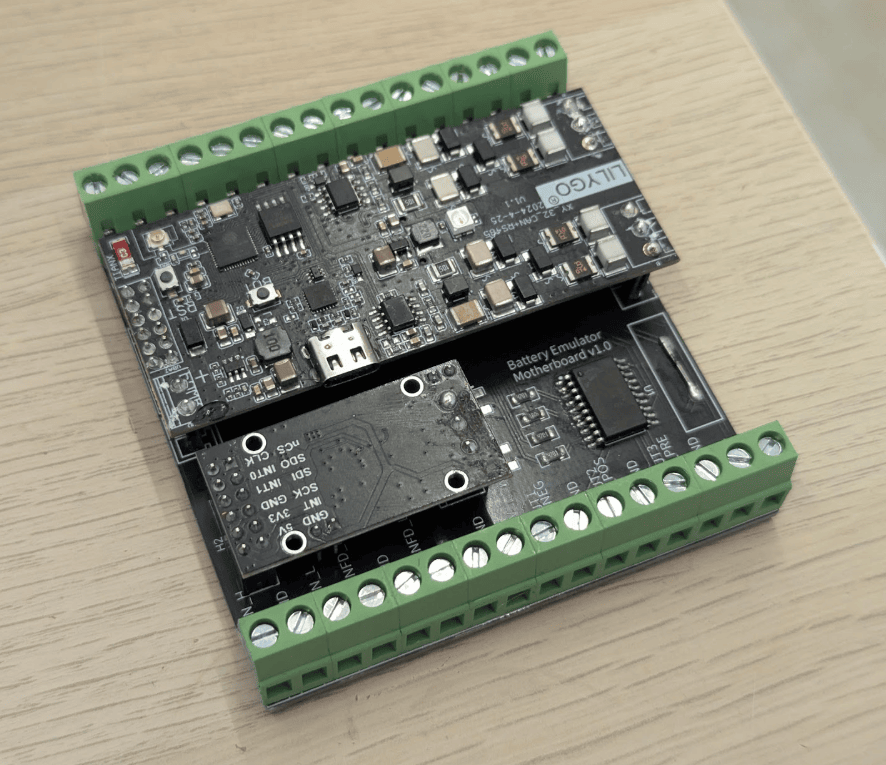
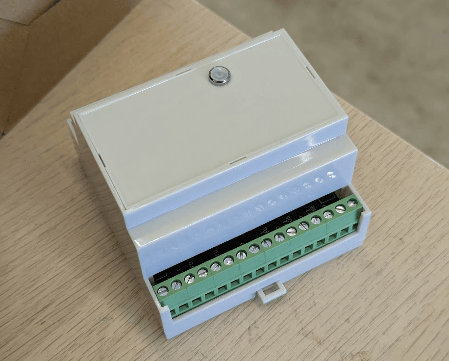
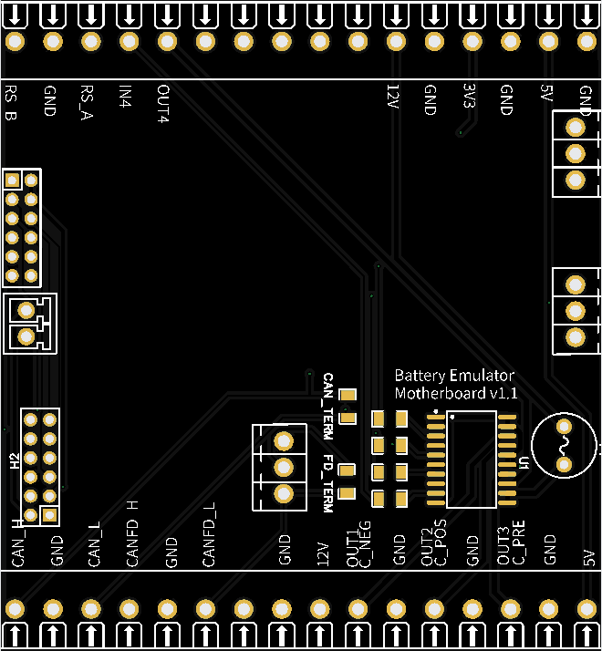

## LilyGo T-CAN485 & CAN-FD Motherboard

This is work in progress **BETA** PCB design for a motherboard to hold both a lillygo T-CAN485, a CAN FD board and a smart highside power switch for contactors. Requires a small amount of SMD soldering. You will need to desolder the output connectors on the lillygo + can FD board.

* Current version 1.1

!!! warning "WARNING"
    This board has limited memory. Starting from 2027, it might not get new integrations added to it. All other hardware choices are better suited for those seeking new feature development and new integrations.

## Overview of features

* Four channel smart high side power switch (short circuit, overload & thermal protection) 4th channel input&output is on terminal other 3 inputs are sourced from lillygo) 2.6A nominal per channel (6.5A current limit)
* MCP2518FD CAN_FD module
* Pluggable/swappable Lilygo and CAN-FD modules
* Entire cost should be around 55USD
* Requires both 12V (contactors) and 5V input

## BOM

* 1x PCB [Link](https://oshwlab.com/cloudy62/batemudaughterboard)  - Please make your own checks before manufacturing
* 1x 83mm DIN Rail case with terminals AK-DR-105A [Link](https://www.aliexpress.com/item/1005006067012648.html)
* 1x SPI To CANFD MCP2518FD Module (must be this style) [Link](https://www.aliexpress.com/item/1005007349452566.html)
* 1x 6A round PCB fuse
* 2x 2x6 2.54mm pin header sockets (Lilygo and Can data header)
* 1x 1x2 2.54mm pin header socket (lilgo power header)
* 9x 1 way 2.54mm pin header sockets (singles as they don't quite match the spacing, might be better options)
* 4x 1206 4k7 SMD resistors
* 2x [Optional] 1206 120ohm resistors (if you need to add termination on either can-bus) Both boards also have can jumpers
* 1x Infineon BTS716G [Link](https://www.mouser.co.uk/ProductDetail/Infineon-Technologies/BTS716G?qs=MGskQgfwDzus89Wlyk6rrg%3D%3D&srsltid=AfmBOorB3UWUL11UHGQ6T4TqtPE6G-uxXzaoZuVttZVdFuyMxHTPvx4-)

## Notes

* Requires 20Mhz setting for CANFD (#define CANFD_ADDON_CRYSTAL_FREQUENCY_MHZ  ACAN2517FDSettings::OSC_20MHz)
* LillyGo is a tight fit in the case!

