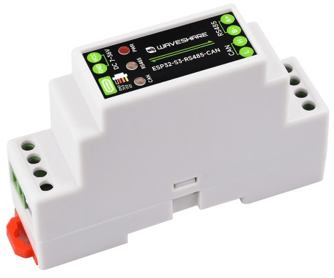
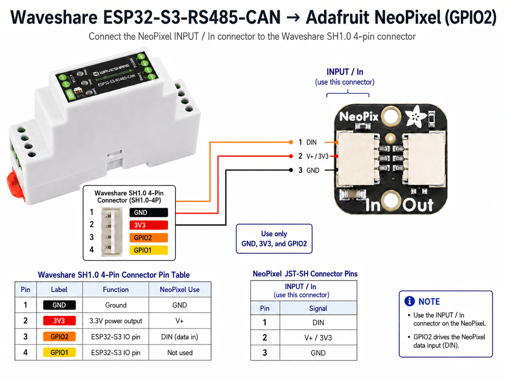
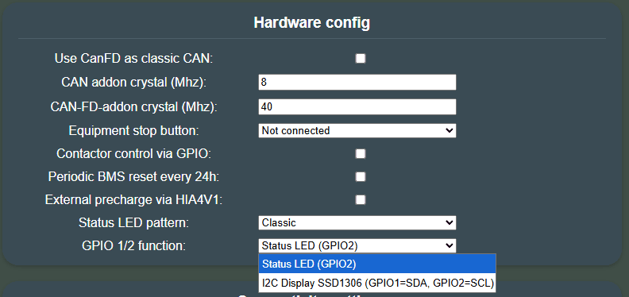
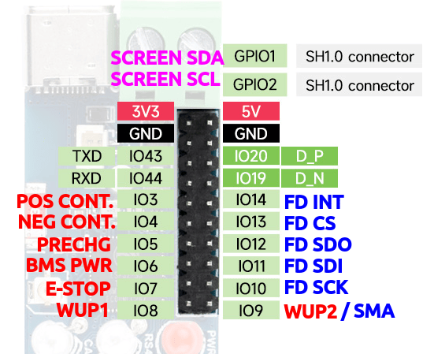

## Hardware basics

The Waveshare ESP32-S3-RS485-CAN is an affordable and easy to source board. It supports 1x CAN channel, and 1x RS485 port. It comes with a DIN mountable case, and accepts an input voltage between 7-36V.

#### Where this hardware shines

On setups that require RS485, and have CAN controlled contactors (E.g. Tesla Battery with a Fronius inverter). This board is a more future proof alternative compared to the LilyGo T-CAN485.

!!! info "IMPORTANT"
    This board is compatible with more than 1 CAN channel and GPIO controlled contactors as from FW 10.10.1!

## Purchase link

The hardware can be bought via sites like AliExpress, or the official [Waveshare](https://www.waveshare.com/esp32-s3-rs485-can.htm)

## Limitations

This board has a single CAN channel and single RS485 port. The 4-pin SH1.0 connector on the board exposes GPIO1 and GPIO2, which can be configured in firmware settings as either a status LED or an I2C display (see below).

## Optional accessories

### Status LED (NeoPixel via GPIO2)

The 4-pin SH1.0 connector (located directly behind the USB C connector) can power an optional **Adafruit NeoPixel** (or any WS2812-compatible single LED) connected to GPIO2, providing a visual status indicator.  Please note that the Waveshare only outputs 3.3v!

{ width="800" height="599" }

Once wired, open the **Settings** page in the web interface and set **GPIO 1/2 function** to **Status LED** (this is the default).

{ width="792" height="374" }

### I2C Display (SSD1306 via GPIO1 + GPIO2)

The same connector can alternatively drive an **SSD1306 128×64 I2C OLED display**, using GPIO1 as SDA and GPIO2 as SCL.

In the **Settings** page, set **GPIO 1/2 function** to **I2C Display (SSD1306)** to enable this.

!!! note "NOTE"
    The status LED and I2C display are mutually exclusive — only one can be active at a time.

### Expansion header

The board has pads for a 20-pin 2.0mm-pitch pin header.

{ width="551" height="449" }

### Boot button 
The BOOT button has [special features to enable AP, wipe wifi settings or factory reset the device](../setup/software/boot_button_functions.md)

