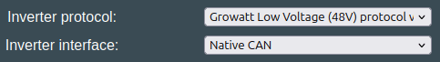

## Growatt HV

The current implementation "Growatt High Voltage protocol via CAN Bus" emulates a "HVC 60050-A1 BMS". This means the following inverters work:

* Growatt SPH 10 10000TL3 BH-UP ✅
* Growatt SPA 4000-10000TL3 BH-UP :question:

We can also emulate a WIT battery when selecting the "Growatt WIT compatible battery via CAN" option. This enables compatibility with the following inverters.

* Growatt WIT 50XHU ✅
* Growatt WIT 100HU ✅

!!! note "Isolated CAN requirement"
    These inverters do not handle a CAN connected EV battery on the same channel. If the inverter sees standard automotive CAN frames, the inverter will enter a fault state. This can be solved in 4 different ways:

    * [add an isolated MCP2515 CAN channel](../setup/can_related/can_add_on_mcp2515.md)
    * [add an isolated MCP2518 CANFD channel, and run it in classic CAN mode](../setup/can_related/can_fd_add_on_mcp2518fd.md)
    * use the [Stark CMR](../hardware/stark_cmr.md) or [BECom](../hardware/becom.md) hardware
    * use a [CAN filter](../setup/can_related/can_filter_hardware.md) between inverter and the rest of the system 

### Incompatible Growatt HV inverters

* Growatt MIN TL-XH (This inverter does not have the DC-DC converter between internal DC-bus and battery connectors, also the RS485 protocol is not modbus and Growatt support does not release the internal protocol.)

### Communication wiring
The Growatt HV inverter works via CAN. A board with a single CAN channel, such as the LilyGo T-CAN485, can have both a CAN battery and a CAN inverter connected on the same pins. When the board is used with two CAN devices at the same time that have termination resistors in all ends, the terminating resistor needs to be removed from the board. Please measure CAN termination if you have issues. This is explained in [CAN-troubleshooting](../setup/can_related/can_wiring_practices_and_troubleshooting.md)

### Which protocol to use
For this inverter type, use the option called **Growatt High Voltage protocol via CAN Bus** under the "Inverter Protocol" setting.

{ width="491" height="66" }

## Growatt LV

### Communication wiring

The Growatt LV compatible inverters works via CAN. A board with a single CAN channel, such as the LilyGo T-CAN485, can have both a CAN battery and a CAN inverter connected on the same pins. When the board is used with two CAN devices at the same time that have termination resistors in all ends, the terminating resistor needs to be removed from the board. Please measure CAN termination if you have issues. This is explained in [CAN-troubleshooting](../setup/can_related/can_wiring_practices_and_troubleshooting.md)

### Which protocol to use
For this inverter type, use the option called **Growatt Low Voltage (48V) protocol via CAN** under the "Inverter Protocol" setting.

{ width="483" height="68" }

## Growatt WIT

Note that the WIT inverters use a separate protocol (GROWATT_WIT) compared to the [smaller Growatt HV inverters](growatt_hv.md)

* WIT 50-100K-HU/AU

### Inverter protocol specification

Here is the inverter CAN definitions:

[GROWATT BATTERY BMS CAN COMMUNICATION PROTOCOL V1.1 (EXTERNAL)-1.pdf](https://github.com/user-attachments/files/21463500/GROWATT.BATTERY.BMS.CAN.COMMUNICATION.PROTOCOL.V1.1.EXTERNAL.-1.pdf)

### Which protocol to use

For this inverter type, use the option called **Growatt WIT compatible battery via CAN** under the "Inverter Protocol" setting.

{ width="490" height="63" }

## General notes

ℹ️ Always check the termination resistance of the system! That way you know if resistor needs to be removed or not.

ℹ️ Grounding is extremely important. Make sure the battery case is connected to protective earth, and the shield part of the twisted pair CAN is connected to PE also! Failing to do this will result in CAN errors.
