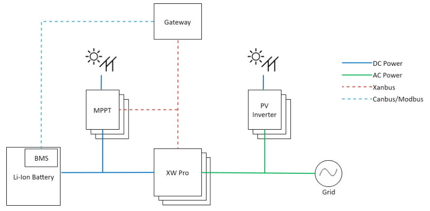
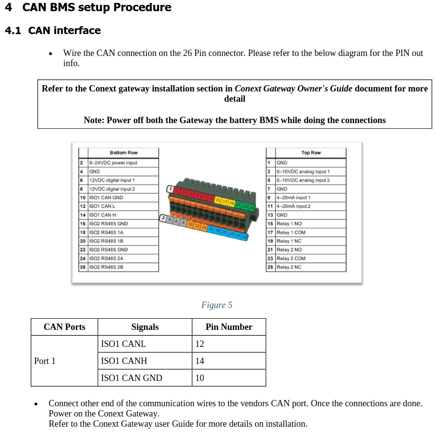
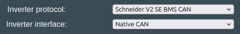

## Compatible Schneider inverters

* Schneider XW Pro Hybrid Inverter :warning: Testing ongoing SCHNEIDER_CAN

## Communication wiring

The Schneider inverter works via CAN. The CAN connection is done at the Gateway

ℹ️ Always check the termination resistance of the system! That way you know if resistor needs to be removed or not.

ℹ️ Grounding is extremely important. Make sure the battery case is connected to protective earth, and the shield part of the twisted pair CAN is connected to PE also! Failing to do this will result in CAN errors.

## Which protocol to use

For this inverter type, use the option called "Schneider V2 SE BMS CAN" under the "Inverter Protocol" setting

{ width="493" height="71" }

## Installation examples
