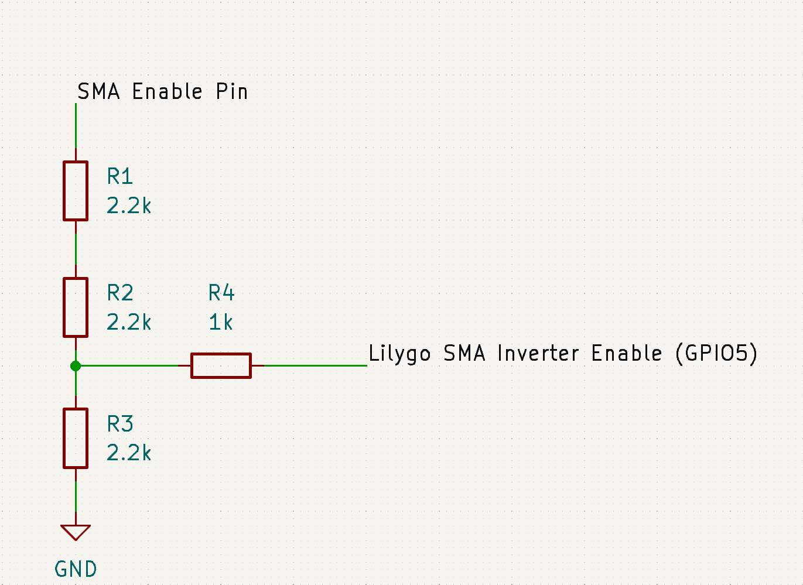
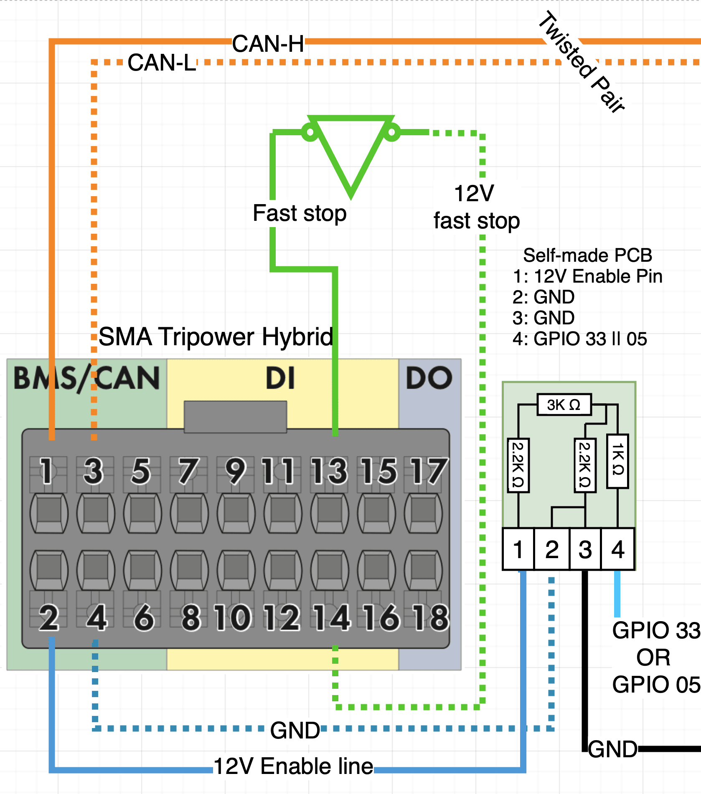
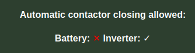
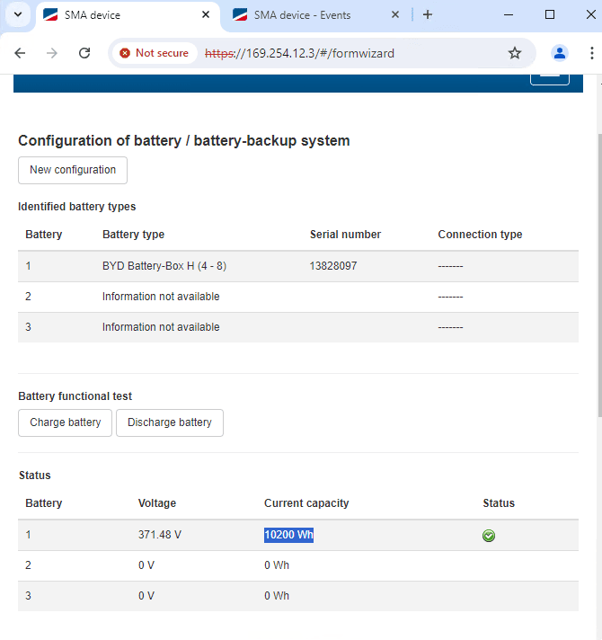
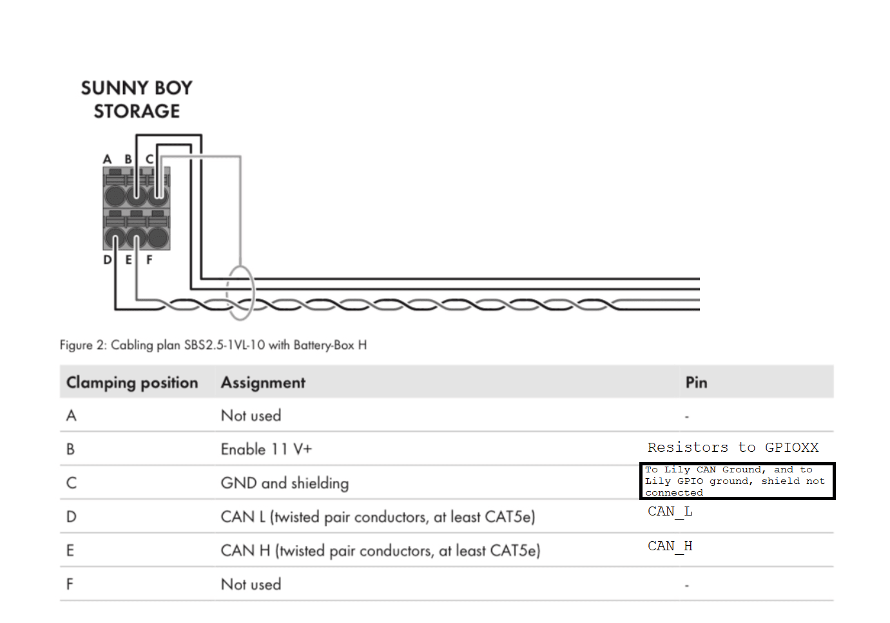
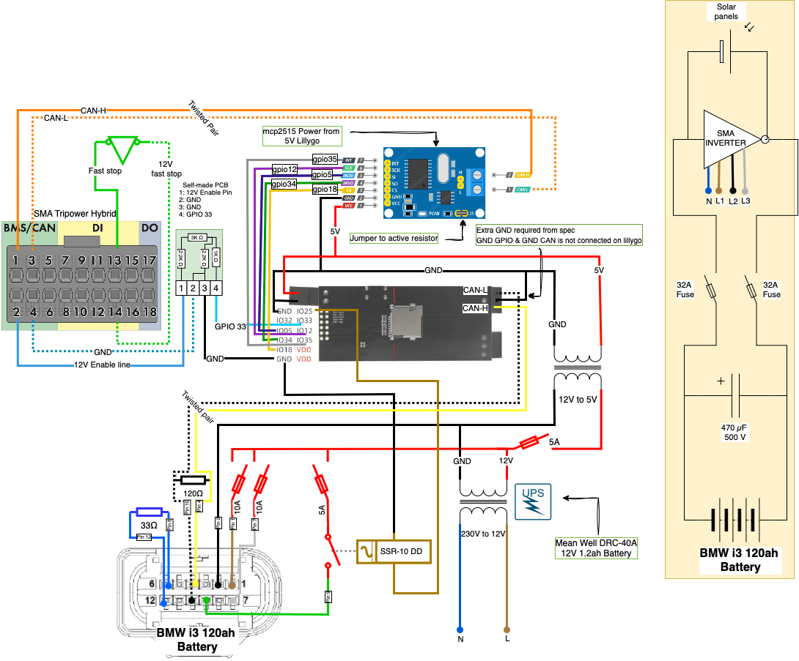

## SMA inverter types
### Sunny Boy Storage

* Sunny Boy Storage 2.5 (SBS2.5-1VL-10) :heavy_check_mark:
* Sunny Boy Storage 3.7 (SBS3.7-10) :heavy_check_mark:
* Sunny Boy Storage 5.0 (SBS5.0-10) :heavy_check_mark:
* Sunny Boy Storage 6.0 (SBS6.0-10) :heavy_check_mark:

!!! note "NOTE"
      The inverter contains a 120 Ohm terminating resistor on CAN-L/H pins. The SBS2.5-1VL-10 inverter has a slightly different protocol than the other SBS inverters

### Sunny Boy Smart Energy

* Sunny Boy Smart Energy 3.8  (SBSE3.8-US-50)  :heavy_check_mark:
* Sunny Boy Smart Energy 4.8  (SBSE4.8-US-50)  :heavy_check_mark:
* Sunny Boy Smart Energy 5.8  (SBSE5.8-US-50)  :heavy_check_mark:
* Sunny Boy Smart Energy 7.7  (SBSE7.7-US-50)  :heavy_check_mark:
* Sunny Boy Smart Energy 9.6  (SBSE9.6-US-50)  :heavy_check_mark:
* Sunny Boy Smart Energy 11.5 (SBSE11.5-US-50) :heavy_check_mark:

### Sunny Tripower Smart Energy

* Sunny Tripower Smart Energy 5.0 (STP5.0-3SE-40) :heavy_check_mark:
* Sunny Tripower Smart Energy 6.0 (STP6.0-3SE-40) :heavy_check_mark:
* Sunny Tripower Smart Energy 8.0 (STP8.0-3SE-40) :heavy_check_mark:
* Sunny Tripower Smart Energy 10.0 (STP10.0-3SE-40) :heavy_check_mark:

### Sunny Island

* Sunny Island 4.4M (SI4.4M-13) (Testers wanted!)
* Sunny Island 6.0H (SI6.0H-13) (Testers wanted!)
* Sunny Island 8.0H (SI8.0H-13) (Testers wanted!)
  
!!! info "IMPORTANT"
      The Sunny Island inverters are rated for 48V. Make sure the battery you intend to use matches the voltage requirement!


## Word of caution, isolated CAN ⚠️
This inverter does not handle a CAN connected EV battery on the same channel.
If the inverter, which likes to see only BYD CAN frames, sees standard automotive CAN frames, the inverter will enter a fault state.

This can be solved in several ways:

* You can use the [Stark CMR](../hardware/stark_cmr.md) hardware which has more CAN channels (Recommended option)
* You can use the [LilyGO T-2CAN](../hardware/lilygo_t_2can.md) hardware, which also has two isolated CAN channels (2nd recommended option)
* You can [add an isolated MCP2515 CAN channel](../setup/can_related/can_add_on_mcp2515.md)
* You can [add an isolated MCP2518 CANFD channel, and run it in classic CAN mode](../setup/can_related/can_fd_add_on_mcp2518fd.md)
* You can use a [CAN filter](../setup/can_related/can_filter_hardware.md) between inverter and the rest of the system

## Word of caution, controllable HV ⚠️

Keep in mind that you will also need automated contactor control via GPIO, or a battery that has CAN controllable on/off contactors. If you have a CAN controlled integration that is not able to turn OFF contactors when commanded, you will need to add external contactors.

This is due to a complicated pairing process when taking the battery in to use, when the inverter will command on/off the battery in order to succeed with pairing. **Due to this, the Stark CMR is highly recommended for first timers!**

!!! info "IMPORTANT"
    Grounding is extremely important for all inverters. Make sure the battery case is connected to protective earth, and the shield part of the twisted pair CAN is connected to PE also! Failing to do this may result in CAN errors.

## Connecting the Enable pin from Inverter to Battery Emulator

The inverter needs to be able to control the closing of the contactors. This is done via a signal, called the enable line. It controls the "Inverter allows contactor closing" in the Battery Emulator web interface.

### Stark hardware

If you have the Stark CMR, you can wire the 12V enable line directly to SIGNAL IN (GPIO 2) and SMA GND directly to SIGNAL GND. The Stark CMR hardware does not require any resistors, it can take the full input voltage of the enable line.

### Other hardware

The Enable line is connected to GPIO 5 on the LilyGo board. Due to the signal being 12V, we need to step it down to 3.3V that the Battery-Emulator uses on its GPIO pins.

!!! note "NOTE"
      In some cases GPIO5 is already occupied by the battery (for example with a BMW i3 battery or using an MCP2515 CAN addon board). An error will be thrown while compiling the battery emulator. SMA enable pin has to be re-assigned in the Battery Emulator code from GPIO5 to e.g. GPIO33

A small PCB with resistors and JST Connectors is a great way to stop down from 12v to ~3.3V. Parts list:

* 2x 2.2K Ω resistor
* 1x 1K Ω resistor
* 1x 3K Ω resistor
* 2x JST Connector 2 pins (1 for SMA Inverter enable line cables, 1 for Battery emulator cables)

This stepdown can be achieved with a resistor divider



The 1k resistor isn't technically needed but just in case there's a short it would limit the current into the LilyGo pin.

### Details for Sunny Boy Smart Energy & Sunny Tripower Smart Energy

Pin layout Custom PCB in the example below: 
```
1. 12V Enable line SMA Tripower
2. Ground SMA Tripower
3. Ground Lilygo
4. GPIO 05 or 33 (or a different pin that you configure) (Default is GPIO 05)
```

This is how the connection for the SMA Tripower would look like.
{ width="839" }

SMA Hybrid Communication pin layout
```
1. CAN-H
2. 12V enable line 
3. CAN-L
4. Ground
13. Fast-Stop 
14. Fast-Stop
```

## Fast-Stop

### For Sunny Boy Smart Energy & Sunny Tripower Smart Energy

Fast-Stop is not required, but optional. This should turn off the inverter (and open battery contacts?) in a safe way.

Fast-Stop or emergency stop is a normally open connection. Closing the circuit (pin 13 to pin 14) will disable the inverter completely. PV input, battery and battery backup.

You can enable Fast-Stop in the settings of the inverter (Device parameters -> Device -> Inputs/outputs -> Digital input -> Fast shutdown via the digital input)

When activated the following event will be triggered
`10513 -NSS quick stop: Stop through Digital inputs is executed`

When deactivated the following event will be triggered
`10513 - NSS quick stop: Start through Digital inputs is executed (maybe it will start-up from itself... )`

I was too impatient to wait for the inverter to startup (after 2 minutes I disconnected the inverter completely) I'm not sure if the inverter will start up to 'normal' if you wait longer (feel free to edit the wiki) 

A known working solution to restart the inverter is: 

1. Black switch on the side of the SMA Hybrid turned off
2. Turn off 230v SMA hybrid
3. Wait until all LEDS are off
4. Enable your emergency stop to be open again
5. Turn on 230v
6. Turn on black switch
7. Wait for SMA Hybrid
8. It should start within 5 minutes.

## Which protocol to use

<details markdown="1">
<summary>Details for Sunny Boy Storage</summary>

For this inverter type, use the option called `SMA SBS compatible BYD Battery-Box HVS` as "Inverter Protocol" setting

</details>
<details markdown="1">
<summary>Details for Sunny Boy Smart Energy</summary>
  
For this inverter type, use the option called `SMA compatible BYD Battery-Box HVS` as "Inverter Protocol"

</details>
<details markdown="1">
<summary>Details for Sunny Tripower Smart Energy</summary>
  
For this inverter type, use the option called `SMA compatible BYD Battery-Box HVS` as "Inverter Protocol"

</details>
<details markdown="1">
<summary>Details for Sunny Island</summary>
  
For this inverter type, use the option called a`SMA Low Voltage (48V) protocol via CAN` as "Inverter Protocol"

</details>

## Inverter setup
The SMA inverter is sensitive when you try to install the battery to the inverter. Pairing the battery in the installation assistant is sometimes tricky.
<details markdown="1">
<summary>Details for Sunny Boy Storage</summary>

For the SMA battery configuration process (pairing) to succeed, the following conditions must be fulfilled:

- The battery emulator state (as seen on the webserver) is OK. This means that the battery must be sending CAN messages.
- The enable line is connected, and able to close the contactors.
- The HV DC lines of the battery are connected to the SMA, such that the SMA measures voltage when the enable line goes high.
- The SMA is connected via CAN to the battery emulator, such that the SMA can send a pairing request, and the battery emulator can respond to this.

Steps:

1. Power on the SMA, and wait for the blue light to stay on continuously.
2. Connect to the SMA web interface. The IP address of webserver is `192.168.12.3` when connecting directly to the SMA WiFi network (access point). This web interface will list the IP address of the SMA on your local network on the bottom of the page. Some inverters were delivered without onboard WIFI/WLAN so you can only access these via your LAN network address. On your local network, you can also reach the webpage via its hostname `smaxxxxxxxxxx.home` (where `xxxxxxxxxx` shall be replaced with the serial number of your device) or look up the IP address with an app like 'Net Analyzer'.
3. Log in to the SMA web interface as installer. To perform the battery configuration process you'll need the installer password (or request the PUK on the SMA website).
4. Start the installation assistant (https://smaxxxxxxxxxx.home/#/formwizard) or via top-right dropdown menu.
5. Proceed with the SMA installation assistant till the 'battery configuration' step, but do not complete the battery config yet.
6. Go to the battery config step in the installation assistant. Wait for the pairing to start. During pairing, make sure the `Inverter allows contactor closing` checkbox on the battery emulator webserver goes :heavy_check_mark: <br>

7. Let the pairing run until it completes. The assistant showing 100% may not mean that the pairing is completed. The battery should be recognised by the SMA. It can take up to 30 minutes for the pairing to complete.
8. Once done, `BYD Battery-Box (4-8)` or 'Battery-Box Premium HVS' and a serial number are seen in the configuration assistant, like in the image below. The capacity is always 10200 Wh, as that is the capacity of the battery type being emulated. <br>

9. Sometimes the battery is recognized as `Other`. If the pairing fails, and the red light of the inverter turns on, it may be necessary to power down the SMA, and power it back on again, to complete the pairing.
10. Once `BYD Battery-Box (4-8)` is seen, complete the battery functional test: charge/discharge the battery using the buttons in the installation assistant.
11. Proceed with the next pages of the installation assistant to finalize the SMA configuration process.

</details>

<details markdown="1">
<summary>Details for Sunny Boy Smart Energy & Sunny Tripower Smart Energy</summary>

1. Power off the battery emulator.
2. Power off the SMA.
3. Disconnect SMA CAN-bus connection on the battery emulator side.
4. Power on the SMA, and wait for the blue light to stay on continuously.
5. Connect to the SMA web interface. The IP address of webserver is `192.168.12.3` when connecting directly to the SMA WiFi network (access point). This web interface will list the IP address of the SMA on your local network on the bottom of the page. On your local network, you can also reach the webpage via its hostname `smaxxxxxxxxxx.home` (where `xxxxxxxxxx` shall be replaced with the serial number of your device).
6. Log in to the SMA web interface as installer. To perform the battery configuration process you'll need the installer password (or request the PUK on the SMA website).
7. Start the installation assistant (https://smaxxxxxxxxxx.home/#/formwizard).
8. Proceed with the SMA instalation assistant till step 6 (do not go to battery config yet).
9. Power on the battery emulator. Wait for the battery emulator to be fully booted. For pairing to succeed, the following conditions must be fulfilled:

    - The battery emulator state (as seen on the webserver) is OK. This means that the battery must be sending CAN messages.
    - The enable line is connected, and able to close the contactors.
    - The HV DC lines of the battery are connected to the SMA, such that the SMA measures voltage when the enable line goes high.
    - The SMA is connected via CAN to the battery emulator, such that the SMA can send a pairing request, and the battery emulator can respond to this.

10. Reconnect the SMA CAN-bus connection on the battery emulator side.
11. Go to step 7 in the installation assistant. Wait for the pairing to start. During pairing, make sure the `Inverter allows contactor closing` checkbox on the battery emulator webserver goes :heavy_check_mark: <br>

12. Let the pairing run until it completes. The battery should be recognised by the SMA. It can take up to 30 minutes for the pairing to complete.
13. The battery should be recognised as a `BYD Battery-Box Premium HVS battery`.
14. Battery functional test: charge/discharge the battery using the buttons in the installation assistant.
15. Proceed with the next pages of the installation assistant to finalize the SMA configuration process.
</details>

## Battery emulator software update

Updating the battery emulator software requires (at least in 1 case) to disconnect the SMA CAN-bus to reboot.
1. Disconnect SMA CAN-bus
2. Update battery emulator
3. Wait for reboot
4. Connect SMA CAN-bus
5. Enjoy

## Communicate with the inverter to charge/discharge

To charge/discharge the battery you need a type of energy meter.
This can be the SMA Energy meter (expensive) or a simulated SMA energy meter.

To simulate the SMA energy meter you can use Home Assistant and an energy meter (like HomeWizard): [SMA-Energy-Meter-emulator](https://github.com/Roeland54/SMA-Energy-Meter-emulator)

## Installation examples

Please feel free to add!

### SMA Sunny Boy Storage to battery emultator

This is how the SBS should be connected to the lily/stark hardware


### SMA Sunny Tripower to Liligo and BMW i3


