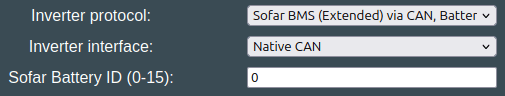
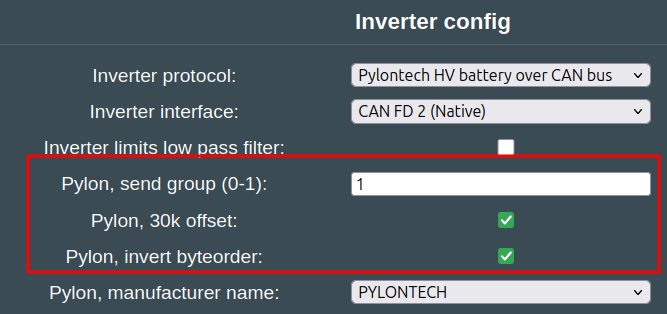
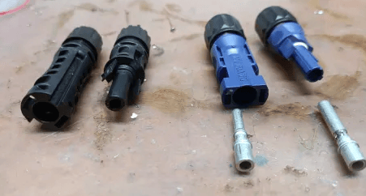
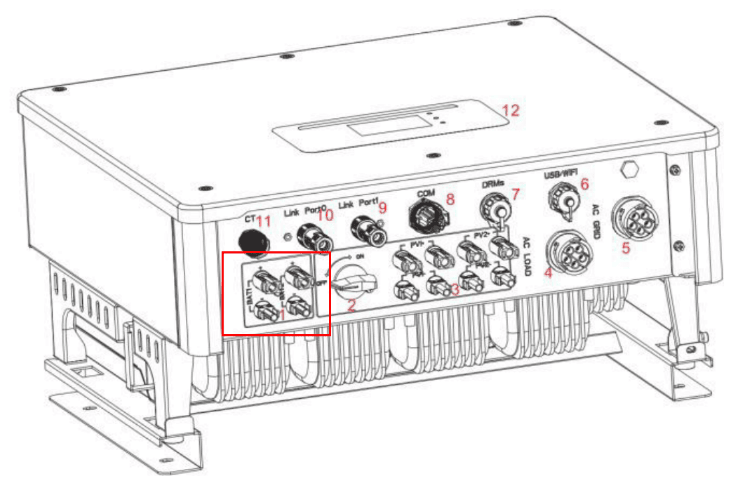
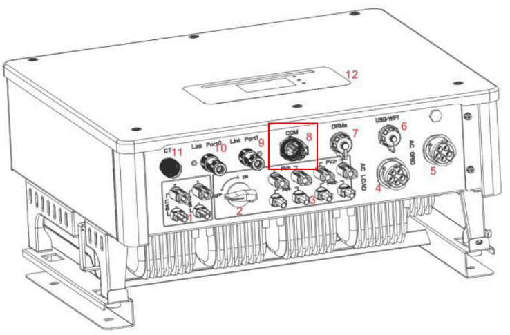
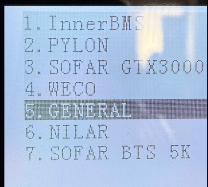
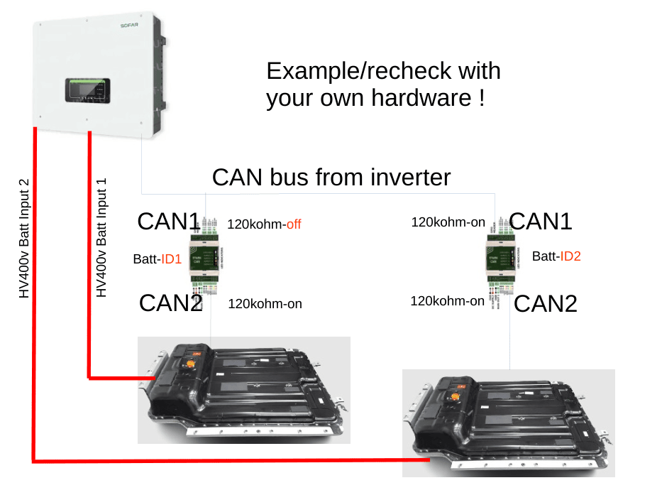

## Compatible Sofar inverters

* HYD 5KTL
* HYD 6KTL
* HYD 8KTL
* HYD 10KTL
* HYD 15KTL
* HYD 20KTL

The inverters started out development with using "Pylontech battery over CAN bus", but you can also use the new [SOFAR_CAN](sofar.md#sofar-can) if you have multiple batteries. At the moment it is recommended to use Sofar CAN!

## Communication wiring
The Sofar inverter works via CAN. You can have both a CAN battery and a CAN inverter connected on the same pins (when using Pylon protoocl). When the board is used with two CAN devices at the same time that have termination resistors in all ends, the terminating resistor needs to be removed from the board. Please measure CAN termination if you have issues. This is explained in [CAN-troubleshooting](../setup/can_related/can_wiring_practices_and_troubleshooting.md)

Note, if you use Sofar CAN protocol instead, the inverter will need to be on a dedicated CAN channel!

ℹ️ Always check the termination resistance of the system! That way you know if resistor needs to be removed or not.

ℹ️ Grounding is extremely important. Make sure the battery case is connected to protective earth, and the shield part of the twisted pair CAN is connected to PE also! Failing to do this will result in CAN errors.

## Which protocol to use
For this inverter type, use the option called "Sofar BMS (Extended) via CAN" under the "Inverter Protocol" setting.

!!! info "IMPORTANT"
    If you try to use Pylon: The Pylon protocol is very versatile. By default we emulate a 4x96V Force H2 battery. Not all inverters like this setup, so please adjust the configuration if needed.

Note also that Sofar inverters need to have some special flags set in the Pylon. Send Group: 1 , Inverter Byteorder :heavy_check_mark: and 30k offset :heavy_check_mark:

Due to this, it is better to use Sofar CAN instead! But Pylon is viable if you want the inverter/battery to be able to share the CAN channel.

## Inverter Wiring
Connect HV cables to battery terminals using OEM connectors. Highly advised to add ~32A DC fuse between.

!!! warning "CAUTION"
    Standard Staubli connectors don't fit SOFAR BAT ports, make sure to acquire proprietary SOFAR connectors.
    

Connect CAN-H and CAN-L from the Battery-Emulator hardware to socket no.8.
CAN-H  -  PIN 7
CAN-L  -  PIN 8

## Inverter Configuration
In "Advanced Settings/Battery Parameters" choose `Pylontech` as battery type and set `01` as battery address (00 is default), save your settings. Check all fuses and everything else twice, then turn on the Battery-Emulator hardware, and voila!

### Sofar CAN
If you use Sofar CAN, select the "General" option

## Sofar CAN
This inverter can also use the dedicated "Sofar BMS (Extended) via CAN" protocol. The bonus of this protocol, is that it is compatible with multiple batteries, using separate IDs for each battery. 

In "Advanced Settings/Battery Parameters" choose `GENERAL` as battery type and set address accordingly to address set in Battery Emulator.
To run two separate batteries on two different DC terminals first you have to enable `BAT 1` and `BAT 2` in Input channel setting. Then, when setting parameters for each batteries use two different address for `BAT 1` and `BAT 2`. 

On the battery emulator side, have one battery configured as 0, and the next 1, etc. **You will need multiple Battery-Emulator hardwares with 2 CAN ports** to use this feature, one per battery.

( remember the inverter itself has also an address on the CAN bus , default 01. )

{ width="933" height="697" }

See the attached .zip file for more info on this protocol
[SofarDocuments.zip](https://github.com/dalathegreat/BYD-Battery-Emulator-For-Gen24/files/13260240/SofarDocuments.zip)
