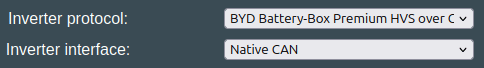
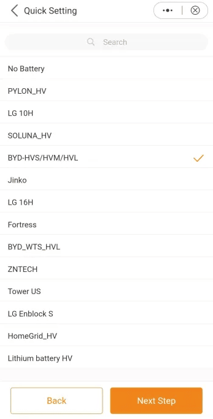
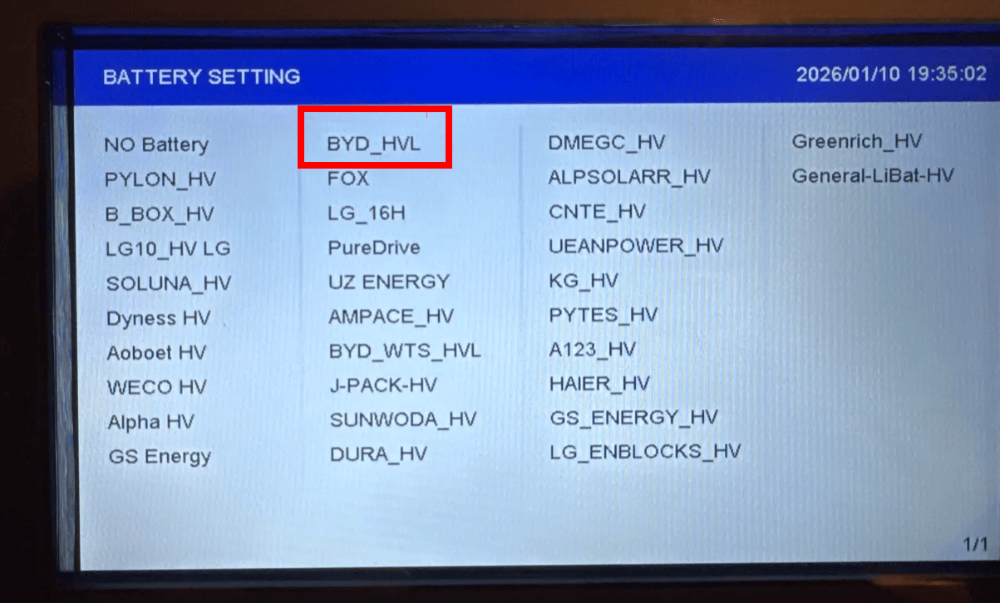
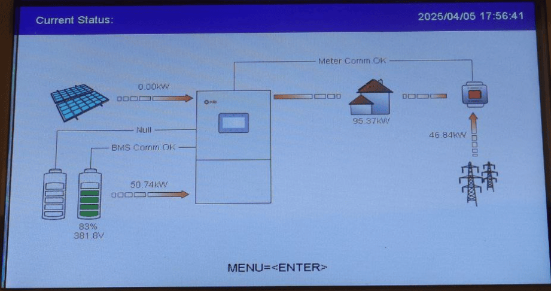

## Compatible Solis inverters
Please note that naming conventions may vary slightly for Solis devices depending on the target market. For example:

S6-EH3P(3–10)K-H-EU _(EU model)_ **VS**  S6-EH3P(3–10)K-H-AU _(AU model)_

While the protocol, software, and hardware design are generally identical, the main differences lie in the available local energy network settings and region-specific configurations.

However, it is strongly recommended to always compare the technical datasheets to ensure compatibility and to verify that your exact model is included in the compatible device list.

**Voltage range:**
Most Solis inverters are compatible with a wide battery voltage range. Nevertheless, you should always confirm that the voltage range of your specific inverter model is compatible with the battery you intend to use.

* RHI-3P(5-10)K-HVES-5G ✅
* RHI-3P10K-HVES-5G ✅ (can also use PYLON protocol)
* S6-EH1P10K-H-US-APST ✅
* S6-EH1P(3.8-11.4)K-H-US ✅
* S6-EH3P(3-10)K-H-AU ✅
* S6-EH3P20K-H ✅
* S6-EH3P50K-H ✅
* S6-EH3P29.9 K-H ✅ 
* S6-EH3P(3-10)K-H-EU ✅ 
* S6-EH3P(3-10)K2-H (testers wanted, please report back!)
* S6-EH3P15K-ND-H ✅ 
* S6-EH3P100K10-NV-YD-H ✅ (Use BYD-WHS inverter setting)

## Communication wiring
The Solis inverter works via CAN. A board with a single CAN channel, such as the LilyGo T-CAN485, can have both a CAN battery and a CAN inverter connected on the same pins. When the board is used with two CAN devices at the same time that have termination resistors in all ends, the terminating resistor needs to be removed from the board. Please measure CAN termination if you have issues. This is explained in [CAN-troubleshooting](../setup/can_related/can_wiring_practices_and_troubleshooting.md)

ℹ️ Always check the termination resistance of the system! That way you know if resistor needs to be removed or not.

ℹ️ Grounding is extremely important. Make sure the battery case is connected to protective earth, and the shield part of the twisted pair CAN is connected to PE also! Failing to do this will result in CAN errors.

## Which protocol to use
For this inverter type, use the option called "BYD Battery-Box Premium HVS over CAN Bus" under the "Inverter Protocol" setting.

{ width="484" height="68" }

In the Solis inverter settings, select the "BYD-HVS/HVM/HVL" option:

BYD_HVL option when looking directly at the inverter screen:

{ width="1203" height="726" }

## Startup example

The sequence that seems to work most reliably is to get the battery up and running but still disconnected from the power supply to the inverter (I have a pair of inline DC 32A breakers for this). Once the battery is awake, go into the inverter menu and select BYD from the battery menu. Then select 'Battery Wakeup'. The alarm light on the inverter should now go out, and the board will be pulsing green on its LED. You can now flip the DC breakers to connect the battery power to the inverter. 

## Troubleshooting

- If you see BatName-FAIL, please contact Solis local service center by email to obtain the latest firmware version. This will fix the issue

## Installation examples

## Tips for connectivity

Note that the supplied web portal is a bit hit and miss, data only **updates every 5 minutes** via the supplied datalogger dongle.

You can also use the local debug mode of the app via Bluetooth, and you'd get real time data (**updates every 5sec**).

You can also connect the inverter via RS485, for instance via a Waveshare USB to RS485 dongle, and connect this to for instance a raspberry Pi5 to get data out instantly.

